# Git常用命令

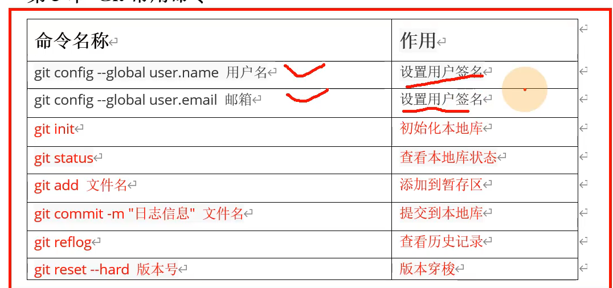

### 设置用户签名 git config

`git config --global user.name []`

`git config --global user.email []`

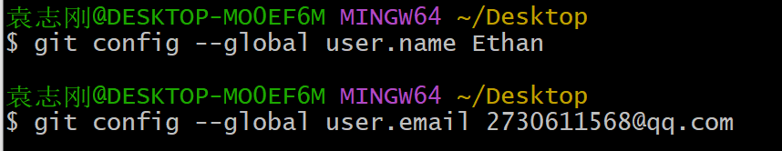

签名的作用是区分不同操作者身份

### 初始化本地库 git init

`git init`

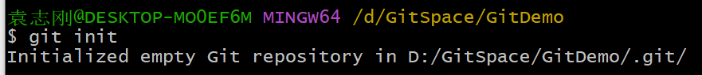

接过该目录的管理权

### 查看本地库状态 git status

`git status`

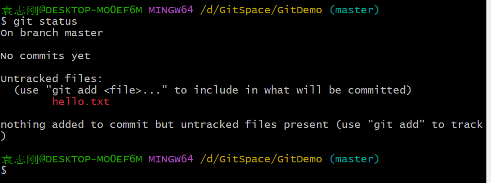

红色说明该文件没有添加到暂存区

### 添加暂存区 git add

`git add`

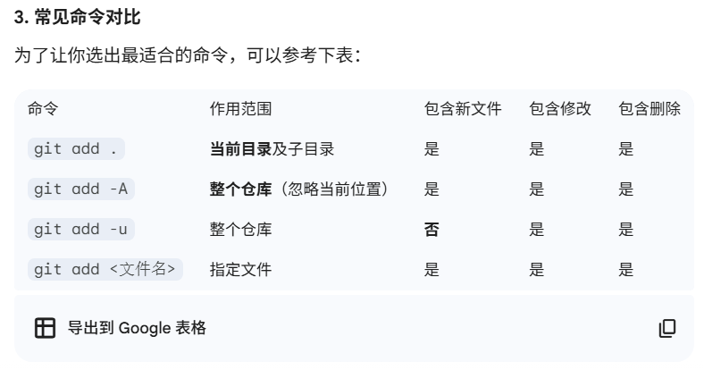

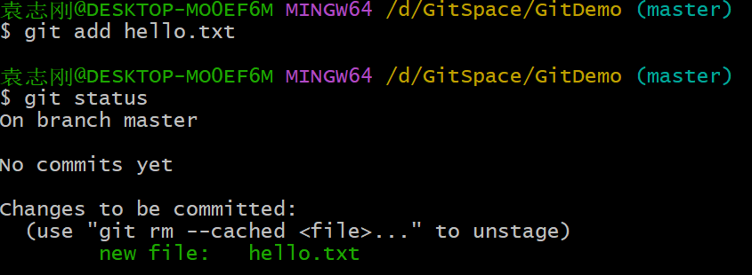

### 将文件从暂存区移除 git rm

`git rm --cached []` cached表明只是将文件从暂存区删除，但是本地文件还在，git不再追踪该文件

`git rm []`  会将文件物理删除

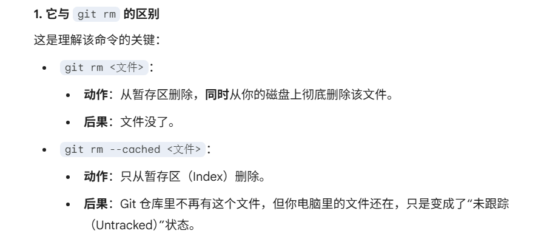

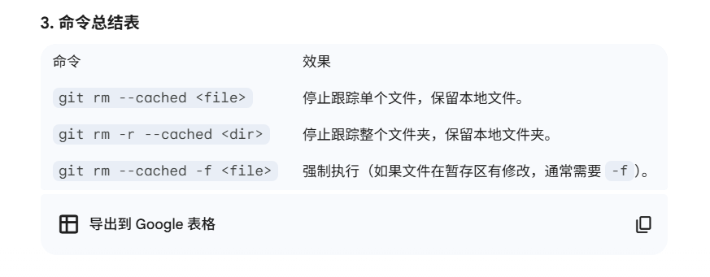

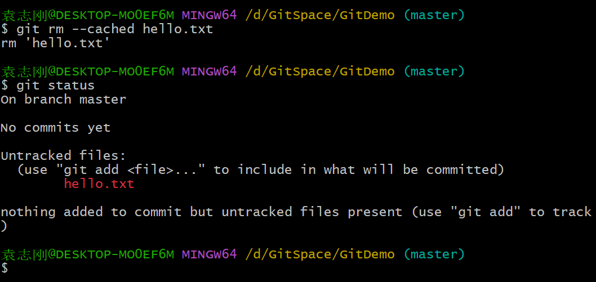

### 提交本地库 git commit

`git commit -m "日志信息" `

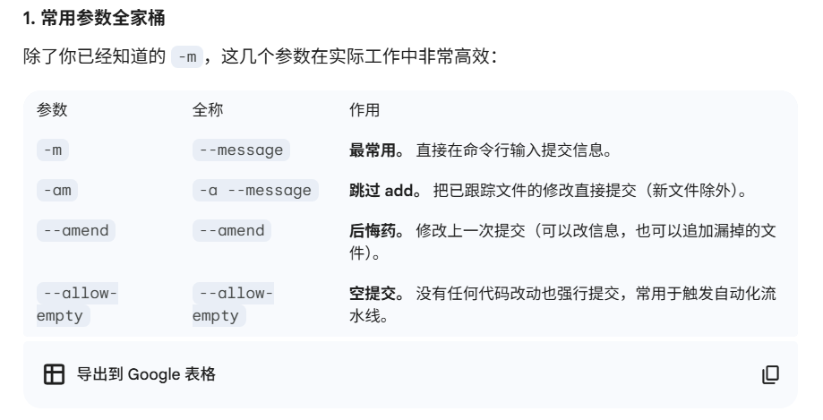

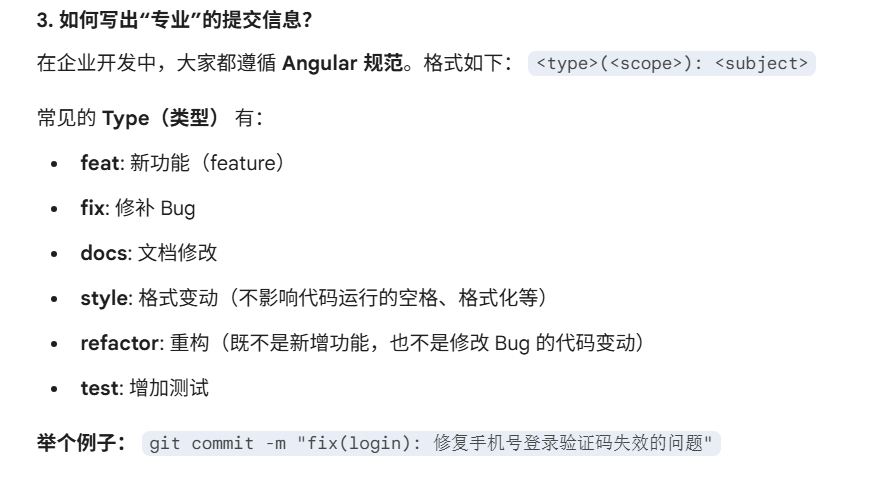

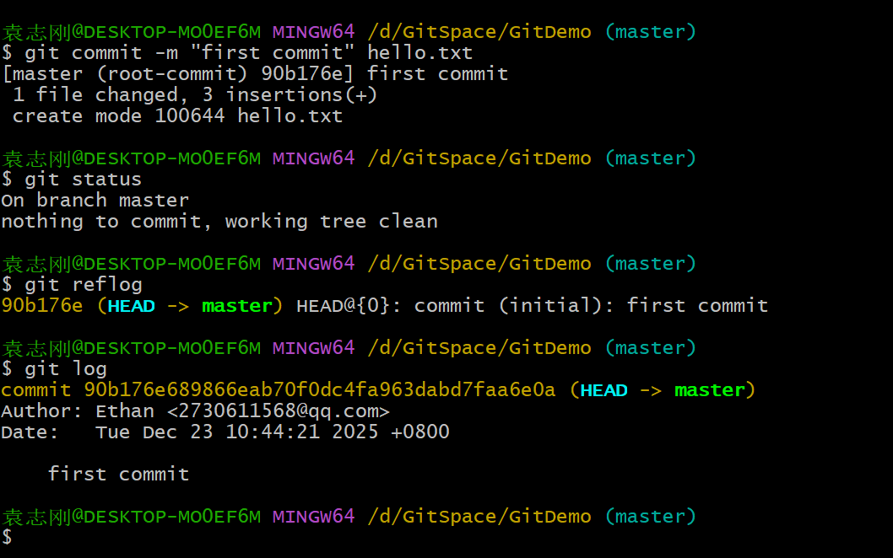

### 查看Git日志 git log/reflog

git log 和 git reflog

### Git回溯 git reset 

`git reset --[mode] 版本号`

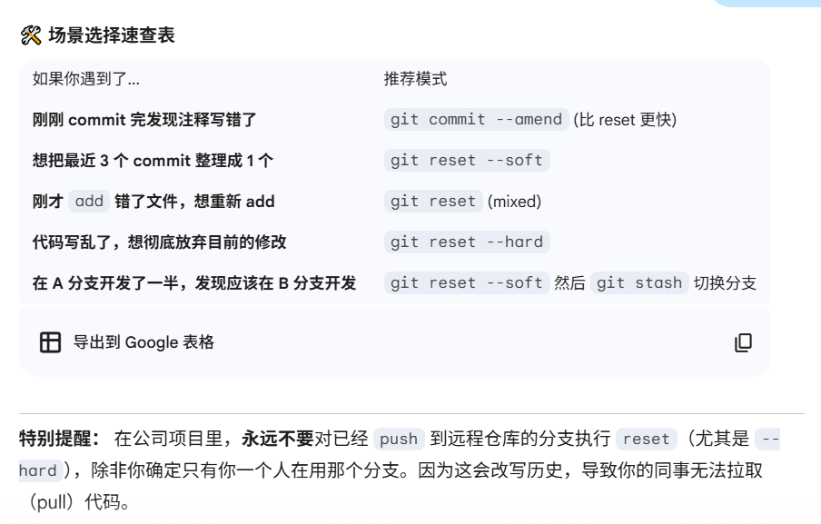