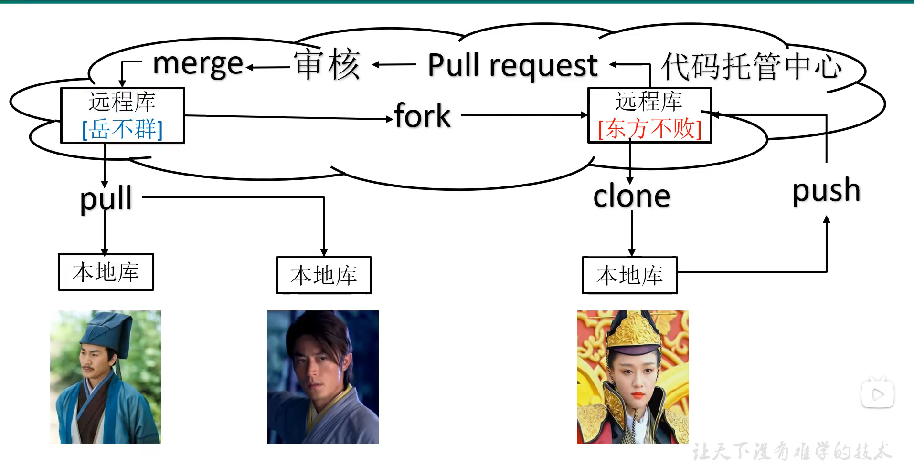

# Git团队协作

### 1. 团队内协作

新成员要想拿到在服务器上的代码，需要先加入其团队，然后将代码 clone 下来，之后做了修改可以 push 到服务器上，其他成员想要拿到该代码只需要 pull 拉取一下即可

### 2. 跨团队协作

如果A团队想和B团队合作，那么B团队需要先把A团队的代码 fork 到自己的远程库，然后再 clone 到本地库，修改好后，再 push 到远程库上，再向 A 发送 Pull Request (PR) 请求，A团队评审通过之后，就可以 merge 到自己的远程库上