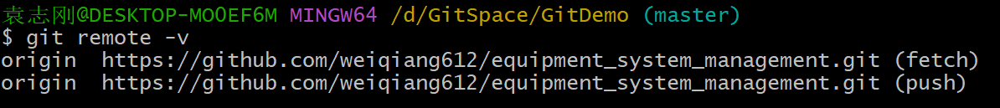
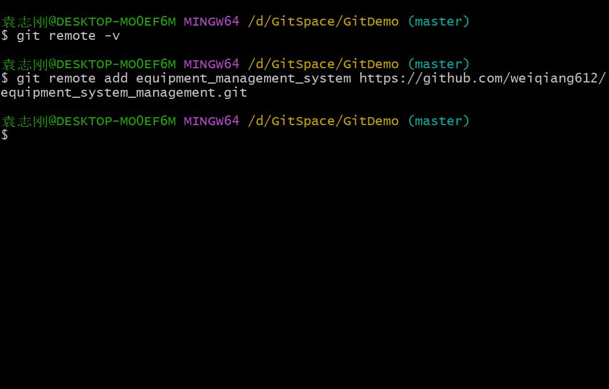
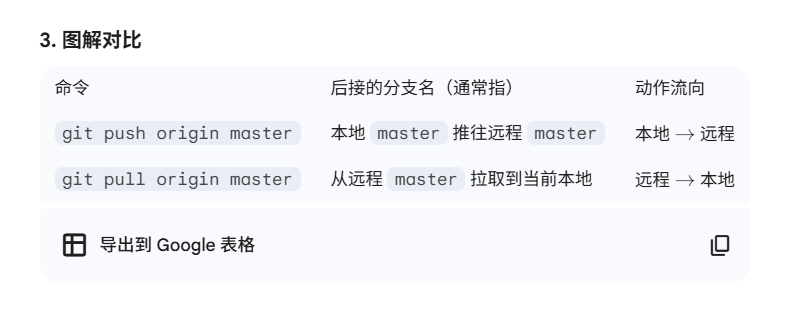
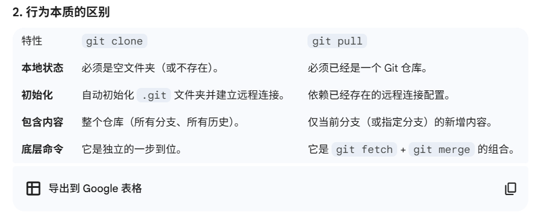
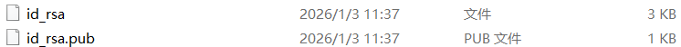

# GitHub远程库操作

### 别名

#### 查看远程库别名

git remote -v

fetch 用于拉取库  push 用于推送

#### 创建远程仓库别名

git remote add [别名] 链接

#### 重命名远程库别名

### 推送本地分支到远程仓库（push）

git push [远程库别名或地址] [分支]

### 拉取远程仓库到本地（pull）

gut pull [远程库别名或地址] [分支]

### 克隆远程仓库到本地（clone）

git clone [地址]

注意：克隆不会让你登录账号，并且克隆会做如下操作：1. 拉取代码 2. 初始化本地仓库 3. 创建别名

跟 git pull 的区别是，git clone 会克隆整个仓库，git pull 拉取指定分支

### 使用SSH拉取推送修改

需要到`C:\Users\袁志刚`目录下，打开git bash，输入 `ssh-keygen -t rsa -C [邮箱]` 使用非对称加密算法生成本机的ssh秘钥，会生成一个 .ssh/ 目录，在该目录下有一对公钥和私钥，id_rsa 为私钥，id_rsa.pub 为公钥，需要到github上面将公钥提交上去，这样之后使用 ssh 登录的时候，github会自动读取本地的私钥来进行远程库操作

