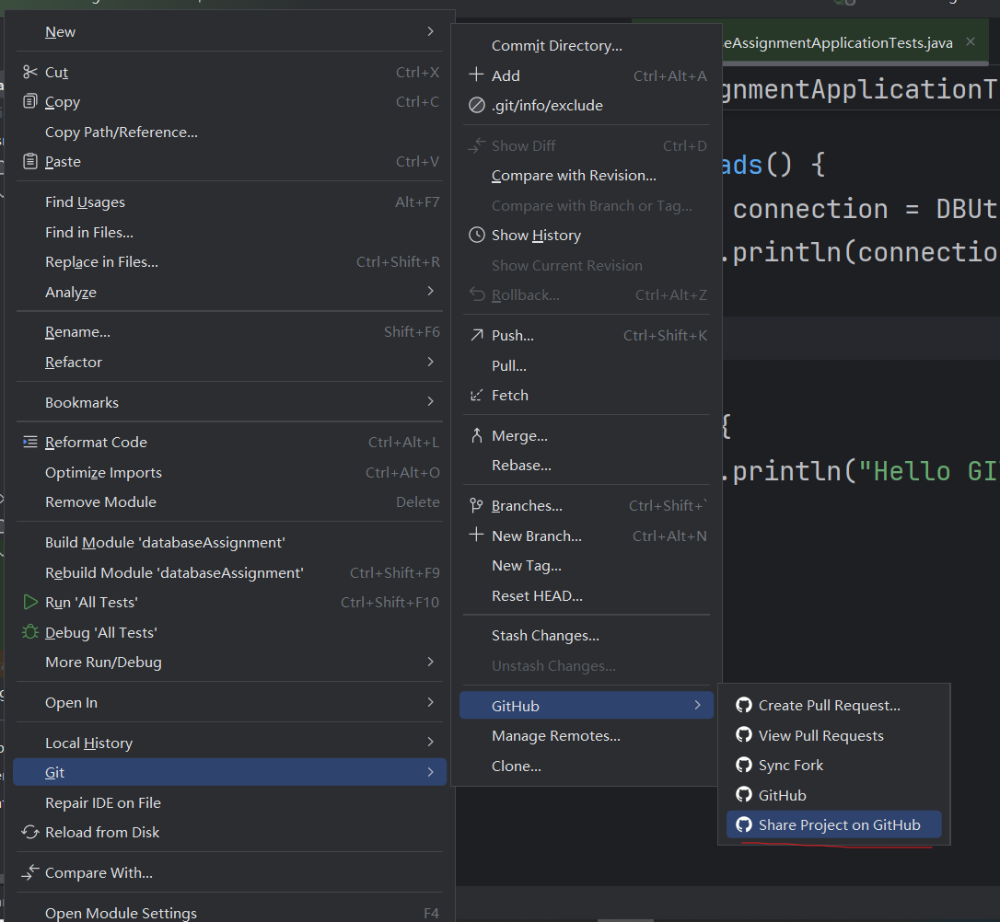

# IDEA 集成Git

### 环境配置

首先需要写一个全局的.gitignore文件，然后修改.gitconfig文件，[core]标签指向刚刚写好的.gitignore文件，这样每次进行版本控制的时候，都会忽略掉里面的内容，如果不想忽略，在项目的.gitignore文件中进行相关配置即可

其次，在IDEA setting中，找到version control -> Git ，配置好Git安装路径，点击Test，如果出现了版本号，即配置成功

### 初始化、添加暂存区、提交本地库

需要在IDEA上方栏中找到VCS（version control setting），添加Git Repository，之后红色文件表示在工作区未被追踪，绿色文件表示未提交，提交之后文件变为黑色，浅灰色代表不受git管理，在.gitignore文件内，蓝色文件代表被追踪过，但是修改了

### 切换版本、创建分支、切换分支

直接在左下角Git这里操作即可

### 合并分支

#### 非冲突合并

直接在当前分支上，右击想要合并的分支，选择合并即可

#### 冲突合并

需要手动合并，merge 即可

### 分享项目到远程库

### 拉取

Git 下拉菜单直接pull即可

### 推送

Git下拉菜单直接push即可