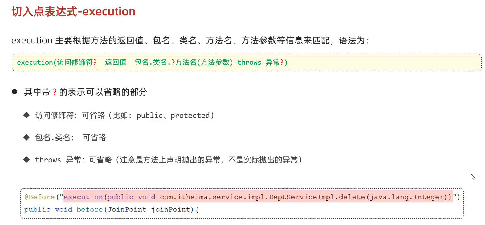
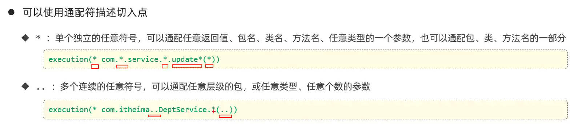
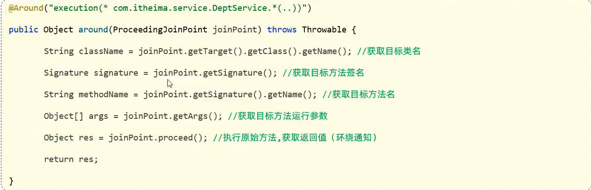
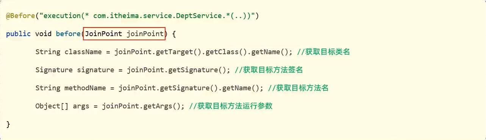

# Spring AOP

> 1. AOP：Aspect Oriented Programming（面向切面编程、面向方面编程），其实就是面向特定方法编程
>
> 2. 底层使用动态代理实现，实现无侵入式更改原有代码逻辑，防止更改原有代码逻辑后，出现“雪崩式”Bug，其实就是代理类执行Invoke方法，在Invoke方法里面定义自己想要增强的逻辑，然后Invoke方法再调用了被代理对象的原有方法
>
> 3. 作用：代码无侵入，减少重复代码，提高开发效率，便于后期维护
>
> 4. AOP核心概念：
>
>    * 连接点：JoinPoint，可以被AOP控制的方法（暗含方法执行时的相关信息），”哪里可以被增强“
>    * 通知：Advice，指那些重复的逻辑，也就是共性功能（最终体现为一个方法）,”增强做什么“
>    * 切入点：PointCut，匹配连接点的条件，通知仅会在切入点方法执行时被应用 @Around方法的execution表达式就是切入点表达式，规定了切入点执行的条件，”精确的哪里要被增强“
>    * 切面：Aspect，描述通知与切入点的对应关系（通知 + 切入点）
>    * 目标对象：Target，通知所应用的对象
>    * 逻辑：
>      * **目标对象 (Target)** 提供了核心业务功能。
>      *  **连接点 (Join Point)** 标记了目标对象中所有可能被增强的方法。
>      * **切入点 (Pointcut)** 通过表达式筛选出需要增强的连接点。
>      * **通知 (Advice)** 提供了具体的增强逻辑。
>      * **切面 (Aspect)** 将切入点和通知关联起来，形成一个模块化的功能增强单元。
>      * AOP 框架（例如 JDK 动态代理或 CGLIB）为目标对象生成**代理对象**，将切面的逻辑插入到切入点的位置执行
>
> 5. 使用：
>
>    * 导入依赖
>
>      ```java
>      <dependency>
>          <groupId>org.springframework.boot</groupId>
>          <artifactId>spring-boot-starter-aop</artifactId>
>      </dependency>
>      ```
>
>    * 编写AOP类
>
>      ```java
>      @Slf4j
>      @Component
>      @Aspect
>      public class TimeStat {
>           
>          @Around("execution(* com.itheima.service.*.*(..))")
>          public Object getTimeStat(ProceedingJoinPoint joinPoint) throws Throwable {
>           
>              // 1. 记录开始时间
>              Long start = System.currentTimeMillis();
>              // 2. 执行原方法
>              Object result = joinPoint.proceed();
>              // 3. 记录结束时间
>              Long end = System.currentTimeMillis();
>              // 4. 以日志形式输出
>              log.info(joinPoint.getSignature() + "执行耗时：{}ms", end - start);
>           
>              // 5. 返回原方法执行结果
>              return result;
>          }
>      }
>      ```
>
>    6. 通知类型
>       * @Around：环绕通知，此注解标注的通知方法在目标前后都被执行
>       * @Before：前置通知，此注解标注的通知方法在目标方法前被执行
>       * @After：后置通知，此注解标注的方法在目标方法后被执行，无论是否有异常都会执行
>       * @AfterReturning：返回后通知，此注解标注的通知方法在目标方法后被执行，有异常不会执行
>       * @AfterThrowing：异常后通知，此注解标注的通知方法发生异常后执行
>       * 注意：环绕通知需要自己调用ProceedingJoinPoint对象的proceed方法让原始方法执行，其他通知不需要考虑目标方法执行，且环绕通知方法的返回值必须为Object，来接收原始方法的返回值
>    
>    7. 通知顺序：当有多个切面的切入点都匹配到了目标方法，目标方法运行时，多个通知方法都会被执行
>    
>       * 不同切面类中，默认按照切面类的类名字母排序（类似于栈的先进后出）：
>         * 目标方法前的通知方法：字母排名靠前的先执行
>         * 目标方法后的通知方法：字母排名靠前的后执行
>       * 用@Order(数字) 加在切面类上来控制顺序
>         * 目标方法前的通知方法：数字小的先执行
>         * 目标方法后的通知方法：数字小的后执行
>    
>    8. 切入点表达式
>    
>       * 切入点表达式：描述切入点方法的一种表达式
>    
>       * 作用：主要用来决定项目中的那些方法需要加入通知
>    
>       * 常见形式：
>    
>         * execution(....) ：根据方法的签名来匹配
>    
>           
>    
>           
>    
>           * 注意：根据业务需要，可以使用 与（&&）、或（||）、非（!）来组合比较复杂的切入点表达式
>           * 书写建议
>             * 所有业务方法在命名时尽量规范，方便切入点表达式快速匹配。如：查询类方法都是find开头，更新类方法都是update开头
>             * 描述切入点方法通常基于接口描述，而不是直接描述实现类，增强拓展性
>             * 在满足业务需要的前提下，尽量缩小切入点的匹配范围，提高性能。如：包名匹配尽量不使用..，使用*匹配单个包
>    
>         * @annotation(....) ：用于匹配标识有特定注解的方法，参数写注解的全限定类名，此时会增强所有带该自定义注解的方法
>    
>    9. 连接点
>    
>       * 在Spring中用JoinPoint抽象了连接点，用它可以获得方法执行时的相关信息，如目标类名、方法名、方法参数等
>    
>         * 对于@Around通知，获取连接点信息只能使用 ProceedingJoinPoint
>    
>           
>    
>         * 对于其他四种通知，获取连接点信息只能使用JoinPoint，它是ProceedingJoinPoint的父类型
>    
>           
>    
>       

