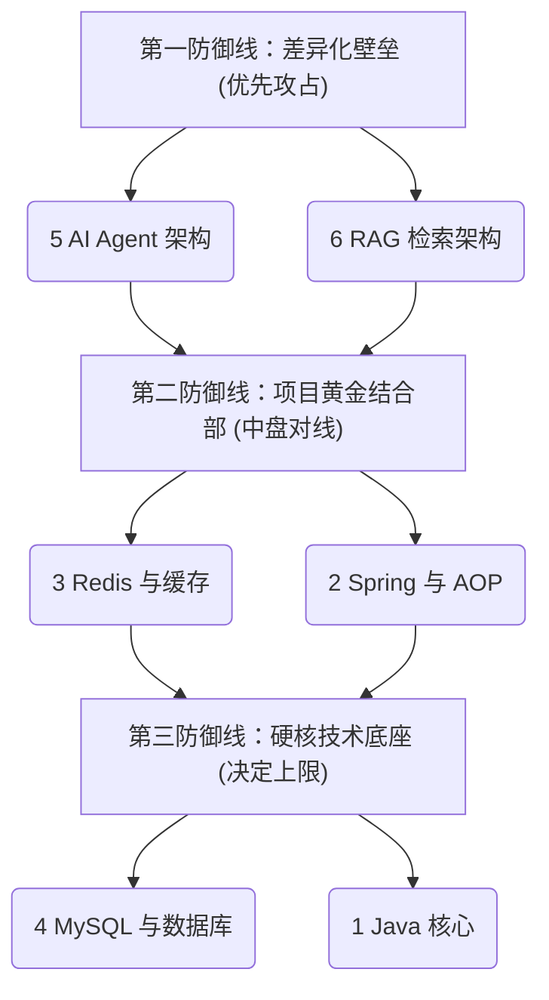

# 🎯 简历驱动型·八股复习战略计划

本计划根据您的个人简历（**Java 后端开发 + AI Agent 智能客服**）的核心卖点与亮点，为您量身定制的冲刺复习路径。

---

## 🗺️ 推荐复习路线图

---

## 🛡️ 三波防线详解

### 🚀 第一防线：差异化壁垒（AI Agent & RAG 架构）
> **包含板块：[5. AI Agent 架构](./5.%20AI%20Agent%20%E6%9E%B6%E6%9E%84/)、[6. RAG 检索架构](./6.%20RAG%20%E6%A3%80%E7%B4%A2%E6%9E%B6%E6%9E%84/)**

*   **战略价值**：大厂面试官对于 2027 届同学最关注的，也是您简历最抢眼的“AI 差异化标签”。一上场面试官心智必定会被这里吸引，需要最优先进行深入拷问。
*   **重点防御方向**：
    *   **Agent**：如何通过 `SafeToolCallAdvisor` 熔断自旋；12 种意图识别与工具过滤动态下发；多步任务编排的 Redis 状态持久化与超时预算设计。
    *   **RAG**：离线文档（PDF/Markdown/QA）的差异化切分（Markdown 按标题，QA 按问答对）；两路检索的 `RRF 融合`、`Reranker` 精排及 `Query Expansion` 原理。
    *   **性能方案**：在最前置加挂 `JVM 语义缓存`，对常见 FAQ 执行余弦相似度匹配，达成毫秒级短路返回。

---

### ⚔️ 第二防线：项目黄金结合部（缓存与核心框架）
> **包含板块：[3. Redis 与缓存](./3.%20Redis%20%E4%B8%8E%E7%BC%93%E5%AD%98/)、[2. Spring 与 AOP](./2.%20Spring%20%E4%B8%8E%20AOP/)**

*   **战略价值**：连接您的 AI 系统与高并发秒杀系统的桥梁，是 Java 开发日常中最重要的实战基础。
*   **重点防御方向**：
    *   **Redis**：`Redis + Lua` 库存扣减原子性、`Redisson` 分布式锁解决一人一单超卖（以及哨兵/主从同步延迟导致分布式锁失效分析）；Caffeine 二级缓存设计；`Redis Pub/Sub` 广播多实例本地缓存同步。
    *   **Spring 与 AOP**：AOP 拦截器实现并发流控；`JDK 动态代理`（基于接口）与 `CGLIB 字节码代理`（基于继承）的底层机制与应用场景；Spring 声明式/编程式事务隔离，规避事务与锁的冲突（如秒杀一人一单中编程式事务 `TransactionTemplate` 的应用）。

---

### 🧱 第三防线：硬核技术底座（数据库与 Java 核心）
> **包含板块：[4. MySQL 与数据库](./4.%20MySQL%20%E4%B8%8E%E6%95%B0%E6%8D%AE%E5%BA%93/)、[1. Java 核心](./1.%20Java%20%E6%A0%B8%E5%BF%83/)**

*   **战略价值**：面试必考的手撕和底层理论八股。项目描述过关后，这一层决定了您的技术功底深度与最终定级。
*   **重点防御方向**：
    *   **MySQL**：设计“支付回调记录表 + 唯一约束”来实现**支付幂等性**；针对订单状态流转等高并发竞争，使用**条件更新实现原子写（乐观锁）**。
    *   **Java 核心**：高并发秒杀或长连接 Agent 产生大量临时对象引发的 **JVM OOM 排查**与垃圾回收调优；高并发线程池核心参数设计与调优；HashMap 与 ConcurrentHashMap 的底层原理。
