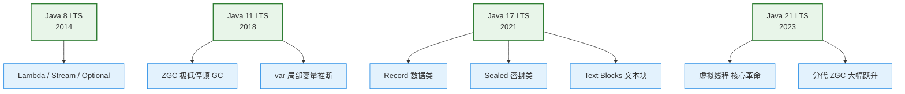

# 2. Java 新特性特训指南（极简源码速成版）

本指南专为快速吃透 **Java 21 虚拟线程高并发调度大模型**、**Spring Boot 3 现代化响应式开发** 等核心场景中的新特性高频考点而设计。杜绝大段铺垫，采用 **Why - What - How - Deep** 四步直达底层源码与硬件机理，帮助您在面试中反客为主，化被动为主动。

---

## 🚀 核心概念极简拆解

*   **函数式接口 (Functional Interface)**
    *   **Why**：在 Java 中，方法不能作为一等公民（参数）直接传递，导致需要写大量臃肿的匿名内部类。
    *   **What/How**：有且仅有一个抽象方法的接口（如 `Runnable`, `Comparator`），使用 `@FunctionalInterface` 注解标识，能被 Lambda 表达式以极简语法瞬间实例化。
*   **局部变量推断 (var)**
    *   **Why**：传统的 Java 变量声明要求左右类型绝对对称，充斥着大段冗长的类型定义。
    *   **What/How**：Java 10 引入。在局部变量声明时用 `var` 代替具体类型，由编译器在编译期根据右侧初始值自动推断并擦除。写代码极快，且没有任何运行期开销。
*   **文本块 (Text Blocks)**
    *   **Why**：在 Java 中拼接多行 JSON、SQL 或 HTML，需要用极其恶心的 `+` 号拼接和手动转义双引号，容易眼花且无法维持排版格式。
    *   **What/How**：Java 15 正式引入。使用 `"""` 包裹多行字符串，能够完美保留格式、自动去除最左侧公共缩进，无需显式写转义字符。
*   **密封类 (Sealed Classes)**
    *   **Why**：传统的类防继承只能用 `final`。但如果想做精准控制（如：接口 Message 只能被 TextMessage 实现，不能被其他第三方类实现），原有的 Java 做不到。
    *   **What/How**：Java 17 引入。通过 `sealed` 声明类/接口，配合 `permits` 特许授权指定子类。子类必须声明为 `final`、`sealed` 或 `non-sealed`。
*   **虚拟线程 (Virtual Threads)**
    *   **Why**：传统的“平台线程”与操作系统（OS）线程是 1:1 的昂贵关系，每个线程占用约 1MB 栈内存，高并发长耗时 I/O 场景会导致严重的线程饥饿和高昂的上下文切换开销。
    *   **What/Deep**：Java 21 引入（Project Loom）。跑在 JVM 用户态的极其轻量的协程（M:N 模型），由 JVM 动态调度挂载到少量平台线程上运行。

---

## 🚀 核心版本演进骨架

在面试中，对于 Java 新特性的演进，您可以通过下图快速建立直觉。我们仅筛选出国内中大型互联网项目以及 AI 落地中最具技术壁垒的几个 LTS 版本：



---

## 🎯 第一优先级核心考点详解

### 一、 虚拟线程源码核心考点 (Why-What-How-Deep)

*   **Why（传统的平台线程为什么这么贵？）**
    *   **痛点**：Java 传统的 `Thread` 是对**操作系统（OS）线程**的 1:1 封装。
        1.  **高昂的内存**：每个 OS 线程预留约 1MB 的栈内存，开 1 万个线程就需要 10GB 的内存，极易 OOM。
        2.  **昂贵的上下文切换**：当 CPU 在多线程间切换时，需要陷入内核态并保存/恢复各种寄存器状态。
        3.  **阻塞即浪费**：面对长耗时 I/O 阻塞（例如等待大模型 API 响应、查库、调用三方接口），高昂的平台线程只能在原地挂起空转，白白浪费 CPU 与内存资源。
    *   **解决**：Java 21 引入了虚拟线程，使得单 JVM 进程能够轻松并发支撑 **百万级** 线程。
*   **What（1:1 与 M:N 模型的极简对比）**
    | 对比维度 | 平台线程 (Platform Thread) | 虚拟线程 (Virtual Thread) |
    | :--- | :--- | :--- |
    | **映射模型** | 1:1 映射操作系统 OS 线程 | M:N 映射（百万个虚拟线程映射到少量平台线程） |
    | **起步内存** | 约 1MB（固定预分配） | 数百字节（根据调用栈深度在 JVM 堆中动态伸缩） |
    | **创建与销毁** | 昂贵，必须池化（ThreadPoolExecutor） | 极轻，随用随建，随用随丢，**严禁池化** |
    | **上下文切换** | OS 内核态切换，开销大（毫秒/微秒级） | JVM 用户态切换，开销极低（纳秒级） |
    | **阻塞后果** | 整个 OS 线程被挂起，无法处理其他任务 | 卸载（Unmount）虚拟线程，平台线程继续服务他人 |

##### 💡 核心极简拆解：虚拟线程的 M:N 调度原理

下图是虚拟线程底层的极简调度流转过程：

```mermaid
graph LR
    subgraph JVM 堆 (User Space)
        VT1[虚拟线程 VT1]
        VT2[虚拟线程 VT2]
        VT3[虚拟线程 VT3]
    end
    subgraph 线程池 ForkJoinPool
        PT1[平台线程 PT1 <br> Carrier]
        PT2[平台线程 PT2 <br> Carrier]
    end
    subgraph OS 级别
        OS1[OS 线程 1]
        OS2[OS 线程 2]
    end

    VT1 -- 挂载 Mount --> PT1
    VT3 -- 挂载 Mount --> PT2
    PT1 --> OS1
    PT2 --> OS2
```

*   **How（如何优雅优雅地使用它？）**
    *   **Executor 自动管理（高频实战写法）**：
        ```java
        // 1. 自动开启虚拟线程流，一个任务一个虚拟线程，随用随丢
        try (var executor = Executors.newVirtualThreadPerTaskExecutor()) {
            executor.submit(() -> {
                // 执行长耗时 I/O 任务，如查库或调用大模型
                String result = callLLMAgent();
                System.out.println(result);
            });
        } // 离开 try 块自动执行 close()，会阻塞并等待所有虚拟线程任务执行完，优雅释放
        ```
*   **Deep（深入源码：Mount/Unmount 调度机制与 Pinned 锁定陷阱）**
    *   **Mount 与 Unmount 源码流转奥秘**
        *   当虚拟线程启动时，JVM 底层的 **ForkJoinPool 调度器** 会将其**挂载 (Mount)** 到一个被称为“携带者线程 (Carrier Thread)”的平台线程上运行。
        *   当虚拟线程内部执行到阻塞 I/O（如 `SocketInputStream.read()`）时，JDK 内部的底层 API 会拦截这一阻塞动作，将其对应的调用栈信息从 Carrier 线程中拷贝到 **JVM 堆内存** 中进行归档保存。这一步叫做**卸载 (Unmount)**。
        *   一旦卸载，Carrier 线程瞬间变为空闲，被 ForkJoinPool 释放去执行其他虚拟线程。
        *   当底层的 I/O 准备就绪（由底层的 `epoll/kqueue` 等多路复用通知 JVM），调度器会重新从堆内存中把该虚拟线程的调用栈“恢复并重构”到某个空闲的 Carrier 线程上继续运行。对开发者而言，写的是同步阻塞代码，底层跑的却是最高并发的响应式多路复用。
    *   **硬核避坑：Pinning 锁定问题（面试绝对杀手锏）**
        *   **痛点机制**：当虚拟线程在 **`synchronized` 块或方法** 内部，或者正在调用 **Native 方法** 时，一旦发生阻塞 I/O，该虚拟线程就会被“钉死 (Pinned)”在 Carrier 线程上，**无法进行卸载 (Unmount)**！
        *   **后果**：这导致底层的 Carrier 平台线程被迫一并陷入硬阻塞状态。如果有多个并发虚拟线程在 `synchronized` 块内发生了 I/O 阻塞，整个 ForkJoinPool 的平台线程会被瞬间全部钉死，整个虚拟线程高并发系统当场退化并瘫痪。
        *   **大厂规范解法**：在采用虚拟线程的高并发场景下，**必须全面将代码中的 `synchronized` 锁替换为 `ReentrantLock`**，因为 `ReentrantLock` 底层依赖的 AQS 已重构，对虚拟线程能够实现完美的 Unmount/Mount 支持。

---

### 二、 Record 数据载体类 (Why-What-How-Deep)

*   **Why（为什么引入 Record？）**
    *   **痛点**：传统的 Java DTO 存在大量的模板样板代码（包含显式构造器、Getter、hashCode、equals、toString），不仅代码冗余，且极易因后续增加字段而遗漏修改这些方法。引入 Lombok 插件虽有改善，但其通过 AST 字节码修改有一定侵入性，且无法满足数据**绝对不可变性**的安全诉求。
    *   **解决**：JDK 14 引入 Record 作为一种专为“数据载体”设计的特殊类，用一行代码平替一切 DTO 的冗余声明。
*   **What（Record 的不可变属性与极简语法）**
    ```java
    // 一行声明，自动生成：全参构造、同名 getter（注意无 get 前缀）、toString、equals、hashCode
    public record UserDTO(Long id, String username, String email) {}
    ```
*   **How（如何快速判断是否该用 Record？）**
    *   **极简决策树**：
        1. 这是一个仅装载数据、不带复杂业务逻辑的对象吗？（**Yes**）
        2. 该对象一旦被创建，其内部的各个字段在生命周期内是否绝对不需要被二次修改（只读）？（**Yes**）
        3. 这个类不需要继承其他父类，也不需要被其他类继承吗？（**Yes**）
        *   👉 **以上皆满足，果断使用 `record`！**（非常适合作为 API 响应载体、DTO、RPC 参数）。
*   **Deep（深入字节码：Record 底层解析与无状态局部状态机）**
    *   **字节码反编译真面目**：
        *   当我们对 `UserDTO.class` 进行反编译时，会发现 Record 的本质：
            1.  它是一个被声明为 **`final` 的类**，无法被继承。
            2.  它默认**继承自 `java.lang.Record`**。正因为 Java 是单继承的，所以 Record 类绝对无法再继承其他任何类，但允许实现接口。
            3.  它的所有成员属性（如 `id`, `username`）都被编译器自动声明为 **`private final`**，实现了对象的强不可变性（不允许生成 Setter 方法）。
    *   **优雅的中间状态机载体（高阶技巧）**：
        *   由于 Record 可以在方法内部本地声明（局部 Record），非常适合在 Stream 流式计算中扮演“无状态局部状态机”。例如在处理复杂报表时，由于需要做临时的多字段映射而不想创建全局 DTO 类，可以直接在方法里定义局部 record 临时聚合数据，对 JVM 极度友好，GC 回收极快。

---

### 三、 Sealed Classes 密封类 (Why-What-How-Deep)

*   **Why（为什么有了 final 还需要 sealed？）**
    *   **痛点**：在传统的 Java 继承中，我们对子类的控制只有“非黑即白”的两个极端：
        1.  要么是普通 `class`，意味着所有第三方类都可以随意继承扩展它，破坏了领域模型的闭合性。
        2.  要么是 `final`，直接锁死，不允许任何类继承。
    *   *诉求*：我们想设计一个类 `Message`（消息），只允许 `TextMessage` 和 `ImageMessage` 两个子类，**绝对禁止**任何外部未授权的子类继承，以此保证系统设计安全性。
*   **What（密封类语法规范）**
    ```java
    // 1. 声明 Message 为密封接口，并 permits（特许）仅允许两个子类实现
    public sealed interface Message permits TextMessage, ImageMessage {}

    // 2. 特许子类必须是 final（不可变）、sealed（继续密封）或 non-sealed（敞开继承）之一
    public final class TextMessage implements Message {}
    public final class ImageMessage implements Message {}
    ```
*   **How（在业务开发中的黄金实战场景）**
    *   非常适用于构建**强闭合的状态机（State Machine）**、**支付管道** 或 **领域驱动设计（DDD）的值对象**，防止系统边界被未知的业务扩展侵入。
*   **Deep（深入源码：编译期闭合穷举校验与 JVM 级字节码审计）**
    *   **Switch 表达式的闭合穷举校验**：
        *   当我们在 Switch 中使用密封类时，编译器能够在编译期执行**完备穷举性检查**。因为编译器明确知道 `Message` 只有两个合法子类，所以如果我们的 `switch` 漏写了其中一个，编译阶段就会强行报错：
            ```java
            // 若漏掉 ImageMessage，编译直接报错："the switch expression does not cover all possible input values"
            String result = switch (msg) {
                case TextMessage t -> "Text: " + t.toString();
                case ImageMessage i -> "Image: " + i.toString();
            }; // 完全无需写多余的 default 分支！代码极其简洁、安全。
            ```
    *   **Class 文件底层审计机制**：
        *   密封类不是简单的语法糖。在编译成 Class 文件后，它的常量池中会新增一个特定的 **`PermittedSubclasses` 属性表**，显式记录所有获得授权的子类全限定名。JVM 类加载器在“连接（Connection）阶段”会严格验证，如果发现有未声明在 permits 中的类尝试继承密封父类，会直接抛出严重的 `IncompatibleClassChangeError`，在字节码和运行期层面提供了铁桶般的防御。

---

### 四、 函数式编程 Lambda 与 Stream API (Why-What-How-Deep)

*   **Why（Stream 的设计初衷是什么？）**
    *   **痛点**：在 Java 8 之前，处理集合数据（过滤、聚合、去重）必须写大量面条式的 `for` 循环和 `if-else` 分支。代码缺乏可读性，多级业务逻辑嵌套极深，且极难编写并行动行计算（并发遍历容易出现写覆盖或死锁）。
    *   **解决**：Stream API 引入声明式、函数式流水线，实现类似 SQL 对数据的极速优雅筛选。
*   **What（惰性求值与及早求值）**
    *   **中间操作（惰性求值 / Lazy Evaluation）**：如 `filter()`, `map()`, `distinct()`。只记录操作轨迹，**完全不触发真正的计算**。
    *   **终端操作（及早求值 / Terminal Evaluation）**：如 `collect()`, `count()`, `findFirst()`。一旦调用，瞬间触发所有先前积累的流水线计算。
*   **How（流式计算常见 API 演示与预估优化）**
    ```java
    List<String> activeUserNames = users.stream()
        .filter(u -> "ACTIVE".equals(u.getStatus())) // 过滤
        .map(User::getUsername)                      // 转换
        .limit(10)                                   // 截断
        .collect(Collectors.toList());               // 终端收集
    ```
*   **Deep（深入源码：双端链表流水线与 Sink 延迟计算）**
    *   **Stream 内部的双端链表流水线机制**
        *   当我们连续调用 `.filter().map()` 时，Stream 底层会在内存中为每个中间操作创建一个特殊的 **`PipelineHelper`（具体为 `AbstractPipeline`）节点**，这些节点会被串联挂载，构成一个**双端链表形式的流水线（Pipeline）**。
    *   **Sink（水槽）延迟计算流转**
        *   当终端操作 `collect()` 触发时，Stream 会从链表尾部向头部反向追溯，将每一个中间操作包装成一个被称为 **`Sink`** 的核心接口对象。
        *   `Sink` 的内部设计了四个核心生命周期方法：`begin()`（准备）、`accept()`（处理元素）、`cancellationRequested()`（短路判断）、`end()`（收尾）。
        *   链表首部的 `Sink` 负责接收原始集合元素，调用 `accept()` 处理后，将结果作为参数调用下一个 `Sink` 的 `accept()`，以此类推。
        *   一旦触发诸如 `limit(10)` 的短路操作，对应的 `Sink` 会在接收满 10 个元素后，使 `cancellationRequested()` 返回 `true`，立刻向上游 Sink 发出短路拦截信号，强行终止遍历。这种设计避免了多余数据的无效计算，实现了极其高效的**延迟求值与单次遍历完成所有过滤映射**。

---

## 🎯 简历亮点深度关联与对线场景 (Why-What-How)

### 场景：Spring Boot 3 + 虚拟线程高并发调度大模型 API

**面试官切入点**：
> "我看你项目中有大量的 AI Agent 调度与多步任务编排，而大模型 API（如 DeepSeek/OpenRouter）的网络 I/O 响应时间往往长达数秒甚至几十秒。传统的线程池面对这种高并发、长耗时的 I/O 会瞬间瘫痪。你是如何解决这个高并发瓶颈的？"

**回答思路 (Why-What-How-Deep 拆解)**：
*   **Why**：
    1.  **平台线程饥饿**：在传统的 Tomcat 线程模型中，由于一个连接绑定一个 OS 线程（1:1）。大模型长达数秒的慢响应会导致平台线程被迅速打满挂起，微服务瞬间因“线程饥饿”拒绝所有新请求。
    2.  **异步编程地狱**：如果使用传统的响应式 WebFlux（基于 Reactor / RxJava），虽然利用少量 Netty 线程提升了吞吐，但却引入了极其痛苦的异步非阻塞回调（Callback Hell），直接导致复杂的 Agent 多步任务状态流转和签名校验代码写起来痛苦不堪，调试与排查日志异常艰难。
*   **What/How**：
    我们升级了 **Spring Boot 3 + JDK 21**，全面启用了 **虚拟线程 (Virtual Threads)**。面对高并发的大模型调度，我们采用零池化设计，直接利用 `Executors.newVirtualThreadPerTaskExecutor()` 为每一个传入的 Agent 任务调度请求在 JVM 用户态动态创建一个专属的虚拟线程，任务结束随用随丢。
*   **Deep**：
    *   **挂/载高吞吐原理**：由于虚拟线程起步仅数百字节，即使瞬时创建 10 万个也毫无内存压力。当 Agent 调用外部 LLM 接口进入阻塞等待时，JVM 捕获这一阻塞行为，将该虚拟线程的调用栈从平台线程（Carrier）上瞬间**卸载 (Unmount)** 并保存到堆内存。Carrier 平台线程立刻释放，被去执行其它任务。大模型响应通过操作系统的 `epoll` 事件通知 JVM 后，JVM 重新在堆中还原其调用栈，**挂载 (Mount)** 回空闲的 Carrier 线程继续下半段逻辑。
    *   **synchronized 避坑实战**：我们在开发中遇到过虚拟线程“Pinned（钉死）”导致系统瘫痪的生产事故。排查发现，我们自研的“接口幂等性拦截器”和“工具白名单检测”底层引用了第三方包的 `synchronized` 同步代码块，导致阻塞时虚拟线程无法被 Unmount 卸载。我们迅速对该部分进行了代码审计，**全面将 synchronized 重构为 AQS 实现的 ReentrantLock**，彻底扫清了虚拟线程的阻塞死角，将 AI 调度网关的高并发吞吐量拉升了数倍！

---

## 📝 第三优先级：避坑与实战常识

*   **Record 序列化注意事项**
    *   Record 类在序列化时，它的 `serialVersionUID` 在编译期始终固定为 `0L`，且其序列化和反序列化过程**完全只依赖其声明的字段定义**，不会调用任何构造函数。这避开了传统类因反序列化构造注入带来的各类漏洞，但要注意在与部分老旧持久化框架（如老版 Hibernate）或传统 JSON 序列化库集成时可能存在字段同名 Getter（没有 get 前缀）的适配缺陷。
*   **严禁使用 ThreadLocal 池化虚拟线程**
    *   很多旧有项目喜欢在平台线程中使用 `ThreadLocal` 缓存昂贵的大对象（如 `SimpleDateFormat`）以进行复用。但在虚拟线程场景下，由于虚拟线程是瞬时产生、数以百万计的，如果对虚拟线程也滥用 `ThreadLocal`，将会在 JVM 堆内堆积海量的小对象，反而引发严重的 GC 压力。因此，虚拟线程场景下应彻底弃用 ThreadLocal 缓存大对象，推荐直接采用 JDK 21 提供的 **ScopedValue（作用域值）** 进行轻量级线程数据传递。