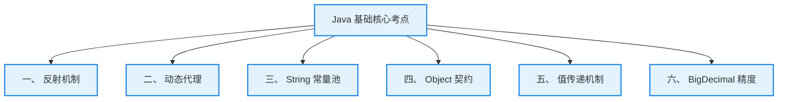

# 3. Java 基础特训指南（极简源码速成版）

本指南专为将 **Java 基础底层原理** 与 **实际工业级项目设计**（如：苍穹外卖 AI Agent 调度管道、多步任务编排、接口幂等性保障、餐饮 SaaS 账单高精度计费）强行绑定而设计。杜绝大段铺垫，采用 **Why - What - How - Deep** 四步直达底层源码与硬件机理，帮助您在面试中反客为主，化被动为主动。

---

## 🚀 核心概念极简拆解

*   **JVM vs JDK vs JRE**
    *   **Why**：需要区分 Java 的运行、开发与虚拟化边界，确保各环境组件各司其职。
    *   **What/How**：**JVM** 是运行字节码的虚拟机；**JRE** 是运行环境，包含 JVM 和核心类库；**JDK** 是开发工具包，包含 JRE 和开发工具（如 javac），开发必须用 JDK。
*   **值传递 (Pass-by-Value)**
    *   **Why**：确保方法调用过程中，实参的内存地址和原始数据不被方法内部的指向改变破坏。
    *   **What/Deep**：Java 中**只有值传递**。方法接收的是实际参数值的一个副本。对于基本类型是具体数值的副本，对于引用类型是对象堆内存地址值的副本。
*   **多态 (Polymorphism)**
    *   **Why**：实现代码的高度解耦与可扩展，是 AOP、装饰器、责任链等几乎所有设计模式和主流框架的基石。
    *   **What/How**：父类型引用指向子类型对象，在运行期（动态绑定）根据对象的实际类型决定调用哪个方法。
*   **语法糖 (Syntactic Sugar)**
    *   **Why**：增加代码可读性与开发效率，由编译器在编译阶段进行解糖还原，降低运行期复杂性。
    *   **What/Deep**：如泛型擦除、foreach、自动装箱。在字节码层面，这些现代语法都会被还原为基础的 JVM 指令结构。

---

## 🚀 核心考点演进骨架



---

## 🎯 第一优先级核心考点详解

### 一、 Java 反射机制 (Why-What-How-Deep)

*   **Why（为什么需要反射？）**
    *   **痛点**：传统的 Java 编程是静态编译的，即在编译期就必须确定所有要实例化的类和要调用的方法。这使得编写高度通用的框架（如 Spring IOC 容器、MyBatis 映射器、Jackson 序列化）变得几乎不可能。
    *   **解决**：反射赋予了 Java 在运行期分析类结构、动态加载类和调用其私有方法/属性的能力，极大地提升了系统的灵活性和框架适配度。
*   **What（反射四大核心元数据类）**
    *   `Class`：类元数据对象，代表内存中的一个类。
    *   `Constructor`：类的构造方法元数据。
    *   `Method`：类的方法元数据。
    *   `Field`：类的成员变量元数据。
*   **How（反射获取与动态调用）**
    *   **Class 获取方式**：
        1.  `Class.forName("全类名")`：常用于配置文件动态加载。
        2.  `类名.class`：最安全高效，编译期即可确定，无运行期解析损耗。
        3.  `实例.getClass()`：适用于已有实例时的类型审计。
    *   *简历实战引用*：在我们的 AI Agent 调度管道中，就是利用反射动态提取带有 `@AgentTool` 注解的方法元数据并进行动态调用的。[👉 点击跳转简历场景一](#场景一动态下发工具白名单签名检测与反射机制)
*   **Deep（深入源码：JIT 内联优化失效与 Inflation 膨胀机制）**
    *   **为什么反射调用性能慢？**
        1.  **JIT 内联优化 (Inlining) 失效**：JIT 编译器能将高频调用的普通方法直接内联到调用点，消除方法调用开销。然而反射的类型和方法在运行期是动态决定的，JIT 根本无法对其执行方法内联优化。
        2.  **频繁的安全权限审计**：每次通过反射执行 `Method.invoke`，JVM 都必须调用 `checkAccess()` 去验证调用者是否拥有执行该方法的权限（例如是否违反了 private 限制），这需要经过高昂的安全审计链。
    *   **源码级 Inflation（膨胀）机制**：
        *   在 `Method.invoke` 底层，其实设计了两套执行策略以平衡启动速度和运行效率：
            1.  **JNI 本地调用（前 15 次）**：在方法被初始调用的前 15 次，JVM 会通过本地方法（JNI）直接调用 C++ 代码执行。这种机制无需生成额外的字节码，启动非常快，但单次执行效率一般。
            2.  **动态字节码生成（> 15 次）**：一旦同一个反射方法被调用的次数超过 **15 次（默认阀值）**，JVM 底层会触发 **Inflation 膨胀机制**。它会动态生成一个继承自 `MethodAccessorImpl` 的全新专用 Java 字节码类（如 `GeneratedMethodAccessor1`），将其直接加载进 JVM。此后的反射调用会直接转化为对这个新生成类的普通 Java 字节码调用，完全规避了本地 JNI 调用开销，执行速度提升数倍。

---

### 二、 动态代理机制 (Why-What-How-Deep)

*   **Why（为什么需要动态代理？）**
    *   **痛点**：传统静态代理要求为每一个目标类手动编写一个代理类。如果有 100 个服务类需要织入统一的“接口防刷限流”或“日志审计”逻辑，我们就必须写 100 个代理类，产生灾难性的样板代码冗余。
    *   **解决**：动态代理允许 JVM 在运行期，直接在内存中动态生成代理类的字节码，实现一处拦截逻辑服务于海量目标类，实现真正的非侵入式横切增强。
*   **What（JDK 动态代理与 CGLIB 代理的严苛对比）**
    | 对比维度 | JDK 动态代理 | CGLIB 动态代理 |
    | :--- | :--- | :--- |
    | **底层实现** | Java 反射机制 + 接口动态类生成 | ASM 字节码操作库 + 继承生成子类 |
    | **目标类限制** | **目标类必须实现至少一个接口** | 目标类不能被 `final` 修饰，方法不能是 `final/private` |
    | **调用开销** | 依赖反射调用，速度相对较慢 | 无反射开销，直接调用，速度极快 |
    | **Spring 决策** | 若实现了接口，默认使用 JDK 代理；否则降级强制使用 CGLIB | **Spring Boot 2.x+ 默认配置已全面倾向于使用 CGLIB** |
*   **How（代理模式在 Spring AI 中的硬核集成）**
    *   *简历实战引用*：在我们的 Advisor 拦截管道中，Spring 底层会根据 Advisor 是否实现接口，自动在 JDK 代理和 CGLIB 代理之间进行切换，完美织入流式拦截。[👉 点击跳转简历场景二](#场景二spring-ai-advisor-链与动态代理与-aop)
*   **Deep（深入源码：$Proxy0 的内存面目与 CGLIB FastClass 索引机制）**
    *   **JDK 动态代理底层生成的 `$Proxy0` 长什么样？**
        *   如果我们把 JDK 动态代理在内存中生成的字节码转储为文件，会发现这个类名为 **`$Proxy0`**：
            1.  它**继承自 `java.lang.reflect.Proxy`**，并**实现了目标类的所有接口**。
            2.  它在静态代码块中，利用反射预先获取了目标接口中所有方法的 `Method` 对象（如 `m1`, `m2`）。
            3.  当外部调用代理方法时，`$Proxy0` 内部会直接把该调用中转委托给持有的 `InvocationHandler.invoke(this, m3, args)` 执行。由于中转依然依赖 Method 的反射执行，存在一定的反射损耗。
    *   **CGLIB 的 FastClass 索引机制（绝对的硬核考点）**：
        *   CGLIB 基于 ASM 库动态生成目标类的**子类**字节码，并重写父类非 final 方法进行拦截。为了彻底消除反射调用的损耗，CGLIB 引入了 **`FastClass` 机制**：
            *   CGLIB 会为被代理类和代理类各生成一个对应的 `FastClass` 辅助类。
            *   在 `FastClass` 内部，会将类中所有的方法信息进行排序，并为每一个方法分配一个**唯一的整型数字索引（Index）**（例如：`insert()` 对应索引 1，`update()` 对应索引 2）。
            *   当需要调用代理方法时，CGLIB 不使用反射 `Method.invoke()`，而是直接传入方法索引，在 FastClass 的 `invoke` 方法内部通过一个高效率的 **`switch-case`** 直接定位并强转调用目标方法：
                ```java
                // FastClass 底层核心机制：完全避免反射，速度几乎等同于直接调用
                public Object invoke(int index, Object obj, Object[] args) {
                    switch (index) {
                        case 1: return ((UserService)obj).insert((String)args[0]);
                        case 2: return ((UserService)obj).update((Long)args[0]);
                    }
                    throw new IllegalArgumentException("Method not found");
                }
                ```

---

### 三、 String 核心面试考点 (Why-What-How-Deep)

*   **Why（为什么 String 要被设计为不可变的？）**
    *   **痛点**：字符串是程序中最频繁使用的数据。如果 String 可变，当多个线程共享同一个字符串时，一处的篡改会无声地破坏其他地方的逻辑；且无法实现常量池缓存共享，导致极大的堆内存浪费。
    *   **解决**：将 String 设计为绝对不可变。
*   **What（不可变性的四大物理基础）**
    1.  **核心数组私有且 final**：在 JDK 8 中底层为 `private final char[] value`；JDK 9 改为 `private final byte[] value`。
    2.  **不暴露任何修改途径**：没有 Setter，所有看似修改的方法（如 `replace`, `substring`）都在底层 `new` 了一个全新的 String 对象返回。
    3.  **类声明为 final**：防范子类通过重写方法破坏不可变性。
*   **How（`intern()` 方法在不同 JDK 版本下的重大差异）**
    ```java
    String s1 = new String("a") + new String("b"); 
    s1.intern(); // 在常量池中寻获或存入引用
    String s2 = "ab";
    System.out.println(s1 == s2); // JDK 6 输出 false；JDK 7+ 输出 true！
    ```
*   **Deep（深入源码：字符串常量池的堆区转移与 intern() 引用复用优化）**
    *   **常量池位置演进**：
        *   **JDK 6 及以前**：字符串常量池（String Pool）位于**永久代（PermGen）**中。由于永久代内存大小由 `-XX:MaxPermSize` 锁死且极难触发 Full GC，高频的 `intern()` 极易引发严重的 `OOM: PermGen space`。
        *   **JDK 7+**：常量池被强行移入了**堆（Heap）**中，直接共享整块堆内存，极大地解放了存储空间，且能高效参与正常的垃圾回收。
    *   **`intern()` 原理演进与内存指针差异**：
        *   **JDK 6 机制**：调用 `s.intern()` 时，如果常量池中没有该字符串，JVM 会在永久代的常量池中**强行拷贝一份全新的字符串对象**，并返回常量池中这个新拷贝对象的内存地址。因此，堆中原有的 `s` 与常量池中的对象是完全独立的两个个体，`==` 必定为 `false`。
        *   **JDK 7+ 机制**：由于常量池就在堆里，调用 `s.intern()` 时，如果常量池没有该字符串，JVM 不会再傻傻地拷贝一份完整对象，而是**直接在常量池中创建一个引用，指向堆中 `s` 所指向的那个对象**。当 `String s2 = "ab"` 声明时，它去常量池寻找，找到了这个指向堆中 `s` 对象的引用，于是 `s2` 直接拿到了 `s` 的堆地址。两者地址完美统一，`==` 结果为 `true`！这极大地节省了大量对象复制的内存开销。

---

### 四、 Object 核心方法与 hashCode-equals 契约 (Why-What-How-Deep)

*   **Why（为什么要有 equals 与 hashCode 契约？）**
    *   **痛点**：Java 集合（如 `HashMap`, `HashSet`）为了实现 $O(1)$ 的定位，需要利用哈希码预先划定元素所在的哈希槽。如果只重写 `equals` 判断内容相等，但 `hashCode` 依然沿用 Object 默认的内存地址哈希，两个逻辑相等（equals 为 true）的对象就会拥有不同的哈希码。
    *   **解决**：制定严格的等值契约，保障基于哈希表的容器行为绝对自恰。
*   **What（黄金契约规则）**
    1.  如果两个对象通过 `equals()` 判断相等，它们的 `hashCode()` **必须完全相同**。
    2.  如果两个对象的 `hashCode()` 相同，它们通过 `equals()` **不一定相等**（这被称为哈希碰撞）。
*   **How（重写 equals 时的经典五步法）**
    1.  用 `==` 检查是否为同一对象引用（提升速度）。
    2.  用 `instanceof` 或 `getClass()` 检查是否为 null 且类型匹配。
    3.  强转为目标类型。
    4.  逐个比较核心属性值。
    5.  **同步重写 `hashCode()`**，常用 `Objects.hash(field1, field2)`。
*   **Deep（深入源码：HashMap 定位失败与隐蔽的内存泄漏陷阱）**
    *   **如果不重写 `hashCode()` 会造成什么灾难？**
        *   我们以 `Map<User, String> map = new HashMap<>()` 为例：
            1.  我们创建了 `User u1 = new User("Ethan")` 并 `put(u1, "Active")`。
            2.  此时我们想获取数据，创建了内容一模一样的 `User u2 = new User("Ethan")` 并尝试 `map.get(u2)`。
            3.  由于没有重写 `hashCode`，`u1.hashCode()` 与 `u2.hashCode()` 大率不一致（它们由 JVM 根据各自堆内存地址计算）。
            4.  `HashMap` 底层计算槽位 `(n - 1) & u2.hashCode()`，直接把 `u2` 导向了一个与 `u1` **完全不同的哈希槽（Bucket）**。
            5.  即使那个槽位恰好为空，或者两个槽位里都有链表，`map.get(u2)` 也会因为在对应槽位找不到哈希相同的节点而返回 `null`。
        *   👉 **后果**：逻辑相同的 Key 无法获取 Value，且如果持续向 Map 中添加内容相同但 hashCode 不同的 User，会导致 Map 中堆积大量无用重复对象，引发严重的**隐蔽性内存泄漏**，直到触发 OOM。

---

### 五、 值传递 vs 引用传递（Java 只有值传递） (Why-What-How-Deep)

*   **Why（为什么 Java 坚持只用值传递？）**
    *   **痛点**：引用传递允许外部方法直接强行改写调用者本地变量的内存地址（即指针本身），极易引发调用者根本无法预知的“变量指向被暗中篡改”的安全隐患。
    *   **解决**：Java 屏蔽了指针操作，强制使用值传递（复制副本），保证方法调用边界的安全。
*   **What（值传递的核心定义）**
    *   **值传递**：方法接收的是实际参数值的一个**副本（Copy）**。
*   **How（引用类型传递的最易混淆陷阱）**
    *   *经典误区*：很多人认为“传入对象并在方法内修改了属性，外部属性也变了，这不就是引用传递吗？”
    *   *真相*：这依然是值传递。因为传入的是“堆内存地址值”的副本。形参和实参此时保存了相同的地址，因此通过地址副本修改属性会生效；但如果直接让形参指向一个新对象，实参指向绝对不会发生变化。[👉 点击跳转验证代码分析](#场景三餐饮-saas-金额计算与bigdecimal-精度陷阱)
*   **Deep（深入 JVM 栈帧：swap 方法失败的内存本质）**
    *   当我们在 `main()` 方法中声明 `Person p1 = new Person("袁志刚")` 时：
        1.  JVM 会在 `main` 线程的**局部变量表（栈帧）**中为 `p1` 分配一个格位，保存着该对象在堆中的地址（假设为 `0x777`）。
    *   当我们调用 `swap(p1, p2)` 时：
        1.  JVM 在局部变量表中为 `swap` 方法开辟新的局部变量表，并将 `p1` 里的地址值复制一份（即 `0x777`）填入形参变量 `a` 中。此时 `p1` 与 `a` 保存的值相同，都指向堆中的同一个对象。
        2.  在 `swap` 内部执行 `Person temp = a; a = b; b = temp;`。
        3.  这几步**仅仅是将 `swap` 方法局部变量表中的 `a` 和 `b` 的格位内容进行了互换**，`a` 变成了 `0x888`，`b` 变成了 `0x777`。
        4.  然而，`main` 方法栈帧中的 `p1` 格位依然稳稳地保存着 `0x777`，根本没有受到任何波及。
        5.  `swap` 方法执行完毕，其栈帧被瞬间销毁，形参 `a` 和 `b` 灰飞烟灭。外部的 `p1` 指向毫无改变。这就是值传递的本质证据。

---

### 六、 BigDecimal 精度考点 (Why-What-How-Deep)

*   **Why（为什么浮点计算必须弃用 Double？）**
    *   **痛点**：计算机在底层使用二进制表示数。而十进制小数（如 `0.1`）在转换为二进制时，是一个**无限循环小数**。`float` 和 `double` 为了能用有限的位数（32位/64位）表示它，只能执行**强行截断**，这导致计算过程中产生微小的精度丢失。在餐饮账单、交易退款等计费场景中，微小的精度漂移累积起来会引发严重的财务事故。
    *   **解决**：使用 Java 提供的 `BigDecimal` 进行精确的十进制数学计算。
*   **What（BigDecimal 的不可变属性与基础 API）**
    *   `BigDecimal` 是不可变对象。每次对其执行 `add()`、`subtract()`，都会**产生并返回一个全新的 BigDecimal 对象**，必须显式接收返回值。
*   **How（如何避开初始化与比较的两大深坑？）**
    *   *简历实战引用*：在餐饮 SaaS 系统计费和外卖总价核算中，我们严格制定了 BigDecimal 的开发规范，杜绝一切精度溢出。[👉 点击跳转简历场景三](#场景三餐饮-saas-金额计算与bigdecimal-精度陷阱)
*   **Deep（深入源码：初始化误差成因与 equals 校验 Scale 缺陷）**
    *   **`new BigDecimal(0.1)` 误差成因**：
        *   当执行 `new BigDecimal(0.1)` 时，由于 `0.1` 传入前就已经是一个发生了精度丢失的 double 浮点数，BigDecimal 构造器会原封不动地将 double 这一精度丢失值完整地转换为十进制数，其实际值会变成 `0.10000000000000000555111512312578...`。
        *   **正确解法**：必须使用 `new BigDecimal("0.1")`（传入字符串，由 BigDecimal 内部逐字解析），或者使用静态工厂 `BigDecimal.valueOf(0.1)`（其底层源码为 `Double.toString(0.1)`，即先将 double 优雅转换为干净的字符串，再构造对象）。
    *   **`equals` 比较失败的底层源码剖析**：
        *   为什么 `new BigDecimal("1.0")` 与 `new BigDecimal("1.00")` 比较，`equals` 返回了 `false`？
        *   **源码依据**：我们翻看 `BigDecimal.equals` 源码：
            ```java
            public boolean equals(Object x) {
                if (!(x instanceof BigDecimal)) return false;
                BigDecimal xDec = (BigDecimal) x;
                if (x == this) return true;
                // 核心缺陷点：先比校验 scale（精度/小数位数），不等则直接返回 false！
                if (scale != xDec.scale) return false; 
                return this.inflated() == xDec.inflated();
            }
            ```
        *   因为 `"1.0"` 的 scale 是 1，而 `"1.00"` 的 scale 是 2，即使它们所代表的数值完全一致，`equals` 也会因为精度位数不等直接无情拒绝。
        *   **大厂规范解法**：比较 BigDecimal 的数值是否相等，**严禁使用 `equals`，必须全部使用 `compareTo()`**。当 `a.compareTo(b) == 0` 时，表明两者数值完全一致，因为它在底层会先对齐两者的精度 scale，再执行纯数值比较。

---

## 🛠️ 第二优先级核心考点详解

### 一、 异常处理机制与 try-with-resources 抑制原理 (Why-What-How-Deep)

*   **Why（传统 finally 关闭资源的痛点）**
    *   在 Java 7 之前，关闭网络连接、IO 流或数据库连接必须在 `finally` 块中执行。如果关闭时再次发生异常，或者需要嵌套关闭多个流，代码会变得极其混乱，且容易因为捕获不到关闭时的真实异常导致“异常屏蔽”现象。
*   **What/How（try-with-resources 优雅关闭）**
    *   凡是实现了 `AutoCloseable` 接口的资源类，都可以直接声明在 `try(...)` 括号中。代码离开 try 块时，JVM 会**自动**安全调用其 `close()` 方法释放资源，无需任何 finally 块。
*   **Deep（深入字节码：异常抑制的底层原理）**
    *   通过反编译字节码会发现，编译器在编译 `try-with-resources` 时，会自动将其展开为包含 `try-catch-finally` 的底层结构。
    *   如果在 try 块内执行业务代码时抛出了主异常 $E_1$，而随后 JVM 自动执行 `close()` 时又抛出了关闭异常 $E_2$，传统的做法会导致后者把前者“吞掉”，导致排查困难。
    *   **异常抑制机制**：编译器在此处会自动注入 **`Throwable.addSuppressed(Throwable exception)`** 动作，将次要的关闭异常 $E_2$ 作为一个“被抑制的异常（Suppressed Exception）”挂载在主异常 $E_1$ 底层。最后只将主异常 $E_1$ 向上抛出。开发者可以通过调用 `e.getSuppressed()` 获取所有被抑制的异常链，彻底解决了底层多重异常丢失的痛点。

---

### 二、 泛型擦除机制 (Why-What-How-Deep)

*   **Why（Java 为什么要引入“伪泛型”？）**
    *   **痛点**：Java 5 引入泛型时，市面上已经有海量基于 Java 1.4（无泛型）运行的生产系统。如果采用 C# 的“真泛型（泛型膨胀模式）”，会导致新旧版本的类库在运行期完全无法兼容。
    *   **解决**：采用“编译期擦除”的折中方案，保证泛型代码能够与老旧字节码完美向后兼容。
*   **What/How（泛型擦除表现）**
    *   泛型只存在于**编译阶段**（供编译器做类型安全检查）。一旦编译完成，所有的泛型标记（如 `List<String>`）在 `.class` 字节码中都会被**全部擦除**，替换为原始类型 `List`。
*   **Deep（深入字节码：checkcast 指令与运行时泛型实例化失效）**
    *   **checkcast 自动注入**：
        *   如果我们反编译泛型获取代码 `String s = list.get(0)`，会发现在字节码层面，`list.get(0)` 返回的依然是一个普通的 `Object`。
        *   编译器在编译时，会自动在调用获取点之后，强行注入一条 **`checkcast java/lang/String` 字节码强转指令**。这也是为什么我们在取出泛型数据时不需要手动强转的本质原因——编译器暗中替我们写了强转。
    *   **为什么泛型不能实例化 `new T()`？**
        *   因为泛型信息已被彻底擦除为 `Object`，在运行期 JVM 根本不知道 `T` 究竟代表哪个具体的 Class，因此 `new T()` 或 `instanceof T` 会直接引发编译报错。

---

## 🎯 场景亮点深度关联与对线场景 (Why-What-How)

### 场景一：动态下发工具白名单、签名检测与反射机制

**面试官切入点**：
> “我看到你的 AI Agent 调度管道中，能够根据识别的意图动态下发工具白名单（例如购物车意图仅开放 6 个相关工具），并且通过调用签名检测防止死循环。在 Java 中，你是如何实现这些工具的动态调用和安全签名的？”

**回答思路 (Why-What-How 拆解)**：
*   **Why**：大模型（LLM）调用外部工具需要极其动态的拦截、白名单校验和执行机制。传统的静态写死 Hardcode 调用无法适应 LLM 千变万化的意图请求，必须依靠运行期动态发现与调用的机制。
*   **What/How**：
    1.  **动态发现（反射提取）**：在系统启动时，我们利用 Java 的 **反射机制 (Reflection)** 扫描 Spring 容器中所有带有 `@AgentTool` 自定义注解的 Bean。通过 `Class.getDeclaredMethods()` 动态提取方法元数据（方法名、参数类型、注解描述），自动拼装转换成大模型所需的 JSON Schema 描述下发给大模型。
    2.  **反射调用（动态执行）**：当大模型决策需要调用某个工具并返回 JSON 参数时，我们首先在大模型拦截层进行白名单匹配。如果匹配成功，利用反射的 `Method.invoke(targetBean, convertedArgs)` 执行实际的业务逻辑并返回结果。
*   **Deep**：
    *   **性能提升（反射膨胀应用）**：由于 Agent 调用非常频繁，我们预估到了反射带来的开销。在性能调优时，我们利用了 JVM 自带的 **Inflation 膨胀机制**。高频反射方法在超过 15 次调用后，JVM 自动将其膨胀为无 JNI 开销的专用 Java 字节码类直接调用，极大地压榨了高频 Agent 反射执行吞吐量。
    *   **安全签名防爆（安全校验）**：反射能够通过 `setAccessible(true)` 强行执行私有方法或绕过安全限制，存在注入隐患。我们通过提取方法的**签名哈希**（方法名 + 参数类型）构建安全调用栈。在 `Method.invoke` 之前，比对当前对话上下文。如果发现相同方法在同一次多步任务编排中被连续且参数完全一致地调用，则立刻判定为大模型逻辑死循环，强行熔断反射调用，完美实现了 AI 沙箱防护。

---

### 场景二：Spring AI Advisor 链与动态代理与 AOP

**面试官切入点**：
> “你的 Agent 调度管道基于 Spring AI Advisor 链实现，且提到用了 AOP 的思想进行拦截和过滤。请问 Spring 中的 AOP 是如何通过动态代理实现的？JDK 动态代理与 CGLIB 有什么区别？它们在你的项目里是如何工作的？请结合具体的接口和组件谈谈你的底层开发细节。”

**回答思路 (Why-What-How 拆解)**：
*   **Why**：在我们的 AI 客服 Agent 项目中，需要对所有的请求和流式返回进行全局拦截（如：动态注入用户上下文画像、工具调用熔断）。我们不想把这些横切逻辑污染到具体的 LLM 调用业务类中，必须采用动态代理与 AOP 实现优雅解耦。
*   **What/How**：
    *   我们自研的 `UserContextAdvisor` 实现了 Spring AI 的 **`CallAdvisor`** 和 **`StreamAdvisor`** 两个核心接口。
    *   在同步调用中（`adviseCall`），我们拦截 `ChatClientRequest`，通过 `mutate()` 动态增强 prompt 并将请求传递给 `nextCall` 代理；在流式响应中（`adviseStream`），通过代理 Reactor 的 **`Flux<ChatClientResponse>`** 流，实现无侵入式增强。
*   **Deep**：
    *   **代理切换抉择**：在运行时，Spring AOP 底层会针对我们注入的各种 Advisor 进行代理包装：
        1.  针对实现了 `CallAdvisor`/`StreamAdvisor` 接口的普通 Advisor，Spring 默认使用 **JDK 动态代理**。在堆内存中动态为该 Advisor 生成 `$Proxy` 代理类，所有拦截调用通过持有的 `InvocationHandler` 进行中转。
        2.  而对于一些继承自 Spring AI 内置基类（如 `ToolCallAdvisor`，且无业务接口实现）的自定义子类（如我们的 `SafeToolCallAdvisor`），Spring 会自动切换并强制降级采用 **CGLIB 动态代理**。
    *   **CGLIB 性能压榨**：在 CGLIB 代理模式下，代理类继承自我们的 `SafeToolCallAdvisor`。当流式响应经过其 `doAfterStream` 拦截时，CGLIB 底层凭借其 **`FastClass` 索引分发机制**（通过整型索引 switch-case 直接路由到对应拦截逻辑方法，无任何反射损耗），极速织入拦截逻辑，使得流式响应的中间代理开销趋近于零。

---

### 场景三：餐饮 SaaS 金额计算与BigDecimal 精度陷阱

**面试官切入点**：
> “在苍穹外卖中，涉及菜品价格、购物车总价以及支付回调退款的计算。你为什么要使用 BigDecimal？如果在开发中误用了 `new BigDecimal(0.1)` 或者用 `equals` 进行价格比较，会发生什么灾难性的后果？你在底层是如何设计的？”

**回答思路 (Why-What-How 拆解)**：
*   **Why**：浮点数（double/float）在转换为二进制时是无限循环小数，强制截断会带来极其隐蔽的精度丢失。在餐饮 SaaS 多门店计费和外卖核算中，日均海量账单一旦产生几分钱的偏差，对账时就会引发极大的财务纠纷和崩盘。因此必须在底层强制采用 `BigDecimal` 锁死精度。
*   **What/How**：
    我们制定了严格的 BigDecimal 开发规范，涉及加减乘除一律采用 `add`、`subtract`、`multiply`、`divide`（必须指定舍入模式，如 `RoundingMode.HALF_UP` 银行家舍入法以防除不尽抛异常），并严格使用 `BigDecimal` 实例显式接收计算结果。
*   **Deep**：
    *   **初始化避坑**：我们严禁在代码中写 `new BigDecimal(0.1)`。因为 double 本身传入前已丢失精度，初始化后其十进制值其实是 `0.10000000000000000555...`。在计算外卖优惠券抵扣时，这一微小抖动会导致结算金额多出 1 分钱。我们统一要求写成 `new BigDecimal("0.1")` 或者利用 `BigDecimal.valueOf(0.1)` 静态工厂构造，确保精度无损。
    *   **等值比较避坑（equals 源码硬核拷点）**：在对账单金额检验中，我们绝对禁止使用 `equals()` 比较价格。因为 `equals()` 底层不仅比较数值，还会校验 `scale` 精度位数。例如 `0.1` 和 `0.10` 的数值相等，但它们的 scale 分别为 1 和 2，`equals` 会直接判定为 `false`。如果用来校验商户支付金额与订单实付，会引发支付回调误判抛错。我们强制要求使用 **`a.compareTo(b) == 0`** 进行价格比较，它会在底层对齐 scale 后进行纯数值比较，彻底杜绝了这一隐患。
