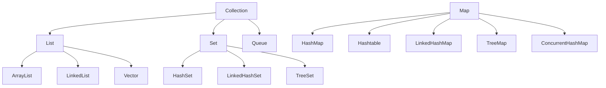

# 4. Java 集合特训指南（袁志刚专属版）

本指南结合简历中 **"黑马点评 Caffeine + Redis 二级缓存抗压"** 和 **"高并发秒杀一人一单拦截"** 场景深度定制。

**建议阅读顺序**：先读"基础概念速查" → 再读"核心考点详解" → 最后读"简历亮点关联"，届时你会发现所有技术细节都有了依托。

---

 

在深入源码之前，先把下面这几个概念理解清楚，后文所有分析都建立在这些基础上。

| 概念                        | 一句话解释                                                                     |
| ------------------------- | ------------------------------------------------------------------------- |
| **哈希桶/槽（Bucket）**         | 数组中的一个格子，Key 经过哈希运算后被分配到其中某个槽位存储                                          |
| **哈希碰撞（Collision）**       | 两个不同的 Key 被哈希到了同一个槽位，需要用链表或红黑树串联解决                                        |
| **CAS（Compare-And-Swap）** | 无锁原子操作：先比较内存值是否等于预期值，等于才执行写入，否则自旋重试；整个过程由 CPU 硬件保证原子性                     |
| **volatile**              | Java 内存模型关键字：保证变量的修改对所有线程立即可见，防止 CPU 缓存导致的脏读                              |
| **ReentrantLock**         | Java 显式锁，功能比 `synchronized` 更丰富（可中断、可超时、公平锁），但 Java 8 后两者性能差距已极小          |
| **自旋（Spin）**              | 线程在获取锁失败后不阻塞休眠，而是循环不断尝试，适合锁持有时间极短的场景；持有时间长则会浪费 CPU                        |
| **负载因子（Load Factor）**     | 触发扩容的阈值比率，默认 0.75，即数组占用超过 75% 时扩容；值越小碰撞越少但浪费空间，值越大越节省空间但碰撞增多              |
| **fail-fast**             | 使用迭代器遍历集合时，若集合被并发修改（`modCount` 变化），立刻抛出 `ConcurrentModificationException` |
| **fail-safe**             | 遍历的是集合的快照副本，并发修改不抛异常，但可能读到旧数据（如 `CopyOnWriteArrayList`）                   |

---

## 🚀 第一优先级核心考点详解

### 一、集合体系全景图



> **核心区别一句话**：`List` 有序可重复；`Set` 无序不可重复；`Queue` 先进先出；`Map` 键值对，键不可重复。

---

### 二、HashMap 源码核心考点

#### 1. 底层数据结构：数组 + 链表 + 红黑树

- **JDK 1.7**：数组 + 链表（拉链法解决哈希碰撞）
- **JDK 1.8**：数组 + 链表 + 红黑树

**树化完整条件（面试经常考细节）**：
- 链表长度 **> 8** 时，**且**数组长度 **≥ 64** 才真正树化为红黑树
- 若链表长度 > 8 但数组长度 < 64，则**优先扩容**而非树化（因为数组小时碰撞主要因容量不足导致，扩容能更有效地分散数据）
- 红黑树节点数量 **≤ 6** 时退化回链表（阈值为 6 而非 8，是为了留出 7 作为缓冲，防止频繁在临界点反复树化/退化导致性能抖动）

**树化阈值为什么是 8？**  
源码注释指出：在默认负载因子 0.75 下，同一个桶中节点数达到 8 的概率按泊松分布仅为 `0.00000006`（百万分之六）。设定 8 是在"红黑树节点占空间是普通节点 2 倍"的内存代价与"极端碰撞时 O(logN) 查询"之间的权衡。

#### 2. 为什么数组容量必须是 2 的幂次方？

**原因一：位运算加速取模**
- 确定 Key 的槽位需计算 `hash % length`
- 当 `length` 是 2 的幂时，等价于位运算 `(length - 1) & hash`，CPU 执行效率远高于除法

**原因二：扩容迁移更高效**
- `length - 1` 的二进制全为 `1`（如 `16-1=15` 即 `1111`），`&` 运算能最大程度保留 hash 低位，减少碰撞
- 扩容时（容量翻倍），每个节点要么留在**原位置**（`hash & oldCap == 0`），要么迁移到**原位置 + 旧容量**处（`hash & oldCap != 0`），无需重新计算 hash

#### 3. HashMap 线程不安全的具体表现

| JDK 版本 | 问题 |
|----------|------|
| JDK 1.7 | 扩容时使用**头插法**，多线程并发扩容会形成**环形链表**，导致 `get()` 时死循环、CPU 飙升至 100% |
| JDK 1.8 | 改为尾插法，避免了死循环，但高并发下仍会出现**数据覆写丢失**（两个线程同时写同一槽位，后者覆盖前者的写结果） |

#### 4. HashMap vs Hashtable

| 对比点 | HashMap | Hashtable |
|--------|---------|-----------|
| 线程安全 | 否 | 是（每个方法加 `synchronized`，粒度极粗） |
| null 支持 | key 和 value 都可以为 null | key 和 value **均不允许**为 null |
| 初始容量 | 16，扩容 × 2 | 11，扩容 × 2 + 1 |
| 性能 | 高 | 低（全局锁） |
| 推荐程度 | 单线程首选 | 已过时，并发场景用 `ConcurrentHashMap` |

#### 5. fail-fast 机制（高频考点）

HashMap 在使用迭代器遍历时，会检查 `modCount`（结构修改次数计数器）。若遍历过程中集合被修改（增删），`modCount` 变化，迭代器立即抛出 `ConcurrentModificationException`。

```java
// 错误示例（遍历时删除，触发 fail-fast）
for (String key : map.keySet()) {
    map.remove(key); // 抛出 ConcurrentModificationException
}

// 正确做法：使用迭代器的 remove()
Iterator<Map.Entry<String, Integer>> it = map.entrySet().iterator();
while (it.hasNext()) {
    it.next();
    it.remove(); // 安全
}
```

> **fail-fast vs fail-safe 对比**：`CopyOnWriteArrayList` 是 fail-safe 的典型——它遍历的是数组快照，并发修改不抛异常，但可能读到旧数据。

---

### 三、ConcurrentHashMap 源码核心考点

#### 1. Java 7 vs Java 8 架构对比

| 对比点 | Java 7（Segment 分段锁） | Java 8（Node + CAS + synchronized） |
|--------|--------------------------|--------------------------------------|
| 数据结构 | Segment 数组，每个 Segment 内含 HashEntry 数组 | Node 数组 + 链表 + 红黑树 |
| 锁机制 | Segment 继承 ReentrantLock，锁粒度是"段" | synchronized 锁定哈希桶**头节点**，锁粒度是"槽" |
| 最大并发度 | 固定 16（Segment 数量，初始化后不可扩展） | 等于 Node 数组长度（动态扩展） |
| 无锁操作 | 无 | 无碰撞的写操作直接用 CAS，性能更高 |

#### 2. Java 8 写操作流程（面试核心）

1. 计算 Key 的 hash，定位槽位
2. 若槽位为空：直接用 **CAS** 原子插入（无需加锁）
3. 若槽位头节点 hash == -1：说明正在扩容，当前线程**主动协助**迁移数据（Help Transfer）
4. 若发生哈希碰撞：用 `synchronized` 锁定头节点，再遍历链表/红黑树插入

#### 3. 读操作为何完全无锁？

`get()` 方法没有任何锁，依赖两个机制保证线程安全：
- **volatile 内存可见性**：Node 的 `val` 字段和 `next` 指针都用 `volatile` 修饰，写线程的修改对读线程立即可见
- **ForwardingNode**：扩容时旧槽位的头节点被替换为 `ForwardingNode`（hash == -1），读线程检测到后自动去新数组查找，读操作不会被扩容阻塞

#### 4. 为什么 key 和 value 不能为 null？（经典陷阱）

`ConcurrentHashMap` 禁止 null 的原因是**多线程场景下的二义性**：

```java
V value = map.get(key);
// 单线程 HashMap：get 返回 null，可以用 containsKey 确认 key 是否存在
// 多线程 ConcurrentHashMap：get 返回 null，无法确认是"key 不存在"还是"value 本来就是 null"
// 因为 containsKey 和 get 之间可能发生并发修改，两次调用的结果不一致
```

而 `HashMap` 在单线程场景下可以通过 `containsKey()` 二次确认，不存在二义性，所以允许 null。

#### 5. 多线程协同扩容（Help Transfer）

当某线程 `put()` 时发现当前槽位是 `ForwardingNode`，它不会等待扩容完成，而是**主动加入扩容**，协助迁移数据。每个线程负责一段连续槽位（默认最小步长 16），并发迁移大幅缩短了停顿时间。

---

### 四、ArrayList 与 LinkedList 深度对比

#### 1. 核心特性对比

| 对比点 | ArrayList | LinkedList |
|--------|-----------|------------|
| 底层结构 | `Object[]` 动态数组 | 双向链表 |
| 随机访问 | O(1)（实现 `RandomAccess`） | O(n)（必须遍历） |
| 头/尾插入 | O(n) / O(1) | O(1) / O(1) |
| 指定位置插入 | O(n)（需移动元素） | O(n)（需遍历定位） |
| 内存 | 更紧凑（数组连续内存） | 每个节点额外存前后指针，内存占用更大 |
| 线程安全 | 否 | 否 |

> **实践建议**：LinkedList 的作者 Josh Bloch 本人表示"从来不用 LinkedList"。大多数场景 ArrayList 性能更好，因为 CPU 缓存对连续内存更友好。

#### 2. ArrayList 扩容机制

- **懒加载**：`new ArrayList()` 初始化的是**空数组**，第一次 `add()` 时才分配容量 10
- **扩容倍数**：容量不足时新容量 = 旧容量 × 1.5（即 `oldCapacity + (oldCapacity >> 1)`）
- **性能陷阱**：预知数据量时，务必用 `new ArrayList(capacity)` 指定初始容量，避免多次扩容拷贝

#### 3. fail-fast 在 ArrayList 中的体现

```java
List<String> list = new ArrayList<>();
list.add("a");
list.add("b");

for (String s : list) {
    list.remove(s); // 抛出 ConcurrentModificationException
}
```

---

### 五、其他常用集合

#### HashSet
- 底层完全基于 `HashMap` 实现，元素作为 Key 存入，Value 统一是一个静态占位对象 `PRESENT`
- **如何判断元素重复**：先比较 `hashCode()`，值相同时再调用 `equals()`，两者都相同才认为重复

#### LinkedHashMap
- 在 `HashMap` 基础上，通过**双向链表**维护了插入顺序（或访问顺序），`entrySet()` 遍历时顺序与插入一致
- LRU 缓存的常用实现方式：继承 `LinkedHashMap` 并重写 `removeEldestEntry()`

#### TreeMap
- 底层基于**红黑树**，Key 默认按自然顺序排序，也可传入 `Comparator` 自定义
- 适合需要范围查询（`subMap`、`headMap`、`tailMap`）的场景

#### CopyOnWriteArrayList（高并发读多写少）
- **写时复制**：写操作（`add`/`set`/`remove`）先用 `ReentrantLock` 加锁，然后复制一个新数组，写完后原子替换引用（`volatile` 保证可见性）
- **读完全无锁**：读操作直接读旧数组，性能极高
- **缺点**：每次写都复制全量数组，大数组频繁写会触发 GC；读到的数据可能比写入慢一步（最终一致性）

#### ArrayDeque（栈的推荐替代）
- Java 官方建议：**弃用** `java.util.Stack`（每个方法都有全局 `synchronized`，性能差），改用 `ArrayDeque` 作为栈
- `ArrayDeque` 基于循环数组，两端插入/删除都是 O(1)，且无锁，比 `Stack` 快得多

---

## 🎯 简历亮点深度关联（有了以上基础，再看这里）

读完核心考点后，你已经理解了 CAS、volatile、synchronized 头节点锁、hash 桶等核心概念。现在把它们串联到你的项目场景中，这才是面试官真正想听的回答。

---

### 场景一：Caffeine + Redis 二级缓存 → ConcurrentHashMap 高并发底座

**面试官切入点**：
> "你在黑马点评中构建了 Caffeine + Redis 多级缓存。Caffeine 作为本地缓存，底层依赖 ConcurrentHashMap 存数据。高并发压测下，大量线程同时读写本地缓存，它是怎么保证线程安全同时还维持高吞吐的？读操作为什么完全不加锁？"

**回答思路（串联已学知识）**：

1. **为什么不用 `Hashtable` 或 `synchronized HashMap`**：它们的锁粒度是"整个 Map"，高并发下所有读写线程串行排队，吞吐量极差。Caffeine 选用 `ConcurrentHashMap` 正是因为它的锁粒度细化到了**单个哈希桶的头节点**。

2. **写操作如何高并发**（Java 8）：
   - 无碰撞时直接 **CAS** 原子写入，无需加锁
   - 有碰撞时只锁当前桶的头节点（`synchronized`），其他桶完全不受影响
   - 最大并发写数 = 数组长度（16384+），远超 Java 7 固定 16 的分段锁

3. **读操作为什么完全无锁**：Node 的 `val` 和 `next` 均为 `volatile`，写线程修改后读线程立刻可见；扩容期间通过 `ForwardingNode` 引导读线程去新数组，读操作全程不阻塞。

---

### 场景二：高并发秒杀防刷限流 → ConcurrentHashMap + LongAdder

**面试官切入点**：
> "秒杀场景中，为了防止瞬时峰值击穿 Redis，要在 JVM 内维护一个高频刷新的用户接口访问频次计数器。你会选什么容器？为什么不用普通 HashMap？"

**回答思路**：

1. **容器选择**：`ConcurrentHashMap<String, LongAdder>`（用户 ID 为 Key，访问次数为 Value），配合 Caffeine 设置过期时间做计数窗口滑动

2. **为什么不用 HashMap**（串联已学的线程不安全问题）：
   - Java 7：并发扩容头插法 → 环形链表 → `get()` 死循环 → CPU 100%
   - Java 8：并发写同一槽位 → 数据覆写丢失 → 计数不准确

3. **为什么用 LongAdder 而不是 AtomicLong**（这是加分项）：
   - `AtomicLong`：所有线程通过 CAS 竞争同一个值，高并发下自旋冲突极大，浪费 CPU
   - `LongAdder`：底层维护一个 `Cell[]` 数组，不同线程写入**不同 Cell**，最后求和，分散了写压力
   - 秒杀峰值下，`LongAdder` 的并发计数吞吐量比 `AtomicLong` 高出数倍

---

## 📝 第三优先级：Collections 工具类与使用注意事项

### 常用方法速查

```java
Collections.sort(list);              // 排序（TimSort）
Collections.reverse(list);          // 逆序
Collections.shuffle(list);          // 随机打乱
Collections.binarySearch(list, key);// 二分查找（需已排序）
Collections.frequency(list, obj);   // 统计元素出现次数
Collections.unmodifiableList(list); // 返回不可修改视图
```

### 线程安全包装（不推荐）

```java
List<String> syncList = Collections.synchronizedList(new ArrayList<>());
```
> 每个方法加 `synchronized` 全局锁，性能差。并发场景请直接用 `CopyOnWriteArrayList` 或 `ConcurrentHashMap`，不要用 `Collections.synchronizedXxx()`。

### 使用注意事项

| 场景 | 错误做法 | 正确做法 |
|------|----------|----------|
| 遍历时删除 | for-each 中直接 `remove()` | 使用 `Iterator.remove()` 或 `removeIf()` |
| 并发计数 | `HashMap<String, Integer>` 手动 `+1` | `ConcurrentHashMap<String, LongAdder>` |
| 高并发读多写少 | `ArrayList` + `synchronized` | `CopyOnWriteArrayList` |
| 需要栈结构 | `java.util.Stack` | `ArrayDeque` |
| 预知数据量 | `new ArrayList()` | `new ArrayList(expectedSize)` |
