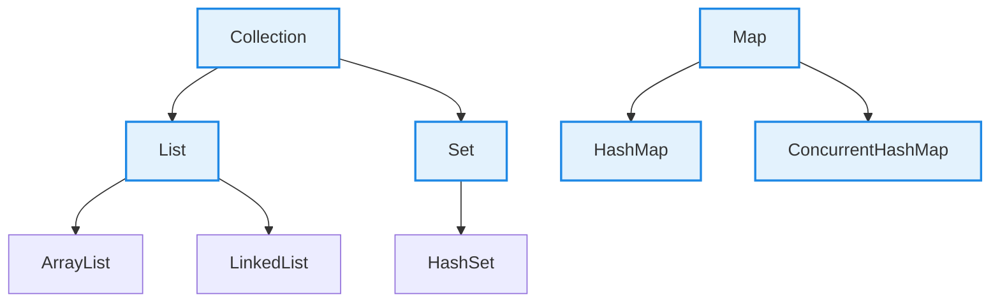
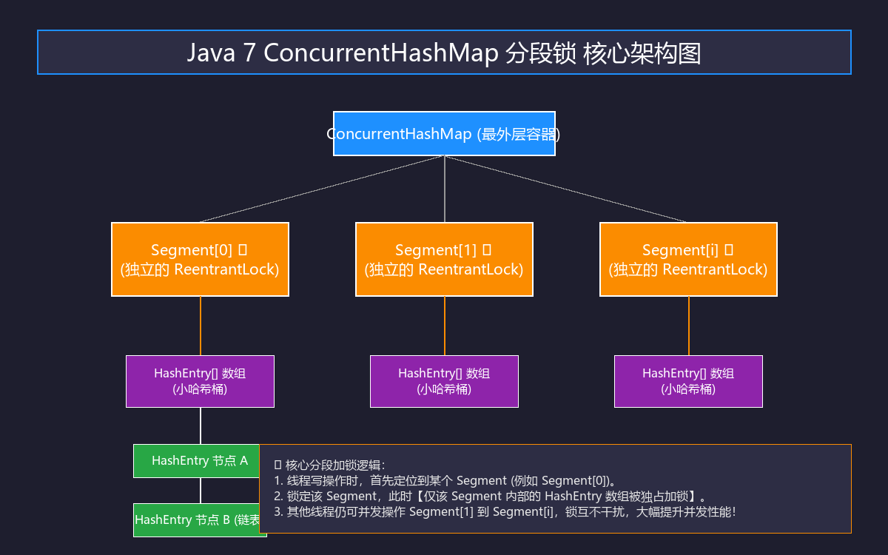

#review
# 4. Java 集合特训指南（极简源码速成版）

本指南专为快速吃透 **Caffeine + Redis 二级缓存**、**高并发秒杀防刷限流** 等核心场景中的集合高频考点而设计。杜绝大段铺垫，采用 **Why - What - How - Deep** 四步直达底层源码与算法，帮助您快速通关面试。

---

## 🚀 核心概念极简拆解

*   **哈希槽 (Bucket)**
    *   **Why**：需要以 $O(1)$ 的速度定位并存取数据。
    *   **What/How**：数组中的一格，Key 经 Hash 运算并对数组长度取模后，直接映射到此槽位存取。
*   **哈希碰撞 (Collision)**
    *   **Why**：不同的 Key 计算出的哈希槽位可能相同。
    *   **What/How**：多 Key 映射同槽，JDK 通过链表或红黑树将碰撞的节点串联挂载在槽位后。
*   **CAS (Compare-And-Swap)**
    *   **Why**：传统锁会导致线程挂起、内核态与用户态切换，开销高昂；在高并发小操作下需要无锁原子写机制。
    *   **What/Deep**：无锁原子操作。比较内存当前值是否等于预期值，等于才更新，否则自旋重试。底层由 CPU 硬件指令（如 `cmpxchg`）提供强原子性保证。
*   **volatile**
    *   **Why**：多线程下，每个线程拥有独立的 CPU 寄存器/缓存，会导致读到过期数据（脏读）。
    *   **What/Deep**：保证变量的**内存可见性**（禁止指令重排，强制每次读写主内存，写线程的修改对其他线程瞬时立即可见）。
*   **负载因子 (Load Factor)**
    *   **Why**：槽位快装满时碰撞率呈指数级上升，需要提前扩容平摊数据。
    *   **What/How**：扩容阈值比例，默认 0.75。即槽位占用超过 75% 时触发扩容（例：16个槽占用12个时扩容）。
*   **fail-fast (快速失败)**
    *   **Why**：单线程遍历集合时，若有其他线程并发修改该集合，遍历会产生严重的数据脏读和逻辑混乱。
    *   **What/Deep**：遍历时实时检测修改计数器 `modCount != expectedModCount`，若不相等说明被并发修改，立刻抛出 `ConcurrentModificationException`。
*   **fail-safe (安全失败)**
    *   **Why**：并发修改时不想抛出异常打断业务。
    *   **What/How**：遍历的是原集合的**克隆副本（快照）**，并发修改只作用于新数组（如 `CopyOnWriteArrayList`）。不会抛异常，但存在弱一致性（读线程可能读到旧快照）。

---

## 🚀 核心集合体系骨架

为了降低视觉疲劳，这里仅呈现面试高频的核心集合体系骨架：



---

## 🎯 第一优先级核心考点详解

### 一、HashMap 源码核心考点 (Why-What-How-Deep)

*   **Why（为什么 JDK 1.8 引入红黑树？）**
    *   **痛点**：JDK 1.7 使用“数组 + 链表”，一旦遭遇极端哈希碰撞（如恶意碰撞），链表过长会导致查询效率从 $O(1)$ 暴跌退化为 $O(n)$。
    *   **解决**：JDK 1.8 引入红黑树，将极端冲突下的查询效率牢牢锁死在 $O(\log n)$。
*   **What（树化/退化的严苛条件是什么？）**
    *   **树化条件**：桶内链表长度 **> 8**，**且**数组总长度 **≥ 64**。
        *   *源码依据*：若链表 > 8 但数组 < 64，优先调用 `resize()` 扩容分散数据，而不是树化。
    *   **退化条件**：红黑树节点数量 **≤ 6** 时退化回链表（阈值留出 7 作为缓冲区，防止在 8 临界点因频繁增删导致高频在树化与退化间反复横跳，带来严重性能抖动）。
    *   **为什么是 8 树化**：在默认 0.75 负载因子下，同一个桶发生 8 次哈希冲突的概率按泊松分布仅为 `0.00000006`（百万分之六）。设置 8 是在空间开销（红黑树节点占用普通节点 2 倍内存）与查询性能之间的完美平衡。
*   **How（怎么定位槽位与高效扩容？）**
    *   **位运算定位**：以位运算代替模运算，要求数组容量必须是 **2 的幂次方**。
        *   `index = (n - 1) & hash`（等价于 `hash % n`，但位运算速度是模运算的数十倍）。
    *   **扩容迁移**：容量翻倍扩容时，节点无须重新计算 Hash，直接利用位运算 `(hash & oldCap)` 快速归类：
        *   若结果为 `0`：留在原位置（`index`）。
        *   若结果不为 `0`：迁移到新位置（`index + oldCap`）。
*   **Deep（深入源码：高并发下线程不安全的底层机制）**
    *   **JDK 1.7：扩容死循环（环形链表）**
        *   *源码根源*：使用**头插法**迁移链表（新移入的节点放在链表头部，会反转链表的原有顺序）。
        *   *机制*：线程 A 在迁移链表时（指针指向节点 1，next 指向节点 2）被挂起；并发线程 B 完成了扩容迁移，使链表顺序反转（变为 2 指向 1）；线程 A 恢复后继续按照旧有逻辑执行头插迁移，直接导致节点 1 与节点 2 发生环形互指。在调用 `get()` 遍历到此槽位时，陷入死循环，CPU 飙升至 100%。
    *   **JDK 1.8：写覆盖丢失**
        *   *源码根源*：改用**尾插法**虽解决了死循环，但多线程并发 `put` 仍无任何锁保护。
        *   *核心源码段落*：
          ```java
          if ((p = tab[i = (n - 1) & hash]) == null)
              tab[i] = newNode(hash, key, value, null); // 两个线程同时判定此处为空，会发生写入覆盖
          ```
        *   *机制*：线程 A 算出槽位为空，在准备插入新节点时被挂起；线程 B 同样算出为空并成功写入数据；线程 A 恢复后直接写入，将线程 B 刚刚写入的数据无情覆盖，导致数据丢失。

---

### 二、ConcurrentHashMap 源码核心考点 (Why-What-How-Deep)

*   **Why（为什么 JDK 1.8 彻底废弃 Segment 分段锁？）**
    *   **Java 7 缺陷**：Segment 分段锁的段数（并发度）默认 16 且**初始化后不可扩容**，导致最大写入并发能力永远被锁死在 16；且多层对象寻址慢，产生严重的内存碎片。
    *   **Java 8 改进**：直接放弃 Segment 结构，改用 **Node 数组 + CAS + synchronized**。锁粒度大幅细化至**每一个哈希桶的头节点**，写无冲突时直接 CAS 无锁写入。
*   **What（1.7 vs 1.8 核心极简对比）**
    | 对比点 | Java 7（Segment 分段锁） | Java 8（Node + CAS + synchronized） |
    | :--- | :--- | :--- |
    | **底层结构** | Segment 数组，内含 HashEntry 数组 | Node 数组 + 链表 + 红黑树 |
    | **锁机制** | Segment 继承 ReentrantLock，锁粒度是"段" | `synchronized` 锁定哈希桶**头节点**，锁粒度是"槽" |
    | **并发度** | 固定 16（初始化后不可扩展） | 随 Node 数组动态扩容，最大并发写能力极高 |

##### 💡 核心极简拆解：Java 7 的 Segment 分段锁

下图是 Java 7 分段锁的纯中文卡片版底层细节标注图：



*   **How（高并发写 putVal 源码流程剖析）**
    *   *JDK 1.8 极简核心源码流程（面试最核心）*：
      ```java
      final V putVal(K key, V value, boolean onlyIfAbsent) {
          if (key == null || value == null) throw new NullPointerException(); // 1. 严格禁止 null
          int hash = spread(key.hashCode());
          int binCount = 0;
          for (Node<K,V>[] tab = table;;) { // 2. 死循环自旋，保证并发写操作最终成功
              Node<K,V> f; int n, i, fh;
              if (tab == null || (n = tab.length) == 0)
                  tab = initTable(); // 懒加载初始化数组
              else if ((f = tabAt(tab, i = (n - 1) & hash)) == null) {
                  // 3. 槽位为空：直接利用 CAS 原子写入，全程无锁，效率极高
                  if (casTabAt(tab, i, null, new Node<K,V>(hash, key, value, null)))
                      break; 
              }
              else if ((fh = f.hash) == MOVED)
                  // 4. 槽位正处于扩容迁移中：当前写线程主动协助扩容 (Help Transfer)
                  tab = helpTransfer(tab, f);
              else {
                  V oldVal = null;
                  // 5. 遭遇哈希碰撞：只锁定当前槽位的头节点 (f)，其余哈希桶完全不受影响
                  synchronized (f) {
                      if (tabAt(tab, i) == f) {
                          if (fh >= 0) { // 链表写入
                              binCount = 1;
                              for (Node<K,V> e = f;; ++binCount) {
                                  K ek;
                                  if (e.hash == hash && ((ek = e.key) == key || (ek != null && key.equals(ek)))) {
                                      oldVal = e.val;
                                      if (!onlyIfAbsent) e.val = value;
                                      break;
                                  }
                                  Node<K,V> pred = e;
                                  if ((e = e.next) == null) {
                                      pred.next = new Node<K,V>(hash, key, value, null); // 尾插法
                                      break;
                                  }
                              }
                          } else if (f instanceof TreeBin) { // 红黑树写入
                              // ... 树写入逻辑
                          }
                      }
                  }
                  if (binCount != 0) {
                      if (binCount >= TREEIFY_THRESHOLD)
                          treeifyBin(tab, i); // 6. 判定是否需要树化
                      break;
                  }
              }
          }
          addCount(1L, binCount);
          return null;
      }
      ```
*   **Deep（读操作完全无锁与协同扩容深挖）**
    *   **读操作完全无锁底层奥秘**：
        1. **`volatile` 内存可见性**：Node 节点的 `val` 和 `next` 指针全部由 `volatile` 修饰，写线程对节点的修改在主内存中对读线程立即可见。
        2. **`ForwardingNode` 转发机制**：多线程协同扩容期间，旧数组中迁移完毕的桶，其头节点会被替换为特定的 `ForwardingNode`（其 `hash` 被标记为固定的 `MOVED = -1`）。当读线程调用 `get()` 遭遇 `hash == -1` 时，会自动调用 `ForwardingNode` 的 `find()` 方法去**新数组**中执行查找。读与写完全并发，全程免锁！
    *   **为什么 Key 和 Value 不能为 null？**
        *   **防范多线程场景下的二义性**：若 `get(key)` 返回 `null`，单线程下我们可以通过 `containsKey(key)` 来确认“究竟是值本来就是 null 还是 key 不存在”；但在高并发下，`get` 和 `containsKey` 两次调用之间随时可能有其他并发线程介入删改，二义性根本无法消除。所以 `ConcurrentHashMap` 严格禁止 null 写入。

---

### 三、ArrayList 与 LinkedList 深度对比 (Why-What-How-Deep)

*   **Why（为什么绝大多数场景首选 ArrayList？）**
    *   **痛点**：LinkedList 每一个节点除了数据，都必须额外存储 `prev` 和 `next` 指针，内存开销大且产生大量碎片；最致命的是其物理内存不连续，无法利用 CPU 高速缓存。
    *   **解决**：ArrayList 底层是连续的 `Object[]` 动态数组，对 CPU 缓存（局部性原理）极其友好，随机读取效率为统治级的 $O(1)$。
*   **What（核心特性极简对比）**
    | 对比点 | ArrayList | LinkedList |
    | :--- | :--- | :--- |
    | **底层结构** | 动态 `Object[]` 数组 | 双向链表 |
    | **随机访问** | $O(1)$ | $O(n)$（必须遍历） |
    | **头尾插入** | 头 $O(n)$ / 尾平均 $O(1)$ | 头尾均为 $O(1)$ |
    | **内存开销** | 紧凑，连续内存 | 指针开销大，大量内存碎屑 |
*   **How（自动扩容是如何实现的？）**
    *   **懒加载**：`new ArrayList()` 初始化为空数组，首次 `add()` 时才分配默认初始容量 10。
    *   **1.5 倍扩容公式**：当容量不足时，自动扩容为原容量的 **1.5 倍**。
        *   *核心源码段落*：
          ```java
          int newCapacity = oldCapacity + (oldCapacity >> 1); // 效率极高的二进制右移位运算
          elementData = Arrays.copyOf(elementData, newCapacity); // 底层依赖 System.arraycopy
          ```
*   **Deep（性能陷阱与扩容代价）**
    *   **内存硬拷贝开销**：每次扩容都伴随着 `Arrays.copyOf()` 底层调用 `System.arraycopy()`（进行大块内存的高频硬拷贝）。如果业务能预估数据量（如拉取 10 万条数据），**务必使用 `new ArrayList(capacity)` 指定初始容量**，避免频繁触发扩容导致的 GC 阻塞。

---

### 四、其他高频常用集合 (Why-What-How-Deep)

*   **CopyOnWriteArrayList（高并发读多写少首选）**
    *   **Why**：普通的并发 List（如 `Vector`）所有读写方法都加全局锁，高并发下多读单写吞吐量极其低下。
    *   **What**：采用**写时复制（Copy-On-Write）**思想的安全 List。
    *   **How**：
        *   **读操作**：完全无锁。直接读取当前数组的引用，效率极高。
        *   **写操作**：使用 `ReentrantLock` 独占加锁，拷贝出一个容量 +1 的新数组，在新数组上完成写入，写完后瞬间原子替换旧数组引用。
    *   **Deep**：
        *   **最终一致性（弱一致性）**：读线程在写操作执行完前，可能读到的是旧数组的数据。
        *   **GC 惩罚**：大容量数组若频繁写，会疯狂拷贝整块内存并产生大量垃圾对象，频繁触发 Full GC。
*   **HashSet（去重集合）**
    *   **Why**：需要极速对海量元素进行查重和过滤。
    *   **What/How**：底层完全基于 `HashMap` 实现。放入 HashSet 的值作为 `HashMap` 的 **Key**，而 Value 统一放置一个静态的虚无占位对象 `PRESENT = new Object()`。
    
*   **LinkedHashMap（LRU 缓存底座）**
    *   **Why**：普通 `HashMap` 无法记录元素的插入或访问顺序，不能直接用来构建 LRU（最近最少使用）淘汰算法。
    *   **What/Deep**：继承自 `HashMap`，但在 `Node` 节点中新增了双向链表指针 `before` 和 `after`，在每次插入或访问节点时更新双向链表。
    *   *极简 LRU 核心源码实现（高频面试手写题）*：
      ```java
      class LRUCache<K, V> extends LinkedHashMap<K, V> {
          private final int capacity;
          public LRUCache(int capacity) {
              super(capacity, 0.75f, true); // true 代表按照访问顺序排序，最近访问的放尾部
              this.capacity = capacity;
          }
          @Override
          protected boolean removeEldestEntry(Map.Entry<K, V> eldest) {
              return size() > capacity; // 当元素总数超过容量时，自动淘汰最久未访问的头部节点
          }
      }
      ```
*   **ArrayDeque（高效双端队列）**
    *   **Why**：`java.util.Stack` 的每个方法都加了全局 `synchronized` 锁，性能极差且已过时。
    *   **What/Deep**：基于循环数组实现的双端队列。两端插入和删除效率均为统治级的 $O(1)$，无锁设计。Java 官方明确建议**使用 ArrayDeque 代替 Stack 作为栈结构使用**。

---

## 🎯 简历亮点深度关联与对线场景 (Why-What-How)

### 场景一：Caffeine + Redis 二级缓存底座

**面试官切入点**：
> "你在黑马点评中构建了 Caffeine 二级缓存。高并发压测下，大量线程同时读写本地缓存，它是怎么保证线程安全同时维持超高吞吐的？读操作为什么不需要锁？"

**回答思路 (Why-What-How 拆解)**：
*   **Why**：为什么不用 `Hashtable` 或 `synchronized HashMap`？因为全局独占锁把高并发强制变成了串行排队。
*   **What/How**：Caffeine 底层基于 `ConcurrentHashMap`。高并发下它通过将锁粒度细化到单个哈希桶头节点（synchronized + CAS），使得各槽位互不影响。
*   **Deep**：读操作由于 `volatile` 内存可见性以及扩容期间 `ForwardingNode` 的新数组重定向转发，实现了**全程完全无锁**，从而最大程度压榨了多核 CPU 的高并发吞吐潜力。

---

### 场景二：高并发秒杀防刷限流 JVM 计数器

**面试官切入点**：
> "秒杀场景中，为了防止瞬时峰值击穿 Redis，要在 JVM 内维护一个高频刷新的用户接口访问频次计数器。并发计数器你选什么容器？为什么不用普通 HashMap 或 AtomicLong？"

**回答思路 (Why-What-How 拆解)**：
*   **Why**：
    1. 禁用 `HashMap`：防止多线程并发下 JDK 1.7 环形链表死循环（导致 CPU 100%）以及 JDK 1.8 数据覆盖丢失。
    2. 弃用 `AtomicLong`：高并发下大量并发线程会因为在单个值上疯狂自旋竞争 CAS，导致 CPU 空转和资源极度浪费。
*   **What/How**：选用 **`ConcurrentHashMap<String, LongAdder>`**。
*   **Deep**：为什么用 LongAdder
   - `AtomicLong`：所有线程通过 CAS 竞争同一个值，高并发下自旋冲突极大，浪费 CPU
   - `LongAdder`：底层维护一个 `Cell[]` 数组，不同线程写入**不同 Cell**，最后求和，分散了写压力
   - 秒杀峰值下，`LongAdder` 的并发计数吞吐量比 `AtomicLong` 高出数倍
---

## 📝 第三优先级：Collections 工具类注意事项

*   **线程安全包装（不推荐）**
    *   `Collections.synchronizedList(new ArrayList<>())`
    *   *注意*：每个方法都加了全局 `synchronized` 锁，性能差。并发场景请直接用 `CopyOnWriteArrayList` 或 `ConcurrentHashMap`。
*   **使用避坑总结**
    *   **遍历删除**：严禁在 `for-each` 中直接调用 `list.remove()`（抛出 `ConcurrentModificationException`），必须使用 `Iterator.remove()` 或 `list.removeIf()`。
    *   **预知容量**：预知数据量时，务必使用 `new ArrayList(expectedSize)` 指定初始容量，避免多次内存硬拷贝带来的性能折损。
