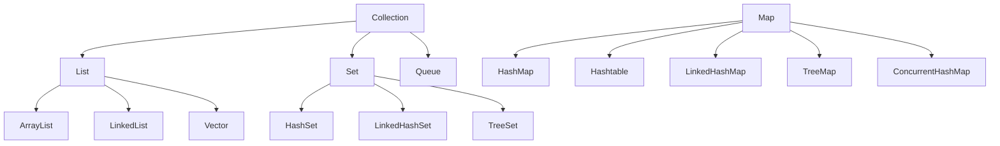

# 4. Java 集合特训指南（袁志刚专属版）

本指南结合您简历中 **“黑马点评 Caffeine + Redis 二级缓存抗压”** 和 **“高并发秒杀一人一单拦截”** 场景深度定制。在高流量和高并发竞争下，选择合适的数据结构并理解其底层线程安全机制是保障系统不崩溃的关键。

---

## 🎯 简历亮点深度关联与大厂面试预测

### 1. Caffeine + Redis 二级缓存与【ConcurrentHashMap 底层高并发锁竞争】
*   **面试官切入点**：
    > “我看到你在黑马点评中构建了 Caffeine + Redis 的多级缓存抗压架构。Caffeine 作为本地缓存，其底层实现高度依赖 ConcurrentHashMap 进行数据存储。请问在高并发商铺热点数据压测下，如果大量线程同时对本地缓存进行读写，ConcurrentHashMap 底层是如何保证线程安全且维持高吞吐量的？为什么它的读操作完全不需要加锁？”
*   **袁志刚专属特训回答模版**：
    1.  **Caffeine 与 ConcurrentHashMap 的高并发底座**：Caffeine 本质上是一个高性能的本地缓存库，为了承载极高的瞬时并发，它放弃了传统的 `synchronized` 粗粒度全局锁 Map（如 Hashtable），而采用了高度优化、基于 **synchronized + CAS** 无锁化设计的 **ConcurrentHashMap** 作为其哈希表存储底座。
    2.  **Java 8 细粒度锁设计**：在高并发写商铺缓存时，Java 8 的 ConcurrentHashMap 抛弃了 Java 7 中粗糙的“分段锁 (Segment)”机制，转而使用 **Node 数组 + 链表 + 红黑树** 的结构。它仅锁定当前哈希桶（槽）的**头节点**（Node 节点加锁），锁的粒度极大细化。对于无哈希冲突的写操作，直接使用 **CAS** (Compare-And-Swap) 无锁原子操作进行插入；只有发生哈希冲突时，才使用 `synchronized` 锁定头节点。这使得不同的哈希槽之间完全实现了写并发。
    3.  **读操作完全无锁的奥秘**：高并发压测下，读商铺缓存的吞吐量通常是写操作的数十倍。ConcurrentHashMap 的 `get()` 方法**完全没有加锁**，性能极高。这归功于两点：
        *   **volatile 内存可见性**：Node 节点的 `val` 和指向下一个节点的 `next` 指针都使用 `volatile` 修饰。这保证了当写线程修改了缓存值或插入了新节点时，读线程能立即可见，避免了脏读。
        *   **安全发布与不变性**：扩容转移时，旧数组的节点会被标记为 `ForwardingNode`，读线程检测到后会直接去新数组中检索，确保读操作不会被扩容过程阻塞。

### 2. 高并发秒杀流量拦截与【本地并发防刷限流容器选择】
*   **面试官切入点**：
    > “在高并发秒杀场景中，为了防止瞬时峰值流量击穿 Redis，我们通常会在本地做一层限流或防刷拦截。如果让你在 JVM 进程内维护一个高频刷新的用户接口访问频次计数器，你会选择什么集合容器？为什么？”
*   **袁志刚专属特训回答模版**：
    1.  **容器选择**：我会选择使用 `ConcurrentHashMap<String, LongAdder>`（或者结合 `Guava Cache`/`Caffeine` 设置带过期时间的本地 Map），而不是普通的 `HashMap` 或 `Hashtable`。
    2.  **避免 HashMap 的高并发死循环与覆写风险**：在多线程高并发写操作下，普通 `HashMap` 在 Java 7 中扩容由于头插法会引发**环形链表死循环**，导致 CPU 占用率瞬间飙升至 100%；而在 Java 8 中，由于使用尾插法虽然避免了死循环，但在高并发操作下仍会导致**数据丢失或覆写**。
    3.  **高并发计数器调优 (LongAdder)**：在计数器更新时，如果使用 `ConcurrentHashMap<String, AtomicLong>`，在超高并发下，所有线程通过 CAS 自旋更新同一个 `AtomicLong` 值，会导致极大的 CPU 自旋开销。而改用 `LongAdder`，其底层通过分段（Cell 数组）分散了并发写压力，最后求和，能极大地提升秒杀场景下的本地限流性能。

---

## 🚀 第一优先级核心考点详解（ConcurrentHashMap 与 HashMap 源码硬核深挖）

### 一、 ConcurrentHashMap 底层源码与线程安全深度剖析

#### 1. Java 7 vs Java 8 的底层架构飞跃
*   **Java 7（Segment 分段锁）**：
    *   **结构**：一个 Segment 数组，每个 Segment 内部包含一个 HashEntry 数组（即一个小型的 HashMap）。
    *   **锁机制**：`Segment` 继承自 `ReentrantLock`。当一个线程占用锁时，它只锁住了当前的那个 Segment，其他 Segment 仍然可以被并发写入。默认并发度是 16（即最多支持 16 个线程并发写）。
    *   **缺点**：并发度固定，一旦初始化无法扩容；每个 Segment 内部依然存在激烈的锁竞争。
*   **Java 8（Node 数组 + synchronized + CAS）**：
    *   **结构**：直接使用 Node 数组 + 链表 + 红黑树。
    *   **锁机制**：抛弃了 ReentrantLock，改用内置锁 `synchronized` 锁定哈希桶的头节点。锁的粒度从“段”降级到了“桶（槽）”。
    *   **优点**：只要哈希槽不冲突，就能完全并发写入，最大并发度等于 Node 数组的长度，极大地提升了并发性能。而且，Java 8 后的 `synchronized` 经过了 JVM 偏向锁、轻量级锁、锁粗化等大量锁升级优化，性能已丝毫不逊色于 ReentrantLock。

#### 2. 扩容协助机制 (Help Transfer)
*   当某一个线程在执行 `put()` 时，发现当前哈希桶的头节点是 `ForwardingNode`（其 hash 值为 `-1`），说明 ConcurrentHashMap 正在进行扩容。
*   该线程不会等待，而是**主动加入**到扩容队列中，协助进行数据迁移工作（多线程协同扩容）。每个线程负责迁移一段连续的哈希槽（默认最小步长是 16），这成倍地缩短了高并发下 Map 扩容的停顿时间。

---

### 二、 HashMap 源码核心考点（面试必挖）

#### 1. 数组 + 链表 + 红黑树的设计初衷与转换阈值
*   **设计初衷**：为了防止极端情况下（或者遭遇哈希碰撞攻击时），大量数据被哈希到同一个桶中，导致链表过长，使得 `put`/`get` 的时间复杂度退化为 $O(N)$。引入红黑树能将其稳定在 $O(\log N)$。
*   **为什么树化阈值是 8？**：
    *   底层源码注释指出，哈希桶中的节点频率遵循**泊松分布**。在负载因子为 0.75 的默认情况下，同一个桶中节点长度达到 8 的概率仅为 `0.00000006`（百万分之六），这几乎是不可能发生的事件。因此，设置阈值为 8 是一种在“空间占用”和“时间开销”之间的完美平衡（因为红黑树节点 `TreeNode` 的大小是普通 `Node` 的两倍）。
*   **为什么退化阈值是 6？**：
    *   如果一旦少于 8 就立即退化为链表，如果频繁在 8 临界点发生插入和删除，会导致红黑树和链表频繁地进行“树化”与“拆分”的反复转换，严重损耗性能。设置退化阈值为 6，中间留有 7 作为缓冲带，可以有效规避此**性能抖动**。

#### 2. 为什么哈希表的容量（数组长度）必须是 2 的幂次方？
1.  **取模运算的位运算优化**：
    *   为了决定 Key 放在数组的哪个槽位，需要计算 `hash % length`。
    *   当 `length` 是 2 的幂次方时，`hash % length` 完全等价于位运算 `(length - 1) & hash`。位运算的 CPU 执行效率远超十进制的取模（除法）运算。
2.  **数据分布更均匀，扩容迁移更清晰**：
    *   当长度为 2 的幂次方时，`length - 1` 的二进制表示全是 `1`（例如 16-1=15，二进制为 `1111`）。在进行 `&` 运算时，能最大程度保留 hash 值的低位特征，减少哈希碰撞。
    *   **扩容迁移规律**：在扩容时（变为原来的 2 倍），由于数组容量翻倍，节点要么留在原位置（`hash & oldCap == 0`），要么迁移到“原位置 + 旧数组长度”的新位置（`hash & oldCap != 0`）。通过简单的位运算就能瞬间决定节点去向，无需重新计算 hash，极大地提升了扩容迁移的效率。

---

## 🛠️ 第二优先级核心考点详解（ArrayList 与 CopyOnWriteArrayList）

### 一、 ArrayList 与 LinkedList 深度对比与性能陷阱
1.  **ArrayList（动态数组）**：
    *   **数据结构**：基于 `Object[]` 动态数组实现。支持**随机访问**（实现了 `RandomAccess` 标记接口），时间复杂度为 $O(1)$。
    *   **插入与删除**：如果不是尾部插入，需要调用 `System.arraycopy()` 移动元素，平均时间复杂度为 $O(N)$。
    *   **扩容陷阱**：
        *   默认初始容量：通过 `new ArrayList()` 创建时，内部其实初始化为一个**空数组** `DEFAULTCAPACITY_EMPTY_ELEMENTDATA`。只有在**第一次调用 `add()` 时**，才会懒加载扩容分配初始容量 `10`。
        *   扩容倍数：当容量不足时，触发扩容，新容量为原来的 **1.5 倍**（`newCapacity = oldCapacity + (oldCapacity >> 1)`）。
        *   **性能踩坑点**：如果预先知道要存储大量数据，一定要使用 `new ArrayList(capacity)` 指定初始容量，或者手动调用 `ensureCapacity`，以规避多次扩容拷贝带来的 CPU 与内存碎片巨大损耗。
2.  **LinkedList（双向链表）**：
    *   **数据结构**：基于双向链表实现。不支持高效的随机访问，查找第 N 个元素必须从头或尾遍历，时间复杂度为 $O(N)$。
    *   **插入与删除**：只要定位到节点，插入/删除操作仅需改变前后节点的指针，时间复杂度为 $O(1)$。

---

### 二、 CopyOnWriteArrayList（高并发读多写少神器）
在高并发读多写少（如配置项加载、秒杀商品分类静态列表）的场景下，它是 `ArrayList` 线程安全版本的绝佳选择。

1.  **核心思想：写时复制 (Copy-On-Write)**：
    *   所有**读**操作完全无锁，直接读取原数组，性能极高。
    *   当发生**写**操作（`add`/`set`/`remove`）时，首先通过 `ReentrantLock` 加锁。然后**复制（Copy）**出一个新的数组，在新的数组中完成写操作，最后将原数组的引用指向新数组（利用 `volatile` 保证该引用的内存可见性）。
2.  **优缺点分析**：
    *   **优点**：读写分离，读完全无锁，高并发读吞吐极佳。
    *   **缺点**：
        1.  **内存占用高**：每次写操作都要复制一个完整的新数组，如果数组体积较大，容易引发频繁的 Young GC 甚至是 Full GC。
        2.  **数据弱一致性**：由于读操作无锁，当写线程还在复制写入时，读线程读取到的仍是老数组的数据。因此它只保证**最终一致性**，不保证强一致性。

---

## 📝 第三优先级核心考点详解（集合框架体系与 Set / Queue）

### 一、 集合体系全景简图


### 二、 HashSet 底层实现原理
*   `HashSet` 的底层**完全基于 `HashMap` 实现**。
*   当您向 `HashSet` 中添加元素时，其底层源码其实就是把该元素作为 Key 存入了一个内置的 `HashMap` 中：
    ```java
    public boolean add(E e) {
        return map.put(e, PRESENT) == null;
    }
    ```
    其中的 `PRESENT` 是一个全局静态的 `Object` 占位符对象，没有任何实际业务含义。
*   因为 HashMap 的 Key 是唯一的，这天然地保证了 `HashSet` 元素的唯一性与去重特性。

### 三、 Queue 与 Deque 的选择
*   `Queue` 是标准的**单端队列**（先进先出 FIFO），常用于任务缓冲和线程间消息传递。
*   `Deque` 是**双端队列**（支持两端高效的插入和删除）。在 Java 中，`LinkedList` 和 `ArrayDeque` 都实现了 `Deque` 接口。
*   **最佳实践**：在需要使用栈（Stack）时，Java 官方强烈建议弃用过时的、带有全局 `synchronized` 锁性能地下的 `java.util.Stack` 类，转而使用实现了 `Deque` 的 `ArrayDeque`。
