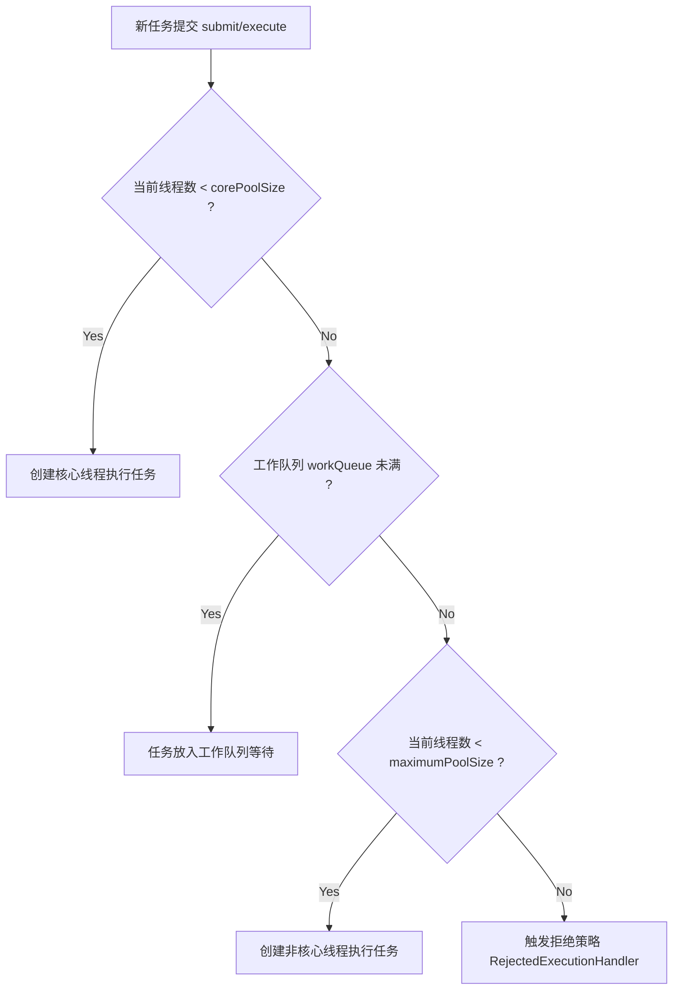

# 5. Java 并发特训指南（袁志刚专属版）

本指南紧扣您简历中 **“苍穹外卖 AI Agent 多步任务超时熔断与编排”**、**“订单状态流转并发原子写”** 和 **“秒杀高并发一人一单与延迟削峰”** 场景进行深度定制。在实际高吞吐应用中，对线程池参数、内存模型、锁机制与 CAS 的微调直接决定了系统在高流量下的吞吐极限和正确性。

**建议阅读顺序**：先读"前置概念速查" → 再读"核心考点详解" → 最后读"简历亮点关联"，届时你会发现所有技术细节都有了依托。

---

## 🔑 前置基础概念速查（必读，5 分钟建立认知底座）

在深入并发底层之前，先把下面这几个概念理解清楚，后文所有分析都建立在这些基础上。

| 概念 | 一句话解释 |
|------|-----------|
| **进程 vs 线程** | **进程**是资源分配的最小单位，拥有独立地址空间；**线程**是CPU调度的最小单位，是进程内的一个执行流，共享进程的内存资源（如堆、方法区）。 |
| **用户态 vs 内核态** | **用户态**是普通应用运行的安全受限级别；**内核态**是操作系统内核运行的特权级别。Java中重量级锁和I/O操作常引发用户态到内核态的上下文切换，开销高昂。 |
| **上下文切换（Context Switch）** | CPU 从一个线程切换到另一个线程执行，保存当前线程的运行上下文（寄存器、程序计数器）并加载新线程上下文的过程，频繁切换会大幅损耗 CPU 性能。 |
| **死锁（Deadlock）** | 两个或多个线程无限期地互相等待对方持有的资源而导致程序卡死的现象。必须满足：互斥、占有且等待、不可剥夺、循环等待四大条件。 |
| **CAS（Compare-And-Swap）** | 比较并交换，一种乐观锁的硬件实现，通过比较预期值和内存值是否相等来决定是否写入新值，保证原子性，底层为 `lock cmpxchg` 汇编指令。 |
| **AQS（AbstractQueuedSynchronizer）** | 抽象队列同步器，使用一个 volatile 整数表示同步状态，通过双向 CLH 队列管理等待锁的线程，是 ReentrantLock 等同步锁的底层核心。 |

---

## 🚀 第一优先级核心考点详解（线程池、JMM、CAS、synchronized 锁升级与死锁）

### 一、 ThreadPoolExecutor 线程池机制与工作流程

线程池是管理和复用线程的并发框架，能极大地避免频繁创建和销毁线程带来的巨大系统开销。

#### 1. 七大核心参数
```java
public ThreadPoolExecutor(
    int corePoolSize,               // 1. 核心线程数（常驻线程数）
    int maximumPoolSize,            // 2. 最大线程数
    long keepAliveTime,             // 3. 空闲线程存活时间
    TimeUnit unit,                  // 4. 存活时间单位
    BlockingQueue<Runnable> workQueue, // 5. 任务阻塞队列
    ThreadFactory threadFactory,    // 6. 线程创建工厂（多用于自定义线程名）
    RejectedExecutionHandler handler // 7. 拒绝策略（队列满且达到最大线程数时触发）
)
```

#### 2. 线程池工作流程与任务流转图


---

### 二、 JMM (Java 内存模型) 与 volatile

#### 1. 为什么需要 JMM？
在多核 CPU 架构下，每个核心都有自己的高速缓存（L1, L2, L3），而它们共享主内存。这会导致**缓存一致性问题**。此外，编译器和处理器为了优化性能会进行**指令重排**。JMM 规范了 Java 虚拟机与计算机内存是如何协同工作的，它定义了共享变量在多线程环境下的可见性、有序性和原子性规则。

#### 2. volatile 的底层原理与两大特性
`volatile` 是 JVM 提供的最轻量级的同步机制。
1.  **保证内存可见性**：
    *   **原理**：被 `volatile` 修饰的变量被写入时，JVM 会向处理器发送一条 **Lock 前缀指令**。这条指令会强制将当前处理器缓存行的数据写回到系统主内存。同时，这个写回内存的操作会引起在其他 CPU 里缓存了该内存地址的缓存行无效（**缓存一致性协议 MESI**）。当其他 CPU 再次读取该变量时，发现缓存行无效，只能重新从主内存中读取。
2.  **防止指令重排（保证有序性）**：
    *   **原理**：编译器在生成字节码时，会在 `volatile` 变量读写操作的前后插入 **内存屏障 (Memory Barrier)**。
        *   在写操作前面插入 `StoreStore` 屏障，写操作后面插入 `StoreLoad` 屏障。
        *   在读操作后面插入 `LoadLoad` 和 `LoadStore` 屏障。
        *   内存屏障会强制禁止屏障前后的指令进行重排序。
3.  **为什么 volatile 无法保证原子性？**：
    *   以经典的 `i++` 为例，它在字节码层面被分解为三步：
        1.  `getstatic`（获取 i 的最新值到栈顶）；
        2.  `iadd`（执行加 1 操作）；
        3.  `putstatic`（将新值写回主内存）。
    *   即使 `i` 用 `volatile` 修饰，当线程 A 执行到第 2 步时，线程 B 抢占执行完了三步并将值写回，此时线程 A 栈顶的值已经过期，但线程 A 仍会继续执行第 3 步，从而导致覆写，发生数据丢失。因此，保证原子性必须使用 `synchronized`、`Lock` 或 `AtomicInteger`。

---

### 三、 CAS (Compare-And-Swap) 底层原理与局限性
*   **概念**：CAS 是一种乐观锁技术。它包含三个参数：内存地址 V、预期原值 A、新值 B。当且仅当内存地址 V 的实际值等于预期值 A 时，才将内存值修改为 B。否则，认为有其他线程修改过，放弃操作或进行自旋（死循环重试）。
*   **底层实现**：在 Windows x86 架构下，`Unsafe.compareAndSwapInt` 底层最终映射为汇编指令 **`lock cmpxchg`**。`lock` 前缀强制锁定总线或缓存，确保整个“比较并交换”过程是一个不可分割的**原子操作**。
*   **CAS 的三大痛点**：
    1.  **ABA 问题**：变量从 A 变成 B 又变回 A，CAS 无法感知其已被修改过。
        *   *解决*：引入版本号，如 `AtomicStampedReference`。
    2.  **高并发自旋开销大**：冲突激烈时，自旋会导致 CPU 满载空转。
        *   *解决*：使用 `LongAdder`（分段写思想）或适当引入 `Thread.yield()` 减缓自旋。
    3.  **只能保证单个共享变量的原子操作**。

---

### 四、 AQS 机制（AbstractQueuedSynchronizer）
AQS 是 RerentrantLock、Semaphore、CountDownLatch 等同步组件的核心。

#### 1. 核心设计三要素
1.  **volatile state（同步状态）**：一个由 `volatile` 修饰的 32 位整数 `state`，代表锁的状态（如 0 代表未占用，$\ge 1$ 代表被占用，支持可重入）。
2.  **CLH 变种双向队列（等待队列）**：当线程获取锁失败时，AQS 会将当前线程封装成一个 `Node` 节点，通过 CAS 原子地加入到双向 FIFO 同步队列的尾部，并将线程通过 `LockSupport.park()` 挂起，等待被前驱节点唤醒。
3.  **CAS 状态抢占**：在获取/释放锁状态时，通过 CAS 原子地修改 `state` 状态。

#### 2. ReentrantLock 中公平锁与非公平锁的底层区别
*   **非公平锁（NonfairSync，默认）**：
    *   当一个新线程尝试获取锁时，它会**直接进行一次 CAS 抢锁**（尝试将 `state` 从 0 设为 1）。如果刚好锁释放了，新线程会直接“插队”抢到锁，而无需理会同步队列中排队等待了很久的线程。
    *   **优势**：减少了线程挂起和唤醒的上下文切换开销，整体吞吐量更高。
*   **公平锁 (FairSync)**：
    *   当一个线程尝试获取锁时，必须先调用 `hasQueuedPredecessors()` 判断同步队列中是否有前驱节点在排队。如果有，它必须老老实实去队尾排队，绝不允许插队。
    *   **劣势**：频繁的线程唤醒导致高昂的上下文切换开销，吞吐量较低。

---

### 五、 synchronized 锁升级完整链路与 Mark Word 深度解析

在 JVM 中，`synchronized` 的锁状态不是固定的，而是随着线程竞争的激烈程度逐步升级的。锁只能升级，不能降级（偏向锁可撤销为无锁，但轻量级和重量级锁无法降级，以提高锁获取效率）。

#### 1. 什么是 Mark Word？
在 64 位 HotSpot 虚拟机中，Java 对象在堆内存中的存储布局分为三部分：**对象头 (Object Header)**、**实例数据 (Instance Data)** 和 **对齐填充 (Padding)**。
对象头中的 **Mark Word**（64位）是锁升级过程的核心，其在不同锁状态下的二进制布局如下：

| 锁状态 | 56 bit 元数据区 | 4 bit GC分代年龄 | 1 bit 是否偏向 | 2 bit 锁标志位 |
| :--- | :--- | :--- | :--- | :--- |
| **无锁状态** | 25 bit 恒定为0 \| 31 bit 对象的 HashCode | GC年龄 (0~15) | `0` | `01` |
| **偏向锁状态** | 54 bit 偏向线程 ID \| 2 bit Epoch | GC年龄 (0~15) | `1` | `01` |
| **轻量级锁** | 62 bit 指向栈中锁记录（Lock Record）的指针 | — (已被栈覆盖) | — | `00` |
| **重量级锁** | 62 bit 指向互斥量（ObjectMonitor）的指针 | — (已被 Monitor 覆盖) | — | `10` |
| **GC标记** | 62 bit 空 | — | — | `11` |

##### 🖥️ 核心支撑源码：使用 JOL 打印并观察锁升级过程
```java
// 依赖：org.openjdk.jol:jol-core:0.16
import org.openjdk.jol.info.ClassLayout;

public class LockUpgradeDemo {
    public static void main(String[] args) throws Exception {
        Object lock = new Object();
        System.out.println("---- 1. 新建对象（无锁状态） ----");
        System.out.println(ClassLayout.parseInstance(lock).toPrintable()); // 标志位 001 (无锁)

        // 默认偏向锁延迟 4s 开启，可以通过 -XX:BiasedLockingStartupDelay=0 禁用延迟
        // 此处为了演示，模拟开启偏向锁（偏向锁状态标志位 101）
        synchronized (lock) {
            System.out.println("---- 2. 偏向锁状态（单线程加锁） ----");
            System.out.println(ClassLayout.parseInstance(lock).toPrintable()); // 标志位 101 且包含 Thread ID
        }

        new Thread(() -> {
            synchronized (lock) {
                System.out.println("---- 3. 轻量级锁状态（交替竞争自旋） ----");
                System.out.println(ClassLayout.parseInstance(lock).toPrintable()); // 标志位 000 指向栈 LockRecord
            }
        }).start();

        Thread.sleep(1000);

        synchronized (lock) {
            new Thread(() -> {
                synchronized (lock) {
                    System.out.println("---- 4. 重量级锁状态（激烈竞争膨胀） ----");
                    System.out.println(ClassLayout.parseInstance(lock).toPrintable()); // 标志位 010 指向 ObjectMonitor
                }
            }).start();
            Thread.sleep(200);
        }
    }
}
```
> [!NOTE]
> **🔥 大厂锁升级高分答题点（避坑指南）**：
> 1. **偏向锁延迟**：HotSpot 虚拟机默认在启动后的前 4 秒会禁用偏向锁，因为 JVM 启动时会有大量内部线程竞争锁，如果直接开启偏向锁会引发频繁的撤销操作，反而降低性能。所以如果需要启动即用偏向锁，需指定参数 `-XX:BiasedLockingStartupDelay=0`。
> 2. **HashCode 的去向**：无锁状态下，Mark Word 中存有对象的 Identity HashCode。一旦对象升级为偏向锁，由于没有空间存放 HashCode，因此在调用对象的 `hashCode()` 方法时，JVM 会立即撤销偏向锁并膨胀为轻量级锁或重量级锁。

#### 2. 锁升级完整链路深度讲解

1.  **偏向锁 (Biased Locking)**：
    *   **背景**：大多数情况下，锁不存在多线程竞争，且总是由同一线程多次获得。
    *   **机制**：当线程获取锁时，JVM 会在对象头 Mark Word 中存储该锁偏向的线程 ID。下次该线程再次进入同步块时，只需简单比对 Thread ID，完全不需要做 CAS 操作，开销极低。
    *   **撤销**：当有第二个线程尝试竞争该锁时，偏向锁被撤销（需要在安全点 Safe Point 挂起持有偏向锁的线程，判断其是否还存活或需要释放锁），升级为轻量级锁。
2.  **轻量级锁 (Lightweight Locking)**：
    *   **背景**：多线程在不同时间段交替获取锁，不存在激烈的并发竞争。
    *   **机制**：JVM 会在当前线程的栈帧中建立一个名为**锁记录 (Lock Record)** 的空间，把对象头 Mark Word 拷贝过来（称为 Displaced Mark Word）。然后通过 CAS 将对象头的 Mark Word 替换为指向当前栈帧 Lock Record 的指针。如果成功，当前线程获得锁。
    *   **自旋**：如果 CAS 失败，说明存在竞争。此时线程不会直接阻塞挂起，而是通过 **自旋 (Spin)** 循环不断尝试获取锁，通过浪费少量 CPU 时间避免高昂的上下文切换开销。
3.  **重量级锁 (Heavyweight Locking)**：
    *   **背景**：锁竞争极其激烈，或者自旋线程自旋达到一定限度（由 JVM 自适应自旋判定）。
    *   **机制**：轻量级锁膨胀为重量级锁。对象头 Mark Word 指针改指向 `ObjectMonitor`（由操作系统底层 Mutex 锁实现）。所有未抢到锁的线程进入 Blocked 状态，被挂起等待操作系统调度。此时挂起和唤醒涉及用户态到内核态的频繁切换，性能损耗达到最高。

---

### 六、 并发工具类专题：CountDownLatch vs CyclicBarrier vs Semaphore

为了在多线程环境下协同工作，Java 提供了三种极其高频的并发工具类：

#### 1. Semaphore（信号量）
*   **概念**：用于控制同时访问特定共享资源的**最大线程并发数量**，可看作是一个“限流门禁”。
*   **核心机制**：内部维护了一个 AQS 同步状态（许可数量）。线程通过 `acquire()` 获取许可（许可减1，为0时阻塞）；执行完后通过 `release()` 释放许可（许可加1，唤醒同步队列中阻塞的线程）。
*   **应用场景**：数据库连接池限流、限流防崩、SaaS 系统接口并发限制。

#### 2. CyclicBarrier（可重用屏障）
*   **概念**：让一组线程到达一个屏障（同步点）时被阻塞，直到最后一个线程到达屏障，屏障才会打开，所有被拦截的线程才能同时继续运行。
*   **核心机制**：内部由 `ReentrantLock` 和 `Condition` 锁实现。计数器减为 0 后，可以通过 `reset()` 方法将计数器重置并重复使用。可指定一个 `BarrierAction` 动作，由最后一个到达屏障的线程来执行。
*   **应用场景**：多线程并行计算汇总（多路召回完成后，合并精排）。

#### 3. CountDownLatch（倒计时器）
*   **概念**：让一个或多个线程等待其他一组线程完成操作后，才能继续往下执行。
*   **核心机制**：内部同样基于 AQS。主线程通过 `await()` 挂起，其他子线程并行工作，每个子线程完成任务后调用 `countDown()` 使计数器减 1。当计数器递减到 0 时，唤醒挂起的主线程。**计数器一旦归 0，就无法被重置**。

#### 4. 三者对比速查表

| 对比点 | CountDownLatch | CyclicBarrier | Semaphore |
| :--- | :--- | :--- | :--- |
| **主要功能** | 一个线程等待其他N个线程完成 | N个线程相互等待，到齐后一起出发 | 控制最多允许M个线程并发访问 |
| **计数器可重用** | 否（一次性） | 是（可通过 `reset()` 重置） | 是（通过 release/acquire 动态增减） |
| **底层实现** | AQS (共享锁状态减1) | ReentrantLock + Condition | AQS (共享锁状态增减) |
| **调用关系** | 一对多 / 多对一关系 | 多对多关系（大家都在同步点等待） | 资源限流保护关系 |

---

### 七、 死锁专题：四大必要条件与检测预防

#### 1. 产生死锁的四大必要条件
要发生死锁，以下四个条件缺一不可，破坏任何一个即可打破死锁：
1.  **互斥条件**：一个资源在同一时刻只能被一个线程占用。
2.  **请求与保持条件**：线程已持有至少一个资源，但又提出新的资源请求，而该资源已被其他线程占有。此时请求线程阻塞，但对自己已持有的资源保持不放。
3.  **不剥夺条件**：线程已获得的资源在未使用完之前，不能被其他线程强行剥夺，只能由持有线程自愿释放。
4.  **循环等待条件**：多个线程之间形成一种头尾相接的循环资源等待链（例如：A 等 B，B 等 C，C 等 A）。

##### 🖥️ 核心支撑源码：死锁极简复现与 ThreadMXBean 运行时自检
```java
// DeadlockDemo.java - 死锁极简复现与自检
import java.lang.management.ManagementFactory;
import java.lang.management.ThreadMXBean;

public class DeadlockDemo {
    private static final Object lockA = new Object();
    private static final Object lockB = new Object();

    public static void main(String[] args) {
        new Thread(() -> {
            synchronized (lockA) {
                System.out.println("Thread 1: Hold lockA, waiting lockB...");
                try { Thread.sleep(100); } catch (InterruptedException e) {}
                synchronized (lockB) {
                    System.out.println("Thread 1: Got lockB");
                }
            }
        }, "Thread-1").start();

        new Thread(() -> {
            synchronized (lockB) {
                System.out.println("Thread 2: Hold lockB, waiting lockA...");
                try { Thread.sleep(100); } catch (InterruptedException e) {}
                synchronized (lockA) {
                    System.out.println("Thread 2: Got lockA");
                }
            }
        }, "Thread-2").start();

        // 启动后台线程利用 ThreadMXBean 进行运行时死锁自检
        new Thread(() -> {
            while (true) {
                try { Thread.sleep(3000); } catch (InterruptedException e) {}
                ThreadMXBean threadMXBean = ManagementFactory.getThreadMXBean();
                long[] deadlockedThreads = threadMXBean.findDeadlockedThreads();
                if (deadlockedThreads != null) {
                    System.err.println("🚨 发现运行时死锁！受影响的线程 ID：");
                    for (long id : deadlockedThreads) {
                        System.err.println("Thread ID: " + id + ", Name: " + threadMXBean.getThreadInfo(id).getThreadName());
                    }
                    break;
                }
            }
        }, "Deadlock-Detector").start();
    }
}
```

#### 2. 死锁的检测手段
在生产环境或本地开发中遇到系统无故卡死，通常可以用以下两种方式排查死锁：
*   **命令行检测 (jstack)**：
    1.  运行 `jps` 获取当前 Java 进程的 PID。
    2.  运行 `jstack -l <PID>` 打印线程堆栈信息。
    3.  若存在死锁，堆栈信息的末尾会明确输出：`Found one Java-level deadlock:` 并列出死锁线程的名字、持有的锁地址以及正在等待的锁地址。
*   **图形化工具 (jvisualvm / jconsole)**：
    1.  在控制台运行 `jvisualvm`。
    2.  双击连接对应的 Java 进程。
    3.  切换到“线程 (Threads)”面板，若有死锁，顶部会出现醒目的红色警报：`检测到死锁！`，点击 `线程 Dump` 按钮即可查看死锁分析。

#### 3. 死锁的预防策略
*   **破坏循环等待条件（最实用）**：**按序加锁**。让所有线程必须按照统一的物理顺序去获取锁。例如，线程 1 和线程 2 都必须先获取锁 A，再获取锁 B，这样就绝不会形成环路。
*   **破坏请求与保持条件**：**一次性申请所有锁**。在进入临界区前，一次性拿齐所有所需资源锁，否则一个都不拿（用条件等待或显式锁 tryLock 判定）。
*   **破坏不剥夺条件**：**锁超时释放**。使用 `ReentrantLock` 的 `tryLock(time, unit)`，如果尝试拿第二把锁超时失败，则主动释放已占有的第一把锁，防止无限死等。

---

## 🎯 简历亮点深度关联与大厂面试预测

### 1. Agent 任务超时熔断与【线程池调优最佳实践】
*   **面试官切入点**：
    > “我看到你的苍穹外卖 Agent 编排中设计了‘动态超时预算，超时自动熔断，系统可用性达 99.5%’，这必定涉及复杂的异步线程池调度。请问你是如何进行线程池参数调优的？对于你的 Agent 任务（涉及调用大模型和 Hybrid RAG 检索），它是 CPU 密集型还是 IO 密集型？你的核心/最大线程数是如何设定的？”
*   **袁志刚专属特训回答模版**：
    1.  **任务属性与核心线程数计算**：Agent 多步编排（大模型 HTTP 接口调用）和 Hybrid RAG 检索（基于向量和数据库查询）是典型的 **IO 密集型任务**。因为线程执行时，大部分时间都阻塞在等待 LLM 响应和数据库网络 IO 上，此时 CPU 处于空闲状态。
        *   **传统计算公式**：$N_{threads} = N_{cpu} \times 2$ 并不适用于高并发 IO 场景。
        *   **工业调优公式**：$N_{threads} = N_{cpu} \times U_{cpu} \times (1 + \frac{W}{C})$（其中 $W/C$ 为线程等待时间与计算时间的比值）。由于大模型调用等待时间极长（数秒），比值可能高达 10~50。
        *   **实际设定**：我们没有套用死公式，而是通过线上压测，在 4 核 CPU 服务器上将核心线程数 `corePoolSize` 设定为 **50**，最大线程数 `maximumPoolSize` 设定为 **100**，允许高并发下多线程阻塞等待网络 IO，极大提升了 Agent 的吞吐量。
    2.  **拒绝策略与优雅熔断**：
        *   **阻塞队列**：我们选用了 `LinkedBlockingQueue` 并设置了上限 **500**，防止任务堆积导致 OOM。
        *   **拒绝策略**：我们没有选择默认的 `AbortPolicy` 抛异常，而是选用了 **`CallerRunsPolicy`（调用者运行策略）**。当队列爆满时，主线程（SaaS 业务线程）会直接分摊执行该 Agent 编排任务，这能天然实现高负载下的**反向压制（限流）**，减缓新任务的提交速度。
        *   **超时熔断**：通过 `CompletableFuture.supplyAsync(..., agentExecutor)` 提交任务，配合 `CompletableFuture.anyOf()` 绑定一个专门的定时超时任务。一旦超时预算消耗完毕，立即调用 `future.cancel(true)` 强行中断任务线程，防止死锁或无限制阻塞。

> [!NOTE]
> **🔥 大厂生产级踩坑/高并发避坑提示（CallerRunsPolicy 导致 Tomcat 线程饥饿死锁）**：
> 很多同学以为 `CallerRunsPolicy` 拒绝策略完美无缺。但在我们的实际 SaaS 业务中曾遇到一个严重的生产故障：在主线程（Tomcat 容器线程）提交异步子任务（如 RAG 检索）后，主线程会调用 `future.get()` 或 `countDownLatch.await()` 阻塞等待子任务返回。由于并发瞬间激增导致子线程池爆满，触发了 `CallerRunsPolicy`。此时，Tomcat 业务主线程开始“兼职”执行子任务，从而被耗时的子任务（RAG 向量检索 API 超时）长时间卡死。这不仅导致 Tomcat 无法接受新的 HTTP 请求，还导致因为主线程被占满执行子任务，本来应该被执行的其他子任务排队等待，子线程池与 Tomcat 线程池发生**锁与资源饥饿死锁**。
> **💡 终极解决方案**：
> 1. **核心业务与非核心业务隔离**：核心业务线程池的拒绝策略严禁使用 `CallerRunsPolicy`，应使用自定义策略（如记录监控指标后快速失败，或落盘日志）。
> 2. **异步非阻塞**：完全抛弃 `future.get()` 这种阻塞调用，全面改用 `CompletableFuture` 的链式非阻塞回调（`thenApply` / `thenAccept`）或者 Reactive 响应式流，杜绝主线程阻塞。

### 2. 订单状态流转与【CAS 乐观锁与并发原子写】
*   **面试官切入点**：
    > “在订单状态流转的并发竞争中，你提到使用‘条件更新实现原子写操作’。这在 Java 底层其实就是 CAS (Compare-And-Swap) 的思想。请问 CAS 的底层原理是什么？如果在高并发秒杀中遭遇大量冲突，CAS 的自旋开销非常大，你有什么优化手段？又是如何解决 ABA 问题的？”
*   **袁志刚专属特训回答模版**：
    1.  **CAS 与条件更新的契合**：在苍穹外卖的订单状态机流转中（例如：待付款 -> 待接单），为了防止两个线程同时处理导致并发冲突（如重复扣款、重复取消），我们设计了 SQL 乐观锁：`UPDATE orders SET status = 'CANCELLED' WHERE id = 123 AND status = 'PENDING'`。这与 Java 内存中的 **CAS 机制**（预期值、新值、内存值比较）如出一辙，均是实现**无锁原子写**的核心手段。
    2.  **Java 中的 CAS 底层原理**：Java 中的原子类（如 `AtomicInteger`）底层依托于 `sun.misc.Unsafe` 类。Unsafe 类可以直接操作系统内存，其核心方法是本地方法（C++ 实现），最终通过 JVM 被编译为 CPU 级别的原子性汇编指令 **`lock cmpxchg`**。配合 `volatile` 保证的可见性，实现了内存级别的无锁并发安全。
    3.  **高并发冲突与 ABA 解决**：
        *   **ABA 问题**：在数据库层面，我们通过引入 `version` 版本号字段（或使用订单修改时间戳）来防止 ABA 问题，每一次更新不仅比对状态，还使版本号 `+1`。在 Java 内存层，对应的解决方案是使用 **`AtomicStampedReference`**，它通过维护一个 `<Reference, Integer Stamp>` 的对偶对象，给引用打上“版本号（邮戳）”，彻底杜绝了 ABA。
        *   **高并发自旋开销优化**：在高并发写极端激烈的场景下，CAS 自旋会疯狂空转占用 CPU。我们底层通过将热点数据进行“分段”，如使用 **`LongAdder`** 代替 `AtomicLong`，让不同的线程写到不同的 Cell 数组中，最后求和，避免了单点 CAS 的严重竞争。

### 3. 多路召回 RAG 合并与【CountDownLatch 异步编排】
*   **面试官切入点**：
    > “在你的 Hybrid RAG 检索中，提到了‘在线阶段向量检索与关键词全文检索并行执行，经 RRF 融合后送入 Reranker 精排’。这两路检索是并行的，你是如何在 Java 中等待它们全部完成后再合并精排的？用到了什么并发工具？”
*   **袁志刚专属特训回答模版**：
    1.  **CountDownLatch 异步协同**：因为向量检索（依赖 Pgvector）和倒排全文检索（依赖关键词）是两条独立且耗时的并行路径。为了将响应延迟压到最低，我们通过自定义线程池异步提交这两个检索任务，并使用 **`CountDownLatch(2)`** 进行线程协同。
    2.  **工作流程**：
        *   主线程初始化 `CountDownLatch latch = new CountDownLatch(2)`。
        *   向量检索线程和全文检索线程在各自执行完毕后，在 `finally` 块中调用 `latch.countDown()`，将计数器减 1。
        *   主线程在调用 `latch.await(timeout, TimeUnit.MILLISECONDS)` 处挂起等待（并设置 500ms 硬超时，防止某个检索分支卡死拖慢整个客服问答）。一旦两路检索全部完成，主线程被唤醒，立即读取结果进行 RRF 融合和 Reranker 精排。

---

## 🛠️ 第二优先级核心考点详解（synchronized vs Lock、CompletableFuture、ThreadLocal）

### 一、 synchronized 与 ReentrantLock 深度对比
| 对比维度 | synchronized | ReentrantLock |
| :--- | :--- | :--- |
| **底层实现** | JVM 级别的 Monitor 监视器锁（基于操作系统 Mutex 锁） | API 级别的 Java 类（基于 AQS 与 CAS） |
| **加锁/解锁方式** | JVM 自动控制，配合 `monitorenter`/`monitorexit`，异常自动释放 | 必须手动显式 `lock()` 与 `unlock()`，必须在 `finally` 块中释放 |
| **公平锁支持** | 不支持（只能是非公平锁） | 支持公平锁与非公平锁 |
| **高级特性** | 无 | 支持可中断锁 (`lockInterruptibly`)、超时抢锁 (`tryLock`)、支持多条件变量 (`Condition`) |
| **锁升级过程** | 包含锁升级：无锁 -> 偏向锁 -> 轻量级锁 -> 重量级锁 | 无锁升级概念，直接通过 CAS 自旋和队列阻塞挂起 |

---

### 二、 CompletableFuture 异步任务编排核心 API
在 Agent 多步编排与融合多路召回时，它是比传统 `Future` 强悍数倍的利器。

1.  **创建异步任务**：
    *   `supplyAsync(Supplier<U>, Executor)`：执行有返回值的异步任务。
    *   `runAsync(Runnable, Executor)`：执行无返回值的异步任务。
2.  **异步链式回调**：
    *   `thenApply()`：承接上一步结果，同步加工并返回新结果（类似于 Stream 的 map）。
    *   `thenAccept()`：消费上一步结果，无返回值。
3.  **多任务编排与合并**：
    *   `allOf(futures...)`：等待所有异步任务全部执行完毕，才进行下一步（类似于 `CountDownLatch`）。
    *   `anyOf(futures...)`：任何一个异步任务执行完毕（或最快的一个返回），即结束并返回其结果（多用于**超时熔断**）。

---

### 三、 ThreadLocal 内存泄漏风险深度剖析
*   **概念**：`ThreadLocal` 为每个线程提供了一个独立的变量副本，实现了线程间的数据隔离。在 Spring 事务管理、用户 Session 存储（如 Spring MVC 拦截器保存当前登录用户信息）中被广泛应用。
*   **底层结构**：每个 Thread 内部都持有一个 `ThreadLocalMap` 属性。这个 Map 的 Key 是 `ThreadLocal` 对象的**弱引用 (WeakReference)**，而 Value 是存储的强引用对象。
*   **内存泄漏发生场景**：
    *   一旦 GC 发生，由于 Key 是弱引用，`ThreadLocal` 对象会被自动回收。此时，`ThreadLocalMap` 中会出现一个 Key 为 `null` 的 Entry。
    *   但是，这个 Entry 的 **Value 是强引用**。只要当前线程不销毁（在线程池环境下，核心线程几乎是永久存活的），这条从 `Thread -> ThreadLocalMap -> Entry -> Value` 的强引用链就一直存在，导致 Value 对象永远无法被 GC 回收，发生内存泄漏。
*   **解决方案**：每次使用完 ThreadLocal 后，**必须强制在 `finally` 块中调用 `remove()` 方法**，将对应的 Entry 清除。

---

## 📝 第三优先级核心考点详解（线程状态与基础协作）

### 一、 线程的 6 种状态及其流转关系
1.  **NEW**：初始化状态，线程刚被 new 出来，尚未调用 `start()`。
2.  **RUNNABLE**：运行状态（在 JVM 中，就绪 Ready 和运行中 Running 合称为 Runnable，由 CPU 调度时间片决定）。
3.  **BLOCKED**：阻塞状态，等待获取锁（如等待进入 `synchronized` 重量级锁区域）。
4.  **WAITING**：无限制等待状态，必须等待其他线程显式唤醒（如调用了 `o.wait()` 或 `LockSupport.park()`）。
5.  **TIMED_WAITING**：超时等待状态，时间到自动唤醒（如 `sleep(ms)`、`o.wait(ms)`）。
6.  **TERMINATED**：终止状态，线程执行完毕。

### 二、 sleep() 和 wait() 的区别
1.  **锁释放标志**：`sleep()` 方法是 Thread 类的静态本地方法，调用时**绝不释放锁**，只让出 CPU 执行权；`wait()` 方法是 Object 类的普通方法，调用时**立即释放锁**，让当前线程进入等待队列，只有被 `notify()` 唤醒后重新争抢锁。
2.  **所属类不同**：`sleep()` 属于 `Thread` 类；`wait()` 属于 `Object` 类。
3.  **使用限制**：`sleep()` 可以在任何地方使用；`wait()` 必须在同步代码块（`synchronized` 区域）内使用，否则运行时会抛出 `IllegalMonitorStateException`。
