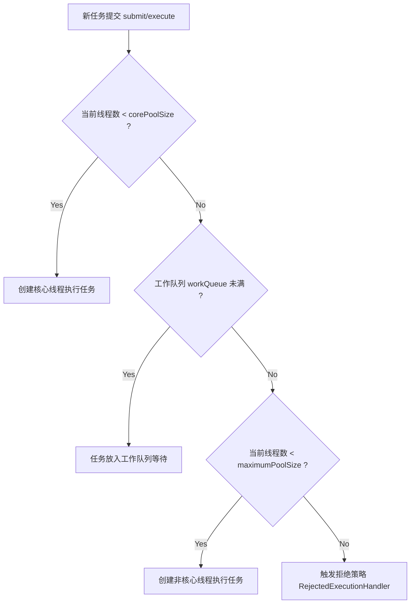

# 5. Java 并发特训指南（袁志刚专属版）

本指南紧扣您简历中 **“苍穹外卖 AI Agent 多步任务超时熔断与编排”**、**“订单状态流转并发原子写”** 和 **“秒杀高并发一人一单与延迟削峰”** 场景进行深度定制。在实际高吞吐应用中，对线程池参数、内存模型、锁机制与 CAS 的微调直接决定了系统在高流量下的吞吐极限和正确性。

---

## 🎯 简历亮点深度关联与大厂面试预测

### 1. Agent 任务超时熔断与【线程池调优最佳实践】
*   **面试官切入点**：
    > “我看到你的苍穹外卖 Agent 编排中设计了‘动态超时预算，超时自动熔断，系统可用性达 99.5%’，这必定涉及复杂的异步线程池调度。请问你是如何进行线程池参数调优的？对于你的 Agent 任务（涉及调用大模型和 Hybrid RAG 检索），它是 CPU 密集型还是 IO 密集型？你的核心/最大线程数是如何设定的？”
*   **袁志刚专属特训回答模版**：
    1.  **任务属性与核心线程数计算**：Agent 多步编排（大模型 HTTP 接口调用）和 Hybrid RAG 检索（基于向量和数据库查询）是典型的 **IO 密集型任务**。因为线程执行时，大部分时间都阻塞在等待 LLM 响应和数据库网络 IO 上，此时 CPU 处于空闲状态。
        *   **传统计算公式**：$N_{threads} = N_{cpu} \times 2$ 并不适用于高并发 IO 场景。
        *   **工业调优公式**：$N_{threads} = N_{cpu} \times U_{cpu} \times (1 + \frac{W}{C})$（其中 $W/C$ 为线程等待时间与计算时间的比值）。由于大模型调用等待时间极长（数秒），比值可能高达 10~50。
        *   **实际设定**：我们没有套用死公式，而是通过线上压测，在 4 核 CPU 服务器上将核心线程数 `corePoolSize` 设定为 **50**，最大线程数 `maximumPoolSize` 设定为 **100**，允许高并发下多线程阻塞等待网络 IO，极大提升了 Agent 的吞吐量。
    2.  **拒绝策略与优雅熔断**：
        *   **阻塞队列**：我们选用了 `LinkedBlockingQueue` 并设置了上限 **500**，防止任务堆积导致 OOM。
        *   **拒绝策略**：我们没有选择默认的 `AbortPolicy` 抛异常，而是选用了 **`CallerRunsPolicy`（调用者运行策略）**。当队列爆满时，主线程（SaaS 业务线程）会直接分摊执行该 Agent 编排任务，这能天然实现高负载下的**反向压制（限流）**，减缓新任务的提交速度。
        *   **超时熔断**：通过 `CompletableFuture.supplyAsync(..., agentExecutor)` 提交任务，配合 `CompletableFuture.anyOf()` 绑定一个专门的定时超时任务。一旦超时预算消耗完毕，立即调用 `future.cancel(true)` 强行中断任务线程，防止死锁或无限制阻塞。

### 2. 订单状态流转与【CAS 乐观锁与并发原子写】
*   **面试官切入点**：
    > “在订单状态流转的并发竞争中，你提到使用‘条件更新实现原子写操作’。这在 Java 底层其实就是 CAS (Compare-And-Swap) 的思想。请问 CAS 的底层原理是什么？如果在高并发秒杀中遭遇大量冲突，CAS 的自旋开销非常大，你有什么优化手段？又是如何解决 ABA 问题的？”
*   **袁志刚专属特训回答模版**：
    1.  **CAS 与条件更新的契合**：在苍穹外卖的订单状态机流转中（例如：待付款 -> 待接单），为了防止两个线程同时处理导致并发冲突（如重复扣款、重复取消），我们设计了 SQL 乐观锁：`UPDATE orders SET status = 'CANCELLED' WHERE id = 123 AND status = 'PENDING'`。这与 Java 内存中的 **CAS 机制**（预期值、新值、内存值比较）如出一辙，均是实现**无锁原子写**的核心手段。
    2.  **Java 中的 CAS 底层原理**：Java 中的原子类（如 `AtomicInteger`）底层依托于 `sun.misc.Unsafe` 类。Unsafe 类可以直接操作系统内存，其核心方法是本地方法（C++ 实现），最终通过 JVM 被编译为 CPU 级别的原子性汇编指令 **`cmpxchg`**。配合 `volatile` 保证的可见性，实现了内存级别的无锁并发安全。
    3.  **高并发冲突与 ABA 解决**：
        *   **ABA 问题**：在数据库层面，我们通过引入 `version` 版本号字段（或使用订单修改时间戳）来防止 ABA 问题，每一次更新不仅比对状态，还使版本号 `+1`。在 Java 内存层，对应的解决方案是使用 **`AtomicStampedReference`**，它通过维护一个 `<Reference, Integer Stamp>` 的对偶对象，给引用打上“版本号（邮戳）”，彻底杜绝了 ABA。
        *   **高并发自旋开销优化**：在高并发写极端激烈的场景下，CAS 自旋会疯狂空转占用 CPU。我们底层通过将热点数据进行“分段”，如使用 **`LongAdder`** 代替 `AtomicLong`，让不同的线程写到不同的 Cell 数组中，最后求和，避免了单点 CAS 的严重竞争。

### 3. 多路召回 RAG 合并与【CountDownLatch 异步编排】
*   **面试官切入点**：
    > “在你的 Hybrid RAG 检索中，提到了‘在线阶段向量检索与关键词全文检索并行执行，经 RRF 融合后送入 Reranker 精排’。这两路检索是并行的，你是如何在 Java 中等待它们全部完成后再合并精排的？用到了什么并发工具？”
*   **袁志刚专属特训回答模版**：
    1.  **CountDownLatch 异步协同**：因为向量检索（依赖 Pgvector）和倒排全文检索（依赖关键词）是两条独立且耗时的并行路径。为了将响应延迟压到最低，我们通过自定义线程池异步提交这两个检索任务，并使用 **`CountDownLatch(2)`** 进行线程协同。
    2.  **工作流程**：
        *   主线程初始化 `CountDownLatch latch = new CountDownLatch(2)`。
        *   向量检索线程和全文检索线程在各自执行完毕后，在 `finally` 块中调用 `latch.countDown()`，将计数器减 1。
        *   主线程在调用 `latch.await(timeout, TimeUnit.MILLISECONDS)` 处挂起等待（并设置 500ms 硬超时，防止某个检索分支卡死拖慢整个客服问答）。一旦两路检索全部完成，主线程被唤醒，立即读取结果进行 RRF 融合和 Reranker 精排。

---

## 🚀 第一优先级核心考点详解（线程池、JMM、CAS、AQS 原理硬核深挖）

### 一、 ThreadPoolExecutor 线程池机制与工作流程
线程池是管理和复用线程的并发框架，能极大地避免频繁创建和销毁线程带来的巨大系统开销。

#### 1. 七大核心参数
```java
public ThreadPoolExecutor(
    int corePoolSize,               // 1. 核心线程数（常驻线程）
    int maximumPoolSize,            // 2. 最大线程数
    long keepAliveTime,             // 3. 空闲线程存活时间
    TimeUnit unit,                  // 4. 存活时间单位
    BlockingQueue<Runnable> workQueue, // 5. 任务阻塞队列
    ThreadFactory threadFactory,    // 6. 线程创建工厂（多用于自定义线程名）
    RejectedExecutionHandler handler // 7. 拒绝策略（队列满且达到最大线程数时触发）
)
```

#### 2. 线程池工作流程与任务流转图


---

### 二、 JMM (Java 内存模型) 与 volatile

#### 1. 为什么需要 JMM？
在多核 CPU 架构下，每个核心都有自己的高速缓存（L1, L2, L3），而它们共享主内存。这会导致**缓存一致性问题**。此外，编译器和处理器为了优化性能会进行**指令重排**。JMM 规范了 Java 虚拟机与计算机内存是如何协同工作的，它定义了共享变量在多线程环境下的可见性、有序性和原子性规则。

#### 2. volatile 的底层原理与两大特性
`volatile` 是 JVM 提供的最轻量级的同步机制。
1.  **保证内存可见性**：
    *   **原理**：被 `volatile` 修饰的变量被写入时，JVM 会向处理器发送一条 **Lock 前缀指令**。这条指令会强制将当前处理器缓存行的数据写回到系统主内存。同时，这个写回内存的操作会引起在其他 CPU 里缓存了该内存地址的缓存行无效（**缓存一致性协议 MESI**）。当其他 CPU 再次读取该变量时，发现缓存行无效，只能重新从主内中读取。
2.  **防止指令重排（保证有序性）**：
    *   **原理**：编译器在生成字节码时，会在 `volatile` 变量读写操作的前后插入 **内存屏障 (Memory Barrier)**。
        *   在写操作前面插入 `StoreStore` 屏障，写操作后面插入 `StoreLoad` 屏障。
        *   在读操作后面插入 `LoadLoad` 和 `LoadStore` 屏障。
        *   内存屏障会强制禁止屏障前后的指令进行重排序。
3.  **为什么 volatile 无法保证原子性？**：
    *   以经典的 `i++` 为例，它在字节码层面被分解为三步：
        1.  `getstatic`（获取 i 的最新值到栈顶）；
        2.  `iadd`（执行加 1 操作）；
        3.  `putstatic`（将新值写回主内存）。
    *   即使 `i` 用 `volatile` 修饰，当线程 A 执行到第 2 步时，线程 B 抢占执行完了三步并将值写回，此时线程 A 栈顶的值已经过期，但线程 A 仍会继续执行第 3 步，从而导致覆写，发生数据丢失。因此，保证原子性必须使用 `synchronized`、`Lock` 或 `AtomicInteger`。

---

### 三、 CAS (Compare-And-Swap) 底层原理与局限性
*   **概念**：CAS 是一种乐观锁技术。它包含三个参数：内存地址 V、预期原值 A、新值 B。当且仅当内存地址 V 的实际值等于预期值 A 时，才将内存值修改为 B。否则，认为有其他线程修改过，放弃操作或进行自旋（死循环重试）。
*   **底层实现**：在 Windows x86 架构下，`Unsafe.compareAndSwapInt` 底层最终映射为汇编指令 **`lock cmpxchg`**。`lock` 前缀强制锁定总线或缓存，确保整个“比较并交换”过程是一个不可分割的**原子操作**。
*   **CAS 的三大痛点**：
    1.  **ABA 问题**：变量从 A 变成 B 又变回 A，CAS 无法感知其已被修改过。
        *   *解决*：引入版本号，如 `AtomicStampedReference`。
    2.  **高并发自旋开销大**：冲突激烈时，自旋会导致 CPU 满载空转。
        *   *解决*：使用 `LongAdder`（分段写思想）或适当引入 `Thread.yield()` 减缓自旋。
    3.  **只能保证单个共享变量的原子操作**。

---

### 四、 AQS 机制（AbstractQueuedSynchronizer）
AQS 是构建锁和同步器（如 `ReentrantLock`、`Semaphore`、`CountDownLatch`）的奠基石。

#### 1. 核心设计三要素
1.  **volatile state（同步状态）**：一个由 `volatile` 修饰的 32 位整数 `state`，代表锁的状态（如 0 代表未占用，$\ge 1$ 代表被占用，支持可重入）。
2.  **CLH 变种双向队列（等待队列）**：当线程获取锁失败时，AQS 会将当前线程封装成一个 `Node` 节点，通过 CAS 原子地加入到双向 FIFO 同步队列的尾部，并将线程通过 `LockSupport.park()` 挂起，等待被前驱节点唤醒。
3.  **CAS 状态抢占**：在获取/释放锁状态时，通过 CAS 原子地修改 `state` 状态。

#### 2. ReentrantLock 中公平锁与非公平锁的底层区别
*   **非公平锁（NonfairSync，默认）**：
    *   当一个新线程尝试获取锁时，它会**直接进行一次 CAS 抢锁**（尝试将 `state` 从 0 设为 1）。如果刚好锁释放了，新线程会直接“插队”抢到锁，而无需理会同步队列中排队等待了很久的线程。
    *   **优势**：减少了线程挂起和唤醒的上下文切换开销，整体吞吐量更高。
*   **公平锁 (FairSync)**：
    *   当一个线程尝试获取锁时，必须先调用 `hasQueuedPredecessors()` 判断同步队列中是否有前驱节点在排队。如果有，它必须老老实实去队尾排队，绝不插队。
    *   **劣势**：频繁的线程唤醒导致高昂的上下文切换开销，吞吐量较低。

---

## 🛠️ 第二优先级核心考点详解（synchronized vs Lock、CompletableFuture、ThreadLocal）

### 一、 synchronized 与 ReentrantLock 深度对比
| 对比维度 | synchronized | ReentrantLock |
| :--- | :--- | :--- |
| **底层实现** | JVM 级别的 Monitor 监视器锁（基于操作系统 Mutex 锁） | API 级别的 Java 类（基于 AQS 与 CAS） |
| **加锁/解锁方式** | JVM 自动控制，配合 `monitorenter`/`monitorexit`，异常自动释放 | 必须手动显式 `lock()` 与 `unlock()`，必须在 `finally` 块中释放 |
| **公平锁支持** | 不支持（只能是非公平锁） | 支持公平锁与非公平锁 |
| **高级特性** | 无 | 支持可中断锁 (`lockInterruptibly`)、超时抢锁 (`tryLock`)、支持多条件变量 (`Condition`) |
| **锁升级过程** | 包含锁升级：无锁 -> 偏向锁 -> 轻量级锁 -> 重量级锁 | 无锁升级概念，直接通过 CAS 自旋和队列阻塞挂起 |

---

### 二、 CompletableFuture 异步任务编排核心 API
在 Agent 多步编排与融合多路召回时，它是比传统 `Future` 强悍数倍的利器。

1.  **创建异步任务**：
    *   `supplyAsync(Supplier<U>, Executor)`：执行有返回值的异步任务。
    *   `runAsync(Runnable, Executor)`：执行无返回值的异步任务。
2.  **异步链式回调**：
    *   `thenApply()`：承接上一步结果，同步加工并返回新结果（类似于 Stream 的 map）。
    *   `thenAccept()`：消费上一步结果，无返回值。
3.  **多任务编排与合并**：
    *   `allOf(futures...)`：等待所有异步任务全部执行完毕，才进行下一步（类似于 `CountDownLatch`）。
    *   `anyOf(futures...)`：任何一个异步任务执行完毕（或最快的一个返回），即结束并返回其结果（多用于**超时熔断**）。

---

### 三、 ThreadLocal 内存泄漏风险深度剖析
*   **概念**：`ThreadLocal` 为每个线程提供了一个独立的变量副本，实现了线程间的数据隔离。在 Spring 事务管理、用户 Session 存储（如 Spring MVC 拦截器保存当前登录用户信息）中被广泛应用。
*   **底层结构**：每个 Thread 内部都持有一个 `ThreadLocalMap` 属性。这个 Map 的 Key 是 `ThreadLocal` 对象的**弱引用 (WeakReference)**，而 Value 是存储的强引用对象。
*   **内存泄漏发生场景**：
    *   一旦 GC 发生，由于 Key 是弱引用，`ThreadLocal` 对象会被自动回收。此时，`ThreadLocalMap` 中会出现一个 Key 为 `null` 的 Entry。
    *   但是，这个 Entry 的 **Value 是强引用**。只要当前线程不销毁（在线程池环境下，核心线程几乎是永久存活的），这条从 `Thread -> ThreadLocalMap -> Entry -> Value` 的强引用链就一直存在，导致 Value 对象永远无法被 GC 回收，发生内存泄漏。
*   **解决方案**：每次使用完 ThreadLocal 后，**必须强制在 `finally` 块中调用 `remove()` 方法**，将对应的 Entry 清除。

---

## 📝 第三优先级核心考点详解（线程状态与基础协作）

### 一、 线程的 6 种状态及其流转关系
1.  **NEW**：初始化状态，线程刚被 new 出来，尚未调用 `start()`。
2.  **RUNNABLE**：运行状态（在 JVM 中，就绪 Ready 和运行中 Running 合称为 Runnable，由 CPU 调度时间片决定）。
3.  **BLOCKED**：阻塞状态，等待获取锁（如等待进入 `synchronized` 重量级锁区域）。
4.  **WAITING**：无限制等待状态，必须等待其他线程显式唤醒（如调用了 `o.wait()` 或 `LockSupport.park()`）。
5.  **TIMED_WAITING**：超时等待状态，时间到自动唤醒（如 `sleep(ms)`、`o.wait(ms)`）。
6.  **TERMINATED**：终止状态，线程执行完毕。

### 二、 sleep() 和 wait() 的区别
1.  **锁释放标志**：`sleep()` 方法是 Thread 类的静态本地方法，调用时**绝不释放锁**，只让出 CPU 执行权；`wait()` 方法是 Object 类的普通方法，调用时**立即释放锁**，让当前线程进入等待队列，只有被 `notify()` 唤醒后重新争抢锁。
2.  **所属类不同**：`sleep()` 属于 `Thread` 类；`wait()` 属于 `Object` 类。
3.  **使用限制**：`sleep()` 可以在任何地方使用；`wait()` 必须在同步代码块（`synchronized` 区域）内使用，否则运行时会抛出 `IllegalMonitorStateException`。
