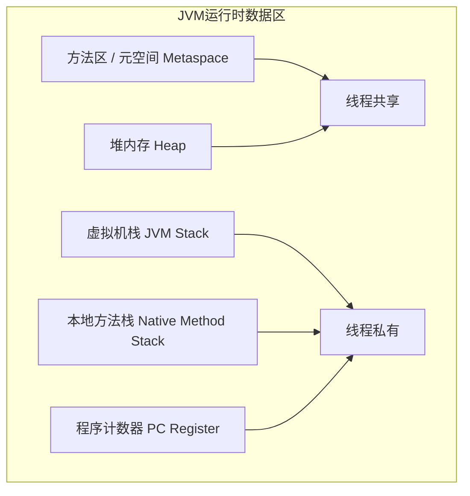

# 6. JVM 特训指南（袁志刚专属版）

本指南结合您简历中 **“Agent 多步编排超低延迟（可用性 99.5%）”** 和 **“秒杀瞬时高吞吐流量”** 场景进行深度定制。在生产环境高并发下，JVM 堆内存中会瞬间产生海量的临时对象（如大模型调用请求/流式响应分块、RAG 向量数据、缓存实体），若垃圾回收器配置不当或发生内存泄露，STW (Stop-The-World) 停顿会导致严重的系统雪崩。

---

## 🎯 简历亮点深度关联与大厂面试预测

### 1. 高并发秒杀与 Agent 服务低延迟与【GC 收集器选型与调优】
*   **面试官切入点**：
    > “我看到你的 AI 客服 Agent 可用性高达 99.5%，且黑马点评是高并发秒杀场景。在这种高并发、高吞吐的场景下，JVM 堆内存会产生大量的瞬时垃圾。如果是你来做 JVM 调优，你会选用什么垃圾收集器？如何配置参数以保障系统在处理高并发请求时停顿时间（STW）最短？”
*   **袁志刚专属特训回答模版**：
    1.  **收集器选型：G1 / ZGC 替代传统 Parallel**：
        *   传统的 Parallel 收集器追求的是高吞吐，但在高并发下，一旦发生 Full GC，STW 停顿可能长达数秒，会导致大面积用户请求超时，彻底打碎 99.5% 的可用性指标。
        *   在 JDK 8 生产环境中，我们选用 **G1 收集器**。它将堆内存划分为多个大小相等的独立 Region。通过并发标记和增量回收，它允许我们通过参数 `-XX:MaxGCPauseMillis=100` 设置一个预期最大停顿时间。它会预测并仅回收性价比最高的 Region，把 STW 控制在百毫秒以内。
        *   在 JDK 11/17 生产环境下，我们强烈建议开启 **ZGC** (`-XX:+UseZGC`)。ZGC 采用染色指针和读屏障技术，几乎把所有的垃圾标记和整理阶段都做到了与用户线程并发执行，即使是 TB 级的堆内存，STW 停顿也牢牢控制在 **10ms 以内**，完全消除了 GC 带来的延迟抖动。
    2.  **核心调优参数配置示例**：
        ```bash
        # 生产环境 JVM 启动核心配置（以 4G 堆内存、G1 收集器为例）
        java -server \
             -Xms4g -Xmx4g \                      # 1. 堆初始与最大内存设为一致，防止内存抖动开销
             -XX:+UseG1GC \                       # 2. 启用 G1 垃圾回收器
             -XX:MaxGCPauseMillis=100 \           # 3. 设置每次 GC 最大预期停顿时间为 100ms
             -XX:InitiatingHeapOccupancyPercent=45 \ # 4. 堆占用率达到 45% 时触发并发 GC 周期
             -XX:+HeapDumpOnOutOfMemoryError \    # 5. 发生 OOM 时自动导出堆转储快照用于排查
             -XX:HeapDumpPath=/data/logs/dump.hprof \
             -jar my-agent-service.jar
        ```

### 2. 线程池队列堆积、ThreadLocal 未清理与【OOM 内存泄漏排查】
*   **面试官切入点**：
    > “在高并发秒杀或 Agent 长连接服务中，如果突然收到报警，JVM 内存持续飙升甚至发生了 OOM (java.lang.OutOfMemoryError: Java heap space)。结合你的简历（涉及线程池、异步编排），你认为最可能的原因是什么？你在排查 OOM 时会使用什么工具，具体步骤是怎样的？”
*   **袁志刚专属特训回答模版**：
    1.  **高并发下 OOM 的常见诱因**：
        *   **诱因一：线程池任务队列无限堆积**：由于大模型响应慢，任务执行被长时间阻塞。如果线程池使用了无界的 `LinkedBlockingQueue`，而生产环境瞬时并发极高，导致大量待执行的任务对象被疯狂塞入队列，直接撑爆堆内存引发 OOM。
        *   **诱因二：ThreadLocal 内存泄漏**：在拦截器或 AOP 切面中利用 `ThreadLocal` 传递用户信息，但由于线程被放回线程池中复用且没有显式调用 `remove()`，导致大量的用户画像、上下文对象在内存中越积越多，发生内存泄漏。
    2.  **硬核排查 4 步走**：
        *   **第一步：获取 Dump 快照**：由于配置了 `-XX:+HeapDumpOnOutOfMemoryError`，系统崩溃时会自动生成 `dump.hprof` 快照。如果在运行中内存偏高，我们会使用 JDK 自带的工具 `jmap -dump:format=b,file=heap.hprof <PID>` 主动导出快照。
        *   **第二步：使用分析工具 (MAT)**：将快照导入 **MAT (Memory Analyzer Tool)** 或者是 **JProfiler** 中。
        *   **第三步：锁定可疑元凶**：在 MAT 中查看 **Histogram（直方图）** 和 **Dominator Tree（支配树）**，查找占用堆内存比例最大的前几个大对象。通常我们会发现 `LinkedBlockingQueue$Node` 或者 `ThreadLocalMap$Entry` 占用了 80% 以上的内存。
        *   **第四步：定位代码并修复**：通过查找大对象到 GC Roots 的**强引用链（Path to GC Roots）**，可以直接定位到是哪个线程池或哪个业务类中的 ThreadLocal 没有被释放，进而修改代码，在 `finally` 块中加入 `remove()`，或者给线程池队列设置合理上限并改为 `CallerRunsPolicy` 拒绝策略。

---

## 🚀 第一优先级核心考点详解（运行时内存区域、对象分配机制、OOM 排查工具）

### 一、 JVM 运行时数据区域深度划分
JVM 内存区域可分为**线程私有**和**线程共享**两大类。



#### 1. 线程私有区域
1.  **程序计数器 (PC Register)**：
    *   **作用**：指向当前线程正在执行的字节码指令的行号。如果是本地（Native）方法，计数器值为空（Undefined）。
    *   **特点**：JVM 中唯一一个**绝不会触发 OOM** 的区域，生命周期与线程相同。
2.  **虚拟机栈 (JVM Stack)**：
    *   **结构**：由一个个**栈帧 (Stack Frame)** 组成，每个方法调用都对应一个栈帧的入栈和出栈。
    *   **栈帧五要素**：
        *   **局部变量表**：存放方法参数和方法内的局部变量（基本数据类型和对象引用 `reference`）。
        *   **操作数栈**：临时存放计算过程中的中间结果。
        *   **动态链接**：指向运行时常量池中该栈帧所属方法的引用，将符号引用转化为直接引用。
        *   **方法出口**：方法返回时的地址信息。
    *   **异常**：如果线程请求的栈深度大于虚拟机所允许的深度，抛出 `StackOverflowError`（常发生于无出口的递归）；如果栈允许动态扩展但在扩展时无法申请到足够内存，抛出 `OutOfMemoryError`。

#### 2. 线程共享区域
1.  **堆内存 (Heap)**：
    *   **作用**：JVM 内存中最大的一块，几乎所有的对象实例和数组都在这里分配内存（除逃逸分析下的栈上分配）。
    *   **结构**：新生代（Eden、S0、S1，默认比例 `8:1:1`）与老年代（默认大小比例 `1:2`）。
2.  **方法区 / 元空间 (Metaspace)**：
    *   **作用**：存储已被虚拟机加载的类信息、常量、静态变量、即时编译器编译后的代码等。
    *   **重大变革**：
        *   JDK 7 之前使用**永久代 (PermGen)** 实现方法区，由于大小固定，极易触发 OOM。
        *   JDK 8 开始全面弃用永久代，改用**元空间 (Metaspace)** 替代，并且**直接使用本地物理内存 (Native Memory)**，只要本地物理内存足够，元空间几乎不会发生 OOM。

---

### 二、 对象的创建与高并发分配机制 (TLAB)
1.  **类加载检查**：当 JVM 遇到 `new` 指令时，先检查该指令的参数能否在常量池中定位到一个类的符号引用，并检查该类是否已被加载、解析和初始化。
2.  **分配内存**：
    *   **指针碰撞**：堆内存绝对规整，通过移动分界指针进行分配。
    *   **空闲列表**：堆内存不规整，JVM 维护一个列表记录可用空间。
    *   **并发分配竞争 (TLAB 机制)**：在高并发秒杀中，成百上千个线程同时在堆上为对象申请内存，会导致严重的并发冲突。为了解决此问题，JVM 在 Eden 区为每个线程预先分配了一块小型的、线程私有的内存区域，称为 **TLAB (Thread Local Allocation Buffer，线程本地分配缓冲区)**。
        *   线程分配对象内存时，**首选在自己的 TLAB 区域中分配**，由于是线程私有的，完全无锁，速度极快。
        *   只有当 TLAB 空间不足时，才采用 CAS 锁机制在共享堆中进行分配。

---

### 三、 垃圾标记算法与 GC Roots

#### 1. 为什么不用引用计数法？
引用计数法是通过给对象添加一个引用计数器来判断垃圾，但它**无法解决循环引用**的问题。例如对象 A 引用了对象 B，B 同时也引用了 A，除此之外再无其他引用，此时两者的计数器均为 1，永远无法被 GC 回收。

#### 2. 可达性分析法 (Reachability Analysis)
*   **原理**：以一系列被称为 **“GC Roots”** 的对象作为起点，向下搜索引用链（Reference Chain）。如果一个对象到 GC Roots 没有任何引用链相连，则证明该对象是不可达的，判定为垃圾。
*   **哪些对象可以作为 GC Roots？**：
    1.  虚拟机栈（栈帧中的局部变量表）中引用的对象。
    2.  方法区中类静态属性引用的对象。
    3.  方法区中常量引用的对象。
    4.  本地方法栈中 JNI（即一般说的 Native 方法）引用的对象。

---

## 🛠️ 第二优先级核心考点详解（类加载机制与双亲委派）

### 一、 类加载的五个阶段
当编译完生成 `.class` 字节码文件后，JVM 需要通过类加载器将字节码加载到内存中方可运行。

1.  **加载**：通过类的全限定名获取二进制字节流，在方法区中生成该类的运行时数据结构，并在堆中创建一个 `java.lang.Class` 对象。
2.  **验证**：确保字节码文件的字节流信息符合 JVM 规范，没有安全危害。
3.  **准备**：正式为类变量（`static` 变量）**分配内存并设置初始零值**（如 `int` 设为 0，注意此时 `final static` 常量会直接分配真实值）。
4.  **解析**：将常量池内的符号引用替换为直接引用（内存地址）。
5.  **初始化**：执行类构造器 `<clinit>()` 方法，真正开始执行 Java 代码，为静态变量赋程序设定的真实值。

---

### 二、 双亲委派模型 (Parent Delegation Model)

#### 1. 类加载器的层次结构
*   **启动类加载器 (BootstrapClassLoader)**：C++ 实现，加载 JDK 核心类库（`rt.jar` 等）。
*   **扩展类加载器 (ExtensionClassLoader / PlatformClassLoader)**：Java 实现，加载 `lib/ext` 目录下的扩展类。
*   **应用程序类加载器 (AppClassLoader)**：Java 实现，加载 ClassPath 路径下的用户自定义类。

#### 2. 工作原理
当一个类加载器收到类加载请求时，它**首先不会自己去尝试加载这个类**，而是把这个请求**委派给父类加载器**去完成。每一个层次的类加载器都是如此，因此所有的加载请求最终都应该传送到顶层的启动类加载器中。只有当父类加载器反馈自己无法完成这个加载请求（它的搜索范围中没有找到所需的类）时，子加载器才会尝试自己去加载。

#### 3. 为什么需要双亲委派？（安全与唯一性）
*   **沙箱安全，防止核心 API 被篡改**：例如用户自己编写了一个 `java.lang.String` 类并试图加载。根据双亲委派模型，加载请求最终会被委派给顶层的 `BootstrapClassLoader`。它发现已经加载了官方的 String 类，直接返回已加载的类。这样可以有效防止核心类库被恶意篡改。
*   **防止类被重复加载**：保证了在 JVM 运行环境中，同一个类只会被加载一次，确保了类型的唯一性。

#### 4. 如何打破双亲委派模型？
打破双亲委派必须**重写 `loadClass()` 方法**（因为双亲委派的逻辑就写在 `ClassLoader` 的 `loadClass()` 方法中；如果只是重写 `findClass()`，则依然遵循双亲委派）。
*   **典型打破场景**：
    1.  **Tomcat 容器**：为了实现不同的 Web 应用之间 ClassPath 库的完美隔离，Tomcat 自定义了 `WebappClassLoader`，它打破了双亲委派，首选自己去加载类，只有找不到时才委派给父类加载器。
    2.  **SPI 机制**：Java 核心类（如 `DriverManager`，由 BootstrapClassLoader 加载）需要调用由第三方厂商实现的 JDBC 驱动。因为 Bootstrap 无法加载 ClassPath 下的厂商类，Java 引入了**线程上下文类加载器 (Thread Context ClassLoader)**，由父类加载器请求子类加载器去完成加载，这也是一种双亲委派的打破。

---

## 📝 第三优先级核心考点详解（三大垃圾收集算法）

### 一、 三大垃圾收集算法

#### 1. 标记 - 清除算法 (Mark-Sweep)
*   **原理**：先标记出所有需要回收的对象，标记完成后统一回收所有被标记的对象。
*   **缺点**：
    1.  **执行效率低**：如果垃圾对象很多，标记和清除的效率都很低。
    2.  **内存碎片严重**：清除后会产生大量不连续的内存碎片。高并发分配大对象时，极易因找不到连续空间而提前触发 Full GC。

#### 2. 标记 - 复制算法 (Copying) —— 新生代首选
*   **原理**：将可用内存按容量划分为大小相等的两块，每次只使用其中一块。当这一块用完了，就将还存活着的对象复制到另一块上面，然后再把已使用过的内存空间一次清理掉。
*   **应用**：G1 的 Region 回收以及新生代（Eden/Survivor）均使用此算法（通过 `8:1:1` 比例最大化节省内存损耗，仅损耗 10% 的 Survivor0/1 空间）。
*   **缺点**：可用内存缩小为原来的一半（如果不采用 Eden/Survivor 划分的话）。

#### 3. 标记 - 整理算法 (Mark-Compact) —— 老年代首选
*   **原理**：标记过程与“标记-清除”一致，但后续步骤不是直接对可回收对象进行清理，而是让所有存活的对象都向内存空间的一端移动，然后直接清理掉边界以外的内存。
*   **优点**：没有内存碎片，适合存活率极高的老年代。
