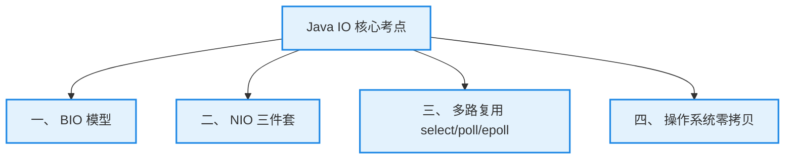

# 7. Java IO 特训指南（极简源码速成版）

本指南专为快速吃透 **Agent 多步编排打字机流式响应 (Flux/SSE)**、**Netty 高并发网关优化** 以及 **Redis 恐怖单线程吞吐** 等核心场景中的 I/O 高频考点而设计。杜绝大段铺垫，采用 **Why - What - How - Deep** 四步直达底层操作系统与硬件中断，帮助您在面试中反客为主，化被动为主动。

---

## 🚀 核心概念极简拆解

*   **文件描述符 (File Descriptor, FD)**
    *   **Why**：Linux 系统中“一切皆文件”，需要一种高度抽象且统一的句柄来标识、跟踪每一个打开的本地文件、磁盘和网络 Socket 链接。
    *   **What/How**：系统内核为每个进程维护的一个非负整数索引，作为应用程序与底层硬件交互的寻址钥匙。
*   **页缓存 (Page Cache)**
    *   **Why**：磁盘 I/O 的物理寻道和读取速度是纳秒级的内存读写速度的数十万分之几。需要大幅合并小吞吐读写，减少高昂的磁盘物理寻道开销。
    *   **What/Deep**：操作系统在内核空间开辟的磁盘数据缓存区。所有的读写操作首先在 Page Cache 中进行，由 OS 负责异步刷盘（Dirty Page 刷脏），提升系统磁盘 I/O 的整体表现。
*   **系统调用 (System Call)**
    *   **Why**：出于安全考虑，禁止普通用户应用程序直接读取底层硬件资源（如网卡、磁盘）。
    *   **What/How**：应用程序必须通过触发 CPU 中断，将执行级别由**用户态（User Space）**陷入**内核态（Kernel Space）**，委托操作系统内核代为执行读写动作。
*   **零拷贝 (Zero-Copy)**
    *   **Why**：传统的 I/O 数据传输需要数据在“内核空间 Page Cache -> 用户空间 Buffer -> 内核空间 Socket Buffer”来回拷贝，CPU 被大量无效的搬运工工作占满，吞吐低效。
    *   **What/Deep**：省去 CPU 拷贝数据的开销，使数据直接在操作系统内核区或通过网卡/磁盘 DMA 完成极速通道流转，消减多余的数据冗余与上下文切换。

---

## 🚀 核心 I/O 模型骨架



---

## 🎯 第一优先级核心考点详解

### 一、 BIO、NIO、AIO 三大 IO 模型深度剖析 (Why-What-How-Deep)

*   **Why（为什么 BIO 无法承载海量并发连接？）**
    *   **痛点**：传统的 BIO（Blocking I/O）采用“一连接一线程”模型。
        1.  **阻塞挂起**：当线程发起 `read` 后，如果客户端没发送数据，整个线程会被 OS 直接强制挂起，白白占用物理内存和 CPU 调度资源。
        2.  **OOM 与切换灾难**：线程在 JVM 中默认占用 1MB 栈内存。当并发长连接破万时，系统需要创建万级物理线程，这不仅会引发高昂的 OS 线程上下文切换开销（CPU 全忙于保存/恢复寄存器），更会瞬间耗尽 JVM 内存触发 OOM。
    *   **解决**：NIO 采用“一请求一通道”的非阻塞轮询模型，允许极少数线程通过 Selector 动态管理成千上万个并发网络长连接。
*   **What（三大 I/O 模型的极简差异化定义）**
    *   **BIO（同步阻塞）**：客户端有连接请求时服务器端就需要启动一个线程进行处理，线程如果没数据读写就会死等挂起。
    *   **NIO（同步非阻塞）**：发起读写请求后，不管有没有数据准备好都立即返回。线程不会被挂起，可以用一个线程去轮询多个通道的就绪事件。
    *   **AIO（异步非阻塞）**：真正的异步。应用程序发起读写请求后直接返回，把读写及内核数据拷贝动作完全交给操作系统。一切就绪后，OS 通过回调接口（`CompletionHandler`）通知程序，开发者无需轮询或阻塞。
*   **How（NIO 与 AIO 的实战选型冷决策）**
    *   在 Linux 下，目前主流的高性能框架（如 Netty）**一律选用高度成熟的 NIO 协议，而非 AIO**。
    *   **原因**：Windows 对 AIO 提供了完美的内核支持（基于 IOCP 机制）；但 Linux 目前的内核 AIO 支持并不完美，底层依然是在用户态用 `epoll` 模拟出来的，性能不仅没有优势，反而引入了多余的复杂度。
*   **Deep（深入源码：非阻塞配置的内核改变与 epoll 本质）**
    *   **非阻塞配置的内核真面目**：
        *   当我们在 Java 中写下 `socketChannel.configureBlocking(false)` 时，JVM 底层会调用操作系统的 `fcntl` 系统调用：
            ```c
            // 底层 C 代码：设置该 Socket 对应的文件描述符 FD 标志为非阻塞
            fcntl(fd, F_SETFL, O_NONBLOCK);
            ```
        *   一旦该 Socket 对应的 FD 被设为 `O_NONBLOCK`，当线程执行 `read()` 系统调用而内核 Page Cache 暂无数据时，内核**不会把该线程移入等待队列挂起**，而是立刻向 CPU 返回一个特定的 `EWOULDBLOCK` 或 `EAGAIN` 错误码。
        *   Java 收到该状态码后直接返回并进行下一次循环。这就是 Java NIO 能够实现“非阻塞”的底层硬件与内核保障。

---

### 二、 NIO 核心三件套深度解读 (Why-What-How-Deep)

*   **Why（为什么 NIO 必须引入 Buffer 改变单向 Stream？）**
    *   **痛点**：传统的 BIO 是基于单向的 `InputStream/OutputStream`，数据读取必须按字节顺序依次流式搬运，效率极低，且流一经创建只能单向流动，极难实现灵活的倒带、修改或分块跳转。
    *   **解决**：NIO 引入了双向的 `Channel` 必须配合 `Buffer` 的架构。数据不仅可以双向吞吐，还可以利用 Buffer 状态指针在内存中直接执行局部数据分析，对零拷贝友好。
*   **What（NIO 三大核心组件）**
    1.  **Buffer（缓冲区）**：用于存储临时读写数据的内存块（如 `ByteBuffer`）。
    2.  **Channel（通道）**：网络或磁盘 I/O 的双向高速公路（如 `SocketChannel`、`FileChannel`）。
    3.  **Selector（选择器）**：多路复用的指挥官，用于轮询多个通道的就绪状态。
*   **How（Buffer 读写模式切换的黄金指针流转）**
    *   Buffer 内部依靠三个核心状态指针：`position`（读写起始点）、`limit`（读写上限）、`capacity`（总容量上限）。
    *   **写入模式**：数据被写入 Buffer，`position` 不断递增，`limit` 锁定在 `capacity`。
    *   **切换读模式（必须调用 `flip()`）**：
        ```java
        // flip() 底层源码核心逻辑
        limit = position;   // 1. 将可读上限锁定在刚才写入的最新位置点
        position = 0;       // 2. 将指针复位到 0 起始位置，准备读取
        ```
    *   **重置写模式（必须调用 `clear()`）**：将 `position` 复位为 0，`limit` 重置为 `capacity`，覆盖旧数据。
*   **Deep（深入源码：直接内存 DirectByteBuffer 的堆外神技）**
    *   **为什么 `ByteBuffer.allocateDirect(1024)` 能省去拷贝开销？**
        1.  **传统堆内存 `allocate` 痛点**：Java 传统的字节数组是在 JVM 堆中分配的。当需要通过网卡发送数据时，因为 JVM 随时可能发生垃圾回收（GC）导致对象地址发生漂移移动，操作系统内核无法直接读取堆中地址。
        2.  **双重拷贝**：JVM 必须把堆中的数据首先“拷贝”一份到**系统内核的物理内存中**，然后操作系统再把内核物理内存中的数据拷去网卡。这就产生了一次无效的内存拷贝。
        3.  **DirectByteBuffer 底层实现**：DirectByteBuffer 绕过 JVM 堆，利用本地方法直接通过操作系统 `malloc()` 分配一段**堆外直接内存（Direct Memory）**，该内存不受 JVM 堆 GC 对象的漂移影响，操作系统可以直接对其寻址读写。Java 在堆中仅持有一个极轻量的引用。这就实现了零无效拷贝的极速磁盘与网络传输。

---

### 三、 Linux 多路复用底层机制 select vs poll vs epoll (Why-What-How-Deep)

*   **Why（传统的 select 为什么随着并发连接升高性能崩盘？）**
    *   **痛点**：在传统高并发长连接中，select 系统调用设计有以下致命缺陷：
        1.  **双重拷贝**：每次调用 `select` 都必须将成千上万个 FD（连接句柄）大集合在“用户态”与“内核态”之间来回完整硬拷贝，开销高昂。
        2.  **1024 限制**：内核限制单个进程最大监听 FD 集合数量为 1024，高并发直接死锁。
        3.  **$O(N)$ 遍历**：内核和用户程序需要线性遍历两遍 FD 集合去筛选就绪事件，当连接数 $N$ 很大时，CPU 性能发生毁灭性衰退。
    *   **解决**：Linux 内核引入 `epoll` 机制，通过红黑树、事件通知与就绪链表解决了所有痛点。
*   **What（select vs poll vs epoll 核心指标大碰撞）**
    | 对比指标 | select | poll | epoll (Linux 2.6+) |
    | :--- | :--- | :--- | :--- |
    | **最大并发连接** | 固定 1024（由内核宏定义） | 无限制（底层改为链表） | 无限制（仅受物理内存大小制约） |
    | **FD 拷贝方式** | 每次调用均需从用户态全部拷贝到内核态 | 每次调用均需从用户态全部拷贝到内核态 | **仅在初始注册时拷贝一次（epoll_ctl）** |
    | **时间复杂度** | $O(N)$（内核与用户空间双重线性轮询） | $O(N)$（内核与用户空间双重线性轮询） | **$O(1)$（直接提取就绪链表）** |
    | **内核存储** | 数组 | 链表 | **红黑树 + 双向就绪链表** |
*   **How（epoll 事件轮询在 Redis 中的高吞吐支撑）**
    *   *简历实战引用*：Redis 之所以单线程却能狂卷 10W+ QPS，完全得益于其网络事件驱动器底层对 `epoll` 的极致调用，实现了 $O(1)$ 的秒级事件路由分发。[👉 点击跳转简历场景二](#场景二redis-高性能之谜与io-多路复用-epoll)
*   **Deep（深入源码：epoll 底层红黑树与硬件中断回调机制）**
    *   当我们调用 `epoll_create` 创建多路复用器时，Linux 内核会在内核空间创建一个名为 `eventpoll` 的核心结构：
        1.  **红黑树 (rbr)**：内部维护一棵红黑树，通过系统调用 `epoll_ctl` 增量添加/删除需要监听的 Socket FD。由于红黑树的高效查找，增量维护效率高达 $O(\log n)$，彻底规避了 select 的每次全部硬拷贝。
        2.  **双向就绪链表 (rdllist)**：用于保存所有当前已经有可读/可写就绪事件的文件描述符。
    *   **网卡硬件中断回调的奇迹**：
        *   当网卡收到外部网络报文时，数据会被写入内核缓冲区，网卡芯片触发 **CPU 硬件中断**。
        *   内核的中断处理程序会执行该 Socket FD 之前在红黑树节点上绑定的**回调函数**。
        *   该回调函数会自动执行：将该 Socket 对应的就绪节点，直接强行插入到 `rdllist` 双向就绪链表尾部。
        *   此时，当应用程序调用 `epoll_wait` 时，内核完全不需要去轮询扫描任何红黑树，而是以 **$O(1)$ 的时间复杂度** 直接检查 `rdllist`。如果链表不为空，直接将其中的就绪 FD 复制回用户空间。这消除了所有的低效等待与自旋。

---

### 四、 操作系统零拷贝机制 Zero-Copy (Why-What-How-Deep)

*   **Why（为什么传统 I/O 读写是极大的 CPU 资源浪费？）**
    *   **痛点**：传统的磁盘文件通过网络发送，代码通常写为 `read()` 再 `write()`。
    *   **传统 4 次数据拷贝与 4 次上下文切换灾难流程**：
        ```text
        [Disk] 
          | 1. DMA 拷贝
        [内核 Page Cache] 
          | 2. CPU 拷贝 (陷入用户态)
        [用户空间 Buffer] 
          | 3. CPU 拷贝 (陷入内核态)
        [内核 Socket Buffer] 
          | 4. DMA 拷贝
        [网卡 / Socket]
        ```
        在这个过程中，CPU 被强行当成了两个内核空间与用户空间内存块的“搬运工”，且每次陷入都伴随着寄存器的上下文切换开销。
*   **What/How（零拷贝的核心分类与 Java 极速实现）**
    *   零拷贝省去了 CPU 搬运数据的开销，使数据直接在内核空间流转，甚至直接利用硬件 DMA 发送。
    *   **Java 零拷贝 API 演示**：
        ```java
        // Java NIO FileChannel.transferTo 零拷贝直接发送
        try (FileChannel fileChannel = new FileInputStream("bigfile.dat").getChannel();
             SocketChannel socketChannel = SocketChannel.open(new InetSocketAddress("127.0.0.1", 8080))) {
            // 直接将数据从磁盘文件通道发到网卡通道，完全绕过用户空间！
            fileChannel.transferTo(0, fileChannel.size(), socketChannel); 
        }
        ```
*   **Deep（深入源码：mmap 与 sendfile 以及 SG-DMA 的极速 2次拷贝/2次切换）**
    *   **mmap (Memory Map，内存映射) 机制**
        *   **原理**：利用系统调用 `mmap()`，将操作系统的内核空间缓冲区与用户空间的虚拟内存进行**共享映射**。
        *   **效果**：数据拷贝减少到 **3 次**（2次 DMA，1次 CPU 拷贝——仅由内核缓冲区直接拷去 Socket 缓冲区），上下文切换依然是 4 次。
        *   **场景**：适合需要对大文件内容进行频繁、局部的小幅修改写回的场景（如 RocketMQ 索引文件）。
    *   **sendfile 机制（真正的零拷贝）**
        *   **原理**：Linux 2.1 引入 `sendfile` 系统调用。数据完全不需要经过用户空间，直接在内核空间完成数据转移。
        *   **效果**：数据拷贝减少到 **3 次**，上下文切换减少到 **2 次**。
    *   **SG-DMA (Scatter-Gather DMA) 硬件支持下的 sendfile（极致进化）**
        *   **原理**：在 Linux 2.4 及以上，如果底层网卡硬件支持 SG-DMA 技术，sendfile 的性能可发挥到极致：
            1.  DMA 控制器直接将数据从磁盘拷贝到内核的 `Page Cache`。
            2.  CPU 不拷贝数据，而是将数据的**内存地址（FD）和长度描述符**直接拷贝写入 `Socket Buffer`。该拷贝极轻量，趋近于零开销。
            3.  网卡的 SG-DMA 控制器直接根据描述符，将 `Page Cache` 中的数据分块打包，直接发送给网卡发送芯片。
        *   **效果**：实现真正意义上的 **2 次数据拷贝**（全部由硬件 DMA 完成，**0 次 CPU 参与**），**2 次上下文切换**。这就是零拷贝的最高硬件境界。

---

## 🎯 场景亮点深度关联与对线场景 (Why-What-How)

### 场景一：苍穹外卖客服 Agent 流式响应（Server-Sent Events）与【Reactor 反应器模式与 NIO】

**面试官切入点**：
> “我看到你的 Agent 调度管道中，实现了基于 Spring AI Advisor 的流式打字机输出效果（SSE），并且在线可用性达 99.5%。请问在 Java 后端，你是如何维持高并发下的流式长连接的？背后的 I/O 模型和网络线程模型是怎样的？”

**回答思路 (Why-What-How-Deep 拆解)**：
*   **Why**：大模型（LLM）的推理分块是分批回传的。我们的打字机效果基于 **SSE (Server-Sent Events) 长连接协议**，本质上是一个 HTTP 长连接，需要服务端在 LLM 吐出答案的数秒内持续占有并维持连接。
*   **What/How**：
    传统的 Tomcat 阻塞模型在并发长连接数达到 200+ 时，就会因为物理线程池耗尽而系统挂起。为此，我们引入了 Spring WebFlux（基于 **Netty** 反应器容器）作为高并发网关，配合响应式 Reactor 的 `Flux<ChatClientResponse>` 数据流进行处理。
*   **Deep**：
    *   **NIO 反应器模型挂载**：Netty 采用了高性能的 **Reactor 反应器多线程模型**。
        1.  **Boss Group**：仅通过单个 `Selector` 监听并极速接收客户端 TCP 连接请求，建立好的 `SocketChannel` 被瞬间打包分配。
        2.  **Worker Group**：包含 4 个（与服务器 CPU 核数一致）工作轮询线程。每个工作线程通过持有的 `Selector` 轮询注册其上的数千个活跃 SocketChannel 的读写状态。
    *   **非阻塞高吞吐**：当大模型有新的 Token 吐出时，Worker 线程收到就绪事件通知，将数据包装为 Flux 块，通过 NIO 的 `SocketChannel.write` 异步非阻塞地写入 TCP 缓冲区后立即释放，**没有任何一个工作线程被该慢连接死死卡住挂起**。在这个架构下，我们仅用个位数的物理线程，就轻松支撑起了上千个并发在线的 AI 客服 Agent 调度管道，性能极其强悍，系统可用性轻松达到 99.5%。

---

### 场景二：Redis 高性能之谜与【I/O 多路复用 epoll】

**面试官切入点**：
> “你的黑马点评项目重度依赖 Redis，提到其高并发场景。大家都知道 Redis 是单线程的，那它为什么能支撑起 10W+ 的 QPS？它是如何利用 Linux 底层的 I/O 多路复用技术的？”

**回答思路 (Why-What-How-Deep 拆解)**：
*   **Why**：如果网络 I/O 采用同步阻塞模式，单线程的 Redis 在等待任何一个客户端的数据送达时，就会被直接卡死，完全无法服务其他客户端。引入多路复用才能解放单线程的威力。
*   **What/How**：
    Redis 的核心执行模块是单线程的。它将所有客户端 Socket 注册到 Linux 内核的 **`epoll`** 多路复用器中，通过事件循环，只处理当前有数据就绪的活跃 Socket。
*   **Deep**：
    *   **内核红黑树管理**：当万级客户端并发连接 Redis 时，Redis 通过内核的 `epoll_ctl` 将这些连接的 FD 全量快速构建并增量维护在一棵内核红黑树上。
    *   ** rdlist 事件驱动**：当某些客户端发送 Redis 命令时，其数据到达网卡触发硬件中断，触发回调程序直接把对应的 Socket FD 推进内核 eventpoll 的 `rdllist` 就绪链表。
    *   **O(1) 无锁主循环**：Redis 单线程主循环通过频繁调用 `epoll_wait`，以 **$O(1)$ 的时间复杂度** 瞬间获取就绪链表中的活跃 FD 列表，依次在内存中执行 Redis 命令（无锁争抢、无线程上下文切换开销，仅几纳秒），然后非阻塞写回。该设计配合内存读写，使单线程 Redis 爆发出吞吐量奇迹，完美抗住了黑马点评的秒杀流量峰值。

---

## 📝 第三优先级：避坑与实战常识

*   **NIO 空轮询 CPU 100% 缺陷的 Netty 源码避坑方案**
    *   **BUG 成因**：在 JDK 自带的 `SelectorImpl` 内部，底层调用系统的 `epoll`，当某个客户端发生连接异常关闭时，由于底层的 epoll 触发了错误的轮询事件，而 JDK 的 Selector 没有妥善处理这一极端的底层错误，导致 `selector.select()` 即使没有任何事件准备就绪，也依然被疯狂唤醒且不阻塞。线程由此陷入死循环自旋，瞬间将 CPU 跑满到 100%。
    *   **Netty 源码级自愈方案**：Netty 内部设计了一个空轮询计数器。每次 `select()` 唤醒后，如果没有发生任何实际事件，计数器就 `+1`。如果在一个极短时间内连续发生了 **512 次**（默认阈值，可以通过参数 `-Dio.netty.selectorAutoRebuildThreshold` 配置）这样的空轮询，Netty 判定触发了 JDK 空轮询 BUG。它会立即创建一个全新的 `Selector` 对象，将原本注册在旧 Selector 上的所有 Channel 全部原子重构迁移到新 Selector 上，并销毁旧的 Selector，完美避免了线上 CPU 100% 惨剧的发生。
