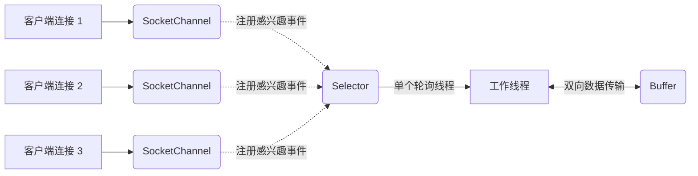

# 7. Java IO 特训指南（袁志刚专属版）

本指南结合您简历中 **“Agent 多步编排打字机流式响应（Flux/SSE）”** 与 **“黑马点评 Redis 高并发极速响应”** 场景进行深度定制。在现代高并发分布式系统里，系统的吞吐量瓶颈往往不在于 CPU 算力，而是在于网络与磁盘的 I/O 效率。掌握 Java I/O 模型及其底层操作系统的多路复用机制，是通往大厂高级架构师的必经之路。

**建议阅读顺序**：先读"前置概念速查" → 再读"核心考点详解" → 最后读"简历亮点关联"，届时你会发现所有技术细节都有了依托。

---

## 🔑 前置基础概念速查（必读，5 分钟建立认知底座）

在深入 I/O 模型之前，先把下面这几个概念理解清楚，后文所有分析都建立在这些基础上。

| 概念 | 一句话解释 |
|------|-----------|
| **同步 vs 异步** | **同步**：调用者发起请求后必须一直等待结果返回，才能继续执行；**异步**：调用者发起请求后立即返回，被调用者通过回调或事件通知来告知结果。 |
| **阻塞 vs 非阻塞** | **阻塞**：线程发起I/O后被挂起，无法执行其他任务，直到I/O操作彻底完成；**非阻塞**：线程发起I/O后立即返回一个状态码，无需挂起，可以继续干别的事。 |
| **用户态 vs 内核态** | 操作系统安全隔离机制：**用户态**是应用程序运行的安全受限级别，无法直接操作硬件；**内核态**是操作系统内核运行的特权级别，拥有完全的硬件读写权限。 |
| **文件描述符（FD）** | **File Descriptor**，Linux 系统中一切皆文件。FD 是操作系统为了跟踪每个打开的文件、Socket 链接等所分配的一个非负整数索引。 |
| **缓冲区（Buffer）** | 内存中的一块临时存储区域。在 I/O 读写时引入缓冲区，能极大地合并小吞吐读写，减少高昂的系统调用（System Call）次数，显著提升吞吐量。 |

---

## 🚀 第一优先级核心考点详解（BIO/NIO/AIO、NIO三件套、epoll 底层深度剖析）

### 一、 BIO、NIO、AIO 三大 IO 模型深度剖析

#### 1. BIO (Blocking I/O，同步阻塞 I/O)
*   **工作机制**：传统的 Java I/O 编程。服务端通常采用“一请求一线程”的模型，即每当有一个客户端连接进来，服务端就必须启动一个线程去专门处理这个链接。
*   **阻塞节点**：如果这个连接没有数据发送过来，处理线程就会一直阻塞在 `read` 操作上，白白浪费 CPU 和内存资源。
*   **致命缺点**：
    *   **高并发瓶颈**：线程在 JVM 中是非常昂贵的资源（默认一个线程栈 1MB）。当面对成千上万个并发连接时，系统会创建海量线程，这不仅会导致 CPU 频繁进行上下文切换引发满载，还会因为超出内存极限而直接引发 OOM。
    *   **伪异步优化局限**：虽然可以通过引入**线程池**来控制线程总数（俗称“伪异步 I/O”），但其本质依然是阻塞式 I/O。当线程池中的所有线程都因为等待读写而阻塞时，后续新的客户端连接请求依然只能排队死等甚至被拒绝。

#### 2. NIO (Non-blocking I/O，同步非阻塞 I/O)
*   **工作机制**：Java 1.4 引入的全新 I/O 包。它基于“一请求一通道”模型。服务端只需启动极少数的线程，通过一个 **Selector（选择器）** 去持续轮询注册在其上的多个 **Channel（通道）**。
*   **非阻塞节点**：当一个 Channel 没有数据准备好时，轮询的线程不会被挂起阻塞，而是立即返回，继续去处理其他就绪的 Channel。
*   **核心优势**：
    *   **极高并发**：利用单线程或极少数线程，就能同时管理成百上千乃至数万个并发长连接。
    *   **资源省**：极大地降低了系统线程的创建和上下文切换开销，是现代高性能网络应用（如 Netty 框架、Tomcat 8+）的核心基石。

#### 3. AIO (Asynchronous I/O，异步非阻塞 I/O)
*   **工作机制**：Java 1.7 引入（也称 NIO.2）。基于**操作系统异步回调机制**。
*   **异步节点**：应用程序发起读写请求后，直接返回去干别的事。实际的“数据读取”和“将数据从内核态拷贝到用户态”的整个过程，完全由操作系统内核在后台默默完成。当一切准备就绪后，内核会通过注册的回调函数（如 `CompletionHandler`）主动通知应用程序处理数据。
*   **现状**：
    *   在 Windows 平台下，AIO 底层基于高性能的 **IOCP** 机制，性能表现极佳。
    *   但在 Linux 平台下，由于内核目前对 AIO 的支持不够成熟完善，底层依然是用 `epoll` 模拟实现的，性能提升不明显。因此，目前主流的高性能网络框架（如 Netty）依然选择重度使用高度成熟且极致优化的 **NIO 多路复用模型**。

---

### 二、 NIO 核心三件套深度解读

NIO 编程不再像 BIO 那样基于字节流/字符流进行单向传输，而是基于 **Buffer、Channel 和 Selector** 三大核心组件进行的高效协同。

#### 1. Buffer (缓冲区)
*   **本质**：所有数据的读写都必须经过 Buffer。它实质上是一个对象，内部封装了一个基本类型的数组以及一组控制读写的状态指针。
*   **核心指针参数**：
    1.  `capacity`：缓冲区的总大小，初始化后不可变。
    2.  `position`：当前读写的起始位置指针。
    3.  `limit`：缓冲区的读写上限边界。
*   **读写模式切换（极其高频必考）**：
    *   当往 Buffer 里写入数据时，`position` 不断向右移动，`limit` 恒等于 `capacity`。
    *   如果要将数据读出来，必须调用 **`flip()` 方法**切换为读模式。此时，JVM 会执行：`limit = position` (将可读上限设为已写位置)，并且 `position = 0` (将指针拨回最左侧起点)，保证读取的数据是刚刚写入的数据。
    *   读完数据后，若要重新写入，需要调用 **`clear()` 方法**。这会将 `position` 重置为 0，`limit` 重置为 `capacity`，恢复为写模式。

#### 2. Channel (通道)
*   **特点**：通道类似于传统的输入输出流（Stream），但流是**单向的**（如 `InputStream` 只能读，`OutputStream` 只能写），而 Channel 是**双向的**（既可以读，也可以写）。而且 Channel 必须配合 Buffer 进行数据交互。
*   **常见实现类**：
    *   `FileChannel`：本地文件的双向读写通道。
    *   `ServerSocketChannel`：监听客户端 TCP 连接的通道（类似于 BIO 中的 `ServerSocket`）。
    *   `SocketChannel`：TCP 网络通信的双向通道（类似于 BIO 中的 `Socket`）。

#### 3. Selector (选择器)
*   **核心功能**：Java 多路复用器的核心。它是单个线程可以管理多个 Channel 的钥匙。
*   **运行机制**：通道（Channel）需要向 Selector 注册其感兴趣的事件（如 `OP_ACCEPT` 连接事件、`OP_READ` 可读事件、`OP_WRITE` 可写事件）。Selector 通过调用 `select()` 方法阻塞轮询，当有通道事件准备就绪时，它就会返回，供工作线程取出事件并进行高效响应。

---

### 三、 核心考点：I/O 多路复用底层原理 (select vs poll vs epoll)

在 Linux 底层，网络 I/O 多路复用经历了三次重大进化。这是大厂面试中区分中级与高级开发工程师的必答分水岭：

#### 1. select 机制
*   **运行原理**：每次调用 `select` 时，应用程序都必须把装有所有 Socket 连接的 **FD 集合（文件描述符集合）** 拷贝到内核空间。内核在线遍历（线性轮询）所有的 FD 是否有数据准备就绪。遍历完毕后，再将整个集合拷贝回用户空间。用户程序必须再次线性遍历一遍集合，才能找出真正就绪的 Socket 进行处理。
*   **三大致命痛点**：
    1.  **最大连接数限制**：Linux 默认限制单个进程能监听的 FD 集合大小最大为 **1024** 个，高并发场景直接受限。
    2.  **双重拷贝开销**：每次调用都要把集合在用户空间和内核空间之间来回拷贝，连接数高时拷贝极其高昂。
    3.  **时间复杂度 $O(N)$**：随着并发连接数 $N$ 的上升，内核和用户空间的两次线性遍历会导致 CPU 性能呈指数级劣化。

#### 2. poll 机制
*   **运行原理**：底层将 select 的数组结构改为了**链表结构**。
*   **优化与遗留**：移除了 1024 的最大并发连接数限制。但并没有解决“双重拷贝”和“$O(N)$ 线性遍历”的性能痛点，在十万以上连接时依然极为缓慢。

#### 3. epoll 机制 (Linux 的终极利器)
Linux 2.6 开始引入，是目前高性能网络服务器（如 Nginx、Redis、Netty）在 Linux 下拥有恐怖吞吐量的核心幕后功臣。它通过以下三项核心设计，完美解决了 select/poll 的所有历史难题：

*   **优化一：红黑树存储（避开双重拷贝）**：
    *   epoll 在内核中建立了一个特殊的 `eventpoll` 结构，内部维护了一棵**红黑树**（通过系统调用 `epoll_ctl` 管理）。
    *   应用程序只需在连接建立时，将要监控的 Socket（FD）一次性注册到红黑树中，之后每次增量维护即可。彻底消除了每次调用都要拷贝所有 FD 的灾难性开销。
*   **优化二：事件回调机制（避开 $O(N)$ 轮询）**：
    *   epoll 引入了**硬件中断回调机制**。当某个 Socket 链接有数据送达网卡时，内核会自动触发该 FD 在红黑树中绑定的回调函数，将该 FD 直接放入一个 **就绪链表 (rdllist)** 中。
    *   它不需要像 select 那样傻傻地遍历所有连接去寻找数据，而是“数据找人”。
*   **优化三：$O(1)$ 极速响应**：
    *   当应用程序调用 `epoll_wait` 获取就绪事件时，内核**无需遍历任何红黑树**，只需检查就绪链表是否为空。
    *   如果有就绪事件，直接将就绪链表中的就绪 FD 返回给用户程序。其时间复杂度恒定为 **$O(1)$**，性能完全不受并发连接总数的影响！

---

## 🎯 简历亮点深度关联与大厂面试预测

### 1. 苍穹外卖客服 Agent 流式响应（Server-Sent Events）与【Reactor 反应器模式与 NIO】
*   **面试官切入点**：
    > “我看到你的 Agent 调度管道中，实现了基于 Spring AI Advisor 的流式打字机输出效果（SSE），并且在线可用性达 99.5%。请问在 Java 后端，你是如何维持高并发下的流式长连接的？背后的 I/O 模型和网络线程模型是怎样的？”
*   **袁志刚专属特训回答模版**：
    1.  **SSE 流式长连接与传统 BIO 的冲突**：
        *   大模型（LLM）的推理分块是分批回传的。我们的打字机效果基于 **SSE (Server-Sent Events) 长连接协议**，本质上是一个 HTTP 长连接，需要服务端在 LLM 吐出答案的数秒内持续占有并维持连接。
        *   如果是传统的 Tomcat BIO（同步阻塞）模型，每个连接都需要强行独占一个物理线程。当并发用户仅达到 200+ 时，Tomcat 线程池就会被全部占满挂起，后续用户全部被阻塞排队，导致系统雪崩。
    2.  **WebFlux 与 Netty 的 NIO 完美融合**：
        *   我们后端引入了 Spring WebFlux（底层基于 **Netty** 容器）和 Reactor 响应式流。
        *   Netty 采用了高性能的 **Reactor 多线程反应器模型**。其核心正是基于 NIO 的 `Selector` 多路复用。主线程池（Boss Group）的 Selector 仅负责极速监听并接收客户端的 TCP 连接请求。
        *   建立好的 `SocketChannel` 会立即注册到工作线程池（Worker Group）的 Selector 上。工作线程的单个 Selector 可以同时监控数千个活跃连接的可读/可写状态。
    3.  **非阻塞异步写与 Flux 高吞吐**：
        *   当大模型有新的 Token 吐出时，Worker 线程收到就绪事件通知，将数据封装为 Flux 块，通过 NIO 异步非阻塞地写入 TCP 缓冲区后立即释放。
        *   在这个过程中，**没有任何一个线程被长连接死死卡住挂起**。我们仅用了 4 个核心工作线程（与服务器 CPU 核数一致），就轻松支撑起了上千个并发在线的 AI 客服 Agent 调度管道，性能极其强悍，系统可用性轻松达到 99.5%。

### 2. Redis 高性能之谜与【I/O 多路复用 epoll】
*   **面试官切入点**：
    > “你的黑马点评项目重度依赖 Redis，提到其高并发场景。大家都知道 Redis 是单线程的，那它为什么能支撑起 10W+ 的 QPS？它是如何利用 Linux 底层的 I/O 多路复用技术的？”
*   **袁志刚专属特训回答模版**：
    1.  **单线程优势与 epoll 的绝佳搭配**：
        *   Redis 的核心执行模块是单线程的。它之所以能达到 10 万+ 的高并发，核心就在于其网络 I/O 模块采用了 Linux 底层极具杀伤力的 **`epoll` 多路复用技术**。
        *   单线程保证了 Redis 的核心逻辑完全在内存中极速运行，**没有任何线程创建、销毁和上下文切换的巨额开销**，也完美规避了多线程锁竞争带来的性能损耗。
    2.  **epoll 避开无效等待**：
        *   在实际工业环境中，虽然同时连接 Redis 的客户端有上万个，但同一时刻正在发起读写命令的活跃客户端往往仅有几十个。
        *   如果是 BIO 模式，单线程在没有数据可读时会被直接阻塞卡死，无法处理其他任何连接。
        *   而 Redis 采用 `epoll` 机制，将所有客户端 Socket 全量注册到内核的红黑树中。通过高效调用 `epoll_wait`，Redis 单线程的主循环（事件分发器）可以在微秒级一键获取当前**仅仅是就绪、有命令请求**的 Socket 列表。
    3.  **极速事件处理循环**：
        *   Redis 拿到就绪 FD 列表后，依次取出 Socket 中的网络命令，在内存中执行完毕，再非阻塞写回客户端。
        *   这个“Selector 轮询事件 -> 内存极速执行 -> 事件写回”的高速循环，在 epoll 的 $O(1)$ 性能加持下，使单线程爆发出惊人的吞吐量，成为了高并发秒杀场景的绝对抗压神器。
