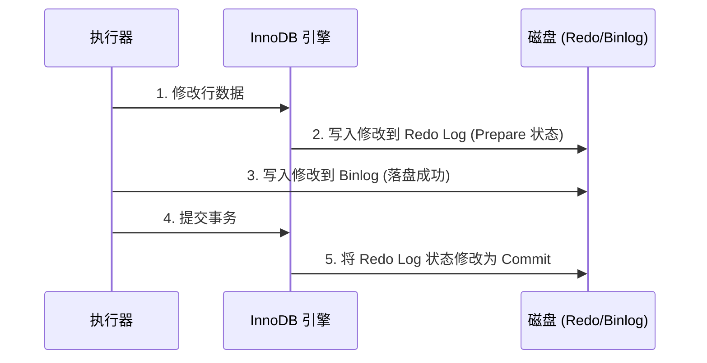
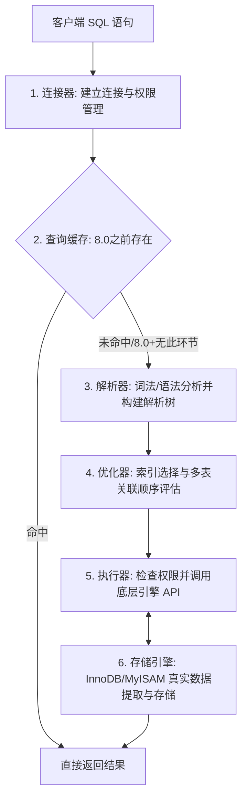

# 1. MySQL 特训指南（袁志刚专属版）

本指南结合您简历中 **“苍穹外卖订单流转条件更新（乐观锁）”**、**“支付回调唯一约束幂等表设计”** 和 **“秒杀高并发减库存防超卖”** 场景进行深度定制。理解 MySQL 底层锁机制、事务隔离（MVCC）与索引调优直接决定了在高并发瞬时流量下数据库能否顶住压力且保证数据绝对准确。

**建议阅读顺序**：先读"前置概念速查" → 再读"核心考点详解" → 最后读"简历亮点关联"，届时你会发现所有技术细节都有了依托。

---

## 🔑 前置基础概念速查（必读，5 分钟建立认知底座）

在深入数据库底层之前，先把下面这几个概念理解清楚，后文所有分析都建立在这些基础上。

| 概念 | 一句话解释 |
|------|-----------|
| **InnoDB vs MyISAM** | **InnoDB**是MySQL当前默认引擎，支持事务、行锁和外键，具备 Crash-Safe 能力；**MyISAM**不支持事务，仅支持表锁，不支持外键，常用于只读或报表分析。 |
| **聚簇 vs 非聚簇索引** | **聚簇索引**（Clustered）的叶子节点直接存放整行数据记录（索引即数据）；**非聚簇索引**（Secondary）的叶子节点只存放索引键和主键值，需要回表。 |
| **回表（Lookup）** | 先通过辅助索引查到对应记录的主键，再使用该主键去聚簇索引中二次检索出整行数据记录的过程，会产生额外的随机磁盘 I/O。 |
| **覆盖索引（Covering）** | 一个查询中，需要的全部列直接在辅助索引中就能完全获取（EXPLAIN 中的 Extra 显示 `Using index`），无需再回表去聚簇索引查询，效率极高。 |
| **WAL 机制（写前日志）** | **Write-Ahead Logging**。InnoDB 对数据的任何修改都是先写到内存的 Log Buffer 并刷写重做日志（Redo Log）落盘，最后才慢慢异步刷脏页到磁盘，以此换取极高的写吞吐。 |

---

## 🚀 第一优先级核心考点详解（MVCC、B+树、崩溃日志、锁机制与 SQL 执行流程）

### 一、 InnoDB 事务隔离级别与 MVCC (Multi-Version Concurrency Control)
MVCC 实现了“读写不冲突”，即在读取数据时不用加任何锁，极大地提升了数据库的读写吞吐率。

#### 1. 隔离级别与幻读解决
*   InnoDB 默认的隔离级别是 **可重复读 (Repeatable Read, RR)**。
*   传统的数据库在 RR 隔离级别下无法解决“幻读”问题，但 MySQL InnoDB 通过 **MVCC 机制（解决快照读下的幻读）** 和 **Next-Key Locks（临键锁，解决当前读下的幻读）** 完美解决了幻读。

#### 2. MVCC 的三大基石底层原理
1.  **隐藏列字段**：
    *   `DB_TRX_ID`：最近修改（插入/更新）此行记录的事务 ID。
    *   `DB_ROLL_PTR`：回滚指针，指向写入 `undo log` 的上一个旧版本记录，将整行记录的所有历史版本串联成一个**版本链**。
    *   `DB_ROW_ID`：如果表没有主键，InnoDB 自动生成的隐藏自增主键。
2.  **Undo Log (回滚日志) 版本链**：
    *   当一个事务修改某行数据时，InnoDB 会先把原数据拷贝到 undo log 中。然后修改当前行，并将当前行的 `DB_ROLL_PTR` 指向刚拷贝到 undo log 的旧记录。
3.  **ReadView (一致性视图)**：
    *   事务在进行 **快照读 (Snapshot Read，即普通 SELECT)** 时生成的内存数据结构。它包含 4 个核心字段：
        *   `m_ids`：在生成 ReadView 那一刻，系统里所有**活跃且未提交**的事务 ID 列表。
        *   `min_trx_id`：`m_ids` 里的最小值（最老的未提交事务 ID）。
        *   `max_trx_id`：系统预分配给下一个事务的 ID（当前最大事务 ID + 1）。
        *   `creator_trx_id`：创建这个 ReadView 的当前事务 ID。

#### 3. 可见性比对算法
当事务尝试读取版本链中的某条记录（其事务 ID 为 `trx_id`）时，会按如下规则判断该记录是否可见：
1.  如果 `trx_id == creator_trx_id`：说明是自己修改的，**可见**。
2.  如果 `trx_id < min_trx_id`：说明在生成 ReadView 之前，该事务已经提交，**可见**。
3.  如果 `trx_id >= max_trx_id`：说明是在生成 ReadView 之后才开启的事务，**不可见**。
4.  如果 `min_trx_id <= trx_id < max_trx_id`：
    *   如果在 `m_ids` 列表中：说明生成 ReadView 时该事务尚未提交，**不可见**。
    *   如果不在 `m_ids` 列表中：说明生成 ReadView 时该事务已经提交，**可见**。
*   如果判定为不可见，则顺着 `DB_ROLL_PTR` 指针在 undo log 中查找上一个版本继续判断，直到找到可见版本或返回空。

#### 4. RC 隔离级别与 RR 隔离级别的根本区别
*   **读已提交 (RC)**：在事务中，**每次普通 SELECT 时都会重新生成一个新的 ReadView**。因此能看到其他事务刚提交的新数据，发生了“不可重复读”。
*   **可重复读 (RR)**：只在事务中**第一次普通 SELECT 时生成一个 ReadView**，后续所有的 SELECT 均复用这同一个 ReadView，这天然保证了在同一个事务内多次读取结果绝对一致。

---

### 二、 B+ 树索引结构与大厂 SQL 优化最佳实践

#### 1. 为什么 MySQL 选用 B+ 树而不是 B 树、二叉树或红黑树？
1.  **相比二叉树 / 红黑树**：当数据量达到千万级时，二叉树/红黑树的树高极高，而数据库索引是存储在磁盘上的，树太高会导致极其高昂的随机磁盘 I/O 次数。
2.  **相比 B 树（B-Tree）**：
    *   B 树的每一个节点（包括非叶子节点）都同时存储了 Key 和 Data（整行记录数据）。这导致每个节点占用的空间极大，单页（默认 16KB）能容纳的索引数量严重缩水，树的高度会变高。
    *   **B+ 树的优势**：
        1.  **非叶子节点极度精简**：非叶子节点只存储 Key，不存储 Data。这使得一个 16KB 的节点页面能容纳上千个索引键，树的高度被极度压缩在 3~4 层，千万级的数据检索也仅需 3~4 次磁盘 I/O。
        2.  **聚簇与叶子节点双向链表**：所有真实数据均保存在叶子节点。并且，叶子节点之间通过双向链表横向相连。这在进行范围查询（如 `WHERE id BETWEEN 10 AND 50`）时，只需定位到 10，然后顺着叶子节点的链表向后遍历即可，而 B 树必须多次回溯树节点，效率底下。

#### 2. 最左匹配原则与索引失效大厂生产避坑
在高频秒杀和复杂订单查询中，误写 SQL 会导致索引瞬间失效，触发全表扫描直接拖死数据库。
*   **最左匹配原则**：如果建立了联合索引 `(a, b, c)`，MySQL 会首先对 `a` 进行排序，在 `a` 相同的情况下对 `b` 排序，依次类推。因此，查询条件必须包含最左前缀：
    *   `WHERE a = 1 AND b = 2` （走索引，与顺序无关，优化器会自动调整）。
    *   `WHERE b = 2 AND c = 3` （**索引失效**，因为没有最左前缀 `a`）。
    *   `WHERE a = 1 AND b > 2 AND c = 3` （`a` 和 `b` 走索引，因为 `b` 范围查询，导致联合索引右侧的 `c` **无法走索引**）。
*   **大厂高频索引失效 4 大坑**：
    1.  **对索引列进行函数或表达式计算**：`WHERE YEAR(create_time) = 2026`（失效，应改为 `WHERE create_time BETWEEN ...`）。
    2.  **隐式类型转换**：如果 `phone` 字段是 `varchar`，但写成了 `WHERE phone = 17731930675`（失效！因为数值型会强迫 MySQL 调用 `CAST` 函数隐式转换，彻底摧毁索引）。
    3.  **模糊查询 `%` 放在最前面**：`WHERE name LIKE '%刚'`（失效；而 `WHERE name LIKE '袁%'` 依然走索引）。
    4.  **OR 连接非索引列**：`WHERE a = 1 OR d = 5`（如果 `d` 不是索引列，会导致 `a` 索引也直接失效）。

---

### 三、 MySQL 三大日志与崩溃恢复 Crash-Safe
MySQL 的高可用性和事务持久性（D）与一致性（C）完全依赖于它的日志系统。

*   **Redo Log (重做日志)**：
    *   **角色**：InnoDB 存储引擎层。
    *   **作用**：保证事务的**持久性**。在写数据时采用 **WAL (Write-Ahead Logging)** 机制：先把修改写入内存的 Redo Log Buffer，并以追加写的方式落入磁盘的 Redo Log 文件，最后才慢慢异步把脏页刷回磁盘。如果系统崩溃，JVM 重启后能根据磁盘 Redo Log 重新执行已提交事务的修改，实现 **Crash-Safe**。
*   **Undo Log (回滚日志)**：
    *   **角色**：InnoDB 存储引擎层。
    *   **作用**：保证事务的**原子性**，是实现回滚和 MVCC 的底座。
*   **Binlog (归档日志)**：
    *   **角色**：MySQL Server（服务）层。
    *   **作用**：用于**主从复制**和数据恢复归档。

#### 1. 二阶段提交机制 (Two-Phase Commit)
为了防止在写磁盘过程中突然停电或崩溃，导致 `redo log` 与 `binlog` 数据不一致（进而引发主从复制数据不一致，主库有数据从库无数据），MySQL 强制采用**二阶段提交**：

*   **崩溃恢复判断逻辑**：
    1.  如果在步骤 2 写入 Prepare 状态后崩溃：binlog 还未写入。崩溃恢复时，发现该事务只有 prepare 标志没有 commit，直接**回滚**。
    2.  如果在步骤 3 写入 Binlog 后，在步骤 5 前崩溃：崩溃恢复时，发现虽然 redo log 是 prepare 状态，但 **binlog 已经完整落盘**。此时，虚拟机会判定该事务有效，**强制提交**，从而保证了主从库数据绝对一致。

---

### 四、 MySQL 锁机制专题（表锁、行锁、间隙锁与意向锁）

MySQL 锁机制是数据库在高并发下保证数据正确性及实现事务隔离的最根本技术支持。

#### 1. 锁粒度分类
*   **表级锁 (Table Lock)**：锁定整张表。开销极小，加锁极快；不会出现死锁；但锁定粒度最大，锁冲突概率最高，并发吞吐量最低（常用于 DDL 操作如 ALTER TABLE）。
*   **行级锁 (Row Lock)**：由 InnoDB 引擎提供，锁定单行记录。开销大，加锁慢；**会出现死锁**；锁定粒度最小，冲突概率最低，高并发吞吐能力极强。

#### 2. 意向锁 (Intention Lock)
意向锁是 **表级锁**，包括 **意向共享锁 (IS)** 和 **意向排他锁 (IX)**。
*   **机制**：当事务尝试给某行数据加行级 S 锁时，必须先在表上加上 IS 锁；想要加行级 X 锁时，必须先在表上加上 IX 锁。
*   **核心作用**：**极大提升表锁的判定效率**。当另一个事务想要给全表加表级排他锁（X 锁）时，它不需要去一行行扫描这几百万条记录看有没有哪行被锁住，而是直接检查这张表上有没有挂着 IX 锁。如果有，直接被挂起进入等待，从而将锁判定复杂度从 $O(N)$ 降低为 **$O(1)$**。

#### 3. InnoDB 行锁算法（RR 下的幻读克星）
在可重复读（RR）隔离级别下，InnoDB 主要使用以下三种行锁算法来锁定数据，彻底剿灭幻读：
1.  **记录锁 (Record Lock)**：
    *   仅锁定**单行记录本身**。
    *   例如：`SELECT * FROM t WHERE id = 1 FOR UPDATE`（如果 id 是唯一索引/主键，且值为 1 的记录确实存在）。
2.  **间隙锁 (Gap Lock)**：
    *   锁定记录之间的**间隙（开区间）**，不包含记录本身。其唯一目的是**防止幻读（防止其他事务在间隙中插入新数据）**。
    *   例如：`SELECT * FROM t WHERE id BETWEEN 5 AND 10 FOR UPDATE`。如果表中只有 id = 5 和 10 的记录，间隙锁会死死锁住 `(5, 10)` 之间的这片虚无空间，任何在这个范围内执行 `INSERT` 的新事务都会被直接挂起挂起。
3.  **临键锁 (Next-Key Lock)**：
    *   **记录锁与间隙锁的组合**。它锁定记录本身以及该记录前面的所有间隙（左开右闭区间，如 `(5, 10]`）。
    *   **InnoDB 默认的行锁算法就是临键锁**。

---

### 五、 SQL 执行流程全面解析

当我们在客户端敲下一行 SQL 命令并回车时，MySQL 在底层内部经历了一套非常精密的流水线协作：

1.  **连接器 (Connector)**：负责跟客户端建立连接、进行账号密码及 IP 的安全验证、获取该用户的特定操作权限，并负责维护和管理连接池（防止连接空闲超时）。
2.  **查询缓存 (Query Cache)**：MySQL 8.0 之前，执行器会先拿着 SQL 字符串作为 Key 去内存的缓存中碰运气。但因为只要表有一条数据发生更新，整个表的全部缓存就会被瞬间清空，这对于高并发系统极其鸡肋。因此，**在 MySQL 8.0 版本中，查询缓存已被彻底移除**。
3.  **解析器 (Parser)**：
    *   **词法分析**：将 SQL 语句拆解成一个个词素（如将 `select` 识别为查询命令，`orders` 识别为表名）。
    *   **语法分析**：根据语法规则校验 SQL 拼写是否正确，最终构建出一棵 **AST (抽象语法树)**。
4.  **优化器 (Optimizer)**：对 SQL 进行智力分析。在表有多个索引时，决定使用哪个最优索引；或者在多表关联（Join）时，决定各表的读取先后顺序，从而为执行器制订出效率最高的**执行计划**。
5.  **执行器 (Executor)**：首先检查该用户对表有没有执行该 SQL 的操作权限。如果有，根据优化器给出的执行计划，循环调用底层存储引擎提供的 API 接口提取数据，并把数据组装返回给客户端。
6.  **存储引擎 (Storage Engine)**：数据的真实管理者，负责将数据写入磁盘或在内存缓存（Buffer Pool）中读写。最常用的是 InnoDB，优化器生成的执行计划最终完全交由存储引擎的接口执行。

---

## 🎯 简历亮点深度关联与大厂面试预测

### 1. 订单状态机条件更新与【MySQL 隐式锁与写写冲突】
*   **面试官切入点**：
    > “你在苍穹外卖中提到了通过‘条件更新（SQL 乐观锁）实现订单并发原子写’。请问，当并发线程同时执行 `UPDATE orders SET status = 'CANCELLED' WHERE id = 123 AND status = 'PENDING'` 这条 SQL 时，在 MySQL 数据库底层发生了什么？它是如何保证不会把同一个订单取消两次的？”
*   **袁志刚专属特训回答模版**：
    1.  **行级排他锁 (X 锁) 的加锁机制**：虽然我们在 Java 层用的是乐观锁的思想（不显式加悲观锁），但在 MySQL InnoDB 引擎中，执行任何写操作（`UPDATE`/`DELETE`/`INSERT`）时，都会自动对被修改的行加 **排他锁（X 锁，又称独占锁/写锁）**。
    2.  **并发执行序列化**：当线程 A 和线程 B 同时更新 `id = 123` 的订单时，MySQL 锁管理器会强行让它们排队。假设线程 A 先抢占到行级排他锁，线程 B 就会被挂起并进入锁等待状态。
    3.  **条件过滤拦截**：线程 A 抢到锁后，成功将 `status` 更新为 `'CANCELLED'`，事务提交，释放 X 锁。接着，线程 B 被唤醒并抢到 X 锁。此时，由于我们在 SQL 过滤条件中严格限制了 `WHERE status = 'PENDING'`，而此时该行记录在内存/磁盘中已经变成了 `'CANCELLED'`。因此，线程 B 的 SQL 匹配行数为 0，影响行数 `rows = 0`。业务层检测到影响行数为 0 时判定为更新冲突或重复处理，直接拦截，从而保证了订单状态机流转的原子性与绝对安全。

### 2. 支付回调幂等表与【B+ 树唯一索引秒杀级检索】
*   **面试官切入点**：
    > “在支付保障部分，你设计了‘支付回调记录表 + 唯一约束’方案来拦截重复回调，确保支付幂等性。为什么这能起到拦截作用？数据库的唯一索引底层是如何实现的？在高并发回调涌入时，会不会拖慢数据库性能？”
*   **袁志刚专属特训回答模版**：
    1.  **唯一索引强拦截**：支付平台（如微信）在网络超时时会重复发送回调。我们设计了以“商户订单号 `out_trade_no`”作为**唯一索引 (Unique Index)** 的回调记录表。高并发重复请求到达时，并发事务执行 `INSERT` 操作，后到达的事务在写入时，数据库底层会立即检测唯一索引冲突，抛出 `DuplicateKeyException`（MySQL 错误码 1062）。我们在 Java 层捕获该异常，判定为已处理，直接对微信响应“SUCCESS”，完美拦截了重复支付逻辑。
    2.  **B+ 树的 O(log N) 级快速检索**：唯一索引在底层是通过 **B+ 树** 实现的。当插入新纪录时，MySQL 必须先检索这棵 B+ 树以验证该键值是否已存在。由于 B+ 树的“高度”极矮胖（通常 3~4 层就能存储千万级数据），查找定位仅需 3~4 次磁盘 I/O。
    3.  **高并发下的 Buffer Pool 与唯一索引写入调优**：
        *   普通索引插入可以利用 **Change Buffer（写缓冲区）**：插入时如果数据页不在内存中，先记录在 Change Buffer 中，等读入数据页时再 merge，避免了随机磁盘 I/O，性能极高。
        *   **唯一索引无法利用 Change Buffer**：因为唯一索引插入时**必须保证唯一性**，这就强制要求必须把对应的数据页读入 **Buffer Pool（缓冲池）** 中进行查重。在高并发写入下，这会带来一定的随机磁盘 I/O 压力。
        *   *优化*：我们通过提前对数据库分配充足的 `innodb_buffer_pool_size`（通常是服务器物理内存的 60%~80%），让绝大多数数据页常驻内存，使唯一性检查完全在内存中完成，从而保障了秒杀级的高吞吐写入性能。

---

## 🛠️ 第二优先级核心考点详解（慢 SQL 调优与 EXPLAIN 执行计划）

### 一、 大厂慢 SQL 调优硬核诊断步骤
1.  **定位慢 SQL**：生产环境开启 `slow_query_log`（慢查询日志），并设置阈值（如超过 1s 记录），通过 `mysqldumpslow` 聚合分析慢日志，或者通过监控系统直接告警。
2.  **EXPLAIN 分析执行计划**：在慢 SQL 前加上 `EXPLAIN` 并运行。
3.  **核心关注字段解析**：
    *   **`type` (访问类型)**：这是衡量 SQL 性能的最关键指标。性能从优到劣依次为：
        *   `system` > `const` (唯一索引等值查询) > `eq_ref` (外键唯一索引联表) > `ref` (非唯一索引等值) > `range` (索引范围扫描) > `index` (全索引树扫描) > `ALL` (全表扫描)。
        *   **大厂底线**：生产环境 SQL 的访问类型**至少要达到 `range` 级别**，杜绝出现 `ALL` 或 `index`。
    *   **`possible_keys`**：可能用到的索引。
    *   **`key`**：实际上用到的索引。如果是 `NULL` 说明没走索引，立刻安排优化。
    *   **`key_len`**：实际使用索引的字节长度，常用于评估联合索引的匹配深度。
    *   **`rows`**：预计要扫描的行数。数值越小越好。
    *   **`Extra` (额外信息)**：
        *   `Using index`：**覆盖索引**（完美，无需回表）。
        *   `Using filesort`：**文件排序**（致命大坑！说明无法利用索引排序，必须在内存或临时磁盘中进行外部排序，急需优化）。
        *   `Using temporary`：**使用临时表**（致命大坑！常发生于 `GROUP BY` 或 `DISTINCT` 没走索引，极度损耗内存和性能）。
        *   `Using index condition`：**索引下推 (ICP)**（优秀，在存储引擎层提前过滤数据，减少回表与 Server 层过滤压力）。
