# 2. Redis 特训指南（极简源码速成版）

本指南专为快速吃透 **黑马点评 Caffeine + Redis 二级缓存抗压**、**逻辑过期异步重建防击穿**、**一人一单 Lua 脚本原子校验** 以及 **Redisson 看门狗分布式锁** 等高并发核心场景中的 Redis 考点而设计。杜绝大段铺垫，采用 **Why - What - How - Deep** 四步直达底层源码与物理页分配，帮助您在面试中反客为主，化被动为主动。

---

## 🚀 核心概念极简拆解

*   **简单动态字符串 (Simple Dynamic String, SDS)**
    *   **Why**：传统的 C 语言字符串以 `\0` 结尾，获取长度需要 $O(N)$ 遍历，且容易发生缓冲区溢出，无法安全存储包含二进制字符的图片或音频字节流。
    *   **What/Deep**：Redis 自研的底层 String 存储结构。包含已用长度 `len`、分配容量 `alloc` 及字节数组 `buf[]`。支持 $O(1)$ 获取长度，杜绝溢出，内存预分配且二进制安全。
*   **压缩列表 (ZipList)**
    *   **Why**：普通的双向链表每个节点都需要存储指向 `prev` 和 `next` 的指针，高频小对象存储下，指针占用的多余内存开销极大，且内存碎片严重。
    *   **What/Deep**：一种由连续物理内存块组成的顺序型双端数据结构。节点紧凑排列，完全没有指针开销，对 CPU 缓存（局部性原理）极其友好。
*   **紧凑列表 (Listpack)**
    *   **Why**：ZipList 虽然节省内存，但其内部每个节点记录了前驱节点长度（`prevlen`）。当修改某个节点导致长度膨胀时，会触发灾难性的**“连锁更新（Cascade Update）”**，导致内存高频拷贝。
    *   **What/Deep**：Redis 7.0 全面平替 ZipList 的新结构。每个节点**不再记录前一个节点的长度**，只记录当前节点的自身长度。彻底从物理上终结了连锁更新性能雪崩。
*   **跳表 (SkipList)**
    *   **Why**：需要以接近平衡树 $O(\log N)$ 的极速定位并维护一个有序集合，但红黑树在进行范围查询时需要多级回溯节点，开销极大且实现复杂。
    *   **What/Deep**：多层级稀疏索引构成的双向链表。检索时间复杂度为 $O(\log N)$，对范围查询支持极佳，查找后可退化为普通双向链表顺序遍历，效率极高。

---

## 🚀 ZSet 跳表稀疏索引骨架

在面试中，对于高频考点 ZSet，您可以通过下图快速呈现跳表（SkipList）通过多级稀疏“跨越”索引实现 $O(\log N)$ 二分查找检索的精美原理：

```mermaid
gantt
    title ZSet 跳表稀疏索引查找逻辑图
    dateFormat X
    axisFormat %s

    section Level 3 稀疏层
    定位元素 1 (Score: 10) :active, 0, 10
    定位元素 3 (Score: 50) :active, 10, 50

    section Level 2 中间层
    元素 1 (10) :10, 10
    元素 2 (30) :active, 10, 30
    元素 3 (50) :50, 50

    section Level 1 双向链表
    元素 1 : 10, 10
    元素 2 : 30, 30
    元素 3 : 50, 50
    元素 4 (Score: 70) :active, 50, 70
```



---

## 🎯 第一优先级核心考点详解

### 一、 Redis 单线程极速与 epoll 网络事件驱动机制 (Why-What-How-Deep)

*   **Why（为什么 Redis 单线程还能狂卷 10W+ QPS？）**
    *   **痛点**：传统的 Java 后端采用多线程模式。在高并发瞬时流量下，多线程会带来极其昂贵的**线程上下文切换开销**（CPU 忙于陷入内核态保存寄存器），且面临复杂的并发锁竞争与内存碎片。
    *   **解决**：Redis 纯内存操作消除磁盘 I/O 瓶颈，并采用极轻量的单线程模型彻底屏蔽了上下文切换和死锁，凭借 epoll 机制实现超高吞吐。
*   **What（单线程模型核心组件）**
    *   Redis 虽指其**执行命令的主线程是单线程的**，但其底层通过 **I/O 多路复用器（基于 epoll）** 并发监听上万个套接字，并将活跃就绪事件打包推送进单线程事件循环中依次消化。
*   **How（epoll 轮询与单线程执行流程）**
    *   *简历实战引用*：在我们的秒杀减库存中，Redis 单线程作为绝对的流量闸口，一秒消化数万并发，彻底杜绝了并发超卖。[👉 点击跳转简历场景二](#场景二秒杀库存预扣减与redis--lua-脚本原子性校验)
*   **Deep（深入源码：aeEventLoop 网络事件大循环机制剖析）**
    *   **网络事件循环 `aeEventLoop` 源码奥秘**：
        *   Redis 启动时，其主线程会陷入一个无休止的死循环中，这个循环的调度核心就是 **`aeMain()`**。
        *   在每次循环内部，主线程会调用 **`aeProcessEvents()`** 执行网络事件分发：
            1.  **epoll_wait 系统调用**：主线程非阻塞地调用操作系统内核的 `epoll_wait`，以 **$O(1)$ 的时间复杂度** 一键拉取当前内核 `rdllist` 中已经有数据写入、准备就绪的 Socket FD 集合。
            2.  **事件分发器 (File Event Dispatcher)**：事件分发器会将这一组就绪 FD，根据其就绪类型（可读/可写），与 Redis 预先注册好的事件处理器（如连接应答处理器 `acceptCommonHandler`、命令请求处理器 `readQueryFromClient`）进行高速绑定映射。
            3.  **单线程队列消化**：绑定的命令（如 `SET`、`GET`）会被塞入一个无锁单线程队列中。Redis 主线程会依次极速执行这些内存命令，再把结果非阻塞写入网络缓冲区。由于没有线程上下文切换，这一套流水线跑出了极致吞吐。

---

### 二、 底层数据结构设计与 ZipList 连锁更新大厂神级避坑 (Why-What-How-Deep)

*   **Why（为什么 ZSet 选用跳表而不是红黑树？）**
    *   **B树/红黑树劣势**：红黑树在执行范围查询（如 `ZRANGEBYSCORE`）时，由于节点是树状分布的，检索完一个节点后，必须向上回溯到父节点再向下检索子节点。这种频繁的回溯在内存中寻址慢，且红黑树在节点分裂调整时平衡逻辑极复杂。
    *   **跳表优势**：跳表查找定位到首个节点后，直接退化为底层的**普通双向链表进行顺序遍历**，没有任何回溯开销，执行范围查询速度降维打击红黑树，且实现简单，支持并发修改。
*   **What（ZSet 底层数据结构的动态切换）**
    *   当 ZSet 存储的元素数量较少（默认 < 128 个且每个元素值 < 64 字节）时，底层采用物理内存连续的 **ZipList（压缩列表）** 以极限压榨内存空间。
    *   一旦超出此阈值，为了防止连续大块内存分配困难，自动转化为 **SkipList（跳表） + Dict（哈希表）**。
*   **How（大厂面试高难度考点：ZipList 连锁更新性能雪崩）**
    *   *连锁更新成因*：ZipList 每一个节点通过 `prevlen` 记录前驱节点的大小。若前驱节点 < 254 字节，`prevlen` 占用 1 字节；若前驱 $\ge 254$ 字节，`prevlen` 强行膨胀为 5 字节。
    *   *灾难情景*：如果 ZipList 中有一排连续长度为 253 字节的节点。此时如果我们把首个节点修改并膨胀为 254 字节：
        1.  第二个节点的 `prevlen` 必须从 1 字节强行扩展到 5 字节，这导致第二个节点整体长度变为 257 字节。
        2.  第二个节点的膨胀，强迫第三个节点的 `prevlen` 也必须跟着从 1 字节膨胀到 5 字节。
        3.  这一波动像多米诺骨牌一样顺着连续内存**发生惨烈地往后连锁更新**。每次膨胀都伴随着操作系统对该连续物理内存页的**重新分配与高频硬拷贝**，直接将 Redis 主线程卡死挂起。
*   **Deep（深入 Redis 7.0 源码：Listpack 终极自愈方案）**
    *   为了彻底根除 ZipList 的连锁更新先天缺陷，Redis 7.0 在底层彻底弃用了 ZipList，全面引入了 **Listpack（紧凑列表）**。
    *   **Listpack 巧妙设计**：每个节点中，**完全剔除了 `prevlen` 字段**。每个节点内部只记录 `element-len`（**当前节点自身的长度**），并把这个长度信息写在节点的**末尾**。
    *   **反向遍历实现**：当需要从尾部向前遍历时，Redis 只需读取当前节点末尾的长度值，即可准确计算出当前节点占用的物理字节数，进而将指针拨回前一个节点的末尾。由于节点之间互不记录前驱长度，对任意节点的修改和膨胀**绝对不会引发连锁更新**，彻底扫清了内存型锁死隐患！

---

### 三、 Redis 集群架构拓扑演进与主从 Psync 同步机理 (Why-What-How-Deep)

*   **Why（为什么演进出 Redis Cluster 无中心化架构？）**
    *   **主从复制痛点**：主节点宕机后必须人工切主，写吞吐受限于单机主节点物理瓶颈。
    *   **哨兵模式缺陷**：自动故障转移，但由于每个节点都保存全量数据，依然受限于单机物理内存上限，无法横向扩容。
    *   **Cluster 优势**：通过虚拟哈希槽（16384 个 Slot）将数据切片分摊到各主节点，支持 PB 级内存的横向弹性扩展。
*   **What（主从复制两大判定要素）**
    *   主从同步依靠两个核心标识完成：
        1.  `Replication ID (runID)`：主库的唯一运行时标识。
        2.  `Offset (偏移量)`：主从各自记录的已同步字节流大小。
*   **How（故障专题：脑裂丢失数据自愈）**
    *   当哨兵因网络抖动误判主节点下线并切主，而原主节点依然接收客户端写入，在网络恢复后原主降级清空内存，会发生严重的脑裂数据丢失。[👉 点击跳转配置防范](#脑裂解决方案防范大厂数据丢失)
*   **Deep（深入源码：增量同步 Psync 与环形缓冲区 Repl-Backlog-Buffer 溢出崩溃灾难）**
    *   **Psync 增量同步判定源码级逻辑**：
        *   当从库由于网络中断重连主库时，会向主库发送 `PSYNC <runID> <offset>` 请求增量同步。
        *   主库接收请求，会执行两个严苛判断：
            1.  传入的 `runID` 是否与当前主库的 `runID` 完全一致？
            2.  传入的 `offset` 偏移量是否依然保存在主库的 **`repl-backlog-buffer`（环形积压缓冲区）** 范围之内？
            *   👉 **以上皆满足，主库只需将缓冲区中两库 offset 差值间的数据增量发给从库即可，开销极低。**
    *   **大厂级生产崩溃隐患：环形积压缓冲区溢出退化全量同步**：
        *   **成因剖析**：`repl-backlog-buffer` 是一个大小固定（默认仅 1MB）的**环形覆盖缓冲区**。如果高并发写入极为激烈，或者从库断线时间偏长。
        *   新写入的字节流会迅速填满这 1MB 空间，并将环形缓冲区中较老的数据**直接覆盖**。
        *   **后果**：当从库重连发送 offset 时，主库发现该 offset 对应的数据已被无情覆盖，**增量同步（Psync）宣告彻底失败**。
        *   为了同步数据，主库被迫将 Psync **降级为高昂的全量同步（Sync）**：主库调用 `fork` 开启子进程，生成全量 `dump.rdb` 文件（引发写时复制磁盘 I/O 阻塞），再通过网络将数 GB 的文件传给从库。在传输期间主库的高频写会导致从库再次落后，极易引发“全量同步 -> 再次断线 -> 再次全量”的死循环级**网络与磁盘 I/O 瘫痪事故**。
        *   **大厂调优规范**：在高并发重写表场景下，**必须强制调大 `repl-backlog-size` 参数**（建议根据压测估算，设置为 100MB 甚至 500MB），确保哪怕从库断开 10 分钟，其 offset 依然处于环形缓冲区安全边界内，死守增量同步防线！

---

## 🎯 简历亮点深度关联与对线场景 (Why-What-How)

### 场景一：Caffeine + Redis 二级缓存与【逻辑过期异步重建防击穿】

**面试官切入点**：
> “在黑马点评中，你构建了多级缓存抗压架构。面对高并发压测，如果遭遇突发的热点缓存击穿（如商铺缓存到期的一瞬间有十万并发涌入），你是如何保证数据库不崩溃的？‘逻辑过期’为什么能实现无锁、低延迟防击穿？”

**回答思路 (Why-What-How 拆解)**：
*   **Why**：普通的缓存过期（物理 TTL 到期）在面对突发热点 Key 失效时，数十万并发流量会瞬间击穿缓存直冲 MySQL 数据库，瞬间导致数据库 CPU 100% 并瘫痪。普通的 `SETNX` 互斥锁会让大量并发线程在 Java 层自旋挂起，导致平均耗时（Latency）发生毁灭性陡增。
*   **What/How**：
    我们自研了 **逻辑过期异步重建** 方案。物理上在 Redis 中将热点商铺 Key **设置为永久不过期**，但在商铺的 JSON 报文中额外包装一个 `expireTime` 逻辑过期时间字段。
*   **Deep（完整的非阻塞低延迟实现源码）**：
    *   在读取商铺时，线程读取逻辑时间发现已过期。此时，该线程尝试调用 `SETNX` 去抢占一个极轻量的分布式锁 `lock:shop:id`：
        1.  **抢锁成功（仅 1 个线程）**：该线程不仅不阻塞，而且**立即启动一个独立的后台线程池任务**，去数据库查询最新的商铺数据，写回 Redis 并重置逻辑过期时间，随后释放锁。
        2.  **抢锁失败（其余所有 99,999 个线程）**：这些线程**完全不需要任何自旋等待**，它们做出了最优雅的决策——**直接无锁返回当前 Redis 中已过期的旧商铺数据**。
    *   这一设计实现了极高的读写隔离。虽然有极短暂的“弱一致性”（部分用户看到旧数据），但在十万并发压测下，核心接口的**平均响应耗时始终保持在个位数毫秒级，且 MySQL 数据库承受的写入压力恒定为 1 次**，完美扛住了击穿洪峰！[👉 异步重建客户端源码实现(file:///C:/Users/Ethan/.gemini/antigravity-ide/brain/bbf709bf-9766-4011-9ff0-0621b37bd21c/walkthrough.md)已在演示文档归档]

---

### 场景二：秒杀库存预扣减与【Redis + Lua 脚本原子性校验】

**面试官切入点**：
> “在高并发秒杀中，你是如何防止超卖和保障‘一人一单’的？为什么必须要用 Redis + Lua 脚本？普通的 Redis 事务或者 Java 加锁行不行？”

**回答思路 (Why-What-How-Deep 拆解)**：
*   **Why**：一人一单包含“校验用户购买状态”与“预扣减库存”多步操作。如果多步操作在 Java 层串行执行，在高并发下，两个线程同时查到用户未下单，随后同时去扣减库存，就会发生超卖与多单，破坏业务逻辑。
*   **What/How**：
    我们直接抛弃了单机局限的 Java `ReentrantLock`（多实例部署下失效且性能差），通过自研 **Redis + Lua 脚本** 实现了内存级的强原子性校验拦截。
*   **Deep（Lua 脚本原子性本质）**：
    *   由于 Redis 底层采用**单线程执行模型**，任何发送给 Redis 的 Lua 脚本都会被作为一个**不可分割的整体命令（Atomicity）**排队执行。在 Lua 执行期间，其余任何并发读写命令都会被强制挂起等待，绝不允许插队。
    *   我们在 Lua 脚本中编写的逻辑是：先执行 `SISMEMBER` 判定用户是否在秒杀成功的 Set 集合中。如果在，立即返回错误码表示重复下单；如果不在，接着执行 `DECR` 扣减库存，若扣减后 `stock >= 0`，则执行 `SADD` 将用户扔入成功集，最终返回 1 确认预扣减成功。
    *   多步判断完全在 Redis 内存中单线程无锁原子执行，将秒杀订单的判定吞吐量拉升到了数万级别，从物理层面彻底掐断了超卖与一人多单！

---

### 场景三：Redisson 分布式锁与【Hash 数据结构、可重入与看门狗自动续约 Lua】

**面试官切入点**：
> “你在黑马点评中用到了 Redisson 分布式锁进行并发兜底。普通的 `setnx` 实现分布式锁有什么重大缺陷？Redisson 的锁底层使用的是什么数据结构？它的‘看门狗 (Watch Dog)’机制和‘可重入’是如何实现的？”

**回答思路 (Why-What-How-Deep 拆解)**：
*   **Why**：普通的 `setnx` 锁存在两个硬伤：一是如果业务执行因 GC 发生停顿，导致锁超过物理 TTL 提前自动释放，引发并发写冲突；二是无法支持重入加锁，极易在递归调用或 AOP 切面嵌套时发生死锁。
*   **What/How**：
    我们引入了 **Redisson** 框架。它弃用了 String 结构，在底层完全基于 Redis 的 **Hash 结构** 实现了类似 `ReentrantLock` 的分布式高可用锁。
*   **Deep（可重入与看门狗 Lua 源码级揭秘）**：
    *   **Hash 锁结构**：锁的 Key 是锁名称，Hash 的 `Field` 是持有锁的线程唯一标识 `UUID + threadId`，`Value` 是**锁的可重入计数（Counter）**。
    *   **可重入 Lua 实现**：当持有锁的线程再次尝试获取同一把锁时，Redisson 发送的 Lua 脚本会校验 Field。如果一致，直接执行 `hincrby lockKey threadID 1`，将重入计数加 1，并重置生存时间（默认 30s）。释放锁时计数减 1，直到归零才执行 `DEL` 彻底清除 Key。
    *   **看门狗 (Watch Dog) 续租原理**：若我们未手动指定释放时间，加锁成功后，Redisson 内部会启动一个名为“看门狗”的后台定时调度线程（基于 Netty 的 `HashedWheelTimer` 时间轮）。只要业务未执行完毕，看门狗会**每隔 10s（即 30s 生存期的 1/3）**自动向 Redis 发送 Lua 续期脚本，强制将过期时间**重置为 30s**。如果业务执行完毕，或者 JVM 突然挂掉，看门狗也随之销毁，锁在剩余的 30s 内自动过期，杜绝了死锁发生！

---

### 场景四：延迟订单处理与【ZSet 延迟队列机制】

**面试官切入点**：
> “你提到引入 Redis 延迟队列，将高耗时的订单超时处理与核心支付链路异步解耦。请问你是如何使用 Redis 实现延迟队列的？”

**回答思路 (Why-What-How-Deep 拆解)**：
*   **Why**：在高并发餐饮/电商场景下，用户下单后会有 15 分钟的支付限制。如果采用传统的数据库定时扫描表，高频的全局 `SELECT` 磁盘扫描会拖跨数据库性能。采用 MQ 延迟插件又引入了额外的中间件开销。
*   **What/How**：
    我们直接利用 Redis 的 **ZSet（有序集合）** 结构，构建了极其轻量、高可用的延迟订单取消队列。
*   **Deep（原子弹出与防重复消费）**：
    *   **Score 映射**：我们将“订单取消任务（包含订单号）”作为 ZSet 的成员，将**“订单超时应该取消的时间戳（当前时间 + 15分钟）”**作为该成员的 **Score 分数** 写入 ZSet。
    *   **自适应轮询**：后台消费线程以低开销定时调用 `ZRANGEBYSCORE delayQueue 0 <当前时间戳> LIMIT 0 1`，获取当前已经到期、必须被处理的订单任务。
    *   **原子移除防重复**：在分布式多实例部署下，为了防止多个节点同时捞出同一个超时订单发生重复取消，我们设计了 Lua 脚本：只有成功执行 `ZREM delayQueue member` 移除当前成员的节点，才被判定为“抢占任务成功”，去执行后续取消动作。这样，我们以极低开销实现了分布式的延迟订单消费调度！

---

## 📝 第三优先级：避坑与实战常识

### 一、 脑裂解决方案：防范大厂数据丢失

*   **配置防范硬核原理**：
    为了在网络抖动产生脑裂时，防止原主节点持续接收写入并在同步新主后清空丢失这部分数据，我们必须在 Redis 配置文件中强制调优以下两个指标：
    ```text
    min-replicas-to-write 1   # 1. 强制要求主节点至少拥有 1 个存活的从节点保持连接
    min-replicas-max-lag 10   # 2. 从节点与主节点的复制延迟不能超过 10 秒
    ```
    *   *自愈过程*：一旦发生脑裂断网，原主节点检测到其存活从节点数为 0（< 1），或者延迟瞬间破表，**会立即主动拒绝客户端的一切写请求**。客户端收到报错后触发重试，此时请求会被智能路由到新选举出的主节点上执行，原主未接受新写入，后续降级同步时无任何数据丢失，完美实现了脑裂自愈！

### 二、 BigKey 危害与 UNLINK 异步释放大厂规范

*   **大厂 BigKey 定义标准**：
    *   String 类型的 Value 超过 **10KB**。
    *   Hash、List、Set、ZSet 等容器类型的成员数量超过 **5000** 个。
*   **BigKey 的致命危害成因**：
    *   很多开发习惯使用 `DEL myBigKey` 强行删除大对象。但在 Redis 单线程中，**释放大块物理内存是一个 $O(N)$ 复杂度的慢操作（时间与成员数/大小成正比）**。
    *   如果直接 DEL 一个包含 10 万成员的 ZSet，Redis 会被强制卡死在物理内存释放动作上**长达数秒**。在此期间，所有的网络 epoll 事件全部在队列中堆积，系统 QPS 瞬间归零，直接引发生产级严重事故！
*   **大厂严苛规范解法**：
    1.  **全面封杀 BigKey 写入**：拆分存储，例如将大 Hash 拆分成多个小的 Hash。
    2.  **异步删除平替 DEL（终极救赎）**：在执行删除时，**必须全量使用 `UNLINK myBigKey` 代替 `DEL`**。
        *   *UNLINK 源码机理*：当调用 `UNLINK` 时，Redis 主线程仅仅是把这个 Key 在外部的指针元数据原子性抹去，使其在外部瞬间“隐形不可见”，整个过程只需 1 纳秒，**主线程立刻返回继续服务业务**。而这块大对象物理内存的真正释放动作，会被优雅地委托给后台的**异步惰性线程（Lazy Free Thread）**，在后台慢慢释放回收物理内存，彻底扫清了单线程硬阻塞隐患！
