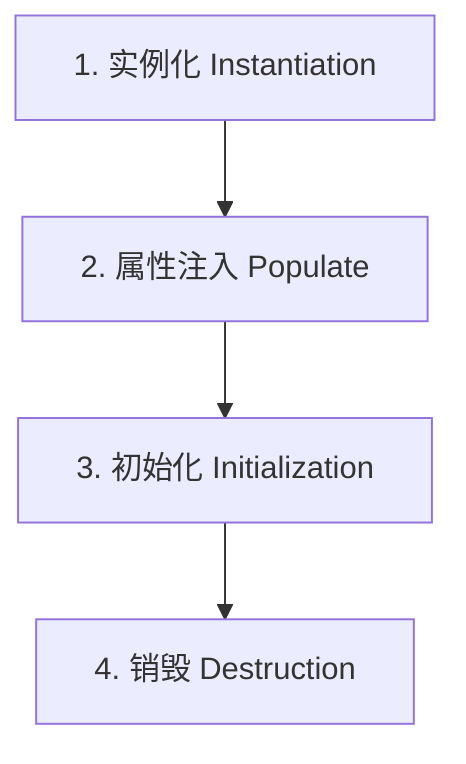

# 1. Spring 与 SpringBoot 特训指南（袁志刚专属版）

本指南结合您简历中 **“Spring AI 自动注入大模型与向量库 Bean”**、**“Advisor 链（AOP 责任链拦截思想）”** 和 **“高并发秒杀环境下分布式锁与数据库事务冲突”** 场景进行深度定制。

---

## 🎯 简历亮点深度关联与大厂面试预测

### 1. 秒杀一人一单分布式锁与【@Transactional 事务冲突引发超卖灾难】
*   **面试官切入点**：
    > “在高并发秒杀一人一单中，我们通常会使用分布式锁来加锁，并使用 Spring 的 `@Transactional` 声明式事务保证订单创建和库存扣减的事务一致性。如果这两者结合不当，会引发严重的超卖灾难。请问这是什么原因造成的？你是如何做事务和锁的隔离调优的？”
*   **袁志刚专属特训回答模版**：
    1.  **超卖灾难的本质（锁先释放，事务后提交）**：
        *   在 Spring 中，`@Transactional` 声明式事务是基于 **Spring AOP 动态代理** 实现的。当我们在一个方法上加锁并注解 `@Transactional` 时，Spring 底层会在代理方法退出时才去执行 `Connection.commit()` 来提交事务。
        *   **致命漏洞**：如果我们的分布式锁加锁和解锁逻辑写在声明式事务方法**内部**（例如，拿到锁 -> 进入有 `@Transactional` 的方法 -> 方法结束释放锁）。当线程 A 执行完方法内逻辑、退出方法并释放了分布式锁，但 **Spring 的声明式事务由于 AOP 代理机制，此时尚未完全提交到数据库**。
        *   **超卖发生**：在此瞬间，线程 B 瞬间拿到分布式锁，查重（一人一单）时由于线程 A 的事务还未提交，线程 B 查到的订单依然是 `null`。因此，线程 B 依然判定自己有购买资格，去扣减库存并落库，直接导致了**超卖（一人多单）**。
    2.  **硬核生产解决方案**：
        *   **方案一：将锁的生命周期扩大，包围事务**：我们在调用声明式事务的**外层无事务方法中进行加锁和释放锁**。确保锁完全包围了 `@Transactional` 方法的调用（锁获取 -> 事务开启 -> 业务处理 -> 事务提交 -> 锁释放）。
        *   **方案二：采用编程式事务 (TransactionTemplate)**：弃用 `@Transactional` 注解，在加锁区域内部，使用 Spring 提供的 `TransactionTemplate` 编程式事务模板：
            ```java
            // 编程式事务，确保在锁范围内完成提交
            lock.lock();
            try {
                transactionTemplate.execute(status -> {
                    // 一人一单校验
                    // 扣减库存
                    // 生成订单
                    return true;
                }); // 此时，事务已强行提交落库
            } finally {
                lock.unlock(); // 之后再安全释放锁
            }
            ```

### 2. 引入 Spring AI 自动配置与【SpringBoot 自动装配原理】
*   **面试官切入点**：
    > “我看到你的 AI 客服 Agent 项目中引入了 Spring AI 框架，只要配置好 yaml，大模型客户端（ChatModel）、向量存储（PgvectorVectorStore）等 Bean 就会被自动加载进容器。请问 Spring Boot 底层的‘自动装配’原理是怎样的？你是如何定制一个 Starter 启动器的？”
*   **袁志刚专属特训回答模版**：
    1.  **引导入口 `@SpringBootApplication`**：Spring Boot 的自动装配核心在于引导类上的复合注解 `@SpringBootApplication`，其内部起决定作用的是 **`@EnableAutoConfiguration`**。
    2.  **核心三步走流转**：
        *   **第一步：导入选择器**：`@EnableAutoConfiguration` 内部通过 `@Import(AutoConfigurationImportSelector.class)` 注入了自动配置选择器。
        *   **第二步：读取 SPI 配置文件**：该选择器的 `selectImports()` 方法在底层会通过 `SpringFactoriesLoader` 扫描所有 Jar 包 ClassPath 路径下的 `META-INF/spring/org.springframework.boot.autoconfigure.AutoConfiguration.imports` 文件（在旧版本如 Spring Boot 2.7 以前是读取 `META-INF/spring.factories` 文件）。这些文件中以 KV 键值对或全限定名列表形式，声明了所有待加载的 `AutoConfiguration` 自动配置类。
        *   **第三步：条件注解过滤**：读取到这些自动配置类后，JVM 不会无脑全量加载。这些类上标有大量的 **`@Conditional` 系列条件注解**。例如，Spring AI 的 Pgvector 自动配置类上标有 `@ConditionalOnClass(PgvectorVectorStore.class)`。因为我们在 `pom.xml` 里引入了对应的 Jar 包，当前 ClassLoader 能找到该 Class，且容器中缺失该 Bean（`@ConditionalOnMissingBean`），该自动配置类就会被触发，动态地将大模型和向量库 Bean 注入到 IoC 容器中。

---

## 🚀 第一优先级核心考点详解（AOP底层机制、事务失效大坑、三级缓存硬核深挖）

### 一、 Spring AOP 核心机制与动态代理应用
AOP (Aspect-Oriented Programming，面向切面编程) 是将与业务无关却被多个模块共同调用的公共逻辑（如日志管理、权限校验、事务控制）封装起来，以减少重复代码并实现解耦。

#### 1. AOP 的动态代理实现
Spring AOP 的底层实现完全依托于 **JDK 动态代理** 和 **CGLIB 动态代理**：
*   如果目标对象实现了接口，Spring 默认使用 JDK 动态代理来生成代理类。
*   如果目标对象没有实现任何接口，Spring 会降级使用 CGLIB 动态代理来生成代理类。
*   **Spring Boot 2.x 以后的改变**：从 Spring Boot 2.x 开始，为了避免因接口缺失、强转类型失败引发的 `ClassCastException`，默认配置已将代理方式全面强制切换为 CGLIB 代理（即默认使用继承来代理，不管你有没有实现接口）。

#### 2. Advice、Pointcut 与 Advisor 关系（结合 Spring AI 核心组件）
在您简历和实际项目中，Spring AI 的 **Advisor** 核心拦截机制就是 AOP 责任链思想在现代 AI 框架中的经典重现：
*   **AOP 与 Advisor 底层概念**：
    *   **Advice (通知/拦截逻辑)**：定义了“在什么时候执行什么操作”（在 Spring AI 中表现为调用大模型前后的动态拦截，如 `adviseCall` 阻塞式拦截与 `adviseStream` 响应式流拦截）。
    *   **Pointcut (切点/在哪拦截)**：定义了“哪些类和哪些方法需要被拦截”。
    *   **Advisor (切面组件)**：**Advice + Pointcut = Advisor**。它将通知与切点封装成一个整体。
*   **您实际项目中的 AOP 动态代理与链式 `mutate()` 重构机制**：
    *   **`CallAdvisor` 与 `StreamAdvisor` 接口（方法入参的动态代理增强）**：您的核心类如 `UserContextAdvisor` 实现了这两个接口，在调用大模型前进行拦截。它通过 `instructions.add(0, new SystemMessage(contextBlock))` 将画像记忆在首位注入前置指令，最后利用 **`chatClientRequest.mutate()` 动态重构** 并返回新请求（`nextCall(chatClientRequest.mutate().prompt(prompt).build())`），这正是经典的 **AOP 动态代理对方法入参数组的增强修改**。
    *   **`ToolCallAdvisor` 覆写与 CGLIB 继承代理（方法返回值的动态代理增强）**：您的 `SafeToolCallAdvisor` 继承自官方的 `ToolCallAdvisor` 基类（没有接口，底层由 Spring AOP 动态生成 CGLIB 继承代理子类）。它在工具方法调用结束后，通过对 `ChatClientResponse` 执行 **`mutate().chatResponse(fallback).build()`** 来重构并直接拦截替换响应结果，实现了不打扰核心业务的动态死循环熔断。这正是经典的 **AOP 对代理对象返回值的动态增强和安全卡点拦截**。

---

### 二、 Spring 声明式事务（@Transactional）失效大厂经典 6 大坑
在高并发和事务高要求场景下，误写声明式事务会导致事务失效，发生静默不回滚或并发冲突。

1.  **非 public 方法加注解**：
    *   *原因*：Spring 事务切面基于 AOP，AOP 的动态代理只能代理并暴露 public 方法。如果写在 `private`、`protected` 方法上，Spring 事务会静默失效。
2.  **方法内部“自我调用” (Self-Invocation)**：
    *   *典型错误*：类内 A 方法（无事务）直接调用 B 方法（有 `@Transactional`）。
    *   *原因*：AOP 拦截必须通过**代理对象**调用才能触发。类内部直接调用属于 `this.B()`，此时调用的是目标对象本身而非代理对象，切面逻辑完全无法生效。
    *   *解决*：注入自己（循环依赖已被 Spring 处理），通过 `self.B()` 调用；或者使用 `AopContext.currentProxy()` 获取当前代理对象调用。
3.  **异常在内部被 try-catch 吞掉**：
    *   *典型错误*：在方法内 `try-catch` 了数据库异常，且没有在 `catch` 块中再次手动抛出。
    *   *原因*：Spring 事务管理器只有在方法**向外抛出异常**时，才能感知到失败并触发 `rollback`。如果异常被吞掉，Spring 认为执行成功，照常 commit。
4.  **默认回滚的异常类型不匹配**：
    *   *原因*：Spring 的 `@Transactional` 默认**只在抛出 `RuntimeException`（运行时异常）和 `Error` 时**才触发回滚。如果方法抛出的是 `IOException`、`SQLException` 等受检异常，默认不回滚。
    *   *解决*：必须显式指定为 `rollbackFor = Exception.class`。
5.  **同一个类内部事务传播级别配置错误**。
6.  **Bean 自身没有被 Spring 容器管理**（如忘写 `@Service` 注解）。

---

### 三、 三级缓存解决循环依赖底层硬核机制（面试必考）

#### 1. 什么是循环依赖？
对象 A 依赖对象 B，同时对象 B 也依赖对象 A：
```java
@Component
public class A { @Autowired private B b; }

@Component
public class B { @Autowired private A a; }
```
Spring 只能解决**单例（Singleton）作用域下的、且基于属性注入（Field/Setter）**的循环依赖。无法解决构造函数注入的循环依赖（因为构造注入在实例化阶段就需要对方，此时连半成品 Bean 都建不出来）。

#### 2. 三级缓存的核心定义
```java
// 一级缓存：保存完整可用的、完全初始化好的单例 Bean
private final Map<String, Object> singletonObjects = new ConcurrentHashMap<>(256);

// 二级缓存：保存半成品的单例 Bean（已实例化，但未进行属性填充与初始化）
private final Map<String, Object> earlySingletonObjects = new ConcurrentHashMap<>(16);

// 三级缓存：保存单例工厂对象 ObjectFactory（保存生成半成品 Bean 的 lambda 表达式，用于延迟触发 AOP）
private final Map<String, ObjectFactory<?>> singletonFactories = new HashMap<>(16);
```

#### 3. 循环依赖解决的完整流转过程
1.  **实例化 A**：调用 `createBeanInstance` 实例化 A。此时 A 仅仅是个半成品。
2.  **A 放入三级缓存**：将 A 包装成 `ObjectFactory` 放入三级缓存 `singletonFactories` 中。
3.  **A 属性填充**：执行 `populateBean`，发现依赖 B，尝试获取 B。
4.  **实例化 B 并依赖 A**：容器中没有 B，触发 B 的加载。B 被实例化，包装并放入三级缓存。执行 B 的属性填充，发现依赖 A，尝试获取 A。
5.  **B 从三级缓存获取 A（关键点）**：
    *   B 去一级缓存找 A，没有；去二级缓存找 A，没有；去三级缓存找 A，**找到了 A 的 `ObjectFactory`**。
    *   调用 `ObjectFactory.getObject()` 获取 A 的引用（如果 A 涉及 AOP 代理，在这一步会**提前触发 AOP 生成 A 的代理对象**并返回；如果不需要 AOP，则直接返回原始半成品 A）。
    *   将 A 放入**二级缓存** `earlySingletonObjects` 中，并从三级缓存中删除。
6.  **B 完成初始化**：B 成功拿到 A 的引用，完成属性填充和初始化，被放入**一级缓存** `singletonObjects` 中。
7.  **A 完成初始化**：B 加载完毕后，A 继续完成属性填充（成功拿到完全体 B），并执行初始化。最终 A 也被存入**一级缓存**中。

#### 4. 为什么必须要用三级缓存？二级缓存行不行？
*   *答案*：**如果不需要 AOP 代理，二级缓存完全足够**。
*   *必须要用三级的根本原因：AOP 延迟织入规范*。
    *   根据 Spring 设计规范，AOP 代理应当在 **Bean 初始化后置处理器** (`postProcessAfterInitialization`) 中统一创建，而不是在实例化之后立刻创建。
    *   如果没有发生循环依赖，Bean A 会按照正常的生命周期走完初始化后，最后才在后置处理器中触发 AOP 生成代理对象。
    *   但如果**发生了循环依赖**，为了让依赖 A 的 B 对象能够拿到 A 的代理引用，三级缓存通过 `ObjectFactory` 机制，**让 A 能够打破常规，提前在此刻触发 AOP 生成代理对象**并缓存至二级缓存。三级缓存的设计完美实现了“无循环依赖时 AOP 延迟触发”和“有循环依赖时提前安全生成”的平衡。

---

## 🛠️ 第二优先级核心考点详解（IoC 容器思想、Bean 生命周期）

### 一、 Spring IoC (控制反转) 思想
*   **控制反转**：将原本在代码中手动通过 `new` 创建对象、管理其生命周期与装配依赖的控制权，全部反转交给 **Spring IoC 容器** 来打理。
*   **依赖注入 (DI)**：IoC 容器在运行期，动态地将某个依赖对象注入到需要的属性中。
*   **优势**：对象之间不再有编译期的硬编码紧耦合，极大地提高了代码的可扩展性与可测试性（方便 mock 测试）。

---

### 二、 Spring Bean 的完整生命周期
面试必背的生命周期主要包含以下 4 个阶段：



1.  **实例化 (Instantiation)**：
    *   调用构造方法在内存中为 Bean 分配空间（Bean 此时是原始的 Object）。
2.  **属性注入 (Populate)**：
    *   执行 `@Autowired`、`@Resource` 进行依赖注入。
3.  **初始化 (Initialization)**：
    *   **Aware 接口调用**：如果 Bean 实现了相关 Aware 接口，注入环境元数据（如 `setBeanName`、`setBeanFactory`）。
    *   **BeanPostProcessor.postProcessBeforeInitialization**：Bean 后置处理器在初始化前进行拦截。
    *   **注解/接口初始化**：
        1.  执行 `@PostConstruct` 注解方法；
        2.  如果实现了 `InitializingBean`，执行 `afterPropertiesSet()`；
        3.  执行 xml 中配置的 `init-method` 方法。
    *   **BeanPostProcessor.postProcessAfterInitialization**：Bean 后置处理器在初始化后进行拦截（**AOP 动态代理代理对象在此阶段生成**）。
4.  **销毁 (Destruction)**：
    *   当容器关闭时：
        1.  执行 `@PreDestroy` 注解方法；
        2.  如果实现了 `DisposableBean`，执行 `destroy()`；
        3.  执行配置的 `destroy-method`。
