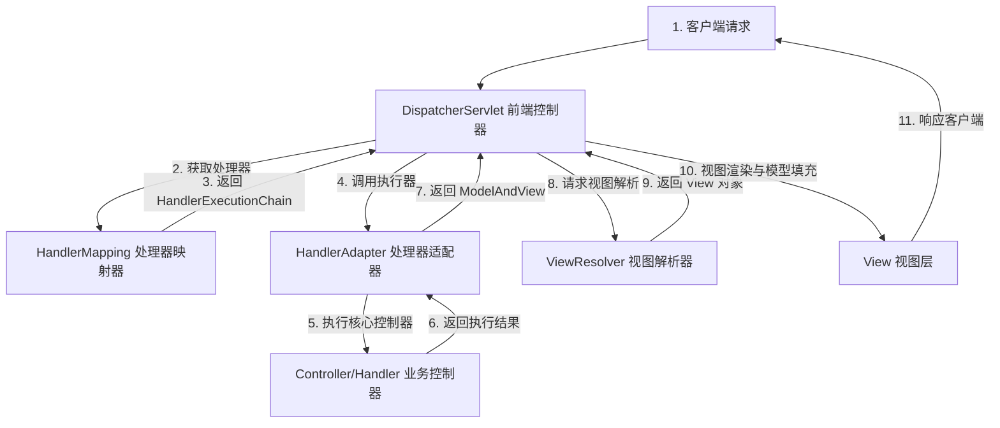
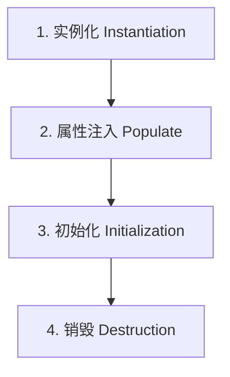

# 1. Spring 与 SpringBoot 特训指南（袁志刚专属版）

本指南结合您简历中 **“Spring AI 自动注入大模型与向量库 Bean”**、**“Advisor 链（AOP 责任链拦截思想）”** 和 **“高并发秒杀环境下分布式锁与数据库事务冲突”** 场景进行深度定制。

**建议阅读顺序**：先读"前置概念速查" → 再读"核心考点详解" → 最后读"简历亮点关联"，届时你会发现所有技术细节都有了依托。

---

## 🔑 前置基础概念速查（必读，5 分钟建立认知底座）

在深入框架底层之前，先把下面这几个概念理解清楚，后文所有分析都建立在这些基础上。

| 概念 | 一句话解释 |
|------|-----------|
| **IoC（控制反转）** | 将对象的创建、依赖装配与生命周期的控制权，从程序员手中反转交给 **Spring IoC 容器**打理。 |
| **DI（依赖注入）** | **Dependency Injection**。Spring 容器在运行期，动态地将依赖的组件注入到需要的属性中。 |
| **AOP（面向切面编程）** | 将与业务无关但被多处调用的公共逻辑（日志、事务、安全）横向提取出来，通过动态代理实现无侵入的切面织入。 |
| **Bean** | 受 Spring IoC 容器所管理的各种应用程序对象的统称。默认都是单例的。 |
| **事务传播行为（Propagation）** | 规定了一个事务方法被另一个事务方法调用时，该如何处理各自的事务上下文（如最常用的 `REQUIRED` 与 `REQUIRES_NEW`）。 |
| **动态代理** | 在程序运行期动态地在内存中为目标类生成代理对象的技术，主要包括 **JDK 动态代理** 与 **CGLIB 动态代理**。 |

---

## 🚀 第一优先级核心考点详解（AOP机制、事务失效、三级缓存、常用注解与 MVC 流程）

### 一、 Spring AOP 核心机制与动态代理应用

AOP (Aspect-Oriented Programming，面向切面编程) 是将与业务无关却被多个模块共同调用的公共逻辑（如日志管理、权限校验、事务控制）封装起来，以减少重复代码并实现解耦。

#### 1. AOP 的动态代理实现
Spring AOP 的底层实现完全依托于 **JDK 动态代理** 和 **CGLIB 动态代理**：
*   如果目标对象实现了接口，Spring 默认使用 JDK 动态代理来生成代理类。
*   如果目标对象没有实现任何接口，Spring 会降级使用 CGLIB 动态代理来生成代理类。
*   **Spring Boot 2.x 以后的改变**：从 Spring Boot 2.x 开始，为了避免因接口缺失、强转类型失败引发的 `ClassCastException`，默认配置已将代理方式全面强制切换为 CGLIB 代理（即默认使用继承来代理，不管你有没有实现接口）。

#### 2. Advice、Pointcut 与 Advisor 关系（结合 Spring AI 核心组件）
在您简历和实际项目中，Spring AI 的 **Advisor** 核心拦截机制就是 AOP 责任链思想在现代 AI 框架中的经典重现：
*   **Advice (通知/拦截逻辑)**：定义了“在什么时候执行什么操作”（在 Spring AI 中表现为调用大模型前后的动态拦截，如 `adviseCall` 阻塞式拦截与 `adviseStream` 响应式流拦截）。
*   **Pointcut (切点/在哪拦截)**：定义了“哪些类和哪些方法需要被拦截”。
*   **Advisor (切面组件)**：**Advice + Pointcut = Advisor**。它将通知与切点封装成一个整体。

---

### 二、 Spring 声明式事务（@Transactional）失效大厂经典 6 大坑

在高并发和事务高要求场景下，误写声明式事务会导致事务失效，发生静默不回滚或并发冲突。

1.  **非 public 方法加注解**：
    *   *原因*：Spring 事务切面基于 AOP，AOP 的动态代理只能代理并暴露 public 方法。如果写在 `private`、`protected` 方法上，Spring 事务会静默失效。
2.  **方法内部“自我调用” (Self-Invocation)**：
    *   *典型错误*：类内 A 方法（无事务）直接调用 B 方法（有 `@Transactional`）。
    *   *原因*：AOP 拦截必须通过**代理对象**调用才能触发。类内部直接调用属于 `this.B()`，此时调用的是目标对象本身而非代理对象，切面逻辑完全无法生效。
    *   *解决*：注入自己（循环依赖已被 Spring 处理），通过 `self.B()` 调用；或者使用 `AopContext.currentProxy()` 获取当前代理对象调用。
3.  **异常在内部被 try-catch 吞掉**：
    *   *典型错误*：在方法内 `try-catch` 了数据库异常，且没有在 `catch` 块中再次手动抛出。
    *   *原因*：Spring 事务管理器只有在方法**向外抛出异常**时，才能感知到失败并触发 `rollback`。如果异常被吞掉，Spring 认为执行成功，照常 commit。
4.  **默认回滚的异常类型不匹配**：
    *   *原因*：Spring 的 `@Transactional` 默认**只在抛出 `RuntimeException`（运行时异常）和 `Error` 时**才触发回滚。如果方法抛出的是 `IOException`、`SQLException` 等受检异常，默认不回滚。
    *   *解决*：必须显式指定为 `rollbackFor = Exception.class`。
5.  **同一个类内部事务传播级别配置错误**。
6.  **Bean 自身没有被 Spring 容器管理**（如忘写 `@Service` 注解）。

---

### 三、 三级缓存解决循环依赖底层硬核机制（面试必考）

#### 1. 什么是循环依赖？
对象 A 依赖对象 B，同时对象 B 也依赖对象 A。
Spring 只能解决**单例（Singleton）作用域下的、且基于属性注入（Field/Setter）**的循环依赖。无法解决构造函数注入的循环依赖（因为构造注入在实例化阶段就需要对方，此时连半成品 Bean 都建不出来）。

#### 2. 三级缓存的核心定义
*   **一级缓存 (`singletonObjects`)**：保存完整可用的、完全初始化好的单例 Bean。
*   **二级缓存 (`earlySingletonObjects`)**：保存半成品的单例 Bean（已实例化，但尚未进行属性填充与初始化）。
*   **三级缓存 (`singletonFactories`)**：保存单例工厂对象 `ObjectFactory`（保存生成半成品 Bean 的 lambda 表达式，用于延迟触发 AOP）。

##### 🖥️ 核心支撑源码：手写 Spring 三级缓存核心逻辑模拟
```java
// Spring 三级缓存极简模拟实现
import java.util.HashMap;
import java.util.Map;
import java.util.function.Supplier;

public class SimpleSpringContainer {
    // 一级缓存：存放完整成熟的单例 Bean (完全初始化)
    private static final Map<String, Object> singletonObjects = new HashMap<>();
    
    // 二级缓存：存放半成品的单例 Bean（未注入属性，可能是原始对象或提前 AOP 代理后的对象）
    private static final Map<String, Object> earlySingletonObjects = new HashMap<>();
    
    // 三级缓存：存放 Bean 工厂（保存生成半成品/提前代理 Bean 的 lambda 表达式，延迟触发 AOP）
    private static final Map<String, Supplier<Object>> singletonFactories = new HashMap<>();

    public static Object getBean(String beanName) throws Exception {
        Object singleton = getSingleton(beanName);
        if (singleton != null) return singleton;

        // 1. 实例化阶段
        Object rawBean = createInstance(beanName);
        
        // 2. 将创建半成品/提前代理的 lambda 表达式放入三级缓存，实现 AOP 延迟触发
        singletonFactories.put(beanName, () -> getEarlyBeanReference(beanName, rawBean));

        // 3. 属性填充阶段（如依赖 B，此处会递归触发 getBean("B") 发生循环依赖）
        populateBean(beanName, rawBean);

        // 4. 初始化阶段（正常情况下无循环依赖的 AOP 发生在此处）
        Object exposedObject = initializeBean(beanName, rawBean);

        // 5. 最终暴露的 Bean 放入一级缓存，并清理二三级缓存
        if (earlySingletonObjects.containsKey(beanName)) {
            exposedObject = earlySingletonObjects.get(beanName); // 若发生过循环依赖，返回二级缓存中的提前代理对象
        }
        singletonObjects.put(beanName, exposedObject);
        earlySingletonObjects.remove(beanName);
        singletonFactories.remove(beanName);
        
        return exposedObject;
    }

    private static Object getSingleton(String beanName) {
        // 双重检索缓存
        Object bean = singletonObjects.get(beanName);
        if (bean == null && earlySingletonObjects.containsKey(beanName)) {
            bean = earlySingletonObjects.get(beanName);
        } else if (bean == null && singletonFactories.containsKey(beanName)) {
            // 三级缓存命中：工厂生产 -> 提升至二级缓存 -> 清理三级缓存
            Supplier<Object> factory = singletonFactories.get(beanName);
            bean = factory.get(); // 触发 lambda 执行（如果是 AOP，在此处生成代理对象）
            earlySingletonObjects.put(beanName, bean);
            singletonFactories.remove(beanName);
        }
        return bean;
    }

    private static Object getEarlyBeanReference(String beanName, Object rawBean) {
        // 模拟提前 AOP 代理逻辑。若 Bean 标有切面，则提前创建代理
        if (needsAop(beanName)) {
            return createAopProxy(rawBean); // 返回提前 AOP 代理后的半成品
        }
        return rawBean; // 否则直接返回原始半成品
    }
    
    private static Object createInstance(String name) { return "RawInstance_" + name; }
    private static void populateBean(String name, Object raw) throws Exception { }
    private static Object initializeBean(String name, Object raw) { return raw; }
    private static boolean needsAop(String name) { return name.equals("userService"); }
    private static Object createAopProxy(Object raw) { return "Proxy_" + raw.toString(); }
}
```

#### 3. 循环依赖解决的完整流转过程
1.  **实例化 A**：调用 `createBeanInstance` 实例化 A。此时 A 仅仅是个半成品。
2.  **A 放入三级缓存**：将 A 包装成 `ObjectFactory` 放入三级缓存 `singletonFactories` 中。
3.  **A 属性填充**：执行 `populateBean`，发现依赖 B，尝试获取 B。
4.  **实例化 B 并依赖 A**：容器中没有 B，触发 B 的加载。B 被实例化，包装并放入三级缓存。执行 B 的属性填充，发现依赖 A，尝试获取 A。
5.  **B 从三级缓存获取 A（关键点）**：
    *   B 去一级缓存找 A，没有；去二级缓存找 A，没有；去三级缓存找 A，**找到了 A 的 `ObjectFactory`**。
    *   调用 `ObjectFactory.getObject()` 获取 A 的引用（如果 A 涉及 AOP 代理，在这一步会**提前触发 AOP 生成 A 的代理对象**并返回；如果不需要 AOP，则直接返回原始半成品 A）。
    *   将 A 放入**二级缓存**中，并从三级缓存中删除。
6.  **B 完成初始化**：B 成功拿到 A 的引用，完成属性填充和初始化，被放入**一级缓存**中。
7.  **A 完成初始化**：B 加载完毕后，A 继续完成属性填充（成功拿到完全体 B），并执行初始化。最终 A 也被存入**一级缓存**中。

#### 4. 为什么必须要用三级缓存？二级缓存行不行？
*   *答案*：**如果不需要 AOP 代理，二级缓存完全足够**。
*   *必须要用三级的根本原因：AOP 延迟织入规范*。
    *   根据 Spring 设计规范，AOP 代理应当在 **Bean 初始化后置处理器** (`postProcessAfterInitialization`) 中统一创建，而不是在实例化之后立刻创建。
    *   如果没有发生循环依赖，Bean A 会按照正常的生命周期走完初始化后，最后才在后置处理器中触发 AOP 生成代理对象。
    *   但如果**发生了循环依赖**，为了让依赖 A 的 B 对象能够拿到 A 的代理引用，三级缓存通过 `ObjectFactory` 机制，**让 A 能够打破常规，提前在此刻触发 AOP 生成代理对象**并缓存至二级缓存。三级缓存的设计完美实现了“无循环依赖时 AOP 延迟触发”和“有循环依赖时提前安全生成”的平衡。

---

### 四、 Spring 常用注解分类速查

在开发中，合理选用注解能大幅提升开发效率及项目的可维护性：

#### 1. 声明 Bean 的组件注解
*   `@Component`：通用组件声明，当不确定 Bean 属于哪一层时使用。
*   `@Service`：声明在**业务逻辑层（Service 层）**。
*   `@Repository`：声明在**数据访问层（DAO/Mapper 层）**，常具备数据库异常转换功能。
*   `@Controller` / `@RestController`：声明在**控制层**。`@RestController` 相当于 `@Controller` + `@ResponseBody`，直接将方法返回值转为 JSON 写入 HTTP 响应体。

#### 2. 注入 Bean 的注解（经典必考：@Autowired vs @Resource）
*   **`@Autowired`**：
    *   *来源*：Spring 框架自带注解。
    *   *注入规则*：**默认按类型 (byType) 注入**。如果容器中存在多个同类型的 Bean，它会尝试**按名称 (byName)** 去匹配。如果依然匹配失败，会抛出异常。
    *   *配合*：通常可以配合 `@Qualifier("beanName")` 强行指定名称注入。
*   **`@Resource`**：
    *   *来源*：JDK 官方注解 (JSR-250 规范)。
    *   *注入规则*：**默认按名称 (byName) 注入**。如果指定了 `name` 属性（如 `@Resource(name="userService")`），则直接精确匹配；如果找不到匹配名称的 Bean，或者没有指定 `name`，它会退化为**按类型 (byType)** 去容器中搜索。

#### 3. 配置与条件注入注解
*   `@Configuration`：声明当前类为配置类，替代传统的 xml 配置文件。
*   `@Bean`：显式声明方法返回的对象为 Spring Bean，交由容器管理。
*   **`@Conditional` 系列条件注解**：
    *   `@ConditionalOnClass(A.class)`：只有当 Classpath 下存在类 A 时，才装配该配置。
    *   `@ConditionalOnMissingBean(B.class)`：只有当容器中缺失类型 B 的 Bean 时，才装配，多用于 Starter 中的默认机制兜底。
    *   `@ConditionalOnProperty(name = "x", havingValue = "y")`：只有当配置文件中属性 x 的值为 y 时，才激活装配。

---

### 五、 Spring MVC 工作流与请求处理流程

Spring MVC 采用经典的 MVC 模式设计，其处理客户端 HTTP 请求的完整流程如下：



1.  **前端控制器 (DispatcherServlet)**：收到客户端发来的 HTTP 请求。它是整个 MVC 体系的核心中转站。
2.  **处理器映射器 (HandlerMapping)**：`DispatcherServlet` 将请求 URL 传给它，它根据 URL 配置寻找到具体的处理器以及该处理器对应的拦截器链，将其封装为 **`HandlerExecutionChain`** 返回给 `DispatcherServlet`。
3.  **处理器适配器 (HandlerAdapter)**：`DispatcherServlet` 根据拿到的 Handler 找到对应的适配器，由适配器统一调用具体的 **`Controller` (业务开发层)** 方法。
4.  **核心控制器 (Controller / Handler)**：开发人员编写的业务控制层。执行完业务后，向 `HandlerAdapter` 返回一个 **`ModelAndView`** 对象（包含数据模型和视图名称）。
5.  **视图解析器 (ViewResolver)**：`DispatcherServlet` 拿到 `ModelAndView` 后，将逻辑视图名送去解析。`ViewResolver` 将其解析为真正的物理 **`View` (视图对象)** 并返回。
6.  **视图渲染**：`DispatcherServlet` 根据模型数据（Model）对 View 视图进行渲染，最终将渲染后的 HTML 视图或者 JSON 数据响应给客户端。

> [!TIP]
> **RESTful JSON 的极简通道：**
> 如果我们的 Controller 方法上标有 `@ResponseBody` 或类标有 `@RestController`，在第 4 步执行完后，`HandlerAdapter` 会直接调用 **`HttpMessageConverter`（如 Jackson 转换器）** 将返回的 Java 对象转为 JSON 字符串，并**直接写入 HTTP 响应体响应**，从而跳过后面的 ViewResolver 视图解析与渲染步骤。

---

## 🎯 简历亮点深度关联与大厂面试预测

### 1. 秒杀一人一单分布式锁与【@Transactional 事务冲突引发超卖灾难】
*   **面试官切入点**：
    > “在高并发秒杀一人一单中，我们通常会使用分布式锁来加锁，并使用 Spring 的 `@Transactional` 声明式事务保证订单创建和库存扣减的事务一致性。如果这两者结合不当，会引发严重的超卖灾难。请问这是什么原因造成的？你是如何做事务和锁的隔离调优的？”
*   **袁志刚专属特训回答模版**：
    1.  **超卖灾难的本质（锁先释放，事务后提交）**：
        *   在 Spring 中，`@Transactional` 声明式事务是基于 **Spring AOP 动态代理** 实现的。当我们在一个方法上加锁并注解 `@Transactional` 时，Spring 底层会在代理方法退出时才去执行 `Connection.commit()` 来提交事务。
        *   **致命漏洞**：如果我们的分布式锁加锁和解锁逻辑写在声明式事务方法**内部**（例如，拿到锁 -> 进入有 `@Transactional` 的方法 -> 方法结束释放锁）。当线程 A 执行完方法内逻辑、退出方法并释放了分布式锁，但 **Spring 的声明式事务由于 AOP 代理机制，此时尚未完全提交到数据库**。
        *   **超卖发生**：在此瞬间，线程 B 瞬间拿到分布式锁，查重（一人一单）时由于线程 A 的事务还未提交，线程 B 查到的订单依然是 `null`。因此，线程 B 依然判定自己有购买资格，去扣减库存并落库，直接导致了**超卖（一人多单）**。
    2.  **硬核生产解决方案**：
        *   **方案一：将锁的生命周期扩大，包围事务**：我们在调用声明式事务的**外层无事务方法中进行加锁和释放锁**。确保锁完全包围了 `@Transactional` 方法的调用（锁获取 -> 事务开启 -> 业务处理 -> 事务提交 -> 锁释放）。
        *   **方案二：采用编程式事务 (TransactionTemplate)**：弃用 `@Transactional` 注解，在加锁区域内部，使用 Spring 提供的 `TransactionTemplate` 编程式事务模板：
            ```java
            // 编程式事务，确保在锁范围内完成提交
            lock.lock();
            try {
                transactionTemplate.execute(status -> {
                    // 一人一单校验
                    // 扣减库存
                    // 生成订单
                    return true;
                }); // 此时，事务已强行提交落库
            } finally {
                lock.unlock(); // 之后再安全释放锁
            }
            ```

### 2. 引入 Spring AI 自动配置与【SpringBoot 自动装配原理】
*   **面试官切入点**：
    > “我看到你的 AI 客服 Agent 项目中引入了 Spring AI 框架，只要配置好 yaml，大模型客户端（ChatModel）、向量存储（PgvectorVectorStore）等 Bean 就会被自动加载进容器。请问 Spring Boot 底层的‘自动装配’原理是怎样的？你是如何定制一个 Starter 启动器的？”
*   **袁志刚专属特训回答模版**：
    1.  **引导入口 `@SpringBootApplication`**：Spring Boot 的自动装配核心在于引导类上的复合注解 `@SpringBootApplication`，其内部起决定作用的是 **`@EnableAutoConfiguration`**。
    2.  **核心三步走流转**：
        *   **第一步：导入选择器**：`@EnableAutoConfiguration` 内部通过 `@Import(AutoConfigurationImportSelector.class)` 注入了自动配置选择器。
        *   **第二步：读取 SPI 配置文件**：该选择器的 `selectImports()` 方法在底层会通过 `SpringFactoriesLoader` 扫描所有 Jar 包 ClassPath 路径下的 `META-INF/spring/org.springframework.boot.autoconfigure.AutoConfiguration.imports` 文件（在旧版本如 Spring Boot 2.7 以前是读取 `META-INF/spring.factories` 文件）。这些文件中以 KV 键值对或全限定名列表形式，声明了所有待加载的 `AutoConfiguration` 自动配置类。
        *   **第三步：条件注解过滤**：读取到这些自动配置类后，JVM 不会无脑全量加载。这些类上标有大量的 **`@Conditional` 系列条件注解**。例如，Spring AI 的 Pgvector 自动配置类上标有 `@ConditionalOnClass(PgvectorVectorStore.class)`。因为我们在 `pom.xml` 里引入了对应的 Jar 包，当前 ClassLoader 能找到该 Class，且容器中缺失该 Bean（`@ConditionalOnMissingBean`），该自动配置类就会被触发，动态地将大模型和向量库 Bean 注入到 IoC 容器中。

---

## 🛠️ 第二优先级核心考点详解（IoC 容器思想、Bean 生命周期、设计模式）

### 一、 Spring IoC (控制反转) 思想
*   **控制反转**：将原本在代码中手动通过 `new` 创建对象、管理其生命周期与装配依赖的控制权，全部反转交给 **Spring IoC 容器** 来打理。
*   **依赖注入 (DI)**：IoC 容器在运行期，动态地将某个依赖对象注入到需要的属性中。
*   **优势**：对象之间不再有编译期的硬编码紧耦合，极大地提高了代码的可扩展性与可测试性（方便 mock 测试）。

---

### 二、 Spring Bean 的完整生命周期
面试必背的生命周期主要包含以下 4 个阶段：

1.  **实例化 (Instantiation)**：调用构造方法在内存中为 Bean 分配空间（Bean 此时是原始的 Object）。
2.  **属性注入 (Populate)**：执行 `@Autowired`、`@Resource` 进行依赖注入。
3.  **初始化 (Initialization)**：
    *   **Aware 接口调用**：如果 Bean 实现了相关 Aware 接口，注入环境元数据（如 `setBeanName`、`setBeanFactory`）。
    *   **BeanPostProcessor.postProcessBeforeInitialization**：Bean 后置处理器在初始化前进行拦截。
    *   **注解/接口初始化**：
        1.  执行 `@PostConstruct` 注解方法；
        2.  如果实现了 `InitializingBean`，执行 `afterPropertiesSet()`；
        3.  执行 xml 中配置的 `init-method` 方法。
    *   **BeanPostProcessor.postProcessAfterInitialization**：Bean 后置处理器在初始化后进行拦截（**AOP 动态代理代理对象在此阶段生成**）。
4.  **销毁 (Destruction)**：
    *   当容器关闭时：执行 `@PreDestroy` 注解方法；如果实现了 `DisposableBean`，执行 `destroy()`；执行配置的 `destroy-method`。

---

### 三、 Spring 中最经典的 5 种设计模式及其硬核落地

Spring 框架本身就是一部活生生的面向对象设计模式教科书，其底层融合了大量的经典模式：

1.  **工厂模式 (Factory)**：
    *   *落地*：Spring 容器就是一个巨大的 Bean 工厂。`BeanFactory` 是 IoC 最底层的顶级工厂接口，而常用的 `ApplicationContext` 则是在其基础上进行了事件、国际化等二次封装的高级工厂。
2.  **单例模式 (Singleton)**：
    *   *落地*：Spring 中的 Bean 默认全部是单例（Singleton）作用域。Spring 底层并没有采用传统私有化构造器的单例写法，而是通过**单例注册表（一级缓存 `singletonObjects` 这个 Map）**来保证单例对象的唯一性与共享。
3.  **代理模式 (Proxy)**：
    *   *落地*：Spring AOP 和声明式事务的底层基石。Spring 底层封装了 JDK 动态代理和 CGLIB 字节码生成，实现了在不触动核心代码的前提下动态织入切面。
4.  **模板方法模式 (Template Method)**：
    *   *落地*：用于规范操作步骤、消除重复样板代码。例如 `JdbcTemplate`、`RestTemplate` 以及您项目中使用的编程式事务 `TransactionTemplate`。它们定义了“获取连接/开启事务 -> 执行用户回调 -> 释放连接/提交事务”的骨架，将具体操作留给用户 Lambda 执行。
5.  **观察者模式 / 发布订阅模式 (Observer)**：
    *   *落地*：Spring 的事件驱动模型。主要由 `ApplicationEvent`（事件）、`ApplicationListener`（监听器/观察者）以及 `ApplicationEventPublisher`（事件发布者）三者组成，实现了模块之间的强解耦。
