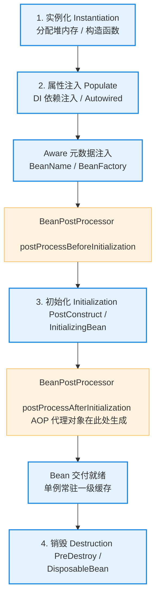

# 1. Spring 与 SpringBoot 特训指南（极简源码速成版）

本指南专为快速吃透 **Spring AI 自动装配大模型与向量库 Bean**、**Advisor 链（AOP 责任链拦截设计）** 以及 **高并发秒杀分布式锁与数据库事务冲突超卖崩溃** 等核心场景中的 Spring 考点而设计。杜绝大段铺垫，采用 **Why - What - How - Deep** 四步直达底层源码与 AOP 字节码，帮助您在面试中反客为主，化被动为主动。

---

## 🚀 核心概念极简拆解

*   **控制反转 (Inversion of Control, IoC)**
    *   **Why**：传统的 Java 开发中，对象之间通过 `new` 强行依赖硬编码，这导致模块之间高度耦合，修改一处逻辑需要大面积重构，系统测试极度困难。
    *   **What/How**：将对象的生命周期管理与依赖装配的控制权，从程序员手中反转交给 **Spring IoC 容器**打理。
*   **依赖注入 (Dependency Injection, DI)**
    *   **Why**：IoC 实现了控制权的反转，但需要一种机制在运行期动态地将具体的依赖实例灌入目标对象的属性中。
    *   **What/How**：Spring 容器在运行期，通过反射动态地将依赖的组件注入到需要的属性或构造方法中。
*   **面向切面编程 (Aspect-Oriented Programming, AOP)**
    *   **Why**：安全校验、事务日志、幂等限流等横切逻辑散落在各个业务方法中，导致严重的逻辑重复和代码污染，极其不利于集中维护。
    *   **What/Deep**：将与业务无关但被多处调用的公共逻辑横向提取，在运行期通过字节码动态代理技术生成代理对象，实现无侵入的横切逻辑织入。
*   **循环依赖 (Circular Dependency)**
    *   **Why**：多服务协同开发中，极易出现服务 A 注入服务 B，而服务 B 又反向注入服务 A 的网状依赖纠缠。
    *   **What/Deep**：Spring 单例容器通过**三级缓存机制**实现了对 Field 属性/Setter 循环依赖的自动完美解决，但无法支持构造注入的循环依赖。
*   **自动装配 (AutoConfiguration)**
    *   **Why**：传统的 Spring 项目需要编写极其繁琐庞大的 XML 配置文件或手工声明 `@Bean` 配置，开发和依赖升级极其低效。
    *   **What/Deep**：Spring Boot 核心理念。通过 SPI 机制扫描 classPath 下的自动配置描述文件，配合丰富的高保真 `@Conditional` 条件注解，实现“只要引入 Jar 包，开箱即用”的极速装配体验。

---

## 🚀 Bean 生命周期流转骨架

在面试中对于高频考点 Bean 的生命周期，您可以通过下图快速呈现其经历的四大核心阶段以及后置处理器（`BeanPostProcessor`）在其中的精美织入拦截点：



---

## 🎯 第一优先级核心考点详解

### 一、 AOP 动态代理机制与 Spring Boot 2.x 的默认代理变革 (Why-What-How-Deep)

*   **Why（为什么 AOP 默认不用静态代理？）**
    *   **痛点**：静态代理（如 AspectJ 静态织入）必须在编译期通过专用编译器将代理代码写入 Class 字节码。开发阶段维护困难，且无法适应运行时极其灵活的动态拦截规则配置。
    *   **解决**：AOP 引入动态代理，在运行期动态在内存中生成代理字节码，以极高的运行时灵活性平替静态织入。
*   **What（JDK 动态代理与 CGLIB 代理的底层抉择）**
    *   **JDK 动态代理**：要求目标类**必须实现至少一个接口**，通过在内存中生成 `$Proxy0` 类并实现相同接口完成代理。
    *   **CGLIB 动态代理**：无接口限制，通过 ASM 字节码库生成目标类的**子类**并重写其方法进行代理。
*   **How（切面 Advisor、通知 Advice 与切点 Pointcut）**
    *   *简历实战引用*：在我们的 AI 客服 Advisor 拦截链中，正是利用 AOP 切面思想拦截了 Flux 流式和同步 Call 的大模型请求。[👉 点击跳转简历场景二](#场景二引入-spring-ai-自动配置与springboot-自动装配原理)
*   **Deep（深入源码：Spring Boot 2.x+ 为什么默认配置全面强制切换为 CGLIB 代理？）**
    *   **默认切换 CGLIB 源码真相**：
        *   从 Spring Boot 2.x 开始，其自动装配类 `AopAutoConfiguration` 内部默认将配置参数 `spring.aop.proxy-target-class` 强制设置为了 `true`（即使目标类实现了接口，也依然无视接口，首选使用 CGLIB 代理生成子类）。
    *   **深层源码原因剖析**：
        1.  **规避类型转换异常 (`ClassCastException`)**：
            *   在 JDK 动态代理下，生成的代理对象 `$Proxy0` 与目标实现类是“兄弟”关系（它们实现了同一个接口）。
            *   如果业务代码中，开发习惯使用实现类直接注入属性（如 `@Autowired private UserServiceImpl userService;`），Spring 会因为注入的代理类 `$Proxy0` 无法向上强转为 `UserServiceImpl` 而**直接抛出类型转换异常导致系统崩溃**。
            *   而 CGLIB 生成代理子类，代理对象天然是目标类的“儿子”，无条件支持向上强转为 `UserServiceImpl`，彻底根除了这一线上低级隐患。
        2.  **JDK 8+ 时代 CGLIB 运行速度的飞跃**：
            *   在早期版本中，CGLIB 生成类速度慢，但随着 JDK 8+ 时代对 ASM 字节码框架的巨大优化，CGLIB 基于 `FastClass` 索引分发的直接方法调用，效率已经全面超越并比肩了反射调用。这促使 Spring Boot 2.x 全面强推 CGLIB。

---

### 二、 声明式事务 @Transactional 失效大厂经典 6 大坑 (Why-What-How-Deep)

*   **Why（为什么要有声明式事务？）**
    *   **痛点**：传统的编程式事务需要手动调用 `connection.setAutoCommit(false)`，在 `try-catch` 块中调用 `commit()` 和 `rollback()`。代码存在极其臃肿的样板重复，难以统一维护。
    *   **解决**：引入 `@Transactional` 切面通知，无侵入式管理事务。
*   **What/How（大厂最致命的两个失效大坑）**
    1.  **非 public 方法加注解**：声明式事务基于 AOP 代理。若写在 `private` 上，代理切面因无法重写该方法，事务静默失效。
    2.  **方法内部“自我调用” (Self-Invocation)**：
        ```java
        public void A() {
            B(); // 同类内部自我调用，此时 B 的事务完全失效！
        }
        @Transactional
        public void B() { ... }
        ```
*   **Deep（深入切面源码：自我调用失效机制与 TransactionAspectSupport 异常决策）**
    *   **内部自我调用失效的底层机理**：
        *   AOP 的代理拦截必须在外部通过**代理对象**调用时才能触发 `monitorenter` 式的事务切面。
        *   当同类内部 A 方法调用 B 时，JVM 底层其实执行的是 **`this.B()`**。这里的 `this` 是普通的被代理目标类实例本身，而非代理对象。因此，B 方法的 `@Transactional` 拦截链完全被完美绕过，事务根本无法开启。
        *   **大厂规范解法**：注入自己 `self` 并通过 `self.B()` 触发代理；或者改用编程式事务 `TransactionTemplate`。
    *   **`TransactionAspectSupport` 异常回滚决策源码剖析**：
        *   为什么 `@Transactional` 默认在抛出 `IOException`/`SQLException` 等 Checked 异常时不触发回滚，而只回滚 `RuntimeException`？
        *   **源码剖析**：我们翻看 Spring 事务异常处理核心类 `TransactionAspectSupport.completeTransactionAfterThrowing()` 源码：
            ```java
            // 事务提交/回滚决策方法
            if (txInfo.transactionAttribute.rollbackOn(ex)) {
                // 如果 rollbackOn 返回 true，则回滚
                txInfo.getTransactionManager().rollback(txInfo.getTransactionStatus());
            } else {
                // 否则照常提交事务！
                txInfo.getTransactionManager().commit(txInfo.getTransactionStatus());
            }
            ```
            在默认的 `RuleBasedTransactionAttribute.rollbackOn()` 中，如果未指定 `rollbackFor`，Spring 只判定异常是否是 `RuntimeException` 或 `Error` 的子类。如果是则回滚，否则认为这是“在可预料范围内的业务Checked异常（如余额不足、库存售罄）”，由业务代码自行处理，**直接强行 Commit 提交事务**。
        *   **大厂规范**：**凡是写 `@Transactional` 注解，必须强制指定 `rollbackFor = Exception.class`**，将回滚边界扩大到所有异常，防范静默提交。

---

### 三、 三级缓存解决单例 Field 循环依赖底层源码 (Why-What-How-Deep)

*   **Why（为什么不能用二级缓存搞定循环依赖？）**
    *   **痛点**：如果在 Spring 单例容器中，类 A 依赖类 B，类 B 依赖类 A，当 A 实例化后准备属性注入，触发 B 加载，B 再次反向尝试获取 A。如果不引入提前暴露的缓存，两类陷入无限 getBean 的死锁状态。
    *   **解决**：Spring 引入三级缓存。
*   **What（三级缓存的核心定义）**
    *   `singletonObjects` (一级缓存)：完全初始化好的完全体单例 Bean。
    *   `earlySingletonObjects` (二级缓存)：实例化好但尚未注入属性的半成品 Bean。
    *   `singletonFactories` (三级缓存)：**存放 `ObjectFactory`（生成 Bean 引用的 Lambda 延迟表达式）**。
*   **How（Field 属性循环依赖解决流程）**
    *   *简历实战引用*：在我们的秒杀一人一单设计中，正是为了彻底规避事务与锁的冲突，而使用 `TransactionTemplate` 编程式事务完成了对 Field 依赖与锁的隔离。[👉 点击跳转简历场景一](#场景一秒杀一人一单分布式锁与transactional-事务冲突引发超卖灾难)
*   **Deep（深入源码：ObjectFactory 延迟触发机制与为什么二级缓存无法平替 AOP 代理？）**
    *   **必须要用三级的核心原因：维护 AOP 的延迟织入规范**。
        *   按照 Spring 的规范设计，AOP 代理对象必须在 **Bean 完全初始化后的后置处理器** (`postProcessAfterInitialization`) 中统一被创建，而不是在 Bean 实例化完成后立刻创建，这样才能保证 Bean 生命周期步调一致。
        *   **如果没有发生循环依赖**：Bean A 顺利走完实例化 -> 属性填充 -> 初始化，最后在初始化后置处理器中触发 AOP 生成 A 代理类。此时三级缓存完全不被调用。
        *   **如果发生了循环依赖**：
            1.  A 实例化后，其原始半成品被包装成 `ObjectFactory` 强行填入三级缓存。
            2.  A 属性填充触发 B，B 在属性填充时向容器尝试获取 A。
            3.  B 检索三级缓存，击中了 A 的 `ObjectFactory`，触发调用其 `getObject()` 方法。
            4.  **提前 AOP 代理**：`ObjectFactory` 在底层会回调 A 的后置处理器 `getEarlyBeanReference`。它打破常规，**提前在此刻为 A 生成 AOP 代理类对象**并返回。
            5.  该提前代理对象被存入二级缓存，B 成功拿到 A 代理引用，顺利完成加载。
        *   👉 **结论**：三级缓存的设计既保证了“在无循环依赖时 AOP 延迟到初始化后触发”的规范，又保证了“在发生循环依赖时 AOP 能提前安全生成并暴露代理类”的完美自恰。如果只用二级缓存，Spring 必须在实例化后无条件立刻为所有 Bean 创建代理，彻底破坏了生命周期规范。

---

### 四、 Spring Boot 自动装配底层原理与 spring.factories 淘汰升级 (Why-What-How-Deep)

*   **Why（为什么要有自动装配？）**
    *   **痛点**：传统的 Spring 项目要想集成 Redis、MyBatis，需要手动写数十行繁杂的 XML 配置文件或者手动写一系列 `@Bean` 声明。系统升级和组件集成体验极其割裂。
    *   **解决**：Spring Boot 引入自动配置，组件只需提供 Starter Jar 包，零配置开箱即用。
*   **What（自动装配三大核心注解）**
    *   `@SpringBootConfiguration`：声明为配置类。
    *   `@ComponentScan`：扫描用户包下的组件。
    *   `@EnableAutoConfiguration`：**自动配置的驱动引擎**。
*   **How（自动装配三步走流转）**
    *   *简历实战引用*：在我们的 AI 客服项目中，大模型的 `ChatModel` 和 Pgvector 向量库 Bean 就是以此原理被自动装配进容器的。[👉 点击跳转简历场景二](#场景二引入-spring-ai-自动配置与springboot-自动装配原理)
*   **Deep（深入源码：AutoConfigurationImportSelector 机制与 spring.factories 淘汰升级）**
    *   **SPI 扫描描述文件升级（大厂最新硬核考点）**：
        *   在 **Spring Boot 2.7 以前**：自动装配类 `AutoConfigurationImportSelector` 依赖 `SpringFactoriesLoader`，去全量扫描所有 Jar 包的 `META-INF/spring.factories` 配置文件（以极高开销的 KV 文本解析读取）。
        *   在 **Spring Boot 2.7 及 3.x+ 中**：传统的 `spring.factories` 机制已被官方**彻底标记为 Deprecated 并逐步淘汰**。取而代之的是全新的 SPI 自动装配文件 —— **`META-INF/spring/org.springframework.boot.autoconfigure.AutoConfiguration.imports`**。
        *   该文件**一行仅声明一个配置类的全限定名**，由 JVM 直接通过流读取，解析速度和类加载效率提升了数倍。
    *   **`AutoConfigurationImportSelector` 的过滤源码流转**：
        1.  `selectImports()` 触发，读取上述新 `.imports` 文件，加载所有候选的自动配置类列表。
        2.  **去重与排序**：执行元数据排序与剔除（根据 `@AutoConfigureAfter` 等定义依赖顺序）。
        3.  **基于 `@Conditional` 的编译期/加载期条件过滤（核心）**：
            *   例如大模型配置类上标有 `@ConditionalOnClass(OpenAiChatModel.class)`。
            *   编译期或类加载期，JVM 在运行时检查当前类加载器（ClassLoader）的 Classpath 下是否存在 `OpenAiChatModel`。如果因为用户没有在 `pom.xml` 里引入对应的依赖，当前类加载器检测缺失该 Class，**则整棵自动装配类在过滤链中直接被剔除**，彻底避免了多余 Bean 加载引发的运行时报错，实现了开箱即用。

---

## 🎯 场景亮点深度关联与对线场景 (Why-What-How)

### 场景一：秒杀一人一单分布式锁与【@Transactional 事务冲突引发超卖灾难】

**面试官切入点**：
> “在高并发秒杀一人一单中，我们通常会使用分布式锁来加锁，并使用 Spring 的 `@Transactional` 声明式事务保证订单创建和库存扣减的事务一致性。如果这两者结合不当，会引发严重的超卖灾难。请问这是什么原因造成的？你是如何做事务和锁的隔离调优的？”

**回答思路 (Why-What-How-Deep 拆解)**：
*   **Why**：如果在高并发下，“一人一单”查重和“预扣减库存”被包装在 `@Transactional` 中，因为 Spring 的 AOP 事务提交是由外部代理对象在方法退出后异步提交的，如果在方法内部释放锁，会导致“锁已释放，但事务还没提交”的并发缝隙，导致超卖和脏单。
*   **What/How**：
    我们直接弃用了注解形式的 `@Transactional` 声明式事务，将分布式锁与 Spring 的 **`TransactionTemplate` 编程式事务** 进行深度强绑定，死锁并控制了加锁范围包围事务。
*   **Deep（大厂级编程式事务隔离防超卖核心实现）**：
    *   为了杜绝这一隐患，我们调整了底层的事务隔离逻辑，将订单状态写入和库存扣减包进编程式事务内部执行：
        ```java
        // 编程式事务完美隔离分布式锁，绝无超卖漏洞
        public void executeVoucherOrder(Long voucherId) {
            String lockKey = "lock:order:" + UserHolder.getUser().getId();
            RLock lock = redissonClient.getLock(lockKey);
            boolean isLock = lock.tryLock();
            if (!isLock) {
                throw new CustomException("请勿重复提交订单");
            }
            try {
                // 在锁范围内，强行利用编程式事务控制落库与提交
                transactionTemplate.execute(status -> {
                    // 1. 一人一单查重（此时由于在锁内，并发请求必被阻塞拦截）
                    int count = query().eq("user_id", userId).eq("voucher_id", voucherId).count();
                    if (count > 0) {
                        status.setRollbackOnly(); // 回滚并拦截
                        return false;
                    }
                    // 2. 扣减库存
                    boolean success = seckillVoucherService.update()
                        .setSql("stock = stock - 1")
                        .eq("voucher_id", voucherId).gt("stock", 0) // CAS 乐观锁防超卖
                        .update();
                    if (!success) {
                        status.setRollbackOnly();
                        return false;
                    }
                    // 3. 创建保存订单
                    VoucherOrder order = new VoucherOrder();
                    save(order);
                    return true;
                }); // 👉 此时离开 transactionTemplate 作用域，Spring 会强行执行 connection.commit() 完成物理落库！
            } finally {
                lock.unlock(); // 👉 事务彻底提交、持久化落库成功后，才安全释放分布式锁，完美剿灭并发缝隙！
            }
        }
        ```

---

### 场景二：引入 Spring AI 自动配置与【SpringBoot 自动装配原理】

**面试官切入点**：
> “我看到你的 AI 客服 Agent 项目中引入了 Spring AI 框架，只要配置好 yaml，大模型客户端（ChatModel）、向量存储（PgvectorVectorStore）等 Bean 就会被自动加载进容器。请问 Spring Boot 底层的‘自动装配’原理是怎样的？你是如何定制一个 Starter 启动器的？”

**回答思路 (Why-What-How-Deep 拆解)**：
*   **Why**：大模型、向量数据库以及 Advisor 责任链拦截器的初始化依赖非常复杂的 Bean 元数据配置。如果让业务层手动通过 XML 或配置类实例化，会产生大量低效的胶水配置代码，必须依靠 Boot 的自动装配机制实现极速集成。
*   **What/How**：
    Spring Boot 的装配基石在于引导类上的 `@SpringBootApplication` 复合注解，其内部通过 `@EnableAutoConfiguration` 驱动。
*   **Deep**：
    *   **SPI 描述读取**：当我们引入了 `spring-ai-pgvector-store-spring-boot-starter` 依赖后，Spring Boot 3 启动时，`AutoConfigurationImportSelector` 自动扫描该 Jar 包的 `META-INF/spring/org.springframework.boot.autoconfigure.AutoConfiguration.imports` 文件，读取里面声明的 `PgvectorStoreAutoConfiguration` 自动装配类全限定名。
    *   **条件激活**：在 `PgvectorStoreAutoConfiguration` 类上，标有：
        1.  `@ConditionalOnClass(PgvectorVectorStore.class)`：检测到 Classpath 下有 Pgvector 的驱动核心类。
        2.  `@ConditionalOnMissingBean(VectorStore.class)`：检测到我们当前 IoC 容器中并没有手动定义其他的向量存储 Bean。
    *   **Bean 注入**：由于条件满足，该类被激活，读取我们在 `application.yml` 中配置的 `spring.ai.vectorstore.pgvector.host` 等属性，利用反射实例化大模型客户端与向量存储 Bean 并一键注入 IoC 容器，实现了极致的 Starter 自愈开箱即用。

---

## 📝 第三优先级：避坑与实战常识

*   **@Autowired 按按类型 (byType) 注入多实例冲突的退化避坑**
    *   **成因剖析**：当容器中存在多个同一类型的 Bean（例如我们定义了两个 `VectorStore` 的 Bean，一个名为 `pgStore`，另一个名为 `redisStore`），此时如果我们直接写 `@Autowired private VectorStore vectorStore`：
        1.  `@Autowired` 的后置处理器 `AutowiredAnnotationBeanPostProcessor` 默认按类型搜寻，会找到两个同名 Bean，发生注入困惑。
        2.  **退化匹配机制**：此时，Spring 会退化为**按属性变量名称 (byName)** 去匹配，即尝试寻找容器中名为 `vectorStore` 的 Bean。但因为容器里只有 `pgStore` 和 `redisStore`，名称均不匹配，Spring 会直接抛出严重的 `NoUniqueBeanDefinitionException` 并拒绝启动。
    *   **大厂规范解法**：当存在同类型多实例 Bean 时，**必须使用 `@Qualifier("pgStore")` 强行指定名称**，或者将变量名直接命名为 Bean 注册名，防范启动失败隐患。
*   **BeanPostProcessor (后置处理器) 的硬核应用**
    *   如果在开发中需要对某些注入的 Bean 在完全初始化前/后执行统一增强（如自动检测大模型配置是否合规，或者在初始化后对特定 Service 生成我们的安全拦截代理），推荐自定义一个类并实现 **`BeanPostProcessor` 接口**：
        - `postProcessBeforeInitialization`：在自定义初始化（如 `@PostConstruct`）前触发，可以对 Bean 的内部参数执行先期安全篡改。
        - `postProcessAfterInitialization`：在自定义初始化后触发。**这正是 Spring AOP 生成动态代理子类/代理对象的源码级发生地点**。
