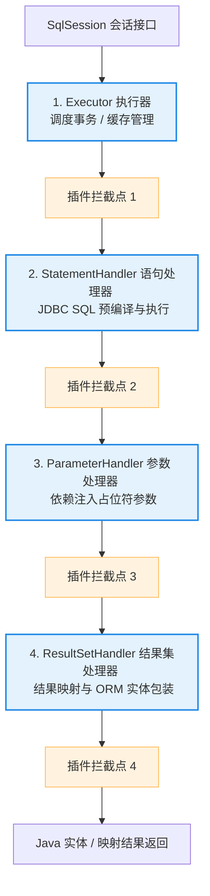

# 2. MyBatis 特训指南（极简源码速成版）

本指南专为快速吃透 **苍穹外卖基于 MyBatis 的高效数据访问层设计**、**基于 ThreadLocal + 拦截器 的公共字段自动填充** 以及 **高并发数据库查询性能优化** 等核心场景中的 MyBatis 考点而设计。杜绝大段铺垫，采用 **Why - What - How - Deep** 四步直达底层源码与 AOP 字节码，帮助您在面试中反客为主，化被动为主动。

---

## 🚀 核心概念极简拆解

*   **预编译 SQL (Prepared SQL)**
    *   **Why**：数据库每次执行新的 SQL 都必须进行高昂的词法语法分析、优化并生成执行计划。如果相同的 SQL 仅因为参数不同就重复编译，会白白耗尽数据库 CPU 算力。
    *   **What/How**：在执行前先将 SQL 结构发给数据库编译，参数位置以占位符 `?` 代替。编译好后，后续请求只需传入纯参数数据即可直接执行，极大提升执行效率，且能彻底剿灭 SQL 注入。
*   **动态代理 MapperProxy**
    *   **Why**：传统的 JDBC 必须手动写大量的 `SqlSession.selectOne("UserMapper.selectById", id)` 强转样板代码，无法像调用普通 Java 接口方法那样干净解耦。
    *   **What/Deep**：MyBatis 核心魔术。开发只需定义 Mapper 接口，MyBatis 启动时利用 **JDK 动态代理** 在内存中为该接口生成一个 **`MapperProxy` 代理实例** 并注入 Spring 容器，使接口方法调用无感转化为底层的 SQL 执行。
*   **一级缓存 (Local Cache)**
    *   **Why**：在同一个数据库会话（SqlSession）内，多次执行一模一样的 SQL 会产生多余的数据库网络 I/O 交互。
    *   **What/Deep**：默认开启的 **SqlSession 级别** 缓存。底层由一个简单的 `PerpetualCache`（内部封装了一个普通的 `HashMap`）实现。
*   **二级缓存 (Second Level Cache)**
    *   **Why**：一级缓存生命周期太短（随会话消亡或更新清空）。需要一种能跨会话、在 Namespace 级别共享的高生命周期缓存。
    *   **What/Deep**：**Namespace（Mapper 接口）级别** 的缓存。由于存在严重的多表 Join 更新脏读灾难，**在真实的互联网分布式项目中，强烈建议彻底禁用并关闭它**，改用业务层分布式多级缓存方案。
*   **延迟加载 (Lazy Loading)**
    *   **Why**：进行多表关联嵌套查询（如订单关联查询用户）时，如果只访问订单的基本属性，就不应该无脑连表查询用户表，以节省昂贵的联表网络与内存 I/O。
    *   **What/Deep**：基于 **CGLIB（或 Javassist）动态代理** 机制。为实体类在内存中生成代理子类，当业务调用被延迟属性的 `getter` 时，触发方法拦截器向数据库秘密发送第二条关联 SQL 并装配返回。

---

## 🚀 MyBatis 核心执行与插件拦截骨架

在面试中谈到 MyBatis 插件和底层原理，您可以通过下图快速呈现 MyBatis 从 SqlSession 开始，依次通过四大核心对象执行 SQL 并完成结果映射的流转链路，以及自定义拦截器（Plugins）在这些核心对象上的 AOP 织入切入点：



---

## 🎯 第一优先级核心考点详解

### 一、 `#{}` 与 `${}` 区别及 SQL 注入防御本质 (Why-What-How-Deep)

*   **Why（为什么 `${}` 无法防止 SQL 注入而 `#{}` 可以？）**
    *   **痛点**：如果数据库在拼接 SQL 参数时采用纯文本硬替换，攻击者传入恶意的 SQL 逻辑片段（如 `1' OR '1'='1`），会无阻地直接参与编译并强行改写原有的 SQL 语法树语义，直接攻破安全防线。
    *   **解决**：预编译机制强制将参数剥离出语法编译环节。
*   **What（占位符与字面量拼接）**
    *   `#{}`：预编译参数占位符。在 SQL 解析时被替换为统一的 `?`，执行时安全填入。
    *   `${}`：字面量拼接符。直接将变量进行静态的 String 字符串硬拼接，存在严重注入隐患。
*   **How（`${}` 不得不用的特殊刚需场景）**
    *   当 SQL 内部结构（如表名、排序列名、排序规则）**无法使用占位符 `?` 代替**时，必须使用 `${}` 进行字面量拼接：
        1.  **动态指定排序列或排序规则**：`ORDER BY ${columnName} ${orderType}`（若写成 `#{}` 注入后会带上单引号变为 `ORDER BY 'price'` 导致 SQL 语法失效报错）。
        2.  **动态分表表名传递**：`FROM ${tableName}`（表名无法被预编译 `?` 代替）。
    *   *安全规范*：在必须使用 `${}` 的场景下，**必须在 Java 业务层执行严格的白名单白过滤**，杜绝任意字符串输入。
*   **Deep（深入内核：PreparedStatement 预编译原理与语法树的绝对安全防御）**
    *   **PreparedStatement 语法树锚定原理**：
        *   当 MyBatis 遇到 `#{}` 并使用 `PreparedStatement` 进行预编译时，MySQL 会将形如 `SELECT * FROM users WHERE username = ?` 的 SQL 语句首先发送至数据库内核。
        *   数据库会对该 SQL 进行词法、语法分析并进行编译优化，**直接生成并固化好该 SQL 对应的物理抽象语法树（AST）结构**。此时，占位符 `?` 作为语法树上的一个孤立叶子节点被锁定。
    *   **参数强转字面量机制**：
        *   后续当调用 `setXXX(1, "' or '1'='1")` 填入真实参数时，数据库内核会将该传入值**强行作为“纯字面量字符串数据”进行数据类型转义**。
        *   传入的任何特殊控制符号（如单引号、双引号、OR、AND）都会在底层被直接进行物理转义字符处理，使其**彻底丧失作为 SQL 指令编译执行的特权**。它只能作为 username 的一个具体字符串数值去执行匹配。这种设计从物理结构上百分之百杀死了 SQL 注入的可能。

---

### 二、 一级与二级缓存底层源码与脏读灾难 (Why-What-How-Deep)

*   **Why（为什么要有缓存机制？）**
    *   **痛点**：高频执行重复查询，会导致多余的数据库磁盘 I/O 负载。
    *   **解决**：引入一/二级缓存，在会话或 Namespace 级别进行内存共享检索。
*   **What（一/二级缓存级别差异）**
    *   一级缓存：SqlSession 会话级别缓存。默认开启，无法关闭。
    *   二级缓存：Namespace（Mapper 接口）级别缓存。跨会话共享，默认关闭。
*   **How（大厂禁用二级缓存的根本致命缺陷：多表 Join 脏读灾难）**
    *   *脏读物理成因*：二级缓存是基于 Namespace 级别进行数据隔离的。如果我们在 `OrderMapper` 中写了一条多表 Join 关联查询，关联了 `User` 表的数据，并将结果缓存进 `OrderMapper` 的二级缓存中。
    *   *数据错乱触发*：此时，并发事务在 `UserMapper` 中对该用户执行了 `UPDATE` 修改并提交。因为该修改属于 `User` 这个 Namespace，它只会清空 `UserMapper` 下的二级缓存，而对 `OrderMapper` 下的二级缓存**完全一无所知**。
    *   *后果*：后续外部通过 `OrderMapper` 再次查询，依然会击中二级缓存中的过期旧脏数据，发生严重的数据不一致脏读，这在工业级高精度场景下是绝对不可原谅的灾难。
*   **Deep（深入源码：一级缓存 PerpeturalCache 的清理源码时机）**
    *   **一级缓存底座**：
        *   一级缓存由 SqlSession 内部的 `BaseExecutor` 维护。其本质是一个简单的 **`PerpetualCache`** 类，内部仅封装了一个极其普通的非并发安全 **`HashMap`**：
            ```java
            public class PerpetualCache implements Cache {
                private final String id;
                private final Map<Object, Object> cache = new HashMap<>(); // 一级缓存底层就是它！
                ...
            }
            ```
    *   **强一致性清理时机源码剖析**：
        *   为了保障事务内数据强一致，MyBatis 源码中强制在执行任何写动作（`INSERT/UPDATE/DELETE`）以及事务提交/回滚时执行缓存清空。我们翻看 `BaseExecutor.update()` 源码：
            ```java
            @Override
            public int update(MappedStatement ms, Object parameter) throws SQLException {
                ErrorContext.instance().resource(ms.getResource()).activity("executing an update").object(ms.getId());
                if (closed) {
                    throw new ExecutorException("Executor was closed.");
                }
                // 👉 核心源码：在执行任何一条 update/insert/delete 之前，无条件强行全部清空一级缓存！
                clearLocalCache(); 
                return doUpdate(ms, parameter);
            }
            ```
            在 `clearLocalCache()` 底层，它会直接调用 `localCache.clear()`（即 `HashMap.clear()`）将整个一级缓存清空，彻底防范了事务内连续查询间的脏读隐患。

---

### 三、 延迟加载 (Lazy Loading) 底层 CGLIB 代理机制 (Why-What-How-Deep)

*   **Why（为什么说延迟加载对多表关联查询性能极其友好？）**
    *   **痛点**：当从数据库中查询出订单表列表时，如果在绝大多数页面我们只需要展示订单的基本价格和时间，就不应该强行去 Join 关联查询耗时极长、体积庞大的用户画像及明细表，这会耗尽内存和网卡 I/O。
    *   **解决**：开启延迟加载，只有在 Java 代码中真正调用 `order.getUser()` 时，才发起第二条 SQL 查询。
*   **What/How（延迟加载配置）**
    *   在 application.yml 中，将全局参数 `lazyLoadingEnabled` 设置为 `true` 开启。
*   **Deep（深入代理：半成品对象实例化与 getter 触发拦截机制）**
    *   **CGLIB 半成品代理子类生成**：
        *   当 MyBatis 从数据库中读取到订单基础数据，进行结果映射（ORM）装配时，它检测到 `user` 属性配置了延迟加载。
        *   MyBatis **不会将 `user` 设为普通的 null**。它会调用底层的 **CGLIB（或 Javassist）字节码操作框架**，在 JVM 内存中动态为 `Order` 实体类生成一个**代理子类对象**。
        *   在这个代理子类对象中，MyBatis 注入了一个特殊的拦截器 —— **`JavassistProxyFactory$EnhancedResultObjectProxyImpl`**（如果是 CGLIB，则是对应的 MethodInterceptor）。这个半成品订单代理对象被返回给业务层。
    *   **`getter` 调用触发无感二级 SQL 注入**：
        *   当我们在 Java 代码中执行普通的属性获取 `order.getOrderNo()` 时，拦截器检测到这一属性不是延迟加载字段，直接放行返回。
        *   一旦代码中调用了 **`order.getUser()`**，方法拦截器会被瞬间触发拦截动作：
            1.  拦截器检测到 `user` 这个被拦截字段目前依然是**未加载的半成品状态**。
            2.  拦截器内部会立即动态拉起原先绑定的数据库执行上下文，**“秘密”向数据库发送第二条关联查询 SQL**：`SELECT * FROM user WHERE id = ?`。
            3.  查回真实的用户数据后，拦截器通过反射技术，将数据无缝注入填充到当前订单代理对象的 `user` 属性中，最后将填充好的 `user` 返回给调用者。
        *   整个过程对外表现为极其流畅的同步调用，底层却实现了精妙的非必要延迟加载。

---

### 四、 插件拦截器 (Interceptor) 底层 JDK 动态代理多层包装责任链 (Why-What-How-Deep)

*   **Why（为什么说 MyBatis 拥有极强的插拔式可扩展性？）**
    *   **痛点**：如果要在 MyBatis 执行 SQL 的关键步骤（如预编译前、参数注入前、结果集解析后）统一织入非侵入的公共字段填充、分库分表路由、多租户拼接等拦截逻辑，硬编码切面会导致底层逻辑臃肿混乱。
    *   **解决**：提供高度可定制的插件（Interceptor）拦截器，支持对核心流水线对象的精准代理拦截。
*   **What（四大核心拦截对象）**
    1.  `Executor`：调度事务、管理缓存的核心执行器（最上层）。
    2.  `StatementHandler`：负责 JDBC Statement 预编译与执行的语句处理器。
    3.  `ParameterHandler`：负责为 SQL 占位符 `?` 注入 Java 实参的参数处理器。
    4.  `ResultSetHandler`：负责将 JDBC ResultSet 映射包装转化为 Java 实体对象的结果集处理器。
*   **How（自动填充拦截器的黄金实战）**
    *   *简历实战引用*：在我们的自动填充拦截器中，正是通过拦截 `Executor.class` 内部的 `update` 方法，实现对公共字段的 ThreadLocal 反射注入。[👉 点击跳转简历场景一](#场景一公共字段自动填充拦截器与mybatis-拦截器-interceptor-四大核心对象)
*   **Deep（深入源码：JDK 动态代理多层包装机制与 AOP 责任链底层源码揭秘）**
    *   **MyBatis 插件是怎么在底层跑起来的？**
        *   当我们启动 MyBatis 并通过 XML 注册自定义的 `AutoFillInterceptor` 插件时，系统会将其缓存到全局 `InterceptorChain`（拦截器链）中。
        *   在 MyBatis 实例化 `Executor` 或 `StatementHandler` 的那一刻，底层会立即调用 **`InterceptorChain.pluginAll(target)`** 方法。我们来翻看其底层核心源码：
            ```java
            public class InterceptorChain {
                private final List<Interceptor> interceptors = new ArrayList<>();
                
                public Object pluginAll(Object target) {
                    // 👉 核心源码：遍历所有注册的插件，对目标对象进行多层 JDK 动态代理嵌套包装！
                    for (Interceptor interceptor : interceptors) {
                        target = interceptor.plugin(target); // 包装成代理对象并返回
                    }
                    return target; // 返回最终的被多层代理包裹的“套娃”对象
                }
            }
            ```
            在 `interceptor.plugin()` 底层，最终调用的是 **`Plugin.wrap(target, this)`**。该方法通过 **`Proxy.newProxyInstance()`**，动态生成一个实现了 MyBatis 核心接口（如 Executor 接口）的动态代理对象。
    *   **多级 AOP 责任链的执行机制**：
        *   当我们调用 `executor.update()` 时，实际上是在调用被多层代理“套娃式”包裹的最高层 `$Proxy` 代理对象。
        *   由于是代理调用，它会首先触发其绑定的 `Plugin.invoke()` 方法。
        *   在 `invoke()` 内部，判定当前执行的方法是否符合我们在 `@Signature` 注解中声明的拦截签名：
            1.  **符合签名**：代理对象会先暂停调用，转而执行我们的 **`Interceptor.intercept(new Invocation(target, method, args))`** 拦截方法。在执行完我们的自动填充/公共逻辑后，我们通过 `invocation.proceed()` 放行，这会使代理链继续进入下一层代理对象的 `invoke`，直到最底层的真实目标对象。
            2.  **不符合签名**：直接调用 `method.invoke(target, args)` 放行至下一层。
        *   这一设计通过精妙的 JDK 动态代理多层嵌套，在内存中构建起了一条完备的高并发 AOP 责任链，成为了各类高性能分库分表、自动填充插件的工业级设计底座！

---

## 🎯 场景亮点深度关联与对线场景 (Why-What-How)

### 场景一：公共字段自动填充拦截器与【MyBatis 拦截器 (Interceptor) 四大核心对象】

**面试官切入点**：
> “你在项目中提到了基于 MyBatis 的数据访问层设计。对于很多业务表，插入时需要填充 `createTime`、`createUser`，更新时需要填充 `updateTime`、`updateUser`。如果在每个 Service 里写 set 逻辑太冗余，漏写还会引发非空报错。请问在底层你是如何优雅地进行公共字段自动填充的？MyBatis 拦截器原理是怎样的？”

**回答思路 (Why-What-How-Deep 拆解)**：
*   **Why**：如果在每个 Service 或 Controller 中手工 set 公共审计字段，不仅代码耦合、极其难看，而且容易因为程序员疏忽漏写引发物理非空报错。必须通过非侵入的底层拦截机制实现 100% 自动注入填充。
*   **What/How**：
    我们自研了 **自定义注解 `@AutoFill` + MyBatis 拦截器 (Interceptor)** 方案。
*   **Deep（拦截器自动填充源码级落地）**：
    *   **声明拦截切入点**：我们自定义 `AutoFillInterceptor` 类，利用 MyBatis 的 `@Intercepts` 声明对 **`Executor.class`** 的 `update` 方法（该方法包含了所有的物理 `INSERT` 和 `UPDATE`）进行代理拦截。
    *   **写操作判定与实体提取**：当写操作触发时，代理对象拦截调用。我们通过 `MappedStatement` 提取出当前的 SQL 运行期指令，通过 `mappedStatement.getSqlCommandType()` 精准判定当前是 `SqlCommandType.INSERT` 还是 `UPDATE`。
    *   **ThreadLocal 画像提取与反射注入**：
        1.  我们通过拦截方法参数获取当前被执行的数据库实体参数对象 `entity`。
        2.  利用反射扫描 `entity` 是否被标注了自定义的 `@AutoFill` 注解。若有，则通过反射提取实体中所有的 `setter` 方法名。
        3.  利用我们封装的 `BaseContext`（**底层基于 ThreadLocal 强隔离机制**）极速读取当前正在操作该接口的登录用户 ID，并提取当前系统时间戳。
        4.  利用反射在内存中直接强行调用 `setCreateTime`、`setCreateUser` 或 `setUpdateTime`、`setUpdateUser` 为实体属性赋值。
        5.  最后调用 `invocation.proceed()` 放行代理责任链，MyBatis 就会拿着已被我们完美注入好公共字段的实体，继续往下执行原生的预编译 SQL 执行与落库。这彻底实现了业务层零感知、数据库强约束的优雅自动填充，展现了极强的工业级工程素养！

---

## 📝 第三优先级：避坑与实战常识

*   **SqlSession 线程不安全本质与 SqlSessionTemplate 底层 ThreadLocal 避坑**
    *   **成因剖析**：MyBatis 的 `DefaultSqlSession` 内部持有底层的 `Executor` 以及与数据库物理连接绑定的物理事务管理器。这个物理连接是有状态的。如果将 `DefaultSqlSession` 声明为单例并供多线程共享并发调用，多个线程会共享同一个底层物理 Connection 执行读写，这会瞬间引发严重的**多线程连接状态错乱、事务越界提交或死锁**。因此，`SqlSession` 绝对是线程不安全的，其生命周期必须被严格限制在单次请求/方法调用范围内（用完即丢）。
    *   **Spring 的 ThreadLocal 救赎（`SqlSessionTemplate` 机制）**：
        *   我们在开发中通过 Spring 注入的 Mapper 接口，底层调用的实际上是 **`SqlSessionTemplate`** 代理类（它实现了 SqlSession 接口）。
        *   `SqlSessionTemplate` 内部采用了**动态代理**：
            1.  当多线程并发调用 Mapper 接口的方法时，`SqlSessionTemplate` 代理对象截获请求。
            2.  它不会无脑使用单例连接，而是通过内部的 `SqlSessionHolder`（**底层基于 ThreadLocal 机制**），去当前线程的本地变量中检索是否已经存在与当前线程绑定的物理 `SqlSession` 实例。
            3.  **无则新建，有则复用**：如果是当前线程第一次调用，它会为当前线程新建一个 SqlSession，并绑定到 ThreadLocal 中，确保这个 SqlSession 只被当前这一个线程在生命周期内独占使用。
            4.  方法执行完毕后，代理对象会自动清理 ThreadLocal 并关闭 SqlSession。这一设计在完全不改动开发体验的前提下，以高内聚的 ThreadLocal 机制彻底扫清了分布式多线程下的物理连接状态错乱死锁隐患。
