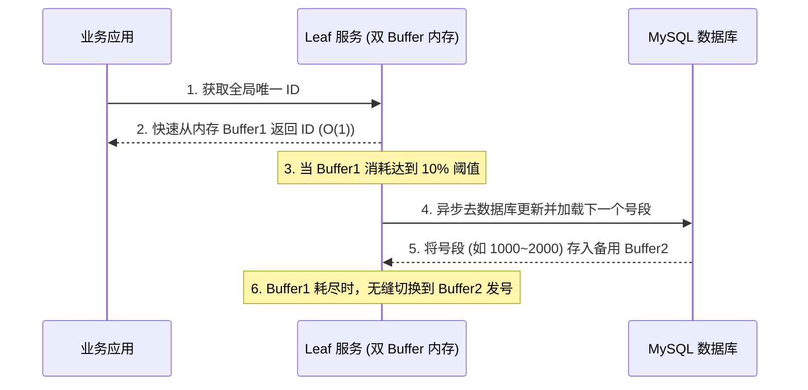

# 1. 分布式锁与分布式 ID 特训指南（袁志刚专属版）

本指南结合您简历中 **“分布式集群部署下的秒杀超卖预防”**、**“Redisson 分布式锁高并发兜底”** 和 **“SaaS 餐饮系统海量订单全局唯一 ID 设计”** 场景进行深度定制。

**建议阅读顺序**：先读"前置概念速查" → 再读"核心考点详解" → 最后读"简历亮点关联"，届时你会发现所有技术细节都有了依托。

---

## 🔑 前置基础概念速查（必读，5 分钟建立认知底座）

在深入分布式架构之前，先把下面这几个概念理解清楚，后文所有分析都建立在这些基础上。

| 概念 | 一句话解释 |
|------|-----------|
| **AP vs CP** | 分布式系统的 CAP 定理抉择。**AP** 侧重高可用性与分区容错（如 Redis，高吞吐但可能存在短暂数据不一致）；**CP** 侧重强一致性与分区容错（如 ZooKeeper，确保数据强一致但写入延迟稍高）。 |
| **分布式锁** | 跨越多个物理独立节点，用于在分布式集群网络环境下协调共享资源排他性访问的全局锁定机制。 |
| **互斥性** | 锁的最核心特征。在分布式系统环境的任意时刻，一把锁只能被一个物理节点的同一个线程所安全持有。 |
| **可重入锁** | 指已经持有锁的线程在未释放锁之前，可以多次重复进入被该锁保护的代码区域，而不会发生自己锁死自己的死锁现象。 |
| **雪花算法** | Twitter 推出的分布式 ID 生成算法，将时间戳、机器 ID 和序列号拼装成 64 位 Long 型整数，实现全局唯一且趋势递增。 |
| **时钟回拨** | 服务器因 NTP 自动对时或其他物理原因导致系统时间发生后退的现象，是依赖时间戳的分布式算法（如雪花算法）的致命克星。 |

---

## 🎯 简历亮点深度关联与大厂面试预测

### 1. Redis 哨兵/主从集群下【主从同步延迟导致分布式锁瞬间失效灾难】
*   **面试官切入点**：
    > “我看到你的秒杀系统用了 Redisson 分布式锁进行兜底。如果你们的 Redis 部署在哨兵模式或主从集群下，一旦发生 Master 节点宕机、主从切换，分布式锁是如何失效的？你听说过红锁 (Redlock) 吗？为什么工业界极少有人真正使用它？你是如何进行业务容错设计的？”
*   **袁志刚专属特训回答模版**：
    1.  **异步同步导致的锁失效灾难**：
        *   Redis 的主从复制是**异步**的。
        *   当线程 A 尝试在 Master 节点上获取了锁（Master 写入了锁的 Key），Master 节点在**还没来得及将这个 Key 异步同步给 Slave 节点**的一瞬间，Master 突然发生物理宕机。
        *   哨兵检测到故障，立即将该 Slave 节点提升为新 Master。由于新 Master 上完全没有该锁的 Key，线程 B 尝试加锁时会轻松成功。此时，线程 A 和线程 B 在分布式集群中**同时持有了同一把锁**，分布式锁瞬间形同虚设，超卖直接发生。
    2.  **红锁 (Redlock) 的高昂代价与学术争议**：
        *   为了解决此问题，Redis 作者提出了红锁算法（Redlock）：客户端尝试在 5 个完全独立的 Redis 实例上并行加锁，只有在**过半数（3个以上）实例上加锁成功**且消耗总时间小于锁租期，才算加锁成功。
        *   **为什么不用红锁**：它太重了。原本一次网络 I/O 变成了 5 次，性能大幅退化。而且在学术界，分布式专家（如 Martin Kleppmann）曾发表长文抨击红锁，指出由于分布式系统存在不可靠的系统时钟漂移和垃圾回收 GC 引起的“STW 暂停”，红锁在理论上依旧无法保证 100% 的安全性，其维护成本极高。
    3.  **架构师的终极业务容错方案**：
        *   在工业界，大厂普遍的共识是**不使用 Redlock**。我们承认 Redis 分布式锁是一种 **AP 属性（侧重高可用，保证高吞吐，存在极低概率数据丢失）** 的锁。
        *   **业务层强容错**：我们通过“前端漏沙限流”+“Redis 分布式锁防重复提交”作为第一道关卡（拦截 99.9% 的流量），而将最终的“防超卖”和“幂等”控制权牢牢死守在**数据库层**（通过 MySQL 的唯一约束、乐观锁条件更新、Redis Lua 脚本内存级原子操作）。即使极低概率下主从切换发生锁失效，数据库也会将脏流量无情绞杀，这才是兼顾高吞吐与绝对安全的成熟分布式架构设计。

### 2. SaaS 餐饮海量订单生成与【雪花算法时钟回拨生产级硬核解法】
*   **面试官切入点**：
    > “在苍穹外卖 SaaS 系统中，创建订单时为什么不能使用 MySQL 自增主键？如果选择雪花算法 (Snowflake)，请问其底层位结构是怎样的？在 NTP 网络对时服务导致‘时钟回拨（时钟往回走）’的极端生产场景下，雪花算法会发生什么？你是如何应对这一痛点的？”
*   **袁志刚专属特训回答模版**：
    1.  **为什么不能用自增主键**：在 SaaS 多租户餐饮系统中，订单量极大，未来必定会面对**分库分表**。如果使用自增 ID，不同分库里的主键会严重冲突，合并对账极为困难；且自增 ID 会直接暴露系统每日订单增量等极度敏感的商业数据。
    2.  **雪花算法的二进制结构**：雪花算法生成的全局唯一 64 位 Long 型 ID，包含 4 个核心段：
        *   `1位符号位`：始终为 0，保证 ID 恒为正数。
        *   `41位时间戳`：精确到毫秒，可容纳 69 年。
        *   `10位工作机器ID`：支持部署 1024 个节点。
        *   `12位序列号`：单机单毫秒内自增，支持每毫秒产生 4096 个唯一 ID。
    3.  **时钟回拨的致命漏洞**：雪花算法强依赖系统时钟。如果 NTP（网络时间协议）服务自动校准时间，导致服务器时间突然被**回拨（回到过去）**，雪花算法就会产生与过去完全重复的 ID，直接引发数据库主键冲突崩溃。
    4.  **我们的生产级时钟回拨解决方案**：
        *   **轻微回拨（小于 5ms）**：如果当前时间戳小于上一次生成的时间戳，且差值在 5 毫秒内，我们会强迫当前线程进行**自旋等待**，直到时间赶上并超过上一次时间戳，再继续生成。
        *   **严重回拨（大于 5ms）之“备用 MachineId”方案**：在初始化时，我们为每台物理机器向 ZooKeeper 或 Redis 动态注册两个 `MachineId`（例如工作 ID 1 和备用 ID 2）。一旦发生严重时钟回拨，算法自动**无感切换到备用机器 ID 2** 继续发号。由于机器 ID 改变，即使时间戳回拨，也绝对不会产生重复的 ID。
        *   **时钟历史最大值记录**：在内存中持久化保存当前发号器所达到的历史最大时间戳，如果回拨，则在上一次最大时间戳上继续执行“毫秒内自增发号”，直到真实系统时间追赶上历史最大时间。

---

## 🚀 第一优先级核心考点详解（Redis vs ZK 锁对比、雪花算法细节）

### 一、 分布式锁的三种实现方式与 AP / CP 抉择
在分布式架构中，加锁必须横跨多个独立的物理节点，通常有三种主流实现：

#### 1. 数据库排他锁 (悲观锁)
*   **实现**：利用 `SELECT ... FOR UPDATE` 锁定这行记录。
*   **缺陷**：高并发下数据库连接会瞬间被抢占爆满，性能极差，完全无法承载秒杀等大流量，工业界一般不采用。

#### 2. 基于 Redis 的分布式锁 (侧重 AP)
*   **实现**：利用 `SET lock_key unique_value NX PX 30000`（或 `Redisson` 底层 Hash 结构）。
*   **优点**：纯内存操作，读写极快，支持超高并发。
*   **缺点**：主从复制是异步的，存在主从切换锁失效的问题（不满足强一致性）。

#### 3. 基于 ZooKeeper 的分布式锁 (侧重 CP)
*   **实现**：在指定的锁节点下，创建**临时顺序节点 (EPHEMERAL_SEQUENTIAL)**。每个客户端只去监听排在自己前一位的节点（避免**羊群效应**）。
*   **优点**：
    1.  **强一致性（满足 CP）**：ZK 集群内部通过 ZAB 崩溃恢复协议，强行保证只有半数以上节点写入成功才返回，绝对不存在主从延迟导致的锁失效。
    2.  **自动释放**：由于是临时节点，如果客户端服务器突然挂掉，与 ZK 的 Session 断开，临时节点会被 JVM 自动删除，彻底免除了死锁发生的可能。
*   **缺点**：每次创建和删除节点都需要在 ZK 节点树上进行同步，性能和吞吐量显著逊色于 Redis 锁。

#### 4. 分布式锁的抉择大厂准则
*   如果业务场景对**高并发、高吞吐**有极限要求，且允许极低概率下的锁失效（配以数据库兜底），**首选 Redis 锁**（如秒杀、高并发商铺限流）。
*   如果业务场景对**数据一致性有极度严苛、零容忍要求**（如大型金融对账、大额转账控制），**首选 ZooKeeper 锁**。

---

## 🛠️ 第二优先级核心考点详解（分布式 ID 方案）

### 一、 数据库号段模式（美团 Leaf 方案深度解密）
因为单纯的 UUID 太长且无序，作为主键会导致 MySQL B+ 树索引频繁进行页分裂与重构，严重拖累性能。美团提出了优秀的 **Leaf 号段模式**：

1.  **号段加载思想**：每次去数据库更新并申请一个号段（例如 `max_id` 从 1000 变到 2000）。应用在本地内存中直接自增获取 ID，无需每次都去请求数据库，性能提升了上百倍。
2.  **双 Buffer 异步装载优化（解决波峰停顿）**：
    *   *普通号段模式缺点*：号段用完的那一瞬间，线程必须同步去请求数据库更新号段，会导致该请求出现明显的响应延迟抖动。
    *   *双 Buffer 方案*：在内存中维护两个号段 Buffer（Buffer1 和 Buffer2）。当 Buffer1 里的号段消耗达到 **10% 阈值**时，后台自动开启一个异步线程去数据库加载下一个号段存入 Buffer2。当 Buffer1 耗尽的那一瞬间，无缝切换到 Buffer2，整个过程完全是 $O(1)$ 的内存操作，彻底消除了响应时间的波峰停顿。
