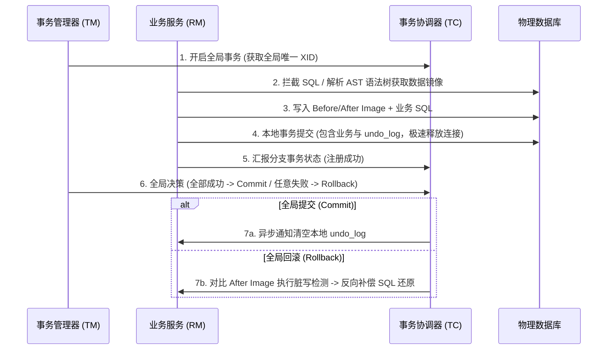

# 2. 分布式事务与理论特训指南（极简源码速成版）

本指南专为快速吃透 **餐饮 SaaS 系统多服务跨库协作**、**订单/库存/支付多层级数据最终一致性** 以及 **三方支付渠道跨系统对账退款** 等高频分布式场景中的一致性考点而设计。杜绝大段铺垫，采用 **Why - What - How - Deep** 四步直达底层源码与事务镜像，帮助您在面试中反客为主，化被动为主动。

---

## 🚀 核心概念极简拆解

*   **两阶段提交 (2-Phase Commit, 2PC)**
    *   **Why**：在分布式环境下，跨物理网络的多个独立数据库（RM）无法感知彼此的执行结果。需要一种强一致性的协议，通过统一的协调者（TC）强行锁死所有物理资源进行表决。
    *   **What/Deep**：事务分为 Prepare（投票/锁资源）和 Commit（真正提交/回滚）两个阶段。由于协调者单点故障可能导致节点无限期阻塞挂起，且一阶段强锁物理资源，并发吞吐极低。
*   **三阶段提交 (3-Phase Commit, 3PC)**
    *   **Why**：2PC 的 Prepare 阶段存在严重的同步阻塞隐患。如果协调者突然暴毙，参与者将永远无限期锁定物理资源。
    *   **What/Deep**：在 2PC 基础上引入 CanCommit、PreCommit、doCommit 三个阶段，并在参与者端加入了**超时自动提交机制**，显著缓解了物理阻塞挂起的隐患，但依然可能存在数据不一致。
*   **Seata AT 模式**
    *   **Why**：传统的分布式事务框架（如 TCC、Saga）对业务代码侵入极深，开发人员需要为每个分支事务编写繁复的 Confirm/Cancel 或反向补偿代码，开发效能极低。
    *   **What/Deep**：Seata 官方强力推出的**无侵入、高性能**分布式事务方案。底层通过代理物理数据源，拦截业务 SQL 并自动在本地库写入前后镜像（Before/After Image）和 undo_log 记录，一阶段直接本地提交释放连接，二阶段异步完成，性能极佳。
*   **补偿事务 (Compensating Transaction)**
    *   **Why**：在弱一致性事务（如 Saga, TCC 模式）中，分支事务在一阶段就已经物理提交并生效了。如果全局事务最终失败，必须有一套反向的“逻辑冲正”机制，撤销此前的物理改动。
    *   **What/How**：用以在业务逻辑上撤销已提交修改的反向事务（例如：一阶段执行了“扣款 100 元”，回滚时对应的补偿事务就是“打款 100 元”还原）。
*   **最终一致性 (Eventual Consistency)**
    *   **Why**：高并发互联网服务（如秒杀、外卖派单）绝对无法承受强一致锁资源带来的延迟暴增。必须释放资源，允许短暂的数据软状态不一致。
    *   **What/Deep**：BASE 理论的核心。系统不需要在任何瞬时时刻保持强一致，只要保证在经历一段时间的重试、对账或消息投递后，数据最终达到一致状态即可。

---

## 🚀 Seata AT 模式分布式事务执行骨架

在面试中陈述微服务跨库事务，您可以通过下方的精美架构流转图，向面试官完美展示 Seata AT 模式通过代理物理数据源在内存中自动构建前后镜像、并在本地一并提交的硬核流程：



---

## 🎯 第一优先级核心考点详解

### 一、 CAP 理论与 BASE 最终一致性抉择哲学 (Why-What-How-Deep)

*   **Why（为什么分布式系统无法同时完美实现 C、A、P？）**
    *   **痛点**：分布式系统的服务器部署在不同物理机上。网络波动、网线断开导致的**物理网络分区（P）是必然发生的客观现实**。
    *   **抉择硬限制**：
        1.  如果我们要保证**强一致性（C）**，当两台机器因网络断开（P）时，为了防止两边数据写入不一致，我们必须强行拒绝客户端的任何读写请求。这直接导致系统**可用性（A）**瘫痪。
        2.  如果我们要保证**可用性（A）**，两台机器在断网（P）时依然照常接受读写，但由于数据暂时无法跨网同步，两台机器的数据会产生短暂冲突不一致。这直接牺牲了**强一致性（C）**。
    *   👉 **结论**：分布式系统设计中，**P 是客观底座，我们只能在 AP 与 CP 之间二选一**。
*   **What（BASE 最终一致性理论）**
    *   大厂高并发互联网系统（如餐饮 SaaS、秒杀）无条件**全面倒向 AP 架构**，遵循 **BASE 理论**：
        *   **Basically Available (基本可用)**：系统面临严重洪峰时进行有损降级（如返回“排队人数多”），死守可用底盘。
        *   **Soft State (软状态)**：允许数据存在非实时的中间状态（如“支付中”、“退款中”），不阻塞前台响应。
        *   **Eventually Consistent (最终一致性)**：系统不维持瞬时强一致，但通过重试、消息对账，保证数据最终对齐。
*   **How（微服务中最终一致性的工程落地）**
    *   *简历实战引用*：在我们的秒杀和多库协作中，通过引入 RocketMQ 事务消息或本地消息表，实现了高并发下的最终一致性。[👉 点击跳转简历场景一](#场景一餐饮-saas-多库分布式协作与seata-at-模式底层原理)
*   **Deep（深水区：微服务最终一致性下 Saga 模式的隔离性并发失效灾难）**
    *   **Saga 模式致命缺陷**：Saga 模式（长事务）将全局事务拆分为多个本地分支事务顺次执行，一旦某一步失败，执行前置步骤的反向逻辑补偿事务。其底层最大的硬伤是 —— **完全没有隔离性（Isolation）**！
    *   **脏写并发冲突机制**：
        *   在一阶段，分支事务 A 扣减了用户 100 元并**直接提交了本地事务**（由于 Saga 不加全局锁）。
        *   在全局事务尚未结束的一瞬间，另一个并发的业务事务 B 进来，读取到了用户被扣减后的余额，并基于该余额执行了扣款和交易。
        *   此时，全局事务 A 后续的分支（如物流服务）执行失败，触发全局回滚。Saga 调度器自动执行分支 A 的补偿事务：将用户余额 `+100` 元还原。
        *   👉 **后果**：此时，并发事务 B 已经执行并提交。Saga 强制加回 100 元，直接发生了**脏写与丢失更新**（多扣或少扣），数据库数据瞬间崩盘。
    *   **大厂规范**：Saga 模式严禁用于高频同步资金扣减与计费，多用于**耗时极长、隔离性要求低、对冲重试易成功**的异步后台业务流程（如复杂的审批流、多级供应商订单分发）。

---

### 二、 Seata AT 模式无侵入强原子性执行机理 (Why-What-How-Deep)

*   **Why（为什么说 Seata AT 模式是传统分布式事务的终极解耦？）**
    *   **痛点**：传统的 XA 强事务（2PC）需要数据库底层高度支持，且事务连接强锁整个二阶段周期，高并发下数据库连接会瞬间被压垮；而 TCC 强侵入业务，开发需要写三倍代码，痛苦不堪。
    *   **解决**：Seata AT 模式代理数据源，一阶段本地直接提交释放连接，由代理数据源自动通过镜像完成两阶段无感调度。
*   **What（TC、TM、RM 三大核心大脑）**
    *   **TC (事务协调器)**：维护全局和分支事务状态，驱动二阶段异步提交或回滚。
    *   **TM (事务管理器)**：定义全局事务边界，通过 `@GlobalTransactional` 开启全局事务。
    *   **RM (资源管理器)**：代理物理数据源，与 TC 通信，负责分支事务注册与前后镜像落库执行。
*   **How（SaaS 多库协作下的 Seata AT 极速接入）**
    *   在 Spring Boot 中引入 Seata 依赖，将物理 DataSource 包装为 Seata 的 `DataSourceProxy`，在入口 Service 方法上添加 `@GlobalTransactional` 即可一键自愈。[👉 点击跳转简历场景一](#场景一餐饮-saas-多库分布式协作与seata-at-模式底层原理)
*   **Deep（深入源码：Before/After Image 内存 AST 解析与全局锁脏写检测防线）**
    *   **一阶段代理数据源拦截与 AST 解析机制**：
        *   当业务服务通过 `DataSourceProxy` 执行普通 SQL（如 `UPDATE stock SET num = num - 1 WHERE id = 1`）时，Seata 会在底层强行拦截该 `PreparedStatement` 的执行：
            1.  **解析 AST 抽象语法树**：Seata 底层会调用 SQL 解析器，解析该 SQL 的语法树结构，精准识别出表名（stock）、更新列（num）、过滤条件（id = 1）。
            2.  **构建 Before Image**：根据解析出的条件，自动秘密发送一条 `SELECT * FROM stock WHERE id = 1` 语句，获取更新前数据的快照（**前镜像**），缓存在 JVM 内存中。
            3.  **执行业务 SQL + 构建 After Image**：执行原业务 SQL 扣减库存。执行完后，再次秘密发送 `SELECT * FROM stock WHERE id = 1`，获取更新后数据的快照（**后镜像**）。
            4.  **打包本地事务提交**：将前后镜像的数据以 JSON 格式封装打包，连同当前的全局 XID 组成一条记录，强行塞入本地库的 `undo_log` 表中。随后，**将业务 SQL 与这一条 `undo_log` 插入操作在同一个本地事务中直接 Commit 提交**。
            *   👉 **核心优势**：本地事务在这一瞬间就已经彻底提交并释放了宝贵的物理数据库连接，物理锁在毫秒级解开，性能相比 XA 强锁暴增数倍！
    *   **二阶段全局锁（Global Lock）脏写检测源码判定**：
        *   如果发生回滚，TC 会通知分支 RM 执行回滚。RM 启动回滚线程，在拿着 `Before Image` 反向生成补偿 SQL（如 `UPDATE stock SET num = 原始值 WHERE id = 1`）执行前，**必须通过极其硬核的“脏写检测”**：
            *   **脏写检测逻辑**：回滚线程会首先去数据库查询 `id=1` 的当前最新值，并**与一阶段记录的 `After Image` 进行逐字比对**。
            *   **情况 A：当前值等于 After Image**：说明在一阶段提交后到当前回滚之间，该行记录没有被任何第三方并发事务篡改过，安全！RM 立即执行补偿 SQL，回滚数据。
            *   **情况 B：当前值不等于 After Image**：说明在 Seata 回滚前，已经有其他不受 Seata 控制的本地并发事务“插队”修改了该行数据（发生了脏写），**回滚无法安全执行**！RM 会立即**冻结该全局事务，停止自动回滚，并瞬间发出严重的系统脏写报警**，保留现场转由人工审计，保障了数据的绝对逻辑闭环。

---

### 三、 TCC 模式三大生产级天坑与控制表防线 (Why-What-How-Deep)

*   **Why（为什么有了 AT 模式还需要 TCC 模式？）**
    *   **痛点**：Seata AT 模式强依赖于数据库的本地关系型事务（需要能在本地生成 undo_log 表和镜像 SQL）。如果我们的微服务分支涉及到**非关系型数据库（如 Redis、MongoDB）**，或者需要调用**外部三方渠道 API（如微信退款、发送短信）**，AT 模式因无法解析 SQL 镜像而直接瘫痪。
    *   **解决**：引入 TCC（Try-Confirm-Cancel）模式，将资源锁定与执行逻辑剥离，由业务层手工实现补偿。
*   **What（TCC 的三个核心业务阶段）**
    *   **Try**：业务资源的检测与**预留/冻结**（如不直接扣余额，而是将 100 元从可用余额转移到冻结余额字段）。
    *   **Confirm**：真正的业务执行。确认 Try 阶段预留的资源无误，直接消费冻结资源（不再查库，必须成功）。
    *   **Cancel**：业务回滚。将 Try 阶段预留冻结的资源退回可用状态。
*   **How（TCC 三大天坑防范）**
    *   *简历实战引用*：在我们的微信退款等分布式场景中，正是通过引入一张分布式状态控制表，完美解决了空回滚、幂等、悬挂三大经典死穴。[👉 点击跳转简历场景二](#场景二三方支付退款协作与tcc-模式三大生产级天坑与解决方案)
*   **Deep（深入时序：控制表状态机一行 SQL 自愈方案源码级破局）**
    *   **三大天坑的物理时序成因**：
        1.  **空回滚**：一阶段的 Try 请求因为严重的网络抖动在路上超时。TC 判定失败开启全局回滚，下发 Cancel 指令。Cancel 接口率先到达并成功调用，但此时**该分支的 Try 压根没有执行过**。
        2.  **悬挂**：Try 超时导致 Cancel 已经先一步被执行完毕（Cancel 判定为空回滚成功返回）。接着，**那个先前严重滞留在网络上的 Try 请求突然到达并执行了资源预留**。由于全局事务已经关闭，该预留资源被永久“悬挂”冻结在内存/库中，发生物理内存泄漏。
        3.  **幂等**：Confirm/Cancel 在网络超时重试下，被 TC 多次重复调用，导致业务扣减或释放动作重复叠加，发生账期混乱。
    *   **大厂终极自愈方案：事务状态控制表设计**：
        *   为了彻底剿灭这三大死穴，我们设计了一张核心的 **分布式事务状态控制表 (`tx_tcc_control`)**：
            ```sql
            CREATE TABLE tx_tcc_control (
                xid VARCHAR(128) NOT NULL,
                branch_id BIGINT NOT NULL,
                status TINYINT NOT NULL, -- 状态: 1-INIT, 2-TRY, 3-CONFIRMED, 4-CANCELLED
                PRIMARY KEY (xid, branch_id) -- 核心：全局XID与分支ID联合唯一主键
            );
            ```
        *   **一枪三鸟的控制表状态机流转自愈源码级设计**：
            *   **防悬挂与防空回滚（Cancel 接口核心实现）**：
                *   在 Cancel 接口被调用时，我们不直接执行回滚，而是**首先尝试在同一个本地事务中向 `tx_tcc_control` 插入一条状态为 `CANCELLED(4)` 的记录**：
                    ```sql
                    -- 若 Try 还没来（发生空回滚），该 INSERT 会成功，直接写入 CANCELLED 状态
                    INSERT INTO tx_tcc_control (xid, branch_id, status) VALUES ('xid_123', 456, 4);
                    ```
                *   如果 `INSERT` 成功：说明一阶段的 `Try` 确实还没执行。既然 `Try` 没执行过，我们**直接在 Java 层 return 成功，拒绝执行底层的业务资源释放逻辑**。这就完美防范了“空回滚”。
                *   **防悬挂降临**：后续，那个迟到的 `Try` 请求终于突破网络拥堵到达了。在 `Try` 接口一开篇，我们**强迫其先尝试插入一条状态为 `TRY(2)` 的记录**：
                    ```sql
                    -- 由于上面已抢先插入了相同的 (xid, branch_id)，此处会瞬间触发唯一主键冲突！
                    INSERT INTO tx_tcc_control (xid, branch_id, status) VALUES ('xid_123', 456, 2);
                    ```
                *   Try 插入直接抛出唯一键冲突异常，我们在 Java 捕获并判定当前事务已被 Cancel，**直接拦截并抛错拒绝执行 Try 的资源预留**！这就从源头上把“悬挂”扼杀在萌芽状态。
            *   **防幂等（Confirm/Cancel 重复调用实现）**：
                *   在执行 Confirm 或 Cancel 前，我们严格通过状态机更新：
                    ```sql
                    -- 状态机原子更新判定，只允许从 TRY(2) 流转为 CONFIRMED(3)
                    UPDATE tx_tcc_control SET status = 3 WHERE xid = 'xid_123' AND branch_id = 456 AND status = 2;
                    ```
                *   如果 `affectedRows == 0`，说明该 Confirm 已经被成功调用并置为 3，或者是空回滚置为 4，直接快速放行 return 成功，绝不再重复扣减/释放，完美化解幂等危机！

---

## 🎯 场景亮点深度关联与对线场景 (Why-What-How)

### 场景一：餐饮 SaaS 多库分布式协作与【Seata AT 模式底层原理】

**面试官切入点**：
> “我看到你的餐饮 SaaS 苍穹外卖项目。当系统升级为微服务架构后，订单服务和库存服务处于不同的物理数据库上。当用户下单时，订单服务要新增订单，库存服务要扣减库存。如果扣减成功了但订单创建由于数据库网络抖动失败了，你是如何保证两个库数据一致性的？Seata 的 AT 模式底层原理是怎样的？”

**回答思路 (Why-What-How-Deep 拆解)**：
*   **Why**：在微服务多库独立部署下，单纯的本地 `@Transactional` 事务完全失效。如果扣库存成功但创单失败，会导致严重的商家资损。必须引入全局分布式事务管理器，且不能以大幅牺牲连接锁定时间为代价。
*   **What/How**：
    我们升级了 **Spring Boot 3 + Seata 3.x**。将我们的业务方法注入 `@GlobalTransactional` 注解，声明由全局事务管理器开启 XID 并代理我们物理数据源。
*   **Deep**：
    *   **一阶段 AST 解析与镜像高速刷写**：
        当库存服务执行 `UPDATE stock SET num = num - 1 WHERE id = 100` 时，Seata 代理的数据源（`DataSourceProxy`）强行拦截该 Statement，调用内置解析器分析 SQL。它首先自动执行 `SELECT num FROM stock WHERE id = 100` 获取前镜像并缓存；然后执行原 SQL，再次 SELECT 获取后镜像。接着，Seata 将前后镜像打包为 JSON，连同当前全局 XID 一并写入本地的 `undo_log` 表中，**与库存扣减在同一个本地数据库事务中直接物理 Commit 提交释放锁**，最大程度避免了长事务挂起。
    *   **二阶段异步清理与脏写判定**：
        若订单服务也创单成功，TM 通知 TC 全局提交。TC 异步调用各分支 RM，RM 极其轻量地异步清除本地 `undo_log` 表，没有发生任何阻塞。若创单由于抖动失败，TM 触发 TC 全局回滚。库存 RM 在执行回滚前，会首先将数据库 id=100 的当前值与后镜像进行比对。确认数据一致（未被第三方事务插队脏写）后，拿着前镜像反向生成 `UPDATE stock SET num = 原始值 WHERE id = 100` 的补偿 SQL 执行并提交，数据瞬间自愈对齐，且全程对业务逻辑零侵入！

---

### 场景二：三方支付退款协作与【TCC 模式三大生产级天坑与解决方案】

**面试官切入点**：
> “在支付保障部分，涉及到外部支付渠道（如微信/支付宝 API 交互），或者跨 Redis 缓存等不支持本地事务的资源时，Seata 的 AT 模式无法生成 SQL 镜像，必须使用 TCC (Try-Confirm-Cancel) 模式。请问 TCC 的底层思想是怎样的？在生产环境高并发下，TCC 会发生‘空回滚’、‘幂等冲突’和‘悬挂’三大天坑，你是如何解决的？”

**回答思路 (Why-What-How-Deep 拆解)**：
*   **Why**：外部三方 API（如微信退款接口）无法解析 SQL 生成前后镜像，无法使用无侵入的 AT 模式。必须使用业务层预留思想的 TCC 模式。而在网络高频抖动、重试下，空回滚、悬挂、幂等是分布式 TCC 的致命死穴，必须在毫秒级物理扼杀。
*   **What/How**：
    我们自研了 **统一分布式事务状态控制表 (`tx_tcc_control`)**。将全局 XID 与分支 ID 建立联合唯一主键，结合状态机的原子转移（`INIT(1) -> TRY(2) -> CONFIRMED(3) / CANCELLED(4)`），在同一个本地事务中彻底解决了这三大天坑。
*   **Deep**：
    *   **空回滚与悬挂强力拦截（自愈源码逻辑）**：
        当网络拥堵导致 Try 超时，TC 下发 Cancel 消息。在我们的 Cancel 接口中，我们**首先尝试向 `tx_tcc_control` 插入一条状态为 4（CANCELLED）的记录**。若插入成功，说明 Try 确实被延误在路上，我们直接放行，不调用外部微信的退款 Cancel 逻辑（完美化解**空回滚**）。随后，那个被延误的 Try 终于突破拥堵到达，尝试先向控制表插入一条状态为 2（TRY）的记录。由于我们已经抢先插入了主键一致的 4（CANCELLED）记录，**数据库会直接触发物理主键冲突抛出异常**，我们在 Java 捕获该异常后，直接拦截并拒绝当前 Try 的执行，完美封杀了**悬挂**现象！
    *   **状态机过滤重复 Confirm/Cancel（防幂等）**：
        我们在 Confirm 与 Cancel 接口开始，使用原子 `UPDATE tx_tcc_control SET status = 3 WHERE xid = ? AND status = 2` 执行状态转移。如果 affectedRows = 0，说明该分支事务由于网络超时重试已经被成功消费过（或是空回滚过），我们直接无感放行，**绝对不再重复向微信/支付宝发送退款调用请求**。这一设计将 TCC 的三大先天死穴在本地数据库内通过一行 SQL 原子性瞬间扼杀，保障了 SaaS 支付系统退款周期的强安全性！

---

## 📝 第三优先级：避坑与实战常识

*   **Saga 模式的强使用局限性**
    *   很多项目在重构微服务时喜欢在核心资金流水中使用 Saga 长事务（即顺次执行本地事务，失败执行补偿事务）。
    *   **防爆大厂规范**：Saga 最大的问题在于其**没有任何隔离性（Isolation）**，分支事务一阶段的物理提交很容易被并发的外部事务读取并修改，进而导致补偿回滚时发生“脏写”数据覆写。
    *   **规范建议**：大厂严禁将 Saga 模式用于高频实时性资金扣减和计费。它多用于**耗时极长（如跨多国供应商物流处理、多层级OA审批流程）**，且对数据最终一致性有缓冲时间对冲的后台异步业务流中。
