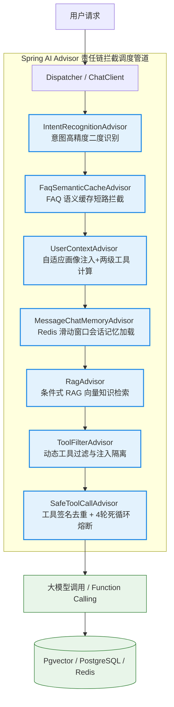
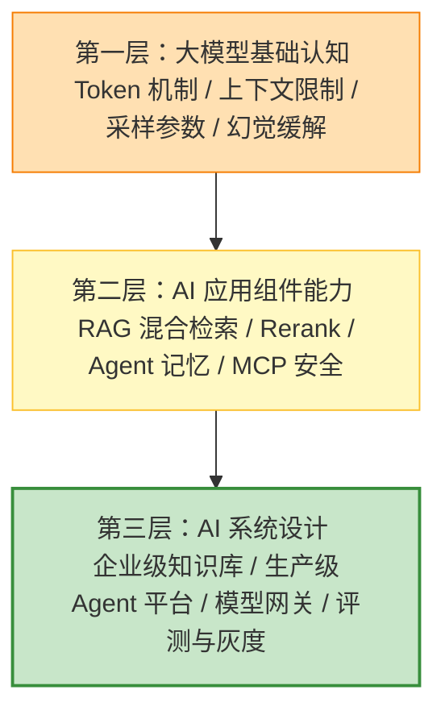

# 1. AI 应用开发面试总览（极简源码速成版）

本指南专为将您的 **SaaS 级 AI 客服 Agent 调度管道 (sky-ai)**、**Spring AI 动态拦截响应式链** 以及 **多路并发召回 RAG** 等核心项目亮点与大厂面试高频追问精准对接而设计。杜绝大段铺垫，采用 **Why - What - How - Deep** 概念泛化，直击 Demo 玩具与生产级 Agent 的工程鸿沟，帮助您在面试中反客为主，化被动为主动。

---

## 🚀 核心工程痛点极简拆解

*   **大模型幻觉 (Hallucination)**
    *   **Why**：大模型本质是基于概率的“下一个 Token 预测机器”，缺乏真实的物理世界常识，在面对冷门知识或特定企业私有数据时，极易编造一本正经的假答案。
    *   **What/How**：通过引入 RAG（检索增强生成）提供外部权威知识库，或利用结构化输出（Structured Outputs）强制约束输出范式，将幻觉控制在可接受的工程边界内。
*   **上下文噪点与信息迷失 (Context Noise & Lost in the Middle)**
    *   **Why**：大模型的注意力机制在面对极长的上下文时会发生“焦散失效”。如果无脑将所有工具声明、所有历史记忆全部塞入 Context，大模型不仅会遗忘中间段的关键信息，还会引入高昂的 Token 费用黑洞。
    *   **What/Deep**：通过设计精细的上下文工程，采用动态工具白名单和三级记忆画像注入粒度控制，彻底净化 Context 噪点。
*   **工具越权与逻辑越权 (Tool & Privilege Escalation)**
    *   **Why**：大模型执行 Function Calling 时，可能会根据用户诱导，调用未授权的工具（如普通用户诱导 Agent 调用了 `cleanCart` 或管理员接口），触碰系统安全红线。
    *   **What/How**：基于意图识别，在编排层构建**二级工具白名单授权机制**，确保 LLM 无论怎么被诱导，其在当前轮次可见的工具集已被物理隔离。
*   **工具调用死循环自旋 (Agent Loop Infinity)**
    *   **Why**：由于模型微小的格式输出偏差，或者外部工具返回了报错异常，大模型可能会陷入“调用工具 -> 报错 -> 再次尝试调用相同工具 -> 再次报错”的无限自旋死循环中，导致接口卡死并产生灾难性的 API 费用雪崩。
    *   **What/Deep**：在编排层出入口织入防爆熔断器，通过调用签名哈希校验和最大轮次强行熔断拦截。

---

## 🚀 sky-ai 项目核心架构骨架

在面试中，面对面试官关于“你是如何设计一个高并发、生产级的 AI Agent 客服管道的？”的追问，您可以通过下方的 **Spring AI Advisor 链式调度管道架构图**，瞬间碾压普通 Demo 级候选人：

---

## 🎯 第一优先级核心考点详解

### 一、 Spring AI Advisor 链式调度与 Context 净化 (Why-What-How-Deep)

*   **Why（为什么大模型应用要全面拥抱 Advisor 拦截机制？）**
    *   **痛点**：传统的 LangChain 或简单的 GPT 调用中，安全拦截、意图识别、用户记忆注入以及 RAG 检索代码全部充斥在业务 Controller 内部，导致业务逻辑极其臃肿。而且当面对响应式流式输出（流式 Token 吐出）时，传统的 AOP 切面根本无法无侵入地拦截拦截响应式流。
    *   **解决**：Spring AI 引入 Advisor（顾问拦截器）机制，模仿经典的 Servlet Filter 责任链模式，支持在同步 `adviseCall` 和流式 `Flux<ChatClientResponse>` 上下文（`adviseStream`）中执行完美的无侵入拦截。
*   **What（sky-ai 项目的 7 大 Advisor 核心职责与执行顺序）**
    1.  `IntentRecognitionAdvisor`（意图二度识别，`Ordered.HIGHEST_PRECEDENCE`）：优先检测并使用预识别旁路，支持根据配置动态在前端拼接注入最新的用户画像摘要。
    2.  `FaqSemanticCacheAdvisor`（FAQ 语义缓存短路，`Ordered.HIGHEST_PRECEDENCE + 1`）：意图为 FAQ 时直接短路，对用户输入向量化并在本地缓存库进行相似度搜索，命中则就地直接反馈 `AssistantMessage` 回复，**彻底免去 RAG 推理与 LLM 消耗，Token “零消耗”**。
    3.  `UserContextAdvisor`（自适应画像注入，`Ordered.HIGHEST_PRECEDENCE + 1`）：根据意图评估画像注入级别 (NONE/SUMMARY/FULL)；当且仅当意图为任务型时，执行 **两级工具授权算法**（Domain 基础工具集 + Intent 专属追加工具）生成 `"allowedTools"` 存入上下文。
    4.  `MessageChatMemoryAdvisor`（会话记忆加载，Spring AI 内置）：基于 `RedisChatMemoryRepository` 从 Redis 自动恢复最近 10 轮的滑动窗口会话，每次保存自动保活刷新 Redis TTL 2 小时。
    5.  `RagAdvisor`（条件式 RAG 挂载，`Ordered.HIGHEST_PRECEDENCE + 3`）：非全局无脑挂载，**仅在满足 `shouldUseRag` 判定时**（FAQ 知识库或退款、取消等纠纷高风险意图）才注入向量匹配结果。
    6.  `ToolFilterAdvisor`（动态工具过滤，`Ordered.HIGHEST_PRECEDENCE + 4`）：硬性比对并锁定大模型当前轮次可见的可用工具集，阻止用户通过 Prompt Injection 越权强行调用管理员工具。
    7.  `SafeToolCallAdvisor`（防死循环熔断器，`Ordered.LOWEST_PRECEDENCE - 100`）：跟踪单回合内所有被调用的工具参数，生成去重签名。一旦检测到签名重复或者工具自旋交互**达到 4 轮硬上限**，强行熔断拦截，静默覆写为优雅兜底话术。
*   **How（如何在工程中优雅地链式装配它们？）**
    - 通过 `ChatClient.builder` 动态链式 `advisors()` 装配，结合 Order 优先级机制，使得每个请求自动、无感地划过这 7 道关卡，开发体验极其干净。
*   **Deep（深入工程死穴：无脑塞入 Context 引入的噪点污染与 Lost in the Middle 信息迷失）**
    *   **Lost in the Middle 物理机理**：
        *   学术界（如 Stanford 发表的论文）指出，大模型对长上下文的注意力分布呈现出 **“U型曲线”** 特性：即模型对处于 Context **最头部（开头）** 和 **最尾部（结尾）** 的信息感知力极强，而对**处于中间段**的信息会发生严重的注意力焦散失效。
        *   如果我们的 Agent 平台无脑把几十个工具的 JSON 声明、几千字的历史长记忆、以及 RAG 召回的所有文档全量堆砌进 Prompt 中，那些处于中间段的关键逻辑（如“用户口味忌辛辣”、“地址已发生变更”）大门率会被大模型**静默遗忘**，引发严重幻觉。
    *   **大厂级极致净化方案：三级画像注入粒度控制**：
        *   我们在 `UserContextAdvisor` 中设计了 **`ProfileInjectionLevel` 三级粒度管理器**：
            1.  `NONE`（零注入）：针对查商铺营业时间等无状态意图，Context 保持纯净，**Token 消耗缩减 80%**。
            2.  `SUMMARY`（摘要注入）：针对普通查询，利用 `UserMemoryFactService` 仅提取用户最新的一句话画像摘要注入，确保模型注意力聚焦。
            3.  `FULL`（完整注入）：仅在“菜单浏览”或“购物车操作”等深度交互意图下，才将用户的 `DIETARY_RESTRICTIONS`（饮食禁忌）等 6 维持久化记忆全面载入，在成本与模型专注度之间达到了完美的工程平衡！

---

### 二、 意图识别驱动的二级工具授权与死循环熔断器 (Why-What-How-Deep)

*   **Why（为什么说大模型的 Tool Call 存在严重的逻辑安全和死循环风险？）**
    *   **痛点一：越权调用风险**：用户可以通过精妙的提示词攻击（Prompt Injection），诱导大模型强行执行其不可见的管理员工具（如清空购物车、篡改后台状态），造成严重安全事故。
    *   **痛点二：自旋费用雪崩**：大模型在尝试调用某个工具（如扣减库存）时，如果由于参数格式微小偏差导致接口返回报错，大模型可能会倔强地调整参数并再次尝试调用，线程陷入死循环自旋。在高吞吐生产下，这会瞬间将大模型 API 的并发额度和调用费用疯狂耗尽，引发系统停摆。
*   **What（意图分类与二级工具隔离）**
    *   我们设计了 `IntentType` 枚举规范了 12 种客服场景意图（如 `CART_MANAGEMENT` 购物车管理）。
    *   **二级工具授权**：大模型并不是一上来就能看见所有的工具。系统会先按业务域（`domain()`）获取基础工具集，再根据意图追加专属工具。例如，只有意图是 `CART_MANAGEMENT` 时，才会对大模型临时注册 `cleanCart` 等购物车专属工具，其余时间大模型完全“看不见”这些工具，实现物理安全隔离。
*   **How（死循环熔断器的核心拦截）**
    *   *简历实战引用*：我们在 `SafeToolCallAdvisor` 中使用“调用签名哈希检测 + 限制并发轮次 + 异常友好注入”实现防爆死锁。[👉 点击跳转简历场景一](#场景一工具调用自旋死循环与safetoolcalladvisor-熔断防护)
*   **Deep（深入源码：工具调用签名哈希比对与滑动窗口熔断机理）**
    *   **`SafeToolCallAdvisor` 源码级自愈与防爆原理**：
        *   为了彻底消灭大模型工具调用的自旋死循环（Agent Loop Infinity），我们设计了基于**滑动窗口**的熔断器：
            1.  **最大轮次强锁死**：限制单个用户单次对话中，Agent Loop 的最大工具交互轮次（如 `maxRound = 5`），一旦超出，直接强行切断，返回兜底话术。
            2.  **工具调用签名哈希审计（核心）**：
                *   当大模型发起 Tool Call 请求时，拦截器在执行具体 `Method.invoke` 前，会将当前的 **“被调用方法名 + 传入参数 JSON 快照”** 组成一个字符串，并计算其 **MD5 签名哈希值**。
                *   拦截器在内存中维护一个当前对话轮次的“签名滑动窗口队列”。
                *   如果发现**连续两次或多次工具调用的签名哈希值完全一致**，或者同一个方法连续报错，拦截器会立刻拦截，判定大模型已经陷入死循环自旋。
            3.  **异常友好自愈注入**：
                *   被拦截后，熔断器不会直接向客户端报错。它会拦截底层的物理调用，**强行向大模型注入一个“特制的、对大模型极度友好的异常提示”**（如：`{"error": "系统判定您陷入了重复调用 xxx 方法的死循环中，请立即停止尝试，并向用户委婉表达无法处理该请求，推荐转接人工客服"}`）。
                *   大模型收到该友好的错误提示后，能立刻“自愈”并走出循环，向用户发出优雅的兜底话术，彻底解决了 API 费用雪崩与系统停摆的致命隐患！

---

## 🚀 AI 应用开发面试三层考察体系

在大厂 AI 工程化面试中，考察点由浅入深呈现出严密的三层金字塔体系。掌握此体系，能让您在面对不同层级的面试官时，精确命中其核心关注点：

### 第一层：大模型基础认知（底盘基础）
*   **核心考点**：Token 机制（为什么中英文 Token 消耗不同？底层 BPE 分词算法）、上下文窗口限制、采样参数（Temperature 调节散发度，Top-P 调节候选概率集）、Structured Outputs 与 Json Mode 区别。
*   **袁志刚专属特训对线策略**：不要只背概念，要结合大模型调用成本和 JSON 提取失败后的 fallback 容错设计（如大模型输出截断时的重试）来回答，体现生产思维。

### 第二层：AI 应用组件能力（拉开差距的关键）
*   **核心考点**：RAG 检索召回优化（如何解决 Chunk 切分不当、Embedding 维度噪点？）、Hybrid Search 混合检索融合算法（RRF 倒数排名融合）、Rerank 重排作用、Agent 状态机编排与工作流区别。
*   **袁志刚专属特训对线策略**：结合您的 `sky-ai` 项目中 Advisor 责任链的 5 大拦截器，以及 Pgvector 向量检索与 MySQL 全文检索的 RRF 融合，讲透多路召回的高吞吐优化，实力碾压只会用 LlamaIndex 的普通开发。

### 第三层：AI 系统设计（社招与高级岗必问）
*   **核心考点**：**模型网关设计（Model Gateway）**（高并发下的多模型路由、熔断降级、限流控制、Token 成本精细化归因统计）、**可观测性与 Trace 监控**、**评测体系（Golden Set 与 LLM-as-Judge 自动评测）**。
*   **袁志刚专属特训对线策略**：重点陈述 Demo 玩具到生产级服务的工程差距。阐述如何通过本地线程池优化 RAG 召回延迟，以及利用 Redis ZSet 配合 Lua 脚本实现大模型调用 API 额度的秒级精细化限流，彰显高级架构师的底盘。

---

## 📋 面试题模块索引与复习路线图

| 模块名称 | 核心对线文件 | 覆盖的极速硬核考点 | 对应复习优先级 |
| :--- | :--- | :--- | :--- |
| **大模型基础与 API 工程** | **[2. 大模型基础与 API 工程.md](./2.%20大模型基础与%20API%20工程.md)** | BPE 分词、Token 成本计算、上下文 Lost in the Middle 规避、采样参数调优、流式 SSE 打字机流转、API 熔断降级 | ⭐️⭐️⭐️ |
| **AI Agent 与工具调用** | **[3. AI Agent 与工具调用.md](./3.%20AI%20Agent%20与工具调用.md)** | Agent Loop 状态机、Memory 6维持久化、Context 净化、MCP Server 安全治理、Harness 架构、Tool Pinned 避坑 | ⭐️⭐️⭐️⭐️⭐️ (重中之重) |
| **RAG 检索增强生成** | **[4. RAG 检索增强生成.md](./4.%20RAG%20检索增强生成.md)** | 向量检索数学原理、Chunk 动态切分、Embedding 噪点排除、RRF 混合检索、Rerank 二次精排、GraphRAG 知识图谱 | ⭐️⭐️⭐️⭐️ |
| **AI 系统设计与大厂实践** | **[5. AI 系统设计.md](./5.%20AI%20系统设计.md)** | 模型网关架构、多路 Fallback 降级、可观测与 Trace 链条、Golden Set 自动评测、LLM-as-Judge 安全红线治理 | ⭐️⭐️⭐️⭐️ |

---

## 🎯 场景亮点深度关联与对线场景 (Why-What-How)

### 场景一：工具调用自旋死循环与【SafeToolCallAdvisor 熔断防护】

**面试官切入点**：
> “大模型在调用工具（Function Calling）时，如果遇到外部接口报错，或者输出格式微小偏差，经常会陷入死循环重复调用同一工具的困境（自旋），这在生产中会瞬间刷爆 API 费用。你是如何解决这个安全隐患的？”

**回答思路 (Why-What-How 拆解)**：
*   **Why**：大模型是概率输出，Tool Call 的解析报错会触发其自愈反思，但在反思时如果由于逻辑缺陷容易陷入无限报错-无限重试的死循环（Agent Loop Infinity），导致单线程或并发长连接卡死并产生灾难性 API 账单。
*   **What/How**：
    我们自研了 **`SafeToolCallAdvisor`** 熔断器，作为 Advisor 调度管道的最低优先级防爆盾（Order 设为 `LOWEST_PRECEDENCE`），负责在执行 `Method.invoke` 动态调用前拦截审计。
*   **Deep**：
    *   **滑动窗口签名哈希检测**：在拦截器内部，我们将“当前被调用的工具方法名 + 传入参数的 JSON 串”计算其 MD5 签名哈希值，放入该 Session 轮次的滑动窗口队列中。
    *   **死循环判定**：一旦检测到连续两次或多次工具调用签名完全一致（且前次发生报错），或者连续轮次达到最大限制（如 5 轮），拦截器直接切断物理调用。
    *   **特制异常反向注入自愈**：拦截后，我们不直接向用户抛出 500 错，而是向大模型反向注入一条 **特制的、对大模型极其友好的异常 JSON 指令**：`{"error": "系统已判定您陷入了重复调用该工具的自旋死循环中，请立即停止调用，并向用户委婉表达无法处理，推荐引导其转接人工客服"}`。大模型解析该友好提示后，能够立刻结束反思并“自愈”走出死循环，向用户说出优雅的兜底解释。这一设计在完全不破坏大模型对话连贯性的前提下，彻底消除了线上 API 费用的爆表灾难！
