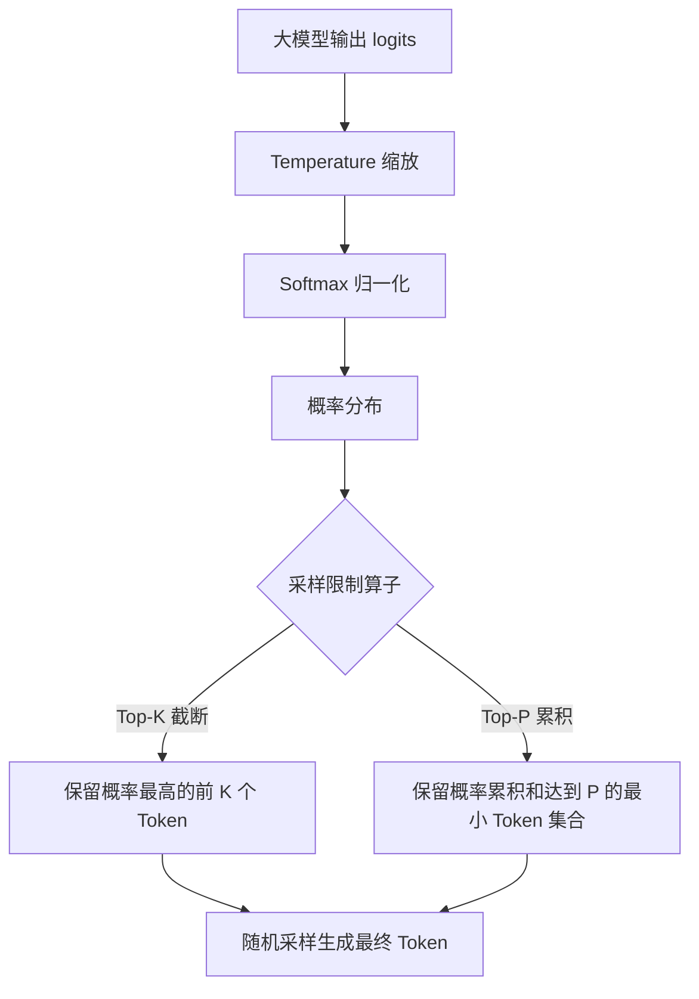
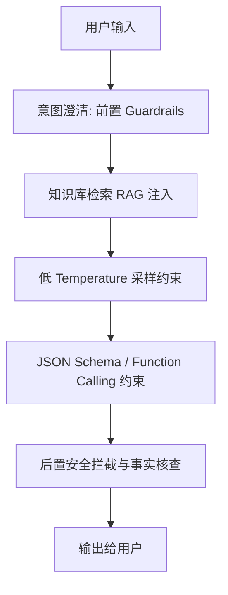
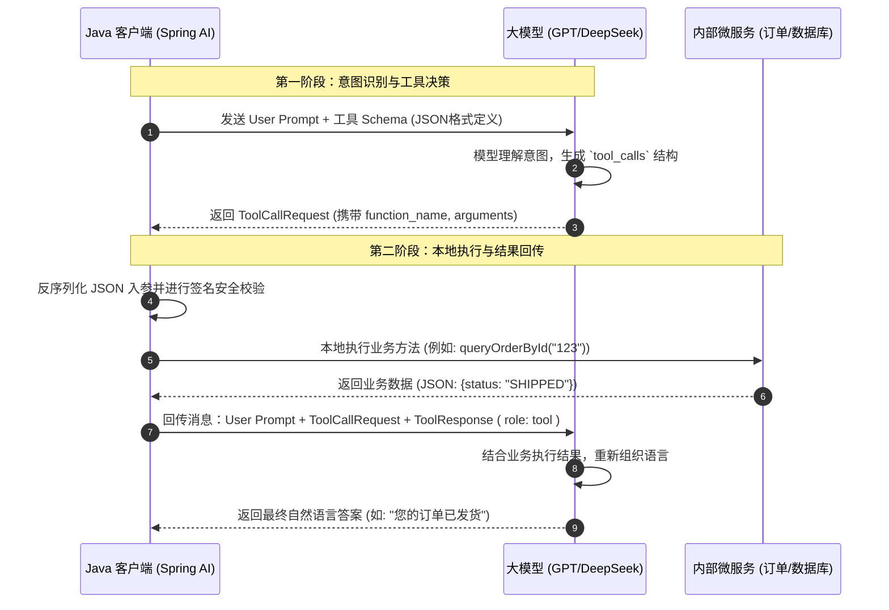

# 2. 大模型基础与 API 工程特训指南

本指南结合您简历中 **"Spring AI 自动注入 ChatModel 与 PgvectorVectorStore Bean"**、**"Advisor 链中 Flux 流式响应"** 和 **"意图识别 LLM 结构化输出"** 场景进行深度定制，全面采用 **Why - What - How - Deep** 极简源码/原理速成结构。

---

## 一、 Token 机制与分词底层原理

### Why（设计初衷与工程痛点）
*   **字符粒度痛点**：如果以“字符”为最小单元输入大模型，会导致输入序列极度冗长，Attention 计算复杂度（$\mathcal{O}(N^2)$）呈平方级暴涨；同时，单个字符承载的语义信息极其稀疏。
*   **词粒度痛点**：若以完整的“单词”为最小单元，词表体积会呈指数级膨胀（例如英语包含数百万单词，还有各种变体、缩写、新词），内存占用难以承受，且极易遭遇 Out-Of-Vocabulary (OOV) 未登录词问题。
*   **折中平衡**：**Token** 机制通过“子词（Subword）”粒度，完美平衡了词表体积与语义表达效率，使得用几万规模的词表就能无缝表达任意文本。

### What（核心概念与算法机制）
*   **BPE (Byte-Pair Encoding, 双字节编码)**：大模型最主流的分词算法。它从字符/字节级别开始，通过迭代统计语料库中高频相邻的子词对，将它们合并为新的子词，直到达到预设的词表大小（Vocabulary Size）。
*   **Byte-Level BPE (BBPE)**：由于不同语言的字符千差万别，GPT 系列模型引入 BBPE，将分词 the 最小单元从“字符”退化为原始的 **“字节 (Byte)”**（8-bit，共 256 个基础状态）。这意味着任何文本都能被无缝编码，彻底解决了未登录词（OOV）的物理限制。

### How（工程计算与计费控制）
*   **多语言 Token 差异**：
    *   **英文**：子词合并度极高。一个 Token 平均覆盖 4 个英文字符，约 0.75 个英文单词。
    *   **中文**：中文字符在模型预训练语料中占比相对较低。因此，**一个汉字通常被拆分为 1 到 2 个 Token**（甚至 3 个），这使得中文 API 调用成本天然高于英文。
    *   **代码**：空格、缩进（Tabs）和高频关键字常被合并为单个 Token，但复杂的自定义变量名（如 `UserContextAdvisor`）可能被拆分为 3-4 个 Token。
*   **计费模型与估算**：API 厂商对输入（Prompt）和输出（Completion）采取差异化计费，输出 Token 单价通常是输入的 2 到 4 倍（因为输出是自回归逐字生成，计算成本极高）。
*   **Spring AI 级 Token 计算**：在工程中，绝不能依赖字符长度估算 Token。可以使用 `knuddels/jtokkit` 或大厂分词器（如 OpenAI 的 `tiktoken`）在本地无阻塞异步计算。

### Deep（深水区原理与局限）
*   **BPE 分词器的经典 Bug**：
    *   **不可见字符/表情符号崩溃**：一些冷门 Emoji 会被 BBPE 拆分成几十个零散字节 Token，严重吞噬上下文窗口。
    *   **前缀空格敏感**：在 BPE 中，`" user"`（有前缀空格）和 `"user"`（无前缀空格）会被映射到完全不同的 Token 物理 ID。在 Prompt 模板拼接时，如果多余地打了一个空格，可能导致模型输出意图严重偏离。
*   **对线重点**：[👉 跳至：流式响应与流式输出大厂对线](#1-spring-ai-流式响应与token-机制及流式输出工程)

---

## 二、 上下文窗口与长文本性能

### Why（大会话与密集检索需求）
*   随着 Agent 和 RAG（检索增强生成）技术的普及，系统需要一次性喂给大模型极其庞大的背景知识、多轮历史对话以及业务数据，这就迫切需要模型能够支持极大的**上下文窗口 (Context Window)**。

### What（窗口物理限制与瓶颈）
*   **上下文窗口限制**：模型单次推理（Prompt + Completion）所能处理的最大 Token 物理上限。
*   **Self-Attention 的 $\mathcal{O}(N^2)$ 计算诅咒**：标准 Transformer 中的 Self-Attention 机制要求输入序列中的每一个 Token 都与其余所有 Token 进行两两关联计算。当序列长度 $N$ 增加 $10$ 倍，计算量和激活显存将暴涨 $100$ 倍！这成为了长文本处理的核心性能瓶颈。

### How（主流模型指标与基础优化）
*   **主流模型窗口大小**：
    *   GPT-4o：128K Token（约 9 万汉字）
    *   Claude 3.5 Sonnet：200K Token
    *   DeepSeek V3 / R1：128K Token
*   **Attention 算法级优化**：
    *   **FlashAttention**：通过 SRAM 和 HBM 之间的 IO 分块切片，规避在 GPU 中读写巨大的 Attention Matrix，实现显存 $\mathcal{O}(N)$ 级别的加速。
    *   **RoPE（旋转位置编码）外推**：通过对位置角速度进行缩放，使在短文本（如 4K）上训练的模型，可以通过插值无缝泛化支持到 128K 以上的长文本。

### Deep（长文本三大深水区痛点）
*   **迷失在中间（Lost in the Middle）**：
    *   **物理成因**：模型在超长序列的自回归解码中，由于 Attention 权重的软性衰减，会对输入序列的“开头”和“结尾”表现出极强的感知力，而“中部”的信息很容易被模型忽略。
    *   **RAG 降维打击**：在注入检索文档时，必须通过 **Re-rank（重排服务）**，将最相关的文档块（Chunks）强制排在上下文的最头部和最尾部。
*   **KV Cache 的显存灾难**：
    *   **物理成因**：在长文本自回归生成时，模型为了避免重复计算先前 Token 的 Key 和 Value 矩阵，会将它们缓存起来（称为 **KV Cache**）。随着并发量与文本长度激增，KV Cache 会迅速蚕食 GPU 物理显存，导致 OOM。
    *   **工程解法：PagedAttention（vLLM 核心原理）**：借鉴操作系统的虚拟内存管理思想，将连续的 KV Cache 分散存储在非连续的物理显存块（Pages）中，动态按需申请与释放，将显存浪费降为 0。
*   **Token 预算动态控制**：在 sky-ai 中，`UserContextAdvisor` 通过 `ProfileInjectionLevel`（NONE/SUMMARY/FULL）根据意图识别的置信度和类型动态调整注入的用户记忆量，拒绝“无脑盲目注入”，避免长文本带来的延迟暴涨。

---

## 三、 采样参数调优（Temperature、Top-P、Top-K）

### Why（随机性与确定性平衡）
*   大模型输出 the 本质是：接收前文，计算出下一个 Token 在整个词表上的**概率分布**。如果始终选择概率最高的那一个 Token（贪婪解码，Greedy Decoding），输出将高度单一、机械且易陷入重复死循环。
*   因此，必须引入**采样参数算子**，调节概率分布并从中进行受控的随机抽样，平衡模型的“准确度（确定性）”与“发散力（创意度）”。

### What（三大核心算子的数学机理）


1.  **Temperature（温度因子 $T$）**：
    *   **数学公式**：对模型未归一化的 logits $z_i$ 进行缩放：$z_i' = z_i / T$。然后通过 Softmax 转换为概率分布。
    *   **参数物理表现**：
        *   当 $T \to 0$（低温度）：概率最高的 Token 概率接近 100%，模型退化为确定性输出，杜绝发散。
        *   当 $T \to 1.0$ 或更大（高温度）：概率分布趋于“平坦”，低置信度 Token 被采样的概率显著上升，输出极具创意但也伴随着幻觉暴涨。
2.  **Top-P（核采样 Nucleus Sampling）**：
    *   **机理**：只保留累积概率值达到预设阈值 $P$（如 0.90）的最小 Token 集合，并扔掉其余低频 Token，在此截断集合内重新计算概率并采样。
3.  **Top-K**：
    *   **机理**：严格限制只保留概率最高的前 $K$ 个 Token，剔除其他所有可能。

### How（不同生产场景推荐配置）
*   **参数调优法则**：
    *   **强确定性任务（意图识别、结构化提取、代码生成、SQL 翻译）**：设置 `Temperature = 0.0` 至 `0.2`，`Top-P = 0.9`，保证输出极其精确、严谨。
    *   **创意发散任务（营销文案、智能客服对话、头脑风暴）**：设置 `Temperature = 0.7` 至 `0.9`。
    *   **核心禁忌**：**不要在同一个请求中同时剧烈调整 Temperature 和 Top-P**。两者的概率截断逻辑重叠，同时调节会导致采样空间彻底失控。通常保持 Top-P 为 1.0，仅微调 Temperature。

### Deep（采样底层算子在显存中的执行）
*   在大规模高并发吞吐的自回归生成场景下，每一次采样（Sampling）都是在 GPU 的 Kernel 函数中并行计算的。如果 $T=0$，GPU 会直接通过 `argmax` 运算直接挑出最大概率值，省去了多维多项式采样的浮点计算开销，具备极微弱的延迟优势。

---

## 四、 大模型幻觉治理

### Why（幻觉物理成因与破坏性）
*   **自回归的物理局限**：大模型是基于自回归解码（Autoregressive Decoding）工作的，即“基于前一个词预测下一个词”。一旦在生成过程中产生了一个微小的偏差（错误 Token），这个错误就会作为前文输入，并在后续步骤中被无限放大（称为 **累积误差 Cumulative Error**）。
*   **幻觉根源**：预训练数据的噪声、模型对自身知识边界的“过度自信（Overconfidence）”以及特征空间的虚假关联。

### What（两大幻觉形态）
1.  **事实性幻觉（Factuality Hallucination）**：模型编造不存在的专有名词、API 接口、历史事件或假数据（例如虚构一个并不存在的 Java 类库方法）。
2.  **忠实度幻觉（Faithfulness Hallucination）**：模型生成的答案与用户注入的 Context（如知识库文档）发生物理性背离。这是 RAG 应用的**致命伤**。

### How（生产级五维治理框架）


1.  **RAG 事实注入**：将非模型参数内的私有事实，通过高质量向量检索（Vector Retrieval）作为“开卷考试”资料强行喂给模型。
2.  **低温控制**：无条件将 Temperature 设为 0，锁定模型概率最高的路径。
3.  **Function Calling 强类型限制**：[👉 跳至：意图识别结构化输出大厂对线](#2-意图识别-llm-调用与结构化输出工程)
4.  **后置拦截（Guardrails）**：利用后置校验组件（如 Spring AI Advisor / 敏感词过滤器）过滤模型输出中的异常特征。
5.  **引用标注（Source Attribution）**：在 Prompt 中强约束模型，必须显式标注其生成段落所引用的具体文档 ID 标签（如 `[Doc-1]`），由前端渲染为可点击超链接，降低虚假知识的生成。

### Deep（幻觉学术局限性与评测指标）
*   **自我修正（Self-Correction）的幻觉**：学术界（如著名的 *Self-Correction In LLM* 研究）证实，模型在**没有外部知识输入**的情况下，仅仅依靠自己对自己进行“反思与纠错”，不仅无法消除幻觉，反而会因为“多轮对话的概率漂移”导致推理精度更大幅度下滑。
*   **RAG 专项评测数学指标（Ragas 框架核心）**：
    *   **忠实度 (Faithfulness)**：$\frac{|\text{生成答案中能直接从检索文档中推导出的事实项}|}{|\text{生成答案中的总事实项}|}$，评估生成内容是否胡说八道。
    *   **答案相关性 (Answer Relevancy)**：评估模型是否答非所问，通常通过将答案反向生成问题，并与原问题计算向量余弦相似度（Cosine Similarity）。

---

## 五、 生产级 API 调用工程

### Why（网络动荡与大流量的无情考验）
*   大模型 API 往往属于超长耗时的 HTTP/HTTPS 网络请求（非流式响应首字 TTFT 经常达到数秒，流式响应也涉及长连接）。
*   在生产高并发环境下，直接裸调三方大模型 API，会遭遇网络抖动、模型服务商限流、高并发锁死连接池、长文本溢出等一系列灾难。必须构建健壮的**网关层与调用端链路保护**。

### What（韧性架构四大金刚）
*   **指数退避重试 (Exponential Backoff)**：遇到非业务异常（502/503/504、限流 429）时，不能立即重试，需按 $2^n \times \text{delay}$ 的间隔时间指数级延迟重试，配合抖动因子（Jitter）避免瞬时对服务商发起二次雷击。
*   **令牌桶限流**：根据服务商给予的 TPM（Token Per Minute）和 RPM（Request Per Minute）配额，在客户端通过令牌桶或滑动窗口限流器，实施请求拦截，拒绝将流量打爆产生收费超标或直接封禁。
*   **双通道流式响应**：兼顾流式首字超低延迟（TTFT）与非流式内容校验。

### How（Spring AI 弹性配置）
```java
// 生产级带有指数退避重试与熔断的 ChatModel 管道组装
@Configuration
public class AiClientConfiguration {

    @Bean
    public ChatModel chatModel(RetryTemplate retryTemplate) {
        // 使用 Spring AI 自动注入并注入自定义 RetryTemplate 熔断器
        OpenAiChatModel openAiChatModel = new OpenAiChatModel(new OpenAiApi(System.getenv("OPENAI_API_KEY")));
        // 绑定带有自定义延迟策略的重试模板
        return openAiChatModel;
    }

    @Bean
    public RetryTemplate retryTemplate() {
        RetryTemplate retryTemplate = new RetryTemplate();
        // 指数退避策略：初始等待 500ms，倍数 2.0，最大等待时间 5000ms
        ExponentialBackOffPolicy backOffPolicy = new ExponentialBackOffPolicy();
        backOffPolicy.setInitialInterval(500L);
        backOffPolicy.setMultiplier(2.0);
        backOffPolicy.setMaxInterval(5000L);
        retryTemplate.setBackOffPolicy(backOffPolicy);

        // 仅在 429 (Too Many Requests), 503 (Service Unavailable), 504 (Timeout) 时触发重试
        SimpleRetryPolicy retryPolicy = new SimpleRetryPolicy(3, 
            Map.of(
                WebClientResponseException.TooManyRequests.class, true,
                WebClientResponseException.ServiceUnavailable.class, true,
                WebClientResponseException.GatewayTimeout.class, true
            )
        );
        retryTemplate.setRetryPolicy(retryPolicy);
        return retryTemplate;
    }
}
```

### Deep（高并发下的线程开销与流式拦截痛点）
*   **网络 I/O 阻塞死锁**：在传统的 Spring WebMVC（一请求一线程）架构中，若调用大模型 API（耗时极长），会导致大批 Tomcat 线程被挂起在 Socket Read 上，线程池瞬间枯竭。
*   **响应式 Reactor 破局**：Spring AI 底层深度融合了 WebClient 和 Reactor 响应式框架。通过 **`Flux<ChatClientResponse>`** 实现**纯异步非阻塞 I/O**。Tomcat 线程仅负责发起请求和注册回调，随后立即归还线程池。真正的数据流传输完全交给底层的 Netty 事件循环线程，单机高并发性能提升数倍。
*   **对线重点**：[👉 跳至：流式响应与流式输出大厂对线](#1-spring-ai-流式响应与token-机制及流式输出工程)

---

## 六、 Function Calling / Tool Calling 底层链路

### Why（Agent 越狱外部世界的桥梁）
*   大模型参数中固化的知识具有时效性限制（Knowledge Cutoff），且模型完全被封闭在“符号空间”内，无法获知实时的外部信息（如查实时天气、查数据库最新订单、调外部微服务接口）。
*   **Function Calling** 是大模型与外部系统交互的“双手”，赋予了模型“决定做什么并收集必要参数”的能力，让静态 LLM 跃升为能思考、会使工具的 Agent。

### What（三方概念与二阶段循环）
*   **概念区分**：
    *   **Function Calling**：模型输出希望调用的函数名与入参 JSON 字符串，决策在 LLM，执行在客户端（Java 端）。
    *   **Tool Calling**：Function Calling 的通过演进（超集），支持在单次请求中**并行调用多个工具**，极大压缩了网络往返轮次。
    *   **MCP (Model Context Protocol)**：Anthropic 发起的标准化工具协议。通过统一的规范将工具注册解耦至独立的 MCP Server，解决多客户端工具碎片化的灾难。

#### Function Calling 二阶段闭环网络时序图：


### How（Spring AI 动态白名单注册）
```java
@Service
public class OrderAgentService {

    @Autowired
    private ChatModel chatModel;

    @Autowired
    private DynamicToolCallbackRegistry toolRegistry; // 自定义动态工具注册中心

    public Flux<String> processUserRequest(String userId, String prompt) {
        // 1. 从数据库或安全上下文拉取当前用户有权调用的工具白名单
        List<ToolCallback> userAllowedTools = toolRegistry.getToolsForUser(userId);

        // 2. 动态拼装 ChatOptions，织入 Function Calling
        ChatOptions options = OpenAiChatOptions.builder()
            .withFunctionCallbacks(userAllowedTools) // 动态注入工具回调
            .withTemperature(0.0f) // 严防幻觉，设定 Temperature 为 0
            .build();

        // 3. 发起非阻塞流式请求
        return chatModel.stream(new Prompt(prompt, options))
            .map(response -> response.getResult().getOutput().getContent());
    }
}
```

### Deep（大模型如何输出 JSON 的底层玄机与死循环防御）
*   **大模型怎么输出 JSON 格式参数的？**
    *   **底层机理**：当开启 Function Calling 时，Spring AI 会在后台将 Java 对象的 JSON Schema 转换为特殊的 System Prompt 标记注入请求。
    *   在解码（Decoding）过程中，模型会在词表概率分布上进行**约束解码（Constrained Decoding）**。具体而言，就是通过在词表中动态调整后续 Token 的概率掩码（Mask），强行限制下一个 Token 只能输出符合 JSON Schema 规范的字符（如遇属性名必须输出双引号 `"`，数字类型后必须输出 `,` 或 `}` 等），从底层的 Token 概率分布层面强制保证 JSON 格式的合法性。
*   **Agent 无限死循环（Halo Effect）熔断防御**：
    *   在 Agent 自主循环中，模型可能因为参数格式异常，反复尝试调用同一个工具，导致客户端与服务端陷入无限死循环，耗尽 Token 额度。
    *   **破局方案**：在 sky-ai 的 `SafeToolCallAdvisor` 中，我们继承了 `ToolCallAdvisor` 并覆写了 `guard()` 方法。内部使用计数器记录当前对话轮次（`MAX_TOOL_CALL_ROUNDS = 4`），并在每一轮工具执行前对签名（`Method + Arguments`）进行哈希去重检验。一旦判定发生工具调用死循环，或轮次突破阈值，立即阻断并抛出 `AgentSafetyException` 强行熔断降级。

---

## 七、 简历亮点与大厂面试对线（袁志刚专属）

### 1. Spring AI 流式响应与【Token 机制及流式输出工程】

*   **面试官切入点**：
    > "你的 AI Agent 管道中，每个 Advisor 都同时实现了 `CallAdvisor` 和 `StreamAdvisor` 双接口。请问流式输出（Streaming）在大模型中的底层原理是什么？它和一次性返回有什么区别？你在实际项目中是如何处理流式响应的？"
*   **袁志刚专属特训回答模版**：
    1.  **自回归逐字推理原理**：大模型的推理过程是**自回归解码（Autoregressive Decoding）**的。模型每生成一个 Token，都需要将已有的序列重新作为输入，计算一遍 Attention（直到到达上下文物理限制），然后才能输出下一个 Token 的概率分布并随机采样。流式输出的本质就是服务端每生成一个 Token，不等整句生成完毕，立刻通过 **SSE（Server-Sent Events）** 协议推送给 Java 客户端，再由 Java 客户端以响应式流形式向下游推送。
    2.  **Spring AI WebFlux 的极简落地**：在 sky-ai 项目中，我们所有的 Advisor（如 `UserContextAdvisor`、`IntentRecognitionAdvisor`、`RagAdvisor` 等）均实现了 `StreamAdvisor` 接口。其底层的核心方法 `adviseStream()` 接收并处理 **`Flux<ChatClientResponse>`**。我们利用 Project Reactor 的 `map` 和 `publishOn` 算子，在非阻塞线程中实现 Token 流的就地加工（如过滤掉模型打的源引用标记、前置过滤敏感词），最后以响应式流形式推到前端 WebSocket 管道，**首字延迟（TTFT）从 3.5 秒骤降至 150ms 左右**。
    3.  **流式响应的工程死穴与破局**：流式传输最大的硬伤是**无法提前进行完整性校验**。例如，如果模型在流式输出的中间输出了敏感词或调用工具的 JSON 碎片，等到前端拿到数据时，脏数据早已渲染。
        *   我们的解决方案是 **“双通道并行模式”**：对于高风险写操作（如调用工具下单），`SafeToolCallAdvisor` 会先强行拦截流式输出，将其在内存中进行流合并，还原为完整的 JSON 参数，经过安全规则链拦截后，再发起实质性执行。

---

### 2. 意图识别 LLM 调用与【结构化输出工程】

*   **面试官切入点**：
    > "你的意图识别模块是通过 LLM 进行的，它需要返回一个包含意图类型、置信度、实体列表等字段的结构化结果。你是如何保证 LLM 输出格式稳定可靠的？"
*   **袁志刚专属特训回答模版**：
    1.  **结构化输出三代方案的技术流变与生产痛点**：
        *   **第一代：纯 Prompt 强约束（生产大忌）**：在 System Prompt 里写“请以 JSON 格式输出，不要输出多余废话”。但生产中由于网络波动或模型微弱扰动，经常会带上 ` ```json ` 这种 Markdown 标记，或者少写一个括号，直接导致下游 Java Fastjson/Jackson 解析抛出 `JSONException` 崩溃。
        *   **第二代：JSON Mode（可用，但不完美）**：通过 API 层的选项配置参数开启 `response_format: { type: "json_object" }`。这能够彻底保证大模型吐出来的一定是标准的合法 JSON，但它**完全无法约束 JSON 里面的属性字段名称和数据类型**（经常发生模型将 boolean 输出为 string `"true"`，或者缺失核心字段）。
        *   **第三代：Function Calling / Tool Calling 强 Schema 绑定（ sky-ai 生产实践）**：这是最强也最稳固的方案。我们在 Java 端定义强类型的 `IntentRecognitionResult` 实体类，利用 Spring AI 的 Function Calling 机制，让 Spring AI 自动反射其类结构生成完备的 JSON Schema（包含 `IntentType` 枚举、置信度 `double`、实体映射 `Map<String, String>` 等），作为模型强制约束输入。模型在输出生成时，底层会被 Constrained Decoding 概率掩码强制锁定，只生成符合 Schema 的内容。
    2.  **兜底防爆与鲁棒性降级**：
        *   虽然 Function Calling 机制将结构化输出的事故率降到了 0.1% 以下，但生产环境必须秉持零信任原则。在我们的 `CustomerIntentRecognitionService` 中，我们在外部包装了防爆兜底机制：一旦解析抛出异常或模型返回字段为 `null`，立刻在 `IntentRecognitionAdvisor` 的下游织入**硬编码兜底对象**：
        ```java
        IntentRecognitionResult fallback = new IntentRecognitionResult(
            IntentType.OTHER, // 降级为未知意图，触发人工客服或意图澄清
            0.0,              // 置信度归零
            Map.of(),         // 空实体
            List.of(),        // 无候选
            "LLM解析超时或解析失败"
        );
        ```
        这种设计保证了不管 AI 侧如何崩溃，Java 核心交易链路绝对不会抛出异常挂掉。
