# 算法复习

### 最短路径

#### Dijkstra

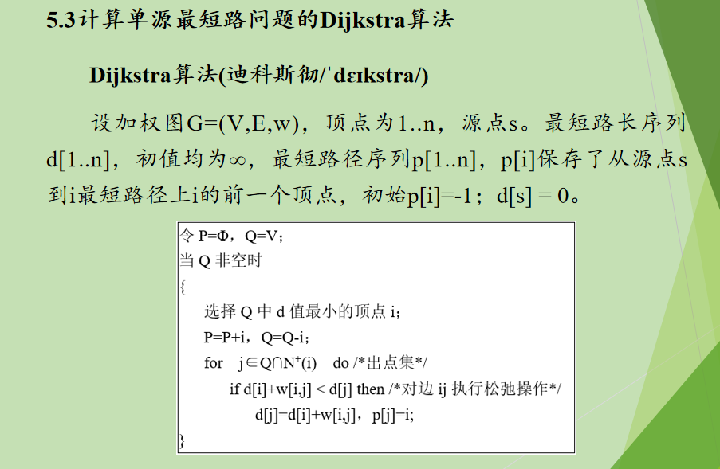

#### BFM

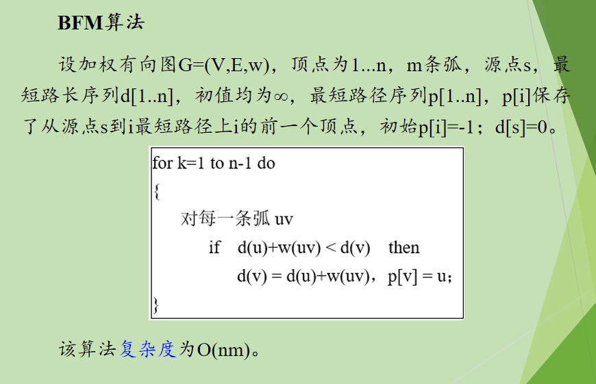

#### 传递闭包

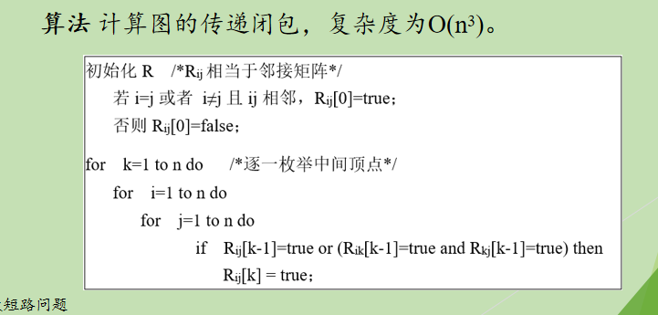

### 最小生成树

#### 生成树的悬挂序列

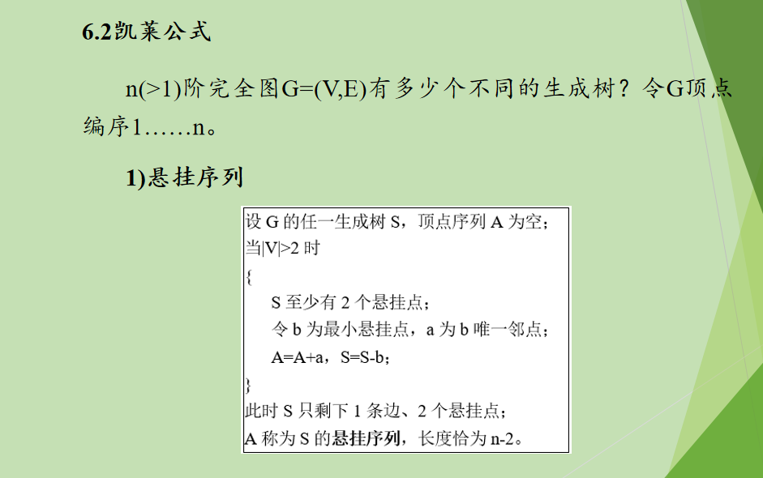

#### Kruskal

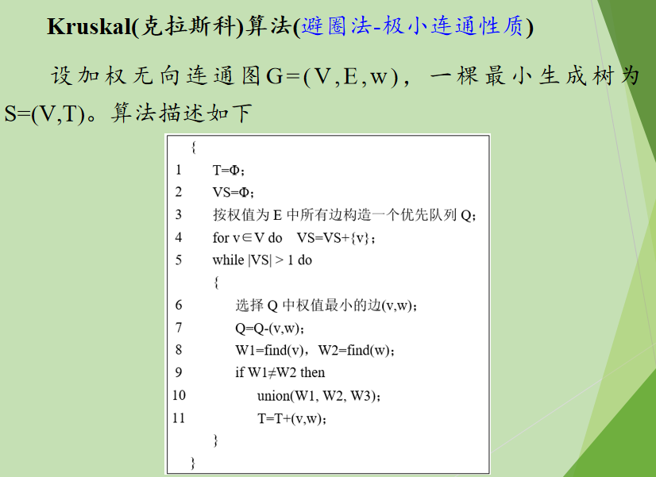

#### Prim

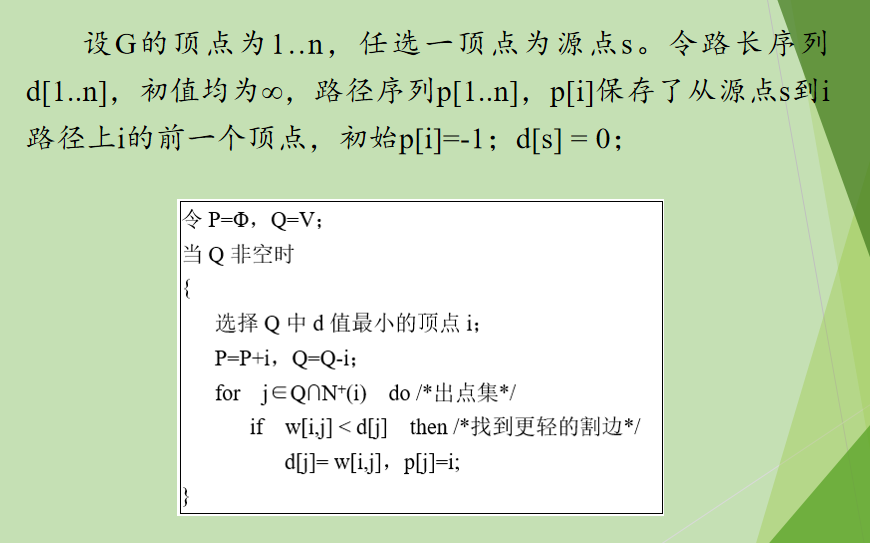

### 匹配

#### 霍尔定理

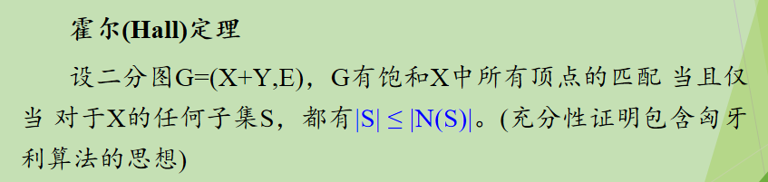

#### 饱和X匈牙利算法

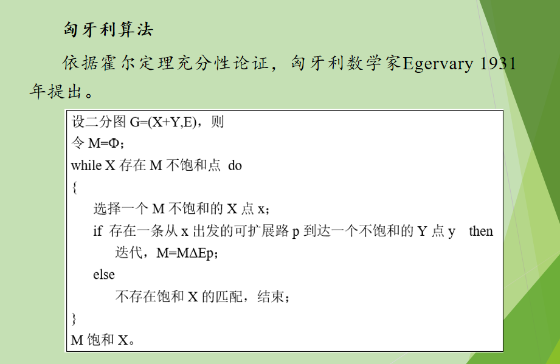

#### 最大匹配匈牙利算法

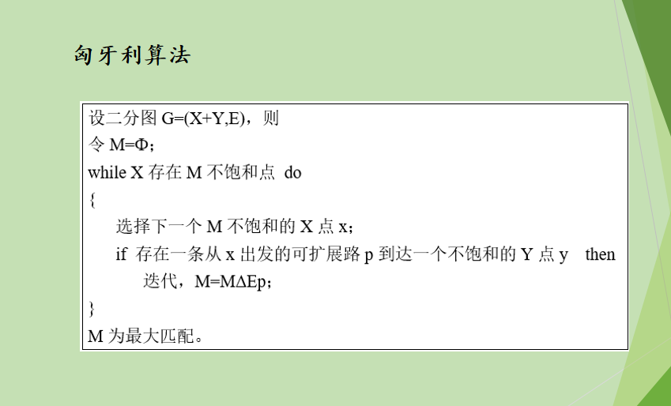

#### Kuhn-Munkres算法

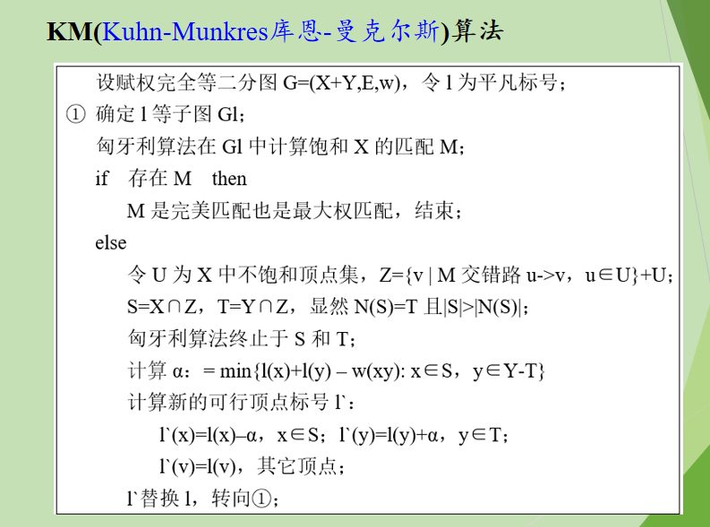

### 网络流

#### st流x和st割(S,S')之间的关系

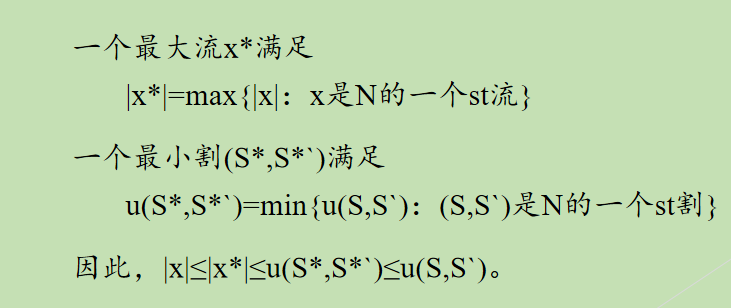

#### FF标数算法

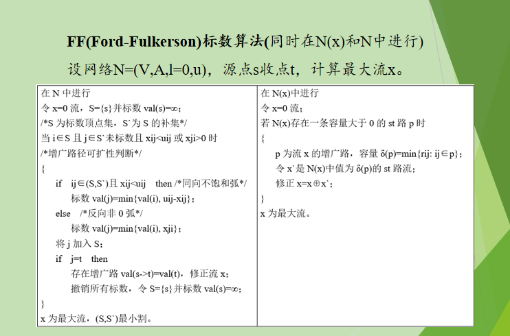

#### EK标数算法

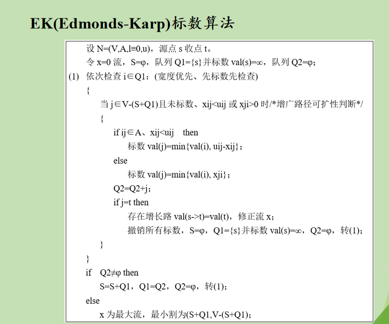

#### 前置流推进算法（GT）

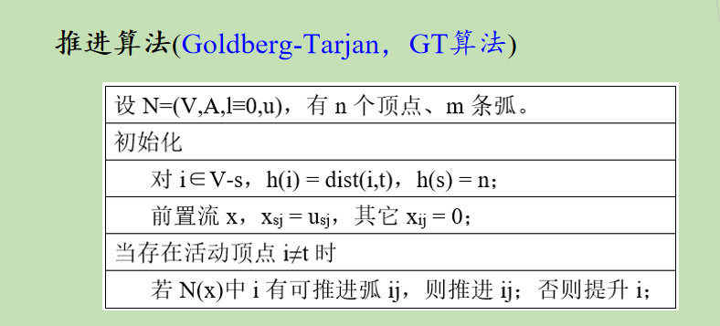